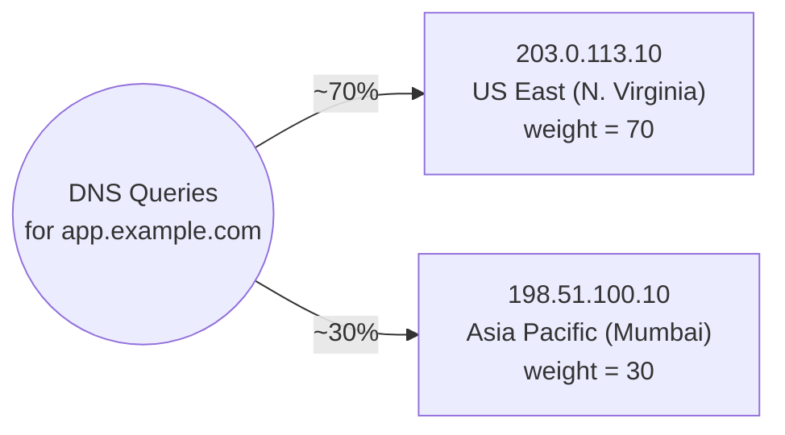

# 04 - Routing Policies Overview, Simple and Weighted Routing Hands-On

> Goal of this note: introduce **all 8 Route 53 routing policies** as a roadmap for the rest of this folder, then go deep and hands-on on the two simplest ones — **Simple** and **Weighted** — using the `app.example.com` record built earlier in this folder.

---

## 1. What a routing policy actually is

Every DNS record in Route 53 is created with a **routing policy** — the rule that decides **which value(s) Route 53 returns** when multiple records share the same name, or how it picks among values within one record. Without any special policy, DNS is just "one name, one answer." Route 53's routing policies let that answer depend on load distribution, network performance, health, or geography.

---

## 2. All 8 routing policies — the roadmap for this folder

| Routing policy | What decides the answer returned | Typical use case |
|---|---|---|
| **Simple** | No logic — returns all configured values for a name (in random order if there are several) | A single resource with no special traffic-shaping needs |
| **Weighted** | A numeric weight you assign per record | Canary releases, A/B testing, gradual traffic shifting between versions |
| **Latency** | The AWS Region with the lowest measured latency from the querier | Multi-Region deployments optimizing for actual network performance |
| **Failover** | Health check status — active/passive | Active-passive disaster recovery, automatic failover to a standby site |
| **Geolocation** | The geographic location the query appears to originate from (continent/country/US state) | Content localization, legal/licensing restrictions, compliance-driven routing |
| **Geoproximity** | Geographic distance between querier and resource, adjustable with a "bias" value | Shifting traffic volume between resources by expanding/shrinking a geographic catchment area |
| **Multivalue Answer** | Up to 8 healthy records chosen at random from those configured | Simple client-side load balancing with basic health awareness, without a load balancer |
| **IP-based** | A table you define mapping specific client IP ranges (CIDR blocks) to specific endpoints | Routing based on which network/ISP a user's traffic originates from, e.g. steering an ISP's users to a server tuned for that network |

Notes 05 through 11 each build one of the health-check-dependent or specialized policies (Failover, Geolocation, Geoproximity, Multivalue Answer, IP-based, plus Latency and health checks themselves) hands-on, one at a time, on that same `app.example.com` record. This note covers the two that need no special setup at all: **Simple** and **Weighted**.

---

## 3. Simple routing — one record, no logic

**Simple routing** is the default: one record name, one or more values, **no health checks, no weighting, no geography** — Route 53 just returns the configured value(s). If a record has multiple values, Route 53 returns **all of them, in a random order**, and it's entirely up to the client which one it tries first.

> 🧠 **Mental model:** Simple routing is a **phonebook entry with no smarts** — ask for the name, get back everything listed under it, in no particular guaranteed order.

Use it when there's genuinely only one destination (or a small handful of interchangeable ones) and you don't need Route 53 to make any decision at all.

---

## 4. Weighted routing — proportional traffic splitting

**Weighted routing** lets you create **multiple records with the same name**, each carrying a **numeric weight**. Route 53 distributes queries across them **proportionally to their weight relative to the total**.

**The math:** if you have two records for `app.example.com` with weights **70** and **30**, the total is 100, so roughly **70%** of queries get the first record's value and **30%** get the second's. Weights don't have to add up to 100 — Route 53 always computes each record's *share of the total weight across all records with that name*. A weight of **50** and **50** splits 50/50 regardless of the actual numbers used, since it's always relative.

**A weight of `0`** means "never send traffic here" — the record stays configured (so you don't lose its setup) but receives no live traffic. This is a fast way to pull a target out of rotation without deleting anything.

Typical use case: a **canary deployment** — send a small weight (e.g. 5) to a new version and the rest (95) to the stable version, then gradually shift the ratio as confidence grows, or an **A/B test** comparing two endpoints under real traffic.

---

## 5. Hands-on (a): demo Simple routing on `app.example.com`

`app.example.com` currently has one A record, value `203.0.113.10`, using the (default) Simple routing policy.

1. Route 53 console → `example.com` hosted zone → select the `app.example.com` A record → **Edit record**.
2. Under **Value**, add a second IP on a new line: `198.51.100.10` (our illustrative "Asia Pacific (Mumbai)" endpoint) — a Simple-routed record supports multiple values in the same record.
3. **Save.**

Now a query for `app.example.com` gets **both** IPs back, in random order — the client (usually the OS resolver or browser) picks one, typically the first in the list it receives, and connects to it. There is no weighting and no health awareness here: if `198.51.100.10` were down, Route 53 would still happily hand it out.

> ⚠️ Simple routing with multiple values is **not** a substitute for load balancing or failover — it has no health checks and no proportional control over which value gets returned more often.

---

## 6. Hands-on (b): demo Weighted routing on `app.example.com`

Now delete that Simple record and rebuild `app.example.com` as **two separate weighted record sets**, both named `app.example.com`:

**Record set 1 — the US endpoint:**
1. **Create record** → **Record name**: `app`.
2. **Record type**: **A**.
3. **Routing policy**: **Weighted**.
4. **Value**: `203.0.113.10`.
5. **Weight**: `70`.
6. **Record ID**: `app-us-east` (a label to distinguish it from the other weighted record with the same name).
7. **Create records.**

**Record set 2 — the Asia endpoint:**
1. **Create record** → **Record name**: `app`.
2. **Record type**: **A**.
3. **Routing policy**: **Weighted**.
4. **Value**: `198.51.100.10`.
5. **Weight**: `30`.
6. **Record ID**: `app-ap-mumbai`.
7. **Create records.**

### Testing/observing the split

Since a single `dig`/`nslookup` only shows you one answer per query, observing the actual ~70/30 ratio requires repeated queries over time (or checking application-level access logs on both endpoints to see the real request distribution) — a single manual lookup can't "prove" the weighting, only many aggregated queries reveal the proportion.

---

## 7. Exam tips

🎯 **Exam tip:** setting **weight = 0** on all but one weighted record is a valid, fast way to **instantly stop sending traffic to a target without deleting its record** — useful for pulling a bad canary out of rotation immediately while keeping the configuration intact for later reuse.

🎯 **Exam tip:** Simple routing can return **multiple values from one record**; Weighted routing requires **multiple separate records sharing the same name**, each with its own weight and a unique **Record ID**. Don't confuse "one record, many values" (Simple) with "many records, one name each" (Weighted).

---

## 8. Cleanup note

If you built this hands-on in a real account, delete the two weighted `app.example.com` records (or the Simple multi-value record from step 5) before moving on, since the next note rebuilds `app.example.com` again under a different policy — keeping only one active configuration per record name avoids a routing-policy conflict when creating the next note's records.

---

## 9. Recap

- All 8 routing policies: **Simple, Weighted, Latency, Failover, Geolocation, Geoproximity, Multivalue Answer, IP-based** — each decides "which answer does the client get" differently.
- **Simple** = one record, all values returned, no logic, no health awareness.
- **Weighted** = multiple records sharing a name, traffic split proportional to weight; weight **0** = fully disabled without deleting.
- Rebuilt `app.example.com` twice: once as a two-value Simple record, then as two Weighted records (70/30 split between the US and Asia endpoints).
- Next: Note 05 — Health Checks Hands-On.

---

### Sources
- [Choosing a routing policy — AWS docs](https://docs.aws.amazon.com/Route53/latest/DeveloperGuide/routing-policy.html)
- [Simple routing — AWS docs](https://docs.aws.amazon.com/Route53/latest/DeveloperGuide/routing-policy-simple.html)
- [Weighted routing — AWS docs](https://docs.aws.amazon.com/Route53/latest/DeveloperGuide/routing-policy-weighted.html)
