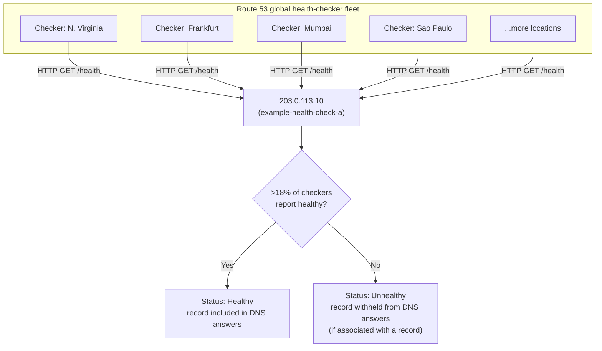

# 05 - Health Checks Hands-On

> Goal of this note: understand what a Route 53 **health check** actually monitors, the three types available, how Route 53 decides "healthy" vs "unhealthy" without false-triggering on a single network blip, and build the two health checks (`example-health-check-a`, `example-health-check-b`) that later routing-policy notes in this folder reuse.

---

## 1. What a Route 53 health check is

A **Route 53 health check** is an independent monitor that periodically sends requests to an endpoint (an IP address or domain name) from a **global network of AWS health-checker locations**, and marks that endpoint **Healthy** or **Unhealthy** based on the responses it gets back. On its own, a health check is just a status — its real power comes from **associating it with a DNS record**: once associated, Route 53 automatically stops including that record's value in its answers whenever the health check reports Unhealthy, and resumes once it recovers.

> 🧠 **Mental model:** a health check is a **standalone security guard watching one door**, reporting a simple healthy/unhealthy status. Associating it with a record is what tells Route 53's receptionist "stop directing visitors to that door while the guard says it's not okay."

---

## 2. The three health check types

| Type | What it monitors | Typical use |
|---|---|---|
| **Endpoint health check** | Directly probes an IP address or domain over HTTP, HTTPS, or TCP | Standard "is my web server/API responding" checks |
| **Calculated health check** | Combines the status of up to 255 other health checks (its "children") using a threshold you configure (effectively an OR/AND-style rule: "healthy if at least N of these children are healthy") | Rolling up multiple individual checks into one combined health signal, e.g. "this Region is healthy only if at least 2 of its 3 endpoints are healthy" |
| **CloudWatch alarm health check** | Follows the state of a CloudWatch alarm's underlying data stream (healthy when the alarm is OK, unhealthy when it's in ALARM) | Monitoring things Route 53 can't directly probe over HTTP/TCP — e.g. a database's internal replication-lag metric, a queue depth, or any custom application metric already flowing into CloudWatch |

The CloudWatch-alarm type matters because plenty of "is this thing okay" signals aren't reachable as a simple network endpoint at all — a private database's internal health metric, for instance — so routing that signal through an existing CloudWatch alarm lets Route 53 react to it anyway.

---

## 3. Key configurable parameters

| Parameter | What it controls |
|---|---|
| **Protocol** | HTTP, HTTPS, or TCP — HTTP/HTTPS checks require a 2xx or 3xx response within the timeout; TCP checks only require a successful connection |
| **Request interval** | **Standard** (every 30 seconds) or **Fast** (every 10 seconds, higher cost) |
| **Failure threshold** | How many consecutive failed checks (from a given checker) are required before that checker considers the endpoint unhealthy |
| **Path** | For HTTP/HTTPS, the URL path requested, e.g. `/health` |
| **String matching** | An optional substring Route 53 must find in the response body for the check to pass — lets you distinguish "server responded with 200 but the page shows an error message" from a genuinely healthy response |

---

## 4. How does Route 53 avoid false alarms from one bad network path?

Route 53 doesn't rely on a single checker's opinion. It runs health checkers from **many locations around the world simultaneously**, and each one independently evaluates the endpoint. Route 53 then **aggregates** all those independent results:

- If **more than 18%** of health checkers report the endpoint healthy, Route 53 considers it **healthy**.
- If **18% or fewer** report it healthy, Route 53 considers it **unhealthy**.

This design specifically protects against a regional network blip (say, one part of the world temporarily losing a path to your endpoint) being mistaken for the endpoint itself being down — a real outage has to be corroborated by the overwhelming majority of the global fleet, not just one or two checker locations.

> ⚠️ HTTPS health checks establish a TCP connection and expect a valid HTTP status code, but they **do not validate the SSL/TLS certificate** — an expired or invalid cert will not, by itself, fail an HTTPS health check.

---

## 5. Hands-on: create the two example health checks

**`example-health-check-a`:**
1. Route 53 console → **Health checks** → **Create health check**.
2. **Name**: `example-health-check-a`.
3. **What to monitor**: **Endpoint**.
4. **Specify endpoint by**: **IP address**.
5. **Protocol**: **HTTP**.
6. **IP address**: `203.0.113.10`.
7. **Path**: `/health`.
8. **Request interval**: **Standard (30 seconds)**.
9. **Failure threshold**: `3` (default).
10. **Create health check.**

**`example-health-check-b`:**
1. **Create health check** again.
2. **Name**: `example-health-check-b`.
3. **What to monitor**: **Endpoint**, **IP address**, **HTTP**.
4. **IP address**: `198.51.100.10`.
5. **Path**: `/health`.
6. Same interval/threshold as above.
7. **Create health check.**

Both checks take roughly **30-60 seconds** after creation to report their first real status; until then Route 53 treats a brand-new health check as healthy by default.

### Optional: CloudWatch alarm notification on a health check

1. Select `example-health-check-a` → **Notifications** (or the **Health check status** section) → enable **Get notified when health check status changes**.
2. This creates/uses a **CloudWatch alarm** tied to the health check's status metric, which you can wire to an **SNS topic** (e.g. an email or Slack-webhook subscriber) so a human gets paged the moment Route 53 marks the endpoint unhealthy — independent of whatever DNS failover behavior the health check might also be driving.

---

## 6. The monitoring flow

---

## 7. Exam tips

🎯 **Exam tip:** a Route 53 health check monitors **exactly the endpoint you point it at** — it has no automatic knowledge of an Application Load Balancer's own internal target-group health. If you want a Route 53 health check to reflect whether an ALB's registered targets are healthy, you must point the health check at the **ALB itself** (or its listener) and configure the path/matching so the ALB's response reflects target health — the two mechanisms operate at completely different layers and are not automatically linked. An ALB's own target-group health check is a **separate feature entirely**: it runs inside the load balancer itself, deciding which of *its own* registered targets receive traffic, and has nothing to do with Route 53's DNS-level health check unless you deliberately connect the two.

🎯 **Exam tip:** the "more than 18% of checkers must agree" rule is the standard exam explanation for why a single flaky network path doesn't cause spurious DNS failover — memorize the concept ("majority of a distributed global fleet must corroborate the failure") even if the exact 18% figure isn't quoted verbatim in a question.

---

## 8. Cleanup note

If created in a real account, delete `example-health-check-a` and `example-health-check-b` (and any SNS subscription/CloudWatch alarm wired to them) once you've finished the exercises that depend on them, to avoid the small per-health-check monthly charge (higher for the Fast/10-second interval, and for HTTPS checks with string matching).

---

## 9. Recap

- A health check independently monitors an endpoint and reports **Healthy/Unhealthy**; associating it with a record lets Route 53 stop answering with unhealthy targets.
- Three types: **endpoint** (direct HTTP/HTTPS/TCP probe), **calculated** (combines other health checks), **CloudWatch alarm** (follows an alarm's state — for things Route 53 can't probe directly).
- Health is decided by **fleet consensus** (more than 18% of global checkers must agree it's healthy), not a single checker's opinion.
- Built `example-health-check-a` (`203.0.113.10`, HTTP, `/health`) and `example-health-check-b` (`198.51.100.10`, HTTP, `/health`) — these two will be reused when this folder builds failover routing, and can optionally inform multivalue answer routing later.
- A Route 53 health check is **not** automatically aware of an ALB's internal target-group health — the two are separate mechanisms at separate layers.
- Next: Note 06 — Geolocation Routing Hands-On.

---

### Sources
- [How Amazon Route 53 determines whether a health check is healthy — AWS docs](https://docs.aws.amazon.com/Route53/latest/DeveloperGuide/dns-failover-determining-health-of-endpoints.html)
- [Creating, updating, and deleting health checks — AWS docs](https://docs.aws.amazon.com/Route53/latest/DeveloperGuide/dns-failover.html)
- [Values that you specify when you create or update health checks — AWS docs](https://docs.aws.amazon.com/Route53/latest/DeveloperGuide/health-checks-creating-values.html)
