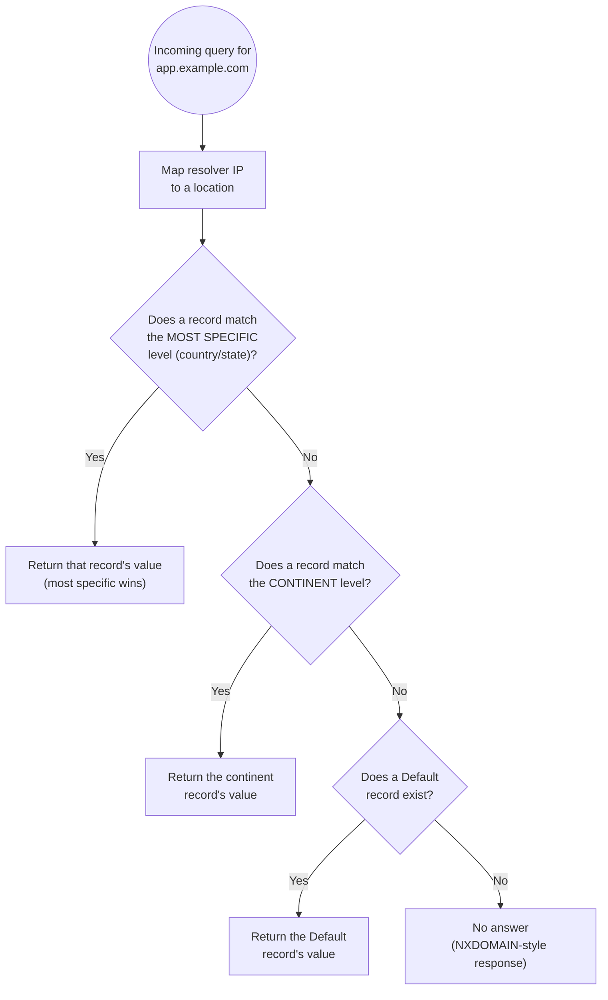

# 06 - Geolocation Routing Hands-On

> Goal of this note: reconfigure `app.example.com` (built earlier in this folder) with **Geolocation routing** — route based on where a DNS query appears to come from, not raw network performance — and understand the mandatory **Default record** and "most specific match wins" rules that the exam tests heavily.

---

## 1. What Geolocation routing actually routes on

**Geolocation routing** answers queries based on the **geographic location of the DNS querier** — but "querier" here specifically means **the resolver that sent the query to Route 53**, not the end user's own precise physical location. Route 53 maps the querier's IP address to a location using its own geographic IP database, at the granularity of **continent, country, or (within the United States) state**.

> ⚠️ Because it's the **resolver's** apparent location being mapped, not the end user's device location, a user on a VPN or using a resolver hosted in a different country/region than they physically are will be routed based on **the resolver's location**, not their own. This is a real, known limitation — not a bug — and something to keep in mind for compliance-sensitive use cases.

---

## 2. Use cases

- **Content localization** — serve a French-language version of a site to queriers resolved as coming from France, an English version elsewhere.
- **Legal/licensing restrictions** — some content can only legally be streamed or distributed in certain countries; geolocation routing lets you serve a "not available in your region" response (or a different, licensed endpoint) based on apparent origin.
- **Directing users toward the geographically nearest deployment** — e.g. for a marketing site, sending European queriers to a European-hosted copy for simplicity, even without measuring actual network performance.

### Geolocation vs. Latency routing — a classic exam distinction

Geolocation and Latency routing often produce *similar-looking* results (both tend to send European users to a European endpoint) but they optimize for **completely different things**: Geolocation routes based on **where the query is geographically believed to originate** (for compliance, localization, licensing reasons) — it doesn't measure network speed at all. Latency routing (the next note in this folder) routes based on **actual measured network latency** between AWS Regions and the querier — it's about performance, not geography or compliance, and can sometimes send a query to a *farther* Region if that Region happens to have a faster network path.

---

## 3. The mandatory Default record

If a query's resolver location doesn't match **any** geolocation record you've configured — either because its IP isn't mapped to a location at all, or because you simply didn't create a record for that continent/country — Route 53 needs a fallback. That fallback is a special **Default** record (location value: "Default").

> ⚠️ **If you don't create a Default record, unmatched queries get a "no answer" response (NXDOMAIN-style) — not a fallback to some other record you happened to create.** This is one of the most common exam traps: geolocation routing silently drops traffic for any location you didn't explicitly account for, unless a Default record exists to catch everything else.

---

## 4. "Most specific match wins"

If you create overlapping records — e.g. one for the continent **North America** and another for the country **United States** — and a query is resolved to a location in the U.S., Route 53 doesn't pick arbitrarily: **priority always goes to the smallest (most specific) matching geographic region.** So a U.S.-resolved query matches the **country**-level record over the **continent**-level one, even though both technically cover it. This lets you set a broad continent-wide default and carve out specific country-level exceptions on top of it.

---

## 5. Hands-on: reconfigure `app.example.com` with Geolocation routing

Delete the previous Weighted records for `app.example.com` from the last note, then create three new records, all named `app.example.com`, all routing policy **Geolocation**:

**Record 1 — North America:**
1. **Create record** → **Record name**: `app`.
2. **Routing policy**: **Geolocation**.
3. **Location**: **North America** (continent).
4. **Value**: `203.0.113.10`.
5. **Record ID**: `app-geo-namerica`.
6. **Create records.**

**Record 2 — Asia:**
1. **Create record** → **Record name**: `app`.
2. **Routing policy**: **Geolocation**.
3. **Location**: **Asia** (continent).
4. **Value**: `198.51.100.10`.
5. **Record ID**: `app-geo-asia`.
6. **Create records.**

**Record 3 — Default (mandatory fallback):**
1. **Create record** → **Record name**: `app`.
2. **Routing policy**: **Geolocation**.
3. **Location**: **Default**.
4. **Value**: `203.0.113.10`.
5. **Record ID**: `app-geo-default`.
6. **Create records.**

Result: queriers resolved to North America get `203.0.113.10`, queriers resolved to Asia get `198.51.100.10`, and every other location on Earth (Europe, Africa, South America, unmapped IPs, etc.) falls through to the **Default** record, also `203.0.113.10` in this example.

### Testing geolocation routing

Because your own machine's resolver only shows you the result for *your own* apparent location, you can't verify all three branches from one machine with a single lookup tool. In practice, teams test geolocation records using a DNS-checking service that lets you query from multiple simulated regions, or by asking colleagues/CI runners physically located in different regions to run a lookup and compare which value they receive. This is a genuinely different testing challenge from Weighted routing (where repeated queries from one location reveal the ratio) — here, you need queries that *originate* from different resolver locations, not just repeated queries from the same one.

### Adding more specific carve-outs

If you later wanted to route a single country within North America differently — say, sending Canada-resolved queries to a separate endpoint while the rest of North America keeps using `203.0.113.10` — you would add a fourth record: **Location: Canada** (country-level), same name `app.example.com`, its own value. Because "most specific match wins," any query resolved specifically to Canada would now prefer that country-level record over the broader North America continent-level one, without needing to touch the North America or Default records at all.

---

## 6. The matching decision logic

---

## 7. Exam tips

🎯 **Exam tip:** **geolocation ≠ latency-based routing.** Geolocation is about **compliance, content restriction, and localization** (where the query is believed to originate from). Latency is about **network performance** (which Region responds fastest). A question asking "restrict content to licensed countries" wants Geolocation; one asking "send users to the Region that responds fastest" wants Latency.

🎯 **Exam tip:** always expect a **Default record** requirement question — "what happens to a query from a location you didn't create a record for, if there's no Default record?" The answer is **no answer / NXDOMAIN-style response**, not silent fallback to any other configured record.

---

## 8. Cleanup note

Delete the three Geolocation records (`app-geo-namerica`, `app-geo-asia`, `app-geo-default`) for `app.example.com` before moving on, since the next note in this folder rebuilds the same record name under Latency-based routing.

---

## 9. Recap

- Geolocation routing decides answers based on the **DNS querier's resolver location** (continent/country/US state), not the end user's exact physical location.
- A **Default record is mandatory** for full coverage — without one, unmatched locations get **no answer**, a classic exam trap.
- **Most specific match wins** — a country-level record beats an overlapping continent-level record.
- Rebuilt `app.example.com` as three Geolocation records: North America → `203.0.113.10`, Asia → `198.51.100.10`, Default → `203.0.113.10`.
- Geolocation (compliance/localization) and Latency (performance) often look similar in practice but optimize for entirely different things.
- Next: Note 07 — Latency-Based Routing Hands-On.

---

### Sources
- [Geolocation routing — AWS docs](https://docs.aws.amazon.com/Route53/latest/DeveloperGuide/routing-policy-geo.html)
- [Values specific for geolocation records — AWS docs](https://docs.aws.amazon.com/Route53/latest/DeveloperGuide/resource-record-sets-values-geo.html)
- [How Amazon Route 53 uses EDNS0 to estimate the location of a user — AWS docs](https://docs.aws.amazon.com/Route53/latest/DeveloperGuide/routing-policy-edns0.html)
