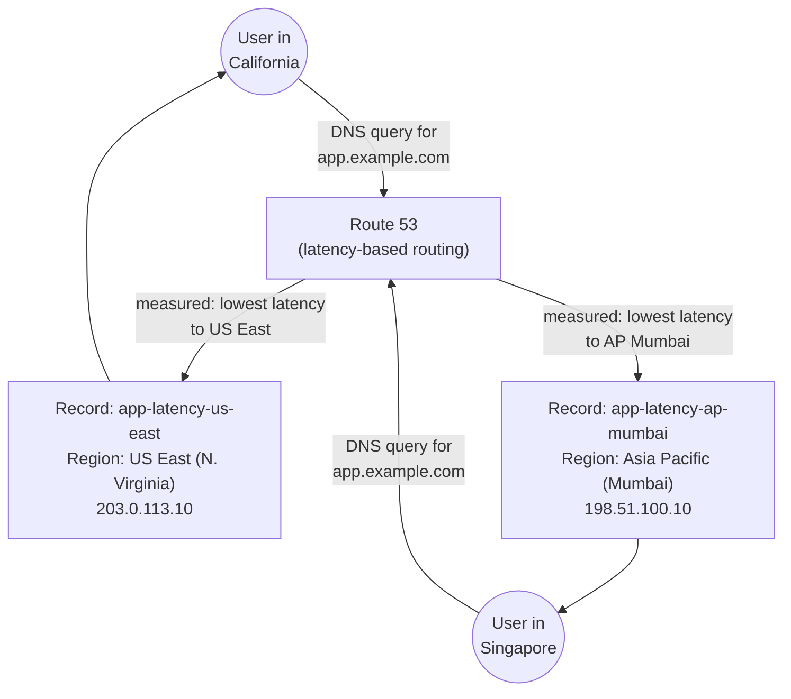

# 07 - Latency-Based Routing (Hands-On)

> Goal: understand **latency-based routing** — sending each user to whichever registered endpoint gives them the lowest *measured network latency* — and reconfigure the `app.example.com` record from our `example.com` hosted zone to use it.

---

## 1. What latency-based routing actually measures

Latency-based routing answers a DNS query with whichever of your registered endpoints has historically given the **lowest network latency** to users querying from that resolver's location. Route 53 doesn't guess this — AWS continuously measures real latency between its own network and users across the internet, region by region, and Route 53 uses that measured data to pick a winner for each query.

The critical thing to internalize: **this is about actual network performance, not geographic distance.** A user in Chennai might get lower latency from a server in Singapore than from one in Mumbai, purely because of how internet backbones, peering agreements, and submarine cable routes happen to be laid out — physical proximity and network proximity are not the same thing. Latency routing is Route 53 outsourcing the "which endpoint is fastest for this user" decision to AWS's own continuously-updated telemetry instead of a fixed map.

> 🧠 **Mental model:** geolocation asks "where does this rule say you live?" — latency routing asks "which of my doors, based on real traffic measurements, does mail actually arrive at fastest for you?" Same query, potentially very different answer.

Latency routing is **Region-based configuration**: each record you create is tagged with the **AWS Region** the endpoint behind it actually lives in (e.g. "US East (N. Virginia)", "Asia Pacific (Mumbai)"). Route 53 then compares the querying resolver's measured latency to each of those regions and returns the record for the lowest one.

---

## 2. Latency routing vs Geolocation routing — the exact distinction

Both can look similar at first glance ("send different users to different endpoints"), but they key off completely different signals:

| | **Geolocation routing** | **Latency-based routing** |
|---|---|---|
| Decision based on | The **querier's geographic location** (continent/country/state, from IP geolocation) | **Measured network latency** between the querier and each registered AWS Region |
| Typical use case | Compliance, data residency, content licensing, localized experiences | Best possible user-perceived performance |
| Can a "closer" location lose? | N/A — it's rule-based, not performance-based | **Yes** — a geographically farther region can legitimately win if its actual network path is faster |
| Record configuration | Continent / country / state you assign | AWS Region the endpoint lives in |

⚠️ **These two can send the exact same user to completely different endpoints for the exact same query.** A compliance rule might force a French user to a Europe endpoint under geolocation, while that same user's actual lowest-latency path (ignoring any rule) might be to the US. Don't assume "geographically nearby" and "network-fastest" are the same fact — they frequently aren't, and exam questions exploit exactly this gap.

---

## 3. What "measured latency" means in practice

AWS collects latency data by continuously measuring round-trip time between its own edge/region network points and a very large sample of internet resolvers worldwide, then aggregates that into per-region latency estimates for different parts of the internet. Route 53 doesn't run a fresh speed test at query time — it consults this pre-computed, continuously-refreshed dataset and picks whichever of your registered regions currently looks fastest for the resolver that sent the query.

Two practical consequences follow from this:

- **The "winner" can change over time** as internet routing, peering, and congestion shift — a region that wasn't fastest for a given resolver last month could become the fastest today, with zero changes to your own configuration.
- **DNS caching (via TTL) still applies.** A resolver that cached an earlier answer keeps using it until the TTL expires, even if the underlying latency measurement has since flipped in favor of the other region. Lower TTLs mean users adapt to latency changes faster, at the cost of more frequent DNS lookups.

---

## 4. Hands-on: reconfigure `app.example.com` for latency-based routing

We're reusing the same hosted zone for `example.com` and the same `app.example.com` record name that earlier notes in this folder have been reconfiguring with a different routing policy each time. This time we give it two latency records, one per AWS Region.

### Step 1 — Open the hosted zone and edit the record

1. Route 53 console → **Hosted zones** → `example.com` → select the existing `app.example.com` **A** record → **Edit record**.
2. Under **Routing policy**, choose **Latency**.

### Step 2 — Create the first latency record (US East)

1. **Record name**: `app` (resolves to `app.example.com`).
2. **Region**: **US East (N. Virginia)**.
3. **Value**: `203.0.113.10` (our illustrative "Server A" endpoint, described throughout this folder as living in US East).
4. **Record ID**: `app-latency-us-east` (a label distinguishing this record from the other latency record with the same name/type — Route 53 requires a unique record ID whenever multiple records share a name).
5. Optionally, associate **a health check monitoring this endpoint** — the HTTP health check built earlier in this folder against `203.0.113.10` on path `/health`. If it's attached and goes unhealthy, Route 53 stops returning this record even if it's the lowest-latency match, and falls through to the next-best latency option instead.
6. Save.

### Step 3 — Create the second latency record (Asia Pacific)

1. Add another record, same name `app`, same type A, routing policy **Latency**.
2. **Region**: **Asia Pacific (Mumbai)**.
3. **Value**: `198.51.100.10` (our illustrative "Server B" endpoint).
4. **Record ID**: `app-latency-ap-mumbai`.
5. Optionally attach the second health check built earlier in this folder, monitoring `198.51.100.10` on `/health`.
6. Save.

`app.example.com` now has two latency records:

| Record ID | Region | Value | Health check |
|---|---|---|---|
| `app-latency-us-east` | US East (N. Virginia) | `203.0.113.10` | optional |
| `app-latency-ap-mumbai` | Asia Pacific (Mumbai) | `198.51.100.10` | optional |

A query from a resolver in California gets measured lower latency to US East, so it receives `203.0.113.10`. A query from a resolver in Singapore gets measured lower latency to Mumbai, so it receives `198.51.100.10`. If a health check is attached to the lowest-latency record and it reports unhealthy, Route 53 skips that record and returns the next-best latency match among the remaining healthy records instead — this is exactly why attaching health checks to latency records matters in production: without one, a still-registered-but-broken "fastest" endpoint keeps getting handed out.

---

## 5. Diagram: two users, two different lowest-latency answers

---

## 6. Common beginner problems

| Symptom | Cause |
|---|---|
| Only one latency record configured, no visible "routing" happening | Latency routing needs **at least two records in two different regions** to do anything meaningful — with a single record it behaves exactly like Simple routing, since there's nothing to compare against. |
| Everyone gets routed to the same region regardless of location | Only one region has a health-check-passing record, or the latency measurements genuinely favor one region for most of your actual user base — this can be correct behavior, not a bug. |
| Unhealthy "fastest" endpoint still being returned | No health check was attached to that latency record — attach one so Route 53 knows to skip it. |
| Record creation fails with a name/type conflict | Each latency record sharing the same name and type needs a distinct **Record ID** — this is how Route 53 tells multiple records for `app.example.com`/A apart. |

---

## 7. Cleanup note

If you're following along and don't intend to keep this configuration, delete the two latency records for `app.example.com` (and, if not needed elsewhere, the associated health checks) once you're done experimenting, to avoid unnecessary health-check charges accumulating on a zone you're not actually using.

---

## 8. Recap

- **Latency-based routing** answers each query with the record for the AWS Region giving the **lowest measured network latency** to that querier — based on AWS's own continuously-collected latency data, not geographic distance.
- It's **Region-based**: every record is tagged with the AWS Region its endpoint lives in.
- It differs from **Geolocation routing** in what signal drives the decision — measured performance vs. the querier's geographic location/compliance rule — and the two can legitimately disagree on where to send the same user.
- Reconfigured `app.example.com` with two latency records: `app-latency-us-east` → `203.0.113.10`, `app-latency-ap-mumbai` → `198.51.100.10`, each optionally backed by a health check so an unhealthy "fastest" endpoint gets skipped in favor of the next-best latency option.
- 🎯 **Exam tip:** latency routing needs **at least 2 records in 2 different regions** to be meaningful — with just one record it behaves like Simple routing.
- Next: Note 08 — Geoproximity Routing (Hands-On).

---

### Sources
- [Latency routing – Amazon Route 53 Developer Guide](https://docs.aws.amazon.com/Route53/latest/DeveloperGuide/routing-policy-latency.html)
- [Choosing a routing policy – Amazon Route 53 Developer Guide](https://docs.aws.amazon.com/Route53/latest/DeveloperGuide/routing-policy.html)
- [Values specific for latency records – Amazon Route 53 Developer Guide](https://docs.aws.amazon.com/Route53/latest/DeveloperGuide/resource-record-sets-values-latency.html)
