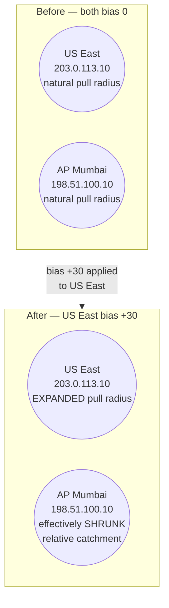

# 08 - Geoproximity Routing (Hands-On)

> Goal: understand **geoproximity routing** — routing based on the geographic location of your resources (and optionally your users), with a **bias** value that lets you shift traffic between nearby regions gradually — and learn the one exam-trap fact that makes this policy type different from all the others: it can **only** be built through **Route 53 Traffic Flow**.

---

## 1. What geoproximity routing is

Geoproximity routing routes traffic based on the geographic location of **where your resources live**, and optionally, where your users are querying from. Unlike Geolocation (which uses hard-coded continent/country/state rules) or Latency (which uses measured network performance), geoproximity draws a geographic "pull" region around each of your endpoints and routes each query to whichever region's pull area covers the querier — then lets you **reshape those pull areas** using a bias value.

> 🧠 **Mental model:** think of each registered endpoint as a radio tower with a broadcast radius. Geoproximity draws that radius on a map based on real geography. **Bias** is the dial that makes one tower's radius bigger (pulling in listeners that would otherwise have tuned into a neighboring tower) or smaller (pushing its own listeners toward a neighboring tower instead).

---

## 2. The bias value — shifting traffic without a hard cutover

**Bias** is a number from **-99 to 99** that you attach to each geoproximity rule for a resource:

| Bias | Effect |
|---|---|
| **Positive (1 to 99)** | **Expands** the geographic region from which Route 53 routes traffic to this resource — it pulls in *more* traffic from a wider surrounding area, including some that would otherwise have gone to a neighboring region. |
| **0 (default)** | No adjustment — the region's natural geographic pull area based on its actual location. |
| **Negative (-1 to -99)** | **Shrinks** the geographic region from which Route 53 routes traffic to this resource — some traffic that would otherwise have come here instead flows to a neighboring, competing region. |

This is exactly the mechanism you'd reach for to **gradually shift load between regions without a hard cutover**:

- **Draining a region approaching capacity**: give it an increasingly negative bias over time, and watch its effective catchment area shrink as traffic drains toward neighboring regions — without touching a single client or DNS record's target value.
- **Ramping up a newly launched region**: start it at a low or negative bias (minimal pull, mostly serving only its immediate area) and increase the bias over days/weeks as you gain confidence in its capacity, letting it organically absorb more of the surrounding geography's traffic.

Because this is a *geographic* pull adjustment rather than a percentage-of-queries split, it behaves differently from Weighted routing — you're reshaping "who counts as nearby," not directly assigning a percentage of total traffic.

---

## 3. The critical exam trap: geoproximity requires Route 53 Traffic Flow

Every other Route 53 routing policy — Simple, Weighted, Latency, Failover, Geolocation, Multivalue Answer, and IP-based — can be configured directly as a plain resource record set in a hosted zone, exactly the way earlier notes in this folder have been reconfiguring `app.example.com`.

**Geoproximity routing is the one exception.** Per AWS's own documentation, geoproximity records — and specifically the bias value and its visual coverage map — are only available by creating a **traffic policy** in **Route 53 Traffic Flow**, the visual policy editor. You cannot set a routing policy dropdown to "Geoproximity" on an ordinary record the way you can for the other seven types.

> ⚠️ **This is the single most common exam trap among the 8 routing policy types.** If a question describes bias-driven, gradual geographic traffic shifting and asks how you'd configure it, the mechanism is Traffic Flow — not a plain hosted-zone record.

---

## 4. Hands-on: a basic geoproximity rule via Traffic Flow

This is a first look at Traffic Flow at the level needed to build one geoproximity rule; the tool's full depth (multi-level trees combining several rule types, traffic policy versions, policy records) is covered later in this folder.

### Step 1 — Open Traffic Flow and start a policy

1. Route 53 console → left nav → **Traffic flow** → **Create traffic policy**.
2. **Policy name**: `app-geoproximity-policy`.
3. **DNS type**: **A**.

### Step 2 — Add a geoproximity rule

1. In the visual editor, click **Connect to** → **New rule**.
2. **Rule type**: **Geoproximity**.
3. Add the first endpoint:
   - **Region**: US East (N. Virginia).
   - **Value**: `203.0.113.10`.
   - **Bias**: `+30`.
4. Add the second endpoint:
   - **Region**: Asia Pacific (Mumbai).
   - **Value**: `198.51.100.10`.
   - **Bias**: `0` (left at its default, unadjusted pull area).
5. Connect this geoproximity rule to **Start** — this makes it the top-level (and in this simple example, only) rule in the tree.

### Step 3 — Create the policy record against the hosted zone

1. Click **Create traffic policy**.
2. Under **Policy records**, choose the `example.com` hosted zone, enter record name `app` (giving `app.example.com`), TTL, and **Create traffic policy record**.

This publishes the actual DNS records into the `example.com` hosted zone on your behalf — you don't hand-author individual resource records for a Traffic Flow policy; the policy record generation does it for you.

### What that +30 bias does to the coverage map

With US East at bias **+30** and Mumbai at bias **0**, the US East endpoint's geographic pull area expands well beyond its "natural," unbiased footprint — the visual coverage map in Traffic Flow shows this literally, as a larger colored region around US East eating into territory that would otherwise default to Mumbai. Querying resolvers located in that newly-absorbed territory (e.g. parts of the Pacific that sat near the natural boundary between the two regions) now resolve to `203.0.113.10` instead of `198.51.100.10`, purely because of the bias adjustment — no change to either endpoint's actual location or health.

If you instead lowered US East's bias toward negative values, its pull area would shrink back below its natural footprint, and Mumbai's un-adjusted (bias 0) area would pick up the difference by comparison.

---

## 5. Diagram: pull-radius before and after a bias adjustment

---

## 6. Common beginner problems

| Symptom | Cause |
|---|---|
| Can't find a "Geoproximity" option when editing a plain record | Expected — geoproximity is **only** available through Traffic Flow, not the ordinary "create record" routing-policy dropdown. |
| Bias changes seem to have no visible effect on actual DNS answers for a quick test | Bias reshapes a large-scale geographic model, not a per-query coin flip — small test-query samples from one location won't show gradual boundary shifts; the effect is most visible in the coverage map and in aggregate traffic over many queriers near a shifting boundary. |
| Confusing bias with Weighted routing's weight | Bias reshapes a **geographic area**; weight assigns a **percentage of total queries** regardless of geography. They solve related but distinct problems. |

---

## 7. Cleanup note

Delete the traffic policy record (this also removes the DNS records it generated in `example.com`) and, if you don't need it further, the traffic policy itself, to stop the separate Traffic Flow charge that applies per policy record per month.

---

## 8. Recap

- **Geoproximity routing** routes based on the geographic location of your resources (and optionally your users), with a **bias** value (-99 to 99) that expands or shrinks each region's geographic "pull" area — letting you gradually shift traffic (draining a region, ramping up a new one) without a hard cutover.
- 🎯 **Exam tip:** geoproximity routing can **only** be created through **Route 53 Traffic Flow** — it is the one policy type of the 8 that cannot be configured as a plain hosted-zone resource record set. This is the detail that most often trips people up.
- Built a basic Traffic Flow policy for `app.example.com`: US East (`203.0.113.10`, bias +30) and AP Mumbai (`198.51.100.10`, bias 0), and walked through how the bias expands US East's catchment area on the coverage map.
- Next: Note 09 — Failover Routing (Hands-On).

---

### Sources
- [Geoproximity routing – Amazon Route 53 Developer Guide](https://docs.aws.amazon.com/Route53/latest/DeveloperGuide/routing-policy-geoproximity.html)
- [Values specific for geoproximity records – Amazon Route 53 Developer Guide](https://docs.aws.amazon.com/Route53/latest/DeveloperGuide/resource-record-sets-values-geoprox.html)
- [Using Traffic Flow to route DNS traffic – Amazon Route 53 Developer Guide](https://docs.aws.amazon.com/Route53/latest/DeveloperGuide/traffic-flow.html)
- [Configure geoproximity routing through the Route 53 console – AWS re:Post knowledge center](https://repost.aws/knowledge-center/route-53-geoproximity-routing-console)
