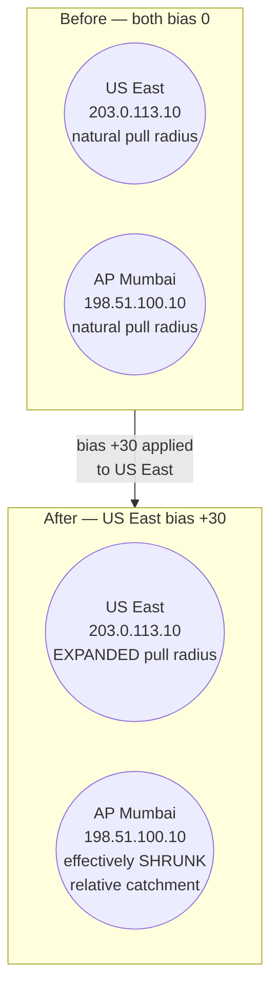

# 08 - Route 53 Geoproximity Routing

**Geoproximity Routing** routes users to AWS resources based on the **geographic location of the user and the geographic location of the resources**.

The key idea is:

> **Route traffic to the resource that is geographically closest to the user, and optionally use a `bias` to make one resource serve a larger or smaller geographic area.**

---

## 1. Basic Architecture

Imagine your application is deployed in three AWS Regions:

```text
                         Users
                           |
                           v
                      Route 53
                           |
              Geoproximity Routing
                           |
          +----------------+----------------+
          |                |                |
          v                v                v
       Mumbai          Frankfurt        Virginia
     ap-south-1        eu-central-1      us-east-1
          |                |                |
         ALB              ALB              ALB
          |                |                |
         EKS              EKS              EKS
```

Route 53 considers:

```text
User location
      +
Resource location
      ↓
Geoproximity calculation
      ↓
Select appropriate resource
```

### Example

A user in **India** is geographically closer to Mumbai:

```text
User → Mumbai
```

A user in **Germany**:

```text
User → Frankfurt
```

A user in **USA**:

```text
User → Virginia
```

---

# 2. What is the `Bias`?

This is the **most important feature that differentiates Geoproximity from simple geographic routing**.

By default, Route 53 tries to distribute users based on geographic proximity.

But you can use **bias** to expand or shrink the geographic area served by a resource.

### Positive bias

A **positive bias** makes the resource's geographic coverage **larger**.

```text
Mumbai
  +20 bias
     ↓
Larger geographic area
     ↓
More users → Mumbai
```

### Negative bias

A **negative bias** makes the resource's geographic coverage **smaller**.

```text
Mumbai
  -20 bias
     ↓
Smaller geographic area
     ↓
Fewer users → Mumbai
```

So you can intentionally shift traffic toward or away from a particular resource.

---

# 3. Real Example

Suppose you have:

```text
Resource A → Mumbai
Resource B → Singapore
```

Normally:

```text
India → Mumbai
Southeast Asia → Singapore
```

Now suppose you have significantly more capacity in Mumbai.

You could give Mumbai a **positive bias**.

Conceptually:

```text
              Before

India -------- Mumbai
SEA ---------- Singapore


              After +Bias

India + some surrounding areas
             |
             v
           Mumbai

Remaining SEA
             |
             v
         Singapore
```

The exact geographic boundary isn't something you manually draw; Route 53 adjusts the routing area based on the bias.

---

# 4. Geolocation vs Geoproximity

This is **very important for SAA-C03**.

|                  | **Geolocation**             | **Geoproximity**                             |
| ---------------- | --------------------------- | -------------------------------------------- |
| Main idea        | Where is the **user**?      | Where is the **user relative to resources**? |
| Routing based on | Geographic location rules   | Geographic proximity                         |
| You define       | Country/continent/etc.      | Resources + geographic location              |
| Bias             | ❌ No                        | ✅ Yes                                        |
| Main purpose     | Explicit geographic routing | Proximity-based routing + traffic shifting   |

---

## Geolocation Example

You explicitly say:

```text
India → Mumbai
USA → Virginia
Europe → Frankfurt
```

Think:

> **"Users from this geographic area should go to this endpoint."**

```text
India ───────→ Mumbai
USA ─────────→ Virginia
Germany ─────→ Frankfurt
```

---

## Geoproximity Example

You have:

```text
Mumbai
Singapore
Frankfurt
Virginia
```

Route 53 considers:

```text
        User
          |
          v
   Geographic position
          |
          v
 Which resource is closest?
          |
          v
 Appropriate resource
```

And you can use **bias** to change the size of the area each resource serves.

---

# 5. Simple Difference to Remember

### Geolocation

**You define the geographic rule.**

```text
India → Mumbai
```

> **"If user is in India, send them here."**

### Geoproximity

**Route 53 calculates proximity and lets you influence it with bias.**

```text
User
 ↓
Which resource is geographically closer?
 ↓
Choose resource
 ↓
Apply bias if configured
```

> **"Send users toward the geographically appropriate resource, but let me expand/shrink that resource's coverage."**

---

# 6. Exam Trick 🧠

If the question says:

> "Route users based on their country."

### → **Geolocation**

If it says:

> "Route users to the geographically closest resource."

### → **Geoproximity**

If it says:

> "Route based on geographic proximity and allow administrators to shift traffic by expanding or shrinking a resource's geographic coverage."

### → **Geoproximity + Bias**

### One-line memory:

```text
Geolocation  → WHERE is the USER?
Geoproximity → HOW CLOSE is the USER to the RESOURCE?
                   +
                 BIAS
                   ↓
             Shift traffic
```


## 4. Hands-on: a basic geoproximity rule via Traffic Flow

This is a first look at Traffic Flow at the level needed to build one geoproximity rule; the tool's full depth (multi-level trees combining several rule types, traffic policy versions, policy records) is covered later in this folder.

### Step 1 — Open Traffic Flow and start a policy

1. Route 53 console → left nav → **Traffic flow** → **Create traffic policy**.
2. **Policy name**: `app-geoproximity-policy`.
3. **DNS type**: **A**.

### Step 2 — Add a geoproximity rule

1. In the visual editor, click **Connect to** → **New rule**.
2. **Rule type**: **Geoproximity**.
3. Add the first endpoint:
   - **Region**: US East (N. Virginia).
   - **Value**: `203.0.113.10`.
   - **Bias**: `+30`.
4. Add the second endpoint:
   - **Region**: Asia Pacific (Mumbai).
   - **Value**: `198.51.100.10`.
   - **Bias**: `0` (left at its default, unadjusted pull area).
5. Connect this geoproximity rule to **Start** — this makes it the top-level (and in this simple example, only) rule in the tree.

### Step 3 — Create the policy record against the hosted zone

1. Click **Create traffic policy**.
2. Under **Policy records**, choose the `example.com` hosted zone, enter record name `app` (giving `app.example.com`), TTL, and **Create traffic policy record**.

This publishes the actual DNS records into the `example.com` hosted zone on your behalf — you don't hand-author individual resource records for a Traffic Flow policy; the policy record generation does it for you.

### What that +30 bias does to the coverage map

With US East at bias **+30** and Mumbai at bias **0**, the US East endpoint's geographic pull area expands well beyond its "natural," unbiased footprint — the visual coverage map in Traffic Flow shows this literally, as a larger colored region around US East eating into territory that would otherwise default to Mumbai. Querying resolvers located in that newly-absorbed territory (e.g. parts of the Pacific that sat near the natural boundary between the two regions) now resolve to `203.0.113.10` instead of `198.51.100.10`, purely because of the bias adjustment — no change to either endpoint's actual location or health.

If you instead lowered US East's bias toward negative values, its pull area would shrink back below its natural footprint, and Mumbai's un-adjusted (bias 0) area would pick up the difference by comparison.

---

## 5. Diagram: pull-radius before and after a bias adjustment


```mermaid
flowchart TD
    subgraph BEFORE["Before — both bias 0"]
        direction LR
        B1(("US East<br/>203.0.113.10<br/>natural pull radius"))
        B2(("AP Mumbai<br/>198.51.100.10<br/>natural pull radius"))
    end

    subgraph AFTER["After — US East bias +30"]
        direction LR
        A1(("US East<br/>203.0.113.10<br/>EXPANDED pull radius"))
        A2(("AP Mumbai<br/>198.51.100.10<br/>effectively SHRUNK<br/>relative catchment"))
    end

    BEFORE -->|"bias +30 applied<br/>to US East"| AFTER
```

---

## 6. Common beginner problems

| Symptom | Cause |
|---|---|
| Can't find a "Geoproximity" option when editing a plain record | Expected — geoproximity is **only** available through Traffic Flow, not the ordinary "create record" routing-policy dropdown. |
| Bias changes seem to have no visible effect on actual DNS answers for a quick test | Bias reshapes a large-scale geographic model, not a per-query coin flip — small test-query samples from one location won't show gradual boundary shifts; the effect is most visible in the coverage map and in aggregate traffic over many queriers near a shifting boundary. |
| Confusing bias with Weighted routing's weight | Bias reshapes a **geographic area**; weight assigns a **percentage of total queries** regardless of geography. They solve related but distinct problems. |

---

## 7. Cleanup note

Delete the traffic policy record (this also removes the DNS records it generated in `example.com`) and, if you don't need it further, the traffic policy itself, to stop the separate Traffic Flow charge that applies per policy record per month.

---

## 8. Recap

- **Geoproximity routing** routes based on the geographic location of your resources (and optionally your users), with a **bias** value (-99 to 99) that expands or shrinks each region's geographic "pull" area — letting you gradually shift traffic (draining a region, ramping up a new one) without a hard cutover.
- 🎯 **Exam tip:** geoproximity routing can **only** be created through **Route 53 Traffic Flow** — it is the one policy type of the 8 that cannot be configured as a plain hosted-zone resource record set. This is the detail that most often trips people up.
- Built a basic Traffic Flow policy for `app.example.com`: US East (`203.0.113.10`, bias +30) and AP Mumbai (`198.51.100.10`, bias 0), and walked through how the bias expands US East's catchment area on the coverage map.
- Next: Note 09 — Failover Routing (Hands-On).

---

### Sources
- [Geoproximity routing – Amazon Route 53 Developer Guide](https://docs.aws.amazon.com/Route53/latest/DeveloperGuide/routing-policy-geoproximity.html)
- [Values specific for geoproximity records – Amazon Route 53 Developer Guide](https://docs.aws.amazon.com/Route53/latest/DeveloperGuide/resource-record-sets-values-geoprox.html)
- [Using Traffic Flow to route DNS traffic – Amazon Route 53 Developer Guide](https://docs.aws.amazon.com/Route53/latest/DeveloperGuide/traffic-flow.html)
- [Configure geoproximity routing through the Route 53 console – AWS re:Post knowledge center](https://repost.aws/knowledge-center/route-53-geoproximity-routing-console)
