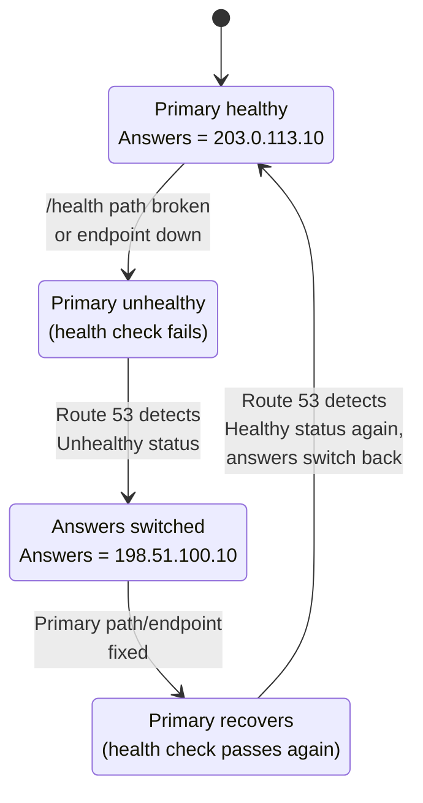

# 09 - Failover Routing (Hands-On)

> Goal: understand **failover routing** — a primary/secondary record pair where Route 53 answers with the primary until its health check reports unhealthy, then automatically switches to the secondary — and reconfigure `app.example.com` to demonstrate a real failover and recovery.

---

## 1. What failover routing is

Failover routing creates a **primary/secondary pair** of records for the same name. Under normal conditions, Route 53 always answers queries with the **primary** record. The moment the **health check associated with the primary** reports **Unhealthy**, Route 53 stops returning the primary and starts answering with the **secondary** instead — automatically, with no manual intervention. When the primary's health check reports healthy again, Route 53 switches answers back to the primary.

This **requires a health check on the primary record** — without one, Route 53 has no signal to act on and has no way to know it should ever stop answering with the primary. This is exactly where the health checks built earlier in this folder get used for a real purpose: they're not just informational status indicators, they directly drive which record Route 53 hands out.

> 🧠 **Mental model:** failover routing is a light switch with an automatic sensor — one side is always "on" (primary) until the sensor detects a fault, at which point the switch flips to the other side (secondary) by itself, and flips back once the fault clears.

---

## 2. Active-active vs active-passive — where failover routing fits

These are the two broad patterns for running redundant infrastructure:

| | **Active-active** | **Active-passive** |
|---|---|---|
| How many endpoints serve traffic at once | **All** registered endpoints, simultaneously | **Only one** at a time |
| Typical Route 53 policy | Weighted, Latency, Multivalue Answer, Geolocation | **Failover** |
| Failure behavior | Traffic simply redistributes across the remaining healthy endpoints | Traffic switches entirely to the standby the moment the primary is deemed unhealthy |
| Common use case | Load spreading + redundancy at the same time | Disaster recovery: a warm/cold standby that only takes over on failure |

**Failover routing implements the active-passive pattern** — by design, only one endpoint (the primary, when healthy) ever serves traffic at a time. The secondary sits idle from Route 53's perspective until it's promoted by a primary health-check failure.

---

## 3. Hands-on: reconfigure `app.example.com` as a failover pair

We reuse the same `example.com` hosted zone, the same `app.example.com` record name, and the two health checks built earlier in this folder (`example-health-check-a` monitoring `203.0.113.10` on `/health`, and `example-health-check-b` monitoring `198.51.100.10` on `/health`).

### Step 1 — Reconfigure the primary record

1. Route 53 console → **Hosted zones** → `example.com` → edit the existing `app.example.com` A record.
2. **Routing policy**: **Failover**.
3. **Failover record type**: **Primary**.
4. **Value**: `203.0.113.10`.
5. **Health check to associate**: the health check monitoring this endpoint — `example-health-check-a`, which checks HTTP `/health` against `203.0.113.10`. This association is what makes failover possible; a primary record with no health check has no failure signal to react to.
6. **Record ID**: `app-failover-primary`.
7. Save.

### Step 2 — Create the secondary record

1. Add a second record, same name (`app`) and type (A).
2. **Routing policy**: **Failover**.
3. **Failover record type**: **Secondary**.
4. **Value**: `198.51.100.10`.
5. Health check: optional on the secondary (you can attach `example-health-check-b` too, so Route 53 also avoids returning a broken secondary, but it isn't required for basic failover behavior — only the primary's health check drives the failover decision itself).
6. **Record ID**: `app-failover-secondary`.
7. Save.

`app.example.com` is now:

| Record ID | Role | Value | Health check |
|---|---|---|---|
| `app-failover-primary` | Primary | `203.0.113.10` | `example-health-check-a` (required) |
| `app-failover-secondary` | Secondary | `198.51.100.10` | `example-health-check-b` (optional) |

### Step 3 — Trigger a real failover

1. Go to **Health checks** → `example-health-check-a` → **Edit health check**.
2. Temporarily change its monitored **path** from `/health` to something that returns a 404 on `203.0.113.10` (e.g. `/this-path-does-not-exist`).
3. Save, and wait for the health checkers (running from multiple global locations) to report the new status — this typically takes a couple of minutes, since it depends on the configured failure threshold (consecutive failed checks before the status flips).
4. Once `example-health-check-a` flips to **Unhealthy**, query `app.example.com` (e.g. `dig app.example.com` or `nslookup app.example.com`) — the answer now comes back as `198.51.100.10`, the secondary.
5. Revert the health check's path back to `/health`, wait for it to report **Healthy** again, and re-query — the answer switches back to `203.0.113.10`, the primary.

This is the entire failover mechanism end to end: nothing about the DNS records themselves changed during the test — only the health check's reported status did, and Route 53 reacted to that automatically.

---

## 4. Diagram: the failover lifecycle

---

## 5. Failover routing vs an ALB's own health checks — different layers

It's easy to conflate "DNS failover" with "load balancer health checks," but they operate at completely different layers and solve different problems:

| | **Route 53 failover routing** | **Load balancer health checks (e.g. an ALB)** |
|---|---|---|
| What gets failed over | Which **IP/region/endpoint** DNS hands out at all | Which **individual instance** inside one target group receives traffic |
| Scope | Can span regions/accounts/completely separate infrastructure stacks | Within a single load balancer's own target group, typically one region |
| Mechanism | DNS answer changes — clients that re-resolve get the new answer | The load balancer itself stops forwarding to the unhealthy target; clients never see any DNS change |
| Typical role | The building block for **DR** (disaster recovery) architectures — an entire region or stack going down | Routine, fine-grained resilience within one healthy region/stack |

🎯 **Exam tip:** failover routing is the **routing-policy-level** building block for DR architectures — it fails over at the DNS-answer level (which endpoint/region gets used at all), which is a different unit and a different layer from an ALB routing around one unhealthy instance inside a single target group. A question describing "an entire region's primary site going down, traffic should shift to a standby site" is describing Route 53 failover routing, not a load balancer's own health checking.

---

## 6. Common beginner problems

| Symptom | Cause |
|---|---|
| Secondary never gets returned even when primary is clearly down | No health check was associated with the **primary** record — failover has no signal to act on without one. |
| Failover feels slow to trigger | Health check status changes aren't instantaneous — they depend on the check interval and failure threshold (consecutive failures required before the status flips), plus DNS TTL affecting how quickly resolvers pick up the new answer. |
| Both primary and secondary always answer, never one-at-a-time | The records weren't actually set to the **Failover** routing policy with correct Primary/Secondary roles — double-check each record's failover record type. |
| Answers don't fail back after fixing the primary | The health check is still failing for some other reason (e.g. the path change wasn't fully reverted, or the failure threshold hasn't been re-evaluated yet) — re-check the health check's current status directly. |

---

## 7. Cleanup note

Revert the health check's monitored path if you changed it for testing, and once you're done experimenting, delete the failover records (or reconfigure `app.example.com` again for the next routing policy) along with any health checks you no longer need, to avoid ongoing health-check charges.

---

## 8. Recap

- **Failover routing** is a primary/secondary record pair: Route 53 always answers with the primary while its health check is healthy, and automatically switches to the secondary the instant that health check reports unhealthy — switching back once the primary recovers.
- It **requires a health check on the primary** — that's the only signal Route 53 has to know a failover is needed.
- Failover routing implements the **active-passive** DR pattern — only one endpoint ever serves traffic at a time, unlike active-active patterns (Weighted, Latency, Multivalue Answer) where multiple endpoints serve traffic simultaneously.
- Reconfigured `app.example.com`: Primary → `203.0.113.10` (with `example-health-check-a` attached), Secondary → `198.51.100.10`; deliberately broke the primary's health check path to observe the switch to secondary, then reverted it to observe the switch back.
- 🎯 **Exam tip:** DNS-level failover (Route 53) switches which IP/region gets used at all — a different layer from an ALB's own health checks, which route around one unhealthy instance inside a single target group.
- Next: Note 10 — Multivalue Answer Routing (Hands-On).

---

### Sources
- [Failover routing – Amazon Route 53 Developer Guide](https://docs.aws.amazon.com/Route53/latest/DeveloperGuide/routing-policy-failover.html)
- [Configuring DNS failover – Amazon Route 53 Developer Guide](https://docs.aws.amazon.com/Route53/latest/DeveloperGuide/dns-failover.html)
- [Creating Amazon Route 53 health checks and configuring DNS failover – Amazon Route 53 Developer Guide](https://docs.aws.amazon.com/Route53/latest/DeveloperGuide/health-checks-creating.html)
