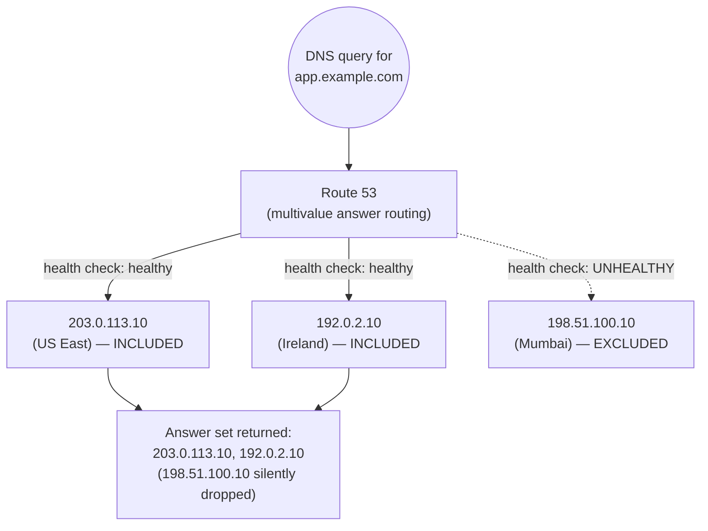

# 10 - Multivalue Answer Routing (Hands-On)

> Goal: understand **multivalue answer routing** — returning up to 8 *healthy* records per query, chosen at random, as a lightweight DNS-level complement to (not a replacement for) a real load balancer — and reconfigure `app.example.com` to demonstrate it with health checks attached.

---

## 1. What multivalue answer routing is

Multivalue answer routing configures Route 53 to return **up to 8 records** in response to each DNS query, selected at random from among the ones currently passing their associated health checks. This gives you simple, DNS-level client-side load balancing and redundancy — a resolver (or client) gets a handful of candidate IPs back and can try one, falling back to another if the first doesn't respond.

> 🧠 **Mental model:** multivalue answer routing is a receptionist handing you a short list of "currently open" desks instead of assigning you to exactly one — you still have to walk up and knock, but you're never handed a desk that's known to be closed.

⚠️ **This is explicitly not a substitute for a real load balancer.** There's no weighting between the returned values, no sticky sessions, no Layer 7 awareness (no path/host-based rules, no request inspection) — just "here are up to 8 currently-healthy IPs, pick one." It's a lightweight complement that improves DNS-level availability and rough load spreading, sitting in front of (or alongside) something like an Application Load Balancer or Network Load Balancer that actually does intelligent traffic management within a region.

---

## 2. Multivalue Answer vs "Simple routing with multiple values" — the exact distinction

This pairing is one of the most frequently confused in the exam, because Simple routing also technically supports attaching multiple values to one record.

| | **Simple routing, multiple values** | **Multivalue Answer routing** |
|---|---|---|
| How many values can one record hold | Multiple (e.g. several IPs under one A record) | Multiple **records**, each independently health-checkable |
| What gets returned per query | **All** configured values, every time, regardless of health | Up to **8**, chosen **only from currently healthy** ones |
| Health check awareness | **None** — Simple routing has no concept of excluding an unhealthy value | **Built in** — an unhealthy record is excluded from the answer entirely |
| Typical use | A handful of static values with no failure-awareness need | Basic DNS-level redundancy/load spreading with automatic exclusion of broken endpoints |

**The deciding factor, if you remember nothing else: does the routing policy exclude unhealthy endpoints from what it hands out?** Simple routing does not — it will happily keep returning a dead IP forever, because it has no health-check integration at all. Multivalue Answer routing does — that's the entire reason it exists as a distinct policy type rather than just being "Simple routing with a fancier name."

---

## 3. Multivalue Answer vs Failover routing — active-active vs active-passive

It's also worth placing multivalue answer routing next to failover routing, since both use health checks to react to unhealthy endpoints, but in opposite styles:

| | **Multivalue Answer** | **Failover** |
|---|---|---|
| Endpoints serving traffic at once | **All** currently healthy ones, simultaneously (active-active) | Only **one** at a time — primary, unless it's unhealthy (active-passive) |
| Answer per query | Up to 8 healthy IPs, client picks one | Exactly one record — primary or secondary |
| Best fit for | Spreading load across several interchangeable, stateless endpoints | Dedicated standby/DR site that should stay idle until needed |

If your endpoints are genuinely interchangeable and you just want to hand out several healthy options at once, multivalue answer is the right shape. If you have a designated primary and a designated standby that should only take over on failure, failover routing (not multivalue answer) is the correct tool.

---

## 4. Hands-on: reconfigure `app.example.com` as multivalue answer records

We reuse the same `example.com` hosted zone, the same `app.example.com` record name, and the two health checks built earlier in this folder — plus introduce a third illustrative endpoint here to show what happens with more than two values.

### Step 1 — First multivalue record

1. Route 53 console → **Hosted zones** → `example.com` → edit the existing `app.example.com` A record.
2. **Routing policy**: **Multivalue answer**.
3. **Value**: `203.0.113.10`.
4. **Health check to associate**: `example-health-check-a` (monitors `203.0.113.10` on `/health`) — attaching it means this value drops out of the answer set the moment it's unhealthy.
5. **Record ID**: `app-mv-1`.
6. Save.

### Step 2 — Second multivalue record

1. Add another record, same name/type, routing policy **Multivalue answer**.
2. **Value**: `198.51.100.10`.
3. **Health check**: `example-health-check-b` (monitors `198.51.100.10` on `/health`).
4. **Record ID**: `app-mv-2`.
5. Save.

### Step 3 — Optional third multivalue record

To demonstrate more than two values in an answer set, add a third:

1. **Value**: `192.0.2.10` (our illustrative "Europe (Ireland)" endpoint).
2. **Health check**: create a third health check the same way as the earlier two — HTTP, path `/health`, against `192.0.2.10` — and associate it here.
3. **Record ID**: `app-mv-3`.
4. Save.

`app.example.com` now looks like this:

| Record ID | Value | Region (illustrative) | Health check |
|---|---|---|---|
| `app-mv-1` | `203.0.113.10` | US East (N. Virginia) | `example-health-check-a` |
| `app-mv-2` | `198.51.100.10` | Asia Pacific (Mumbai) | `example-health-check-b` |
| `app-mv-3` | `192.0.2.10` | Europe (Ireland) | new health check on `/health` |

With all three healthy, a query for `app.example.com` returns all three IPs (since 3 is under the 8-value cap), in a different order for different resolvers. If one — say `198.51.100.10` — fails its health check, subsequent queries return only the remaining two healthy values; the unhealthy one is dropped from the answer set entirely rather than being returned alongside the others.

---

## 5. Diagram: healthy values returned, unhealthy one excluded

---

## 6. Common beginner problems

| Symptom | Cause |
|---|---|
| Expecting weighted or sticky behavior from multivalue answer | Not supported — multivalue answer has no weighting or session affinity; every healthy value is an equally likely random pick. |
| All configured values keep being returned even after one goes down | No health check was attached to that record — without one, Route 53 has no failure signal and just keeps including it (this is actually indistinguishable from Simple routing's behavior at that point). |
| More than 8 records configured, but never seeing all of them in one answer | Expected — Route 53 caps each response at **8** records; extra healthy values are still eligible but a given response only surfaces up to 8, chosen at random per resolver. |
| All records showing unhealthy simultaneously and answers still return something | If **every** record for a name is unhealthy, Route 53 falls back to returning all of them anyway (better to hand out a possibly-dead answer than none at all) — treat "everything unhealthy" as a signal to investigate the health checks themselves, not the routing policy. |

---

## 7. Cleanup note

Delete the multivalue records for `app.example.com` and the third health check created for `192.0.2.10` if you don't need to keep experimenting, to avoid extra health-check charges beyond the two built earlier in this folder.

---

## 8. Recap

- **Multivalue answer routing** returns up to **8 healthy records**, chosen at random, per query — simple DNS-level load balancing and redundancy, explicitly **not** a substitute for a real load balancer (no weighting, no sticky sessions, no Layer 7 features).
- The precise, commonly-tested distinction versus **Simple routing with multiple values**: Simple returns **all** configured values regardless of health; Multivalue Answer returns only **healthy** ones, excluding failed health checks from the answer set entirely.
- Reconfigured `app.example.com` with three multivalue records — `203.0.113.10`, `198.51.100.10`, and `192.0.2.10` — each backed by its own health check, and walked through an unhealthy value being silently dropped from the answer set.
- 🎯 **Exam tip:** "Simple routing with multiple values" vs "Multivalue Answer routing" is a frequently-confused exam pair — the deciding factor is whether unhealthy endpoints get excluded (only Multivalue Answer does that).
- Next: Note 11 — IP-Based Routing (Hands-On).

---

### Sources
- [Multivalue answer routing – Amazon Route 53 Developer Guide](https://docs.aws.amazon.com/Route53/latest/DeveloperGuide/routing-policy-multivalue.html)
- [Difference between multivalue answer routing policy and simple routing policy – AWS re:Post knowledge center](https://repost.aws/knowledge-center/multivalue-versus-simple-policies)
- [Values specific for multivalue answer records – Amazon Route 53 Developer Guide](https://docs.aws.amazon.com/Route53/latest/DeveloperGuide/resource-record-sets-values-multivalue.html)
