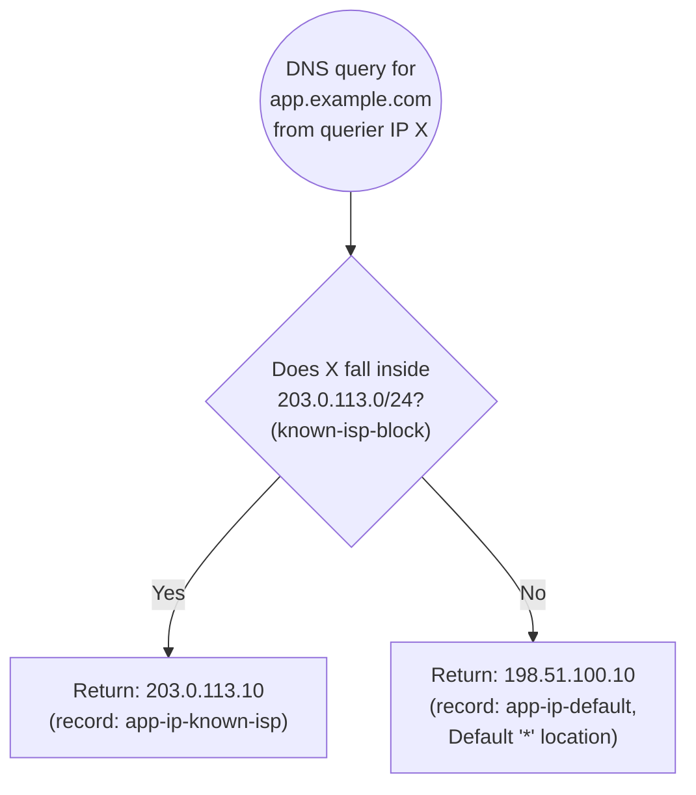

# 11 - IP-Based Routing (Hands-On)

> Goal: understand **IP-based routing** — routing based on the *querier's own IP address range*, defined by CIDR blocks you configure yourself — and reconfigure `app.example.com` with a CIDR collection to demonstrate it.

---

## 1. What IP-based routing actually keys on

IP-based routing routes a DNS query based on the **CIDR block the querying resolver's IP address falls into** — ranges that *you* define, not anything AWS derives automatically. You group IP ranges into named **CIDR locations**, gather those into a **CIDR collection**, and map each location to a specific endpoint. When a query comes in, Route 53 checks which CIDR location the querier's IP matches and answers accordingly.

This is a fundamentally different signal from the other "which endpoint for this user" policies:

| Policy | Signal it keys on |
|---|---|
| **Geolocation** | The querier's **geographic location** (continent/country/state, derived from IP geolocation databases) |
| **Latency** | AWS's own **measured network latency** between the querier and each region |
| **IP-based** | **Your own knowledge of specific IP/CIDR ranges** — no geography or latency measurement involved at all |

> 🧠 **Mental model:** geolocation and latency both rely on *someone else's* model of the world (a geo-IP database, or AWS's latency telemetry). IP-based routing throws that out and lets you say, in your own words, "I personally know these exact IP ranges should go here" — because you have information AWS's generic models don't capture.

---

## 2. Why IP-based routing exists — the real use case

The point of IP-based routing is to encode **network topology knowledge that only you (or your ISP contact) have** — things no generic geolocation or latency dataset would know:

- You know a specific **ISP's** published IP ranges get measurably better performance from one particular endpoint of yours because of a private peering arrangement or transit relationship between that ISP and your hosting provider — a fact that has nothing to do with geography and that AWS's generic latency measurements might not reflect precisely enough for your needs.
- You know a **corporate office's** public egress IP block (their well-known NAT gateway range) and want every query from that block routed straight to an internal-facing endpoint (e.g. a corporate VPN-adjacent service), regardless of where that office happens to sit geographically.
- You're running a **CDN or partner integration** where a specific known IP range (e.g. a partner's crawler or monitoring infrastructure) needs to be pinned to a dedicated endpoint, separate from general public traffic.

None of these are "where is this user, geographically" or "what's the fastest path" questions — they're "I recognize this specific network block and I know exactly what I want to do with it" decisions, which is exactly what IP-based routing is built for.

---

## 3. CIDR collections — the reusable building block

A **CIDR collection** is a named container for one or more **CIDR locations**, and each CIDR location is itself a named group of one or more CIDR blocks (IP ranges). For example, a collection could contain a location called `example-isp-ranges` holding the CIDR blocks known to belong to a particular ISP. Collections are account-level objects, reusable across multiple records and hosted zones — define the CIDR location once, then reference it from any IP-based record that needs it.

Every IP-based record you create references one location within exactly one collection, and every record sharing the same record name/type must reference the **same** collection (you can't mix collections across records for one name). AWS's default account quota allows up to **5 CIDR collections**, each holding up to **1,000 CIDR blocks** — enough headroom for realistic ISP/corporate-network mapping scenarios.

**You still need a default record.** Any querier whose IP doesn't match a CIDR block in any of your defined locations falls through to a special **Default (`*`)** location — a catch-all record you must configure so that traffic from IP ranges you haven't explicitly mapped still gets an answer instead of nothing.

---

## 4. Hands-on: reconfigure `app.example.com` with IP-based routing

We reuse the `example.com` hosted zone and the `app.example.com` record name.

### Step 1 — Create a CIDR collection

1. Route 53 console → left nav → **IP-based routing** → **CIDR collections** → **Create CIDR collection**.
2. **Collection name**: `example-isp-ranges`.
3. Add a **CIDR location** inside the collection:
   - **Location name**: `known-isp-block`.
   - **CIDR blocks**: `203.0.113.0/24` (reusing the TEST-NET-3 documentation range here purely as an illustrative "known ISP range" — in a real deployment this would be the actual published CIDR block for the ISP or corporate network you're targeting).
4. Save the collection.

### Step 2 — Reconfigure `app.example.com` with the first IP-based record

1. Go back to the hosted zone → edit the existing `app.example.com` A record.
2. **Routing policy**: **IP-based**.
3. **CIDR collection**: `example-isp-ranges`.
4. **Location**: `known-isp-block`.
5. **Value**: `203.0.113.10`.
6. **Record ID**: `app-ip-known-isp`.
7. Save.

### Step 3 — Add the required default record

1. Add another record, same name/type, routing policy **IP-based**.
2. **Location**: **Default (`*`)**.
3. **Value**: `198.51.100.10`.
4. **Record ID**: `app-ip-default`.
5. Save.

`app.example.com` now looks like:

| Record ID | Location | Value |
|---|---|---|
| `app-ip-known-isp` | `known-isp-block` (`203.0.113.0/24`, in `example-isp-ranges`) | `203.0.113.10` |
| `app-ip-default` | Default (`*`) | `198.51.100.10` |

A querier whose IP falls inside `203.0.113.0/24` gets `203.0.113.10`. Every other querier — anyone outside that specific block — falls through to the default record and gets `198.51.100.10`.

---

## 5. Diagram: CIDR match logic with default fallback

---

## 6. Common beginner problems

| Symptom | Cause |
|---|---|
| Records fail to create with a "no default location" error | IP-based routing requires a **Default (`*`)** record for the same name/type before (or alongside) any specific-CIDR records — there's always a fallback required. |
| A querier expected to match a CIDR block gets the default answer instead | Double-check the exact CIDR block boundaries — a querier's IP just outside the defined range (e.g. a neighboring /24) won't match; CIDR matching is exact-range, not "close enough." |
| Can't reference two different collections from records with the same name | Not allowed — every record sharing a name/type must reference the **same** CIDR collection; use multiple locations within one collection instead. |
| Confusing this with Geolocation | Geolocation keys on the querier's **geographic** location (continent/country/state); IP-based keys on the querier's **specific IP/CIDR range**, which you define yourself and which may have nothing to do with geography at all. |

---

## 7. Cleanup note

Delete the IP-based records for `app.example.com`, and if you don't need it for further experiments, the `example-isp-ranges` CIDR collection itself, to keep the hosted zone tidy.

---

## 8. Recap

- **IP-based routing** routes based on the **querier's own IP address**, matched against CIDR blocks you define yourself — not geography, not measured latency.
- The real use case: encoding **network topology knowledge only you have** — a specific ISP's peering advantage, a corporate office's known egress IP block — that generic AWS geolocation/latency data doesn't capture.
- **CIDR collections** are named, reusable containers of **CIDR locations** (each a named group of CIDR blocks); every record needs a **Default (`*`)** location as a fallback for unmatched queriers.
- Built the `example-isp-ranges` collection with a `known-isp-block` location (`203.0.113.0/24`), and reconfigured `app.example.com` with an IP-based record mapping that location to `203.0.113.10`, plus a default record → `198.51.100.10`.
- 🎯 **Exam tip:** IP-based routing keys on the **querier's IP/network identity** — don't confuse it with Geolocation (querier's geography) or Latency (measured network performance); all three can sound similar in an exam scenario but key on entirely different signals.
- Next: Note 12 — Traffic Policies and Traffic Flow.

---

### Sources
- [IP-based routing – Amazon Route 53 Developer Guide](https://docs.aws.amazon.com/Route53/latest/DeveloperGuide/routing-policy-ipbased.html)
- [Creating a CIDR collection with CIDR locations and blocks – Amazon Route 53 Developer Guide](https://docs.aws.amazon.com/Route53/latest/DeveloperGuide/resource-record-sets-creating-cidr-collection.html)
- [Working with CIDR locations and blocks – Amazon Route 53 Developer Guide](https://docs.aws.amazon.com/Route53/latest/DeveloperGuide/resource-record-sets-working-with-cidr-locations.html)
- [Introducing IP-based routing for Amazon Route 53 – AWS Networking & Content Delivery Blog](https://aws.amazon.com/blogs/networking-and-content-delivery/introducing-ip-based-routing-for-amazon-route-53/)
