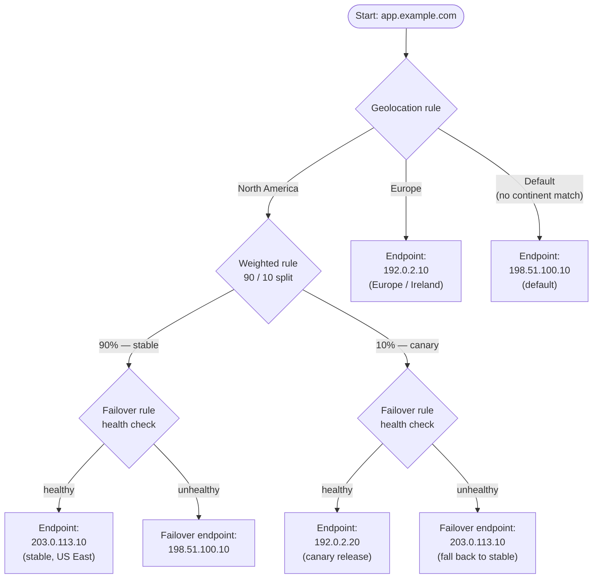

# 12 - Traffic Policies and Traffic Flow

> Goal: understand **Route 53 Traffic Flow** as a distinct feature from ordinary hosted-zone routing-policy records — a visual editor for building a single, reusable, multi-level decision tree that combines several routing rule types together — and see how it's billed and when it's genuinely worth reaching for.

---

## 1. The problem: one record, one routing policy

Every hands-on note earlier in this folder reconfigured `app.example.com` with exactly **one** routing policy at a time — Simple, then Weighted, then Geolocation, then Latency, then Failover, then Multivalue Answer, then IP-based. Each of those is a plain resource record set: you pick one policy type, fill in its specific fields, and that's the whole decision.

But real-world DNS decisions are often layered: "first split by geography, **then**, within one of those geographic branches, do a canary weighted split, **and** each of those weighted branches should fail over to a backup if its primary is unhealthy." A plain resource record set can't express that — it's built around exactly one routing-policy type per record. **Route 53 Traffic Flow** exists to close that gap.

> 🧠 **Mental model:** a plain routing-policy record is a single fork in the road. Traffic Flow is the entire road map — forks feeding into more forks, each fork potentially a different *kind* of decision, all captured in one reusable document.

---

## 2. Core concepts: Traffic Policy vs Traffic Policy Record

| Concept | What it is |
|---|---|
| **Traffic Policy** | The visual decision-tree **definition** itself — built in the Traffic Flow editor by chaining rule types (Geolocation, Weighted, Latency, Failover, Geoproximity, etc.) together. A traffic policy on its own doesn't touch any hosted zone or cost anything — it's just a saved template. |
| **Traffic Policy Version** | Traffic policies are **versioned**. Editing an existing policy doesn't overwrite it — it creates a new version, and older versions are retained. You can see exactly which version is live anywhere the policy is applied, and roll back to an older version if a change causes problems. |
| **Traffic Policy Record** | The actual DNS record(s) **created from** a specific traffic policy version and applied to a specific hosted zone + record name (e.g. applying version 3 of `app-traffic-policy` to `app.example.com` in the `example.com` hosted zone). This is the billable unit — creating a traffic policy record is what actually publishes live DNS records derived from the tree. |

The relationship: you design a Traffic Policy once (versioned as you refine it), then create one or more Traffic Policy Records to actually deploy a specific version of that policy against real DNS names.

> ⚠️ Building a traffic policy costs nothing by itself. You only start paying once you create a **traffic policy record** — the moment the policy actually goes live against a DNS name.

---

## 3. Why reach for Traffic Flow instead of a plain routing-policy record

Three concrete reasons, each already touched on earlier in this folder:

1. **Geoproximity requires it.** As covered when reconfiguring `app.example.com` for geoproximity routing, that policy type — including its bias value and coverage map — is only configurable through Traffic Flow. There is no plain-record equivalent.
2. **Combining multiple rule types in one coherent tree** is only possible through Traffic Flow's visual editor. A scenario like "split by continent first, then weight a canary release within one continent, with failover health checks guarding every leaf" needs several *different* routing-policy types layered on top of each other — something a single plain record, limited to one policy type, simply cannot express.
3. **Reusability across names and zones.** The same traffic policy **version** can be applied — as separate traffic policy records — to multiple DNS names and even multiple hosted zones at once. Design the tree once, then stamp it onto `app.example.com`, `api.example.com`, or names in an entirely different hosted zone, all pointing at the same underlying decision logic.

---

## 4. Building this in the console, at a glance

The mechanics of the visual editor itself are the same ones introduced when building the basic Geoproximity rule earlier in this folder: Route 53 console → **Traffic flow** → **Create traffic policy** → chain rules together by clicking **Connect to** → **New rule** on any existing node, choosing a rule type (Geolocation, Weighted, Latency, Failover, Geoproximity, etc.) at each step, and finally choosing **Create traffic policy record** to publish the tree against a real hosted zone and DNS name. What's different this time is simply that the tree has **multiple levels and multiple rule types chained together**, rather than a single geoproximity rule feeding straight into Start.

---

## 5. A concrete multi-level tree for `app.example.com`

Here's one coherent example combining three rule types into a single Traffic Flow policy for `app.example.com`, illustrating geographic segmentation, a canary weighted split, and failover safety nets all in one tree:

- **Top level — Geolocation rule**: split by continent.
  - **North America** branch → feeds a **Weighted rule**:
    - **90%** → "stable" endpoint `203.0.113.10`, itself guarded by a **Failover rule** with a health check before reaching the final IP.
    - **10%** → a new illustrative canary endpoint `192.0.2.20`, also guarded by its own Failover rule with a health check.
  - **Europe** branch → routes to `192.0.2.10` (the illustrative "Europe (Ireland)" endpoint used elsewhere in this folder).
  - **Default** branch (anyone not matched by a specific continent rule) → routes to `198.51.100.10`.

Walking the tree for a single query: a North American resolver first hits the Geolocation rule and is routed into the Weighted rule; the weighted split then sends roughly 9 out of 10 such queries down the "stable" branch and 1 out of 10 down the "canary" branch; whichever branch is picked still passes through its own Failover rule, so even the canary release has a safety net if its instance goes unhealthy. A European resolver skips all of that entirely and goes straight to the Ireland endpoint. Anyone Route 53 can't place into a specific continent falls through to the default endpoint.

---

## 6. Real-world use cases this pattern supports

- **Blue/green or canary deployments with geographic segmentation** — roll a new version out to a small percentage of traffic within one specific geography first (exactly the North America 90/10 split above), while leaving other geographies untouched, all as one managed policy rather than juggling separate per-region records by hand.
- **Multi-region disaster recovery combined with compliance-driven data-residency routing** — route European queriers to an EU-resident endpoint for data-residency reasons (a geolocation-style rule) while independently running active-passive failover within each region's own branch of the tree, in one unified policy instead of stitching together separate unrelated records.
- **A/B testing infrastructure changes on a fraction of a specific geography's traffic only** — combine a geographic split with a weighted split beneath it to test a change on, say, 10% of North American traffic specifically, without touching any other region's behavior at all.

---

## 7. Plain routing-policy record vs Traffic Policy Record

| | **Plain routing-policy record** | **Traffic Policy Record (via Traffic Flow)** |
|---|---|---|
| Flexibility | One routing policy type per record | Multi-level tree combining several rule types in one policy |
| Combining rule types | Not possible — pick exactly one policy | Fully supported — chain Geolocation → Weighted → Failover, etc. |
| Versioning | None — editing a record just changes it in place | **Versioned** — edits create a new version; old versions retained |
| Reusability across names/zones | None — each record is independent | Same policy **version** can be applied to multiple names/zones as separate policy records |
| Cost model | Standard hosted-zone query pricing only | Standard hosted-zone query pricing **plus** a separate Traffic Flow charge, billed **per policy record per month** (prorated for partial months); designing/saving a policy itself is free until you create a policy record from it |
| Which of the 8 routing policy types it can express | Simple, Weighted, Latency, Failover, Geolocation, Multivalue Answer, IP-based (all except Geoproximity) | All 8, **including Geoproximity** — the only path to Geoproximity |

---

## 8. Common beginner problems

| Symptom | Cause |
|---|---|
| Editing a traffic policy doesn't seem to change live behavior | Expected if you edited the policy but never created a new policy record from the new version — live DNS answers stay pinned to whatever version their existing policy record references until you update it. |
| Unexpected monthly charge appears | A traffic policy record exists somewhere, applied to a DNS name — check **Traffic policy records** in the console; the charge accrues per record per month regardless of query volume. |
| Trying to build Geoproximity as a plain record and it's missing from the dropdown | Expected — Geoproximity is Traffic-Flow-only, covered in depth earlier in this folder. |
| A multi-rule scenario feels impossible to configure | If it genuinely needs more than one routing policy type layered together, that's the exact signal to move to Traffic Flow rather than trying to force it into a single plain record. |

---

## 9. Cleanup note

Delete any traffic policy records you created while experimenting (this removes the live DNS records they generated) to stop the per-record monthly charge; traffic policies themselves (the design/template) can be left in place at no cost if you might reuse them later, or deleted too if you're done.

---

## 10. Recap

- **Route 53 Traffic Flow** is a visual policy editor for building a single, reusable, **multi-level decision tree** combining several routing rule types — instead of being limited to one routing policy type per plain record.
- A **Traffic Policy** is the versioned tree definition itself (free to design and save); a **Traffic Policy Record** is what happens when you apply a specific policy version to a real hosted zone + DNS name — that's the actual billable, DNS-publishing unit, billed **per traffic policy record per month**, on top of standard hosted-zone/query pricing.
- Reach for Traffic Flow when: (1) you need **Geoproximity**, which has no plain-record equivalent, (2) you need to **combine multiple rule types** in one coherent tree, or (3) you want to **reuse the same policy version** across multiple DNS names or hosted zones.
- Built one concrete tree for `app.example.com`: Geolocation (North America / Europe / Default) → Weighted 90/10 canary split within North America → Failover health checks guarding every leaf endpoint.
- Supports real patterns like geographically-segmented canary releases, DR combined with data-residency compliance, and geography-scoped A/B testing of infrastructure changes.
- This closes out the Route 53 routing-policy arc: Simple and Weighted (plain records, no special setup), Health Checks, Geolocation, Latency, Geoproximity, Failover, Multivalue Answer, and IP-based (each its own dedicated hands-on build against the same `app.example.com` record), and finally Traffic Flow tying multiple policy types together into one tree.

---

### Sources
- [Using Traffic Flow to route DNS traffic – Amazon Route 53 Developer Guide](https://docs.aws.amazon.com/Route53/latest/DeveloperGuide/traffic-flow.html)
- [Creating and managing traffic policies – Amazon Route 53 Developer Guide](https://docs.aws.amazon.com/Route53/latest/DeveloperGuide/traffic-policies.html)
- [Amazon Route 53 Pricing](https://aws.amazon.com/route53/pricing/)
- [Choosing a routing policy – Amazon Route 53 Developer Guide](https://docs.aws.amazon.com/Route53/latest/DeveloperGuide/routing-policy.html)
