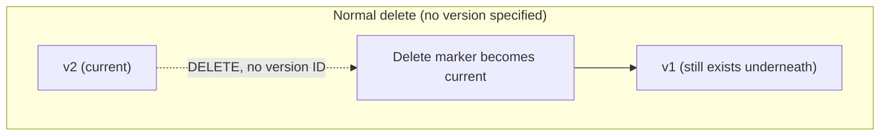

# 06 - AWS S3 Versioning

> Goal: enable versioning on a bucket and understand exactly what it protects against (accidental overwrite/delete) and what it costs (every version keeps billing until deleted) — the foundation Notes 07-08's lifecycle rules and Note 14's Object Lock both build directly on top of.

---

## 1. What versioning actually changes

By default, uploading a new object to an existing key **overwrites** the old one permanently — there's no built-in undo. **Versioning**, once enabled on a bucket, changes this: every `PUT` to the same key creates a **new version**, and the old version is **kept**, not overwritten. Every version gets its own unique **Version ID**.

> 🧠 **Mental model:** versioning turns each object key from "one file" into "a stack of files, newest on top" — a normal `GetObject` (no version specified) always reads the top of the stack (the **current/latest** version), but every older version underneath it is still there, retrievable by its specific Version ID, until someone explicitly deletes that specific version.

---

## 2. Enable versioning

1. **S3 console** → open a bucket → **Properties** tab → **Bucket Versioning** → **Edit** → **Enable** → **Save changes**.
2. Once enabled, versioning **cannot be fully turned off again** — only **suspended** (Section 5). This is a one-way door worth knowing before enabling it on a bucket you're not sure about.

---

## 3. How deletes actually work once versioning is on

This is the single most important, most tested behavior change versioning introduces:

- A normal `DELETE` (no version specified) does **not** actually erase the object's data — it inserts a **delete marker** as the new "current" version. The object appears gone from a normal listing/`GetObject` call, but every prior version is still fully intact underneath the delete marker.
- To **actually, permanently** delete a specific version's data, you must issue a `DELETE` that explicitly specifies that **Version ID** — deleting a delete marker itself (also by its own Version ID) is what "un-deletes" the object, making the next version down current again.

> ⚠️ This is exactly why versioning is a real protection against **accidental deletion**, not just accidental overwrite — an accidental `aws s3 rm` on a versioned bucket just adds a delete marker; the data is still recoverable by deleting the delete marker itself, unless someone goes out of their way to delete the specific version ID too.

---

## 4. Cost implications — every version bills

- Each version of an object is billed as **its own full copy** of storage — a 1 GB file overwritten 10 times (versioning on) means **10 GB** of billed storage, not 1 GB, until old versions are cleaned up.
- This is exactly why versioning is almost always paired with a **Lifecycle rule** (Notes 07-08) that automatically expires **non-current versions** after some period, rather than keeping every version forever by accident.

---

## 5. Suspending vs. disabling

| State | Behavior |
|---|---|
| **Enabled** | Every PUT creates a new version; every DELETE creates a delete marker |
| **Suspended** | New PUTs **overwrite** in place again (no new versions created) going forward; but **all existing versions created while it was enabled are preserved** — suspension doesn't retroactively delete history |
| **Disabled** | Not actually a real state you can return to — versioning only ever moves between **enabled** and **suspended** |

---

## 6. Versioning and MFA Delete (preview)

Versioning is also the **prerequisite** for **MFA Delete** (Note 36) — a bucket must have versioning enabled before MFA Delete can be configured at all, since MFA Delete's entire purpose is requiring an extra authentication factor specifically for the kind of permanent version-deletion this note just described.

> 🎯 **Exam tip:** "objects were accidentally overwritten or deleted, and we need a way to recover the previous copy" is the textbook **versioning** scenario — but remember the storage-cost trade-off: real deployments almost always pair versioning with a lifecycle rule to expire old versions, not leave them accumulating forever.

---

## 7. Recap

- **Versioning** keeps every prior copy of an object under its own Version ID; a normal delete only adds a **delete marker**, leaving real data recoverable underneath it.
- Versioning is a **one-way enable** — it can only be **suspended** afterward, never fully "disabled" back to its original state, and suspension doesn't delete history already created.
- Every version bills as full storage — pair versioning with lifecycle rules (Notes 07-08) to control cost over time.
- Versioning is a hard prerequisite for both **Object Lock** (Note 14) and **MFA Delete** (Note 36).
- Next: Note 07 — S3 Lifecycle Rule, Part 1, automating exactly the kind of version/storage-class cleanup this note flagged as necessary.

### Sources
- [Using versioning in S3 buckets — AWS docs](https://docs.aws.amazon.com/AmazonS3/latest/userguide/Versioning.html)
- [Working with delete markers — AWS docs](https://docs.aws.amazon.com/AmazonS3/latest/userguide/DeleteMarker.html)
- [Configuring versioning on buckets — AWS docs](https://docs.aws.amazon.com/AmazonS3/latest/userguide/manage-versioning-examples.html)
