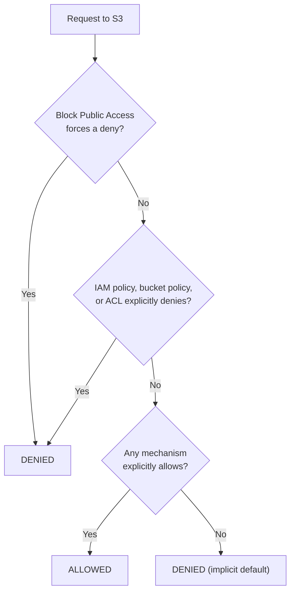

# 09 - Controlling Access To AWS S3 Buckets

> Goal: map out the **four** independent mechanisms that can each grant or restrict access to an S3 bucket/object — IAM policies, bucket policies, ACLs, and (for cross-account scenarios) explicit access grants — before Notes 10-13 go deep on each one individually.

---

## 1. The four access-control mechanisms, at a glance

| Mechanism | Attached to | Grants access to | Covered in |
|---|---|---|---|
| **IAM policy** | An IAM user/group/role | Whatever that identity is allowed to do, account-wide | Note 11 (and `IAM/02-04` for policy fundamentals) |
| **Bucket policy** | The bucket itself (a resource-based policy) | Any principal named in the policy — including other AWS accounts, or the public | Note 12 |
| **ACL (Access Control List)** | A specific bucket or object | A small, coarse set of grantees (predefined groups, or specific AWS accounts) — the oldest, least flexible mechanism | Note 13 |
| **Block Public Access** | The bucket (or the whole account) | Nothing — it's an override that can **force-deny** public access regardless of what any policy/ACL says | Notes 24-25 |

> 🧠 **Mental model:** an IAM policy asks "what can **this identity** do, anywhere?" — a bucket policy asks "who can reach **this bucket**, and what can they do?" These are two independent gates, and (Note 01's evaluation logic, extended here) **either type can grant, but an explicit Deny in either one always wins** — the same core IAM rule from `IAM/01`, just now spanning both identity-based and resource-based policies at once.

---

## 2. Why S3 needs a resource-based policy at all

Most services covered elsewhere in this repo (EC2, most of IAM's role-assumption notes) are governed almost entirely by identity-based policies. S3 is different because buckets very often need to be reached by principals that **don't belong to your account at all** — a different AWS account, a CloudFront distribution, another AWS service, or (deliberately, in specific cases) the public internet. A resource-based (bucket) policy is what makes that possible without needing to create an IAM identity in your own account for every external principal.

---

## 3. Effective access = union of grants, minus any explicit deny

For a given request, S3 evaluates **every applicable mechanism** — the requester's own IAM policies, the bucket policy, any ACLs, and Block Public Access — together:

> ⚠️ Block Public Access (Notes 24-25) sits **above** everything else — it can force a deny on public access even if a bucket policy or ACL explicitly tries to grant it. This is a deliberate, account/bucket-level safety net specifically to prevent accidental public exposure.

---

## 4. Same-account vs. cross-account access — which mechanism actually matters

| Scenario | What actually governs access |
|---|---|
| A user in **your own account** accessing a bucket in your own account | Both the user's IAM policy **and** the bucket policy (if one exists) must allow it — but for same-account, an IAM policy alone is often sufficient without needing a bucket policy at all |
| A user or role in **a different AWS account** accessing your bucket | The bucket policy **must** explicitly grant that external account/principal access — an IAM policy that external account writes for its own users has no authority over your bucket by itself |
| **Public/anonymous** access | Only a bucket policy (or ACL) can grant this — and only if Block Public Access doesn't override it |

> 🎯 **Exam tip:** "a user in Account B needs access to a bucket in Account A" is a recurring exam pattern whose answer almost always involves a **bucket policy** on Account A's bucket naming Account B's principal — an IAM policy inside Account B alone can never reach into Account A's bucket without the bucket owner's side also granting it.

---

## 5. Recap

- Four mechanisms can independently affect S3 access: **IAM policies** (identity-based), **bucket policies** (resource-based), **ACLs** (legacy, coarse-grained), and **Block Public Access** (an overriding safety net).
- Effective access is the union of every explicit Allow across all applicable mechanisms, **unless** any of them contains an explicit Deny, or Block Public Access forces one — same evaluation philosophy as `IAM/01`, extended across resource-based policies too.
- Cross-account and public access **require** a bucket policy (or ACL) — an IAM policy alone, written in someone else's account, cannot reach into your bucket.
- Next: Note 10 — AWS IAM Policy Vs Bucket Policy, contrasting the two most commonly used mechanisms in more depth.

### Sources
- [Identity and access management in Amazon S3 — AWS docs](https://docs.aws.amazon.com/AmazonS3/latest/userguide/s3-access-control.html)
- [How Amazon S3 authorizes a request — AWS docs](https://docs.aws.amazon.com/AmazonS3/latest/userguide/access-control-overview.html)
- [The Block Public Access setting — AWS docs](https://docs.aws.amazon.com/AmazonS3/latest/userguide/access-control-block-public-access.html)
