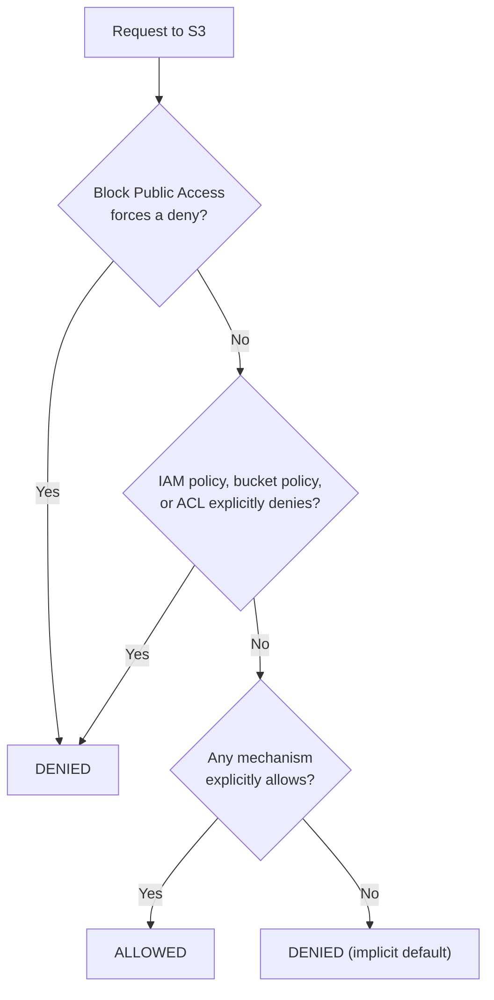

# 09 - Controlling Access To AWS S3 Buckets

> Goal: map out the **four** independent mechanisms that can each grant or restrict access to an S3 bucket/object — IAM policies, bucket policies, ACLs, and (for cross-account scenarios) explicit access grants — before Notes 10-13 go deep on each one individually.

---

## 1. The four access-control mechanisms, at a glance

| Mechanism | Attached to | Grants access to | Covered in |
|---|---|---|---|
| **IAM policy** | An IAM user/group/role | Whatever that identity is allowed to do, account-wide | Note 11 (and `IAM/02-04` for policy fundamentals) |
| **Bucket policy** | The bucket itself (a resource-based policy) | Any principal named in the policy — including other AWS accounts, or the public | Note 12 |
| **ACL (Access Control List)** | A specific bucket or object | A small, coarse set of grantees (predefined groups, or specific AWS accounts) — the oldest, least flexible mechanism | Note 13 |
| **Block Public Access** | The bucket (or the whole account) | Nothing — it's an override that can **force-deny** public access regardless of what any policy/ACL says | Notes 24-25 |

> 🧠 **Mental model:** an IAM policy asks "what can **this identity** do, anywhere?" — a bucket policy asks "who can reach **this bucket**, and what can they do?" These are two independent gates, and (Note 01's evaluation logic, extended here) **either type can grant, but an explicit Deny in either one always wins** — the same core IAM rule from `IAM/01`, just now spanning both identity-based and resource-based policies at once.

---

## 2. Why S3 needs a resource-based policy at all

Most services covered elsewhere in this repo (EC2, most of IAM's role-assumption notes) are governed almost entirely by identity-based policies. S3 is different because buckets very often need to be reached by principals that **don't belong to your account at all** — a different AWS account, a CloudFront distribution, another AWS service, or (deliberately, in specific cases) the public internet. A resource-based (bucket) policy is what makes that possible without needing to create an IAM identity in your own account for every external principal.


> **For same-account access, an IAM identity-based policy can be enough.**
>
> **For cross-account access, you generally need authorization on both sides: the caller's IAM policy AND the S3 bucket policy.**

Let's make this concrete.

---

# 1. Same account: IAM policy can be enough

Suppose everything is in:

```text
AWS Account A
Account ID: 111111111111
```

You have:

```text
                 Account A
        ┌─────────────────────────┐
        │                         │
        │  EC2                    │
        │  IAM Role              │
        │  MyEC2Role             │
        │       │                 │
        │       │ IAM Policy      │
        │       ▼                 │
        │  S3 Bucket              │
        │  my-app-images          │
        │                         │
        └─────────────────────────┘
```

EC2 has an IAM role:

```text
MyEC2Role
```

Attach:

```json
{
  "Version": "2012-10-17",
  "Statement": [
    {
      "Effect": "Allow",
      "Action": [
        "s3:GetObject",
        "s3:PutObject"
      ],
      "Resource": "arn:aws:s3:::my-app-images/*"
    }
  ]
}
```

That's enough.

You **don't necessarily need a bucket policy**.

---

## Demo

### EC2 role

`ec2-role-policy.json`

```json
{
  "Version": "2012-10-17",
  "Statement": [
    {
      "Effect": "Allow",
      "Action": [
        "s3:GetObject",
        "s3:PutObject"
      ],
      "Resource": "arn:aws:s3:::my-app-images/*"
    }
  ]
}
```

Then EC2 can do:

```bash
aws s3 cp image.jpg s3://my-app-images/
```

because:

```text
EC2
 │
 │ AssumeRole automatically through instance profile
 ▼
MyEC2Role
 │
 │ IAM Allow
 ▼
S3
```

No bucket policy is required in this basic same-account case.

---

# 2. Why does this work without a bucket policy?

Because the IAM role and S3 bucket belong to the **same AWS account**.

The account owner controls both:

```text
Account A
│
├── IAM Role
│
└── S3 Bucket
```

An identity-based policy attached to the role can grant the role access to the bucket.

---

# 3. Now cross-account EC2 → S3

Now let's change the architecture.

```text
Account A                         Account B
111111111111                      222222222222
──────────────                    ──────────────

EC2                               S3
 │                                │
 │ IAM Role                       │
 ▼                                │
EC2Role                           │
 │                                │
 └─────────────── AWS ────────────┘
```

EC2 belongs to:

```text
Account A
```

Bucket belongs to:

```text
Account B
```

Now Account A wants:

```text
PutObject
GetObject
```

on Account B's bucket.

Here you need to think about **two authorization layers**.

---

# 4. Layer 1 — IAM policy on EC2 role

Account A gives its EC2 role permission to access the bucket.

```json
{
  "Version": "2012-10-17",
  "Statement": [
    {
      "Effect": "Allow",
      "Action": [
        "s3:GetObject",
        "s3:PutObject"
      ],
      "Resource": "arn:aws:s3:::account-b-images/*"
    }
  ]
}
```

This says:

> `EC2Role` is allowed to perform these S3 actions.

But that's **not enough** for the cross-account case.

---

# 5. Layer 2 — Bucket policy in Account B

The bucket owner must also trust the external principal.

Account B's bucket policy:

```json
{
  "Version": "2012-10-17",
  "Statement": [
    {
      "Effect": "Allow",
      "Principal": {
        "AWS": "arn:aws:iam::111111111111:role/EC2Role"
      },
      "Action": [
        "s3:GetObject",
        "s3:PutObject"
      ],
      "Resource": "arn:aws:s3:::account-b-images/*"
    }
  ]
}
```

Now we have:

```text
Account A                         Account B
111111111111                      222222222222

EC2
 │
 ▼
EC2Role
 │
 │ IAM Policy
 │
 │ "I can access bucket"
 │
 └─────────────────────────────► S3 Bucket
                                  │
                                  │ Bucket Policy
                                  │
                                  │ "I trust EC2Role
                                  │  from Account A"
                                  ▼
                                ALLOW
```

---

# 6. Think of it as two questions

This mental model is extremely useful:

### IAM policy asks:

> **"Is this principal allowed to perform the action?"**

Example:

```text
EC2Role
   │
   └── IAM Policy
          │
          └── Allow s3:GetObject
```

### Bucket policy asks:

> **"Does this bucket allow this principal to access me?"**

Example:

```text
S3 Bucket
   │
   └── Bucket Policy
          │
          └── Allow Account-A EC2Role
```

For cross-account access, you generally need **both sides to permit it**.

---

# 7. What about Role Assumption?

This is where your question gets interesting.

You said:

> "IAM (both sides role assumption) or bucket policy or both?"

There are actually **two different cross-account designs**.

---

# Option A — Direct cross-account S3 access

This is the simpler architecture.

```text
Account A                         Account B
──────────                        ──────────

EC2
 │
 ▼
EC2Role
 │
 │ IAM Policy
 │
 └──────────────────────────────► S3
                                  ▲
                                  │
                           Bucket Policy
```

No role assumption into Account B is necessary.

### Account A

EC2 role:

```json
{
  "Effect": "Allow",
  "Action": [
    "s3:GetObject",
    "s3:PutObject"
  ],
  "Resource": "arn:aws:s3:::account-b-images/*"
}
```

### Account B

Bucket policy:

```json
{
  "Effect": "Allow",
  "Principal": {
    "AWS": "arn:aws:iam::111111111111:role/EC2Role"
  },
  "Action": [
    "s3:GetObject",
    "s3:PutObject"
  ],
  "Resource": "arn:aws:s3:::account-b-images/*"
}
```

That's enough.

---

# Option B — Assume a role in Account B

You can instead have Account A's EC2 role assume a role that lives in Account B.

Architecture:

```text
Account A                         Account B
──────────                        ──────────

EC2
 │
 ▼
EC2Role
 │
 │ sts:AssumeRole
 ▼
                         S3AccessRole
                              │
                              │ IAM Policy
                              ▼
                             S3
```

Now you have **two IAM policies involved**, but they're doing different things.

---

## Step 1 — Account B creates S3AccessRole

Account B:

```text
S3AccessRole
```

Its trust policy says:

> I trust Account A's EC2Role to assume me.

```json
{
  "Version": "2012-10-17",
  "Statement": [
    {
      "Effect": "Allow",
      "Principal": {
        "AWS": "arn:aws:iam::111111111111:role/EC2Role"
      },
      "Action": "sts:AssumeRole"
    }
  ]
}
```

This is the **trust policy**.

---

# 8. S3AccessRole also needs permissions

The role in Account B gets an identity policy:

```json
{
  "Version": "2012-10-17",
  "Statement": [
    {
      "Effect": "Allow",
      "Action": [
        "s3:GetObject",
        "s3:PutObject"
      ],
      "Resource": "arn:aws:s3:::account-b-images/*"
    }
  ]
}
```

Now:

```text
Account A

EC2
 │
 ▼
EC2Role
 │
 │ AssumeRole
 │
 ▼
Account B

S3AccessRole
 │
 │ IAM Policy
 ▼
S3 Bucket
```

In this design, **you may not need a bucket policy** if the assumed role and bucket are both in Account B and the identity policy on `S3AccessRole` is sufficient.

That's an important distinction.

---

# 9. Compare the two approaches

## Direct access

```text
Account A                         Account B

EC2
 │
 ▼
EC2Role
 │
 │ IAM Policy
 │
 └──────────────────────────────► S3
                                  │
                                  │ Bucket Policy
                                  ▼
```

Permissions:

```text
Account A:
EC2Role IAM policy

Account B:
Bucket policy
```

No `AssumeRole`.

---

## AssumeRole

```text
Account A                         Account B

EC2
 │
 ▼
EC2Role
 │
 │ sts:AssumeRole
 ▼
                                  S3AccessRole
                                       │
                                       │ IAM Policy
                                       ▼
                                      S3
```

Permissions:

```text
Account A:
EC2Role → sts:AssumeRole

Account B:
S3AccessRole → S3 permissions
S3AccessRole trust policy
```

Bucket policy may not be required.

---

# 10. Why would you choose AssumeRole?

Imagine Account B owns hundreds of S3 buckets.

Instead of putting Account A's EC2 role into every bucket policy:

```text
bucket1 → trust EC2Role
bucket2 → trust EC2Role
bucket3 → trust EC2Role
...
bucket100 → trust EC2Role
```

You could centralize permissions:

```text
Account B

S3AccessRole
     │
     ├── bucket1
     ├── bucket2
     ├── bucket3
     ├── bucket4
     └── bucket100
```

Account A simply assumes:

```text
arn:aws:iam::222222222222:role/S3AccessRole
```

and gets the permissions associated with that role.

---

# 11. Important correction to your original statement

You said:

> "If any service needs to reach S3 in the same account — IAM is fine without bucket policy."

### Generally: **Yes.**

For example:

```text
Account A

EC2 ──IAM Role──► S3
Lambda ──IAM Role──► S3
ECS ──Task Role──► S3
EKS Pod ──IRSA/Pod Identity──► S3
```

An identity-based policy can be sufficient.

---

### Cross-account:

Don't think:

> "IAM OR bucket policy."

Instead think:

### Direct cross-account:

```text
Caller IAM Policy
        +
Bucket Policy
```

### Cross-account AssumeRole:

```text
Caller → AssumeRole permission
        +
Target Role Trust Policy
        +
Target Role IAM Policy
```

And **bucket policy may or may not be necessary**, depending on the resulting principal and resource policy configuration.

---

# 12. One very useful exam/interview table

| Scenario                                  | IAM Policy | Bucket Policy               | AssumeRole |
| ----------------------------------------- | ---------- | --------------------------- | ---------- |
| EC2 → S3, same account                    | ✅          | Usually not needed          | ❌          |
| Lambda → S3, same account                 | ✅          | Usually not needed          | ❌          |
| EC2 Account A → S3 Account B directly     | ✅          | ✅                           | ❌          |
| EC2 Account A → AssumeRole Account B → S3 | ✅          | Usually not needed          | ✅          |
| CloudFront → private S3                   | —          | ✅ resource policy/OAC model | ❌          |
| Public S3 access                          | —          | ✅                           | ❌          |

The **big mental model** is:

```text
                 WHO AM I?
                    │
                    ▼
             IAM Role/Identity
                    │
             Identity Policy
                    │
                    ▼
             CAN I DO THIS?
                    │
                    ▼
                   S3
                    │
                    ▼
             Bucket Policy
                    │
             SHOULD YOU BE
             ALLOWED HERE?
```

For **same-account**, the identity policy is often enough.

For **cross-account direct access**, both the caller's identity policy and the bucket's resource policy generally participate.

For **cross-account AssumeRole**, the caller first gets permission to assume the target role, the target role trusts the caller, and then the **assumed role's own permissions** govern what it can do.


---

## 3. Effective access = union of grants, minus any explicit deny

For a given request, S3 evaluates **every applicable mechanism** — the requester's own IAM policies, the bucket policy, any ACLs, and Block Public Access — together:


```mermaid
flowchart TD
    REQ["Request to S3"] --> BPA{"Block Public Access\nforces a deny?"}
    BPA -->|Yes| DENY["DENIED"]
    BPA -->|No| CHECK{"IAM policy, bucket policy,\nor ACL explicitly denies?"}
    CHECK -->|Yes| DENY
    CHECK -->|No| ALLOW_CHECK{"Any mechanism\nexplicitly allows?"}
    ALLOW_CHECK -->|Yes| ALLOW["ALLOWED"]
    ALLOW_CHECK -->|No| DENY2["DENIED (implicit default)"]
```

> ⚠️ Block Public Access (Notes 24-25) sits **above** everything else — it can force a deny on public access even if a bucket policy or ACL explicitly tries to grant it. This is a deliberate, account/bucket-level safety net specifically to prevent accidental public exposure.

---

## 4. Same-account vs. cross-account access — which mechanism actually matters

| Scenario | What actually governs access |
|---|---|
| A user in **your own account** accessing a bucket in your own account | Both the user's IAM policy **and** the bucket policy (if one exists) must allow it — but for same-account, an IAM policy alone is often sufficient without needing a bucket policy at all |
| A user or role in **a different AWS account** accessing your bucket | The bucket policy **must** explicitly grant that external account/principal access — an IAM policy that external account writes for its own users has no authority over your bucket by itself |
| **Public/anonymous** access | Only a bucket policy (or ACL) can grant this — and only if Block Public Access doesn't override it |

> 🎯 **Exam tip:** "a user in Account B needs access to a bucket in Account A" is a recurring exam pattern whose answer almost always involves a **bucket policy** on Account A's bucket naming Account B's principal — an IAM policy inside Account B alone can never reach into Account A's bucket without the bucket owner's side also granting it.

---

## 5. Recap

- Four mechanisms can independently affect S3 access: **IAM policies** (identity-based), **bucket policies** (resource-based), **ACLs** (legacy, coarse-grained), and **Block Public Access** (an overriding safety net).
- Effective access is the union of every explicit Allow across all applicable mechanisms, **unless** any of them contains an explicit Deny, or Block Public Access forces one — same evaluation philosophy as `IAM/01`, extended across resource-based policies too.
- Cross-account and public access **require** a bucket policy (or ACL) — an IAM policy alone, written in someone else's account, cannot reach into your bucket.
- Next: Note 10 — AWS IAM Policy Vs Bucket Policy, contrasting the two most commonly used mechanisms in more depth.

### Sources
- [Identity and access management in Amazon S3 — AWS docs](https://docs.aws.amazon.com/AmazonS3/latest/userguide/s3-access-control.html)
- [How Amazon S3 authorizes a request — AWS docs](https://docs.aws.amazon.com/AmazonS3/latest/userguide/access-control-overview.html)
- [The Block Public Access setting — AWS docs](https://docs.aws.amazon.com/AmazonS3/latest/userguide/access-control-block-public-access.html)
