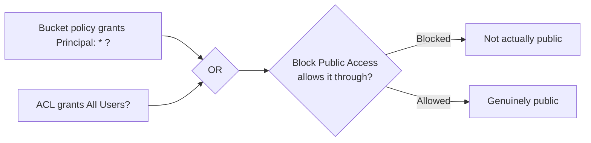

# 23 - AWS S3 — S3 Public Access Part 1: Two Ways To Grant Public Access

> Goal: name the **only two mechanisms** that can ever make an S3 bucket or object reachable by the public internet — a short, closed list worth memorizing exactly, since Notes 24-25 build directly on it.

---

## 1. The two, and only two, ways to grant public access

| Mechanism | How it grants public access |
|---|---|
| **Bucket policy** (Note 12) | A statement with `"Principal": "*"` and an `Effect: Allow` — anyone, with no AWS credentials at all, matching that statement |
| **ACL** (Note 13) | Granting the predefined **"All Users"** group any permission |

**No IAM policy can ever grant public access** — this is a direct consequence of Note 10's core distinction: an IAM policy only ever governs the identity it's attached to, and "the public" isn't an identity in your account at all, so there's no IAM policy to attach it to in the first place.

> 🧠 **Mental model:** think of this as a very short, closed list — if a bucket or object is genuinely public, tracing back *why* always lands on one of exactly these two places. There is no third path, no special setting elsewhere that independently makes something public.

---

## 2. Why this matters — troubleshooting and auditing both get simpler

Because there are only two possible causes, "is this bucket public, and why?" becomes a **fully answerable, bounded question**:

1. Check the bucket policy for any `"Principal": "*"` (or a wildcard/broad AWS principal) paired with `Allow`.
2. Check the bucket's and every object's ACLs for an "All Users" (or "Authenticated Users," Note 13) grant.
3. If neither exists, the bucket is **not** public, full stop — no other setting could have made it so.

This closed list is also exactly what tools like **IAM Access Analyzer** (`IAM/17`) check for automatically when generating **external access findings** — Access Analyzer's S3-related findings are, at their core, scanning for exactly these two things.

---

## 3. Public access still isn't automatic even when granted — Block Public Access

Even a bucket policy or ACL that *would* grant public access can be overridden by **Block Public Access** (Note 24) — a separate, account/bucket-level setting that can force-deny public access regardless of what either mechanism says. This is why "granting" public access (this note) and "actually becoming reachable publicly" (Note 24) are conceptually two different steps, covered as two separate notes.

---

## 4. Recap

- Exactly **two** mechanisms can ever grant public access to S3 content: a **bucket policy** with `"Principal": "*"` + `Allow`, or an **ACL** granting the **"All Users"** group.
- **IAM policies can never grant public access** — they have no authority over non-identities like "the public."
- Even a granted public-access statement can still be overridden by **Block Public Access** (Note 24) — granting and actually-being-reachable are two separate steps.
- Next: Note 24 — S3 Public Access Part 2: Block Public Access, the account/bucket-level override that can force-deny both mechanisms from this note.

### Sources
- [Blocking public access to your Amazon S3 storage — AWS docs](https://docs.aws.amazon.com/AmazonS3/latest/userguide/access-control-block-public-access.html)
- [Identity and access management in Amazon S3 — AWS docs](https://docs.aws.amazon.com/AmazonS3/latest/userguide/s3-access-control.html)
