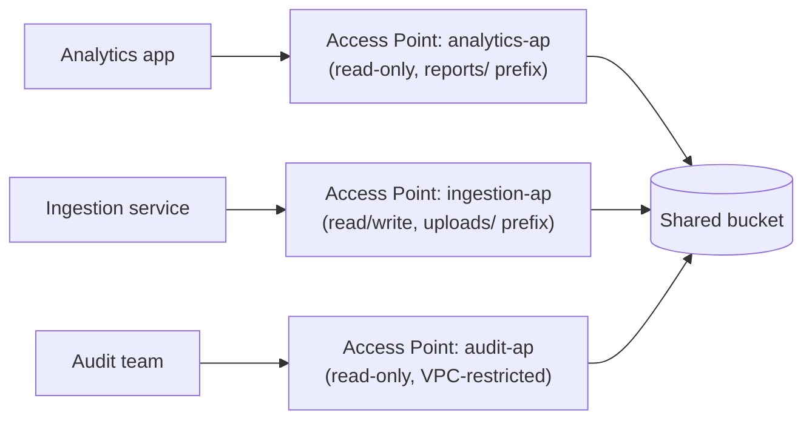

# 40 - AWS S3 Access Point Theory

> Goal: understand the problem **S3 Access Points** solve — a single, growing bucket policy becoming unmanageable as more applications/teams need access — before configuring one hands-on in Note 41.

---

## 1. The problem: one bucket policy trying to serve everyone

A large, shared bucket used by many different applications or teams eventually accumulates a **single, sprawling bucket policy** (Note 12) with statements for every consumer — one app needs read access to `logs/`, another needs read/write to `uploads/`, a third needs read-only to `reports/`, and so on, all crammed into one JSON document that everyone touching the bucket has to understand, and that becomes increasingly risky to edit (one mistake can affect every consumer at once).

> 🧠 **Mental model:** a single bucket policy trying to serve ten different applications is like one shared front door with one incredibly complicated lock, where the key-cutting instructions for every single tenant are all written on the same one sheet of paper — easy to make a mistake that affects someone else's access entirely by accident.

---

## 2. What an Access Point actually is

An **S3 Access Point** is a **named, dedicated network endpoint** for a bucket, each with:

- Its **own DNS name** and its **own access policy** — scoped to exactly the application or team it's meant for.
- Its **own Block Public Access settings**, independent of the bucket's own settings.
- Optionally, its **own VPC restriction** — an access point can be configured so it's **only reachable from within a specific VPC**, adding a network-level boundary on top of the policy-level one.

Instead of one bucket policy trying to express every consumer's access in one place, you create **one access point per application/team**, each with a small, focused policy — and the underlying bucket policy can stay simple (or even just delegate broadly to the access points themselves).



---

## 3. Access point ARNs — used in place of bucket ARNs

Applications address objects through an access point using **its own ARN**, not the bucket's name directly:

```
arn:aws:s3:ap-south-1:111122223333:accesspoint/analytics-ap/object/reports/*
```

This ARN is what gets used in IAM policies (Note 11) and in application code (many SDKs accept an access point ARN anywhere a bucket name is expected) — the application's own IAM policy only needs to reference **its own access point**, not reason about the entire bucket's shared policy at all.

---

## 4. Access point policy vs. bucket policy — both still apply

Access points don't replace the bucket policy — they add another, more granular layer **in front of it**. For a request routed through an access point to succeed, **both** the access point's own policy **and** the underlying bucket's policy (if one exists and applies) must allow it — the same "every applicable layer must agree" principle from Note 09's evaluation model, extended with one more layer.

> 🎯 **Exam tip:** "a shared bucket is used by dozens of applications, and managing one bucket policy for all of them has become error-prone and hard to audit" is the signature **S3 Access Points** scenario — the fix is decomposing that one policy into many small, per-application access point policies, not attempting to write an ever-larger single bucket policy.

---

## 5. Recap

- **S3 Access Points** give each application/team its **own named endpoint, DNS name, and access policy** for a shared bucket — solving the "one sprawling bucket policy" management problem.
- Each access point can have its **own Block Public Access settings** and can be **restricted to a specific VPC**.
- Access point policies **layer on top of**, not replace, the bucket's own policy — both must independently allow a request.
- Next: Note 41 — AWS S3 Access Point (Hands-On), creating and testing a real access point — the final note in this folder.

### Sources
- [Managing access with Amazon S3 access points — AWS docs](https://docs.aws.amazon.com/AmazonS3/latest/userguide/access-points.html)
- [Access point restrictions and limitations — AWS docs](https://docs.aws.amazon.com/AmazonS3/latest/userguide/access-points-restrictions-limitations.html)
