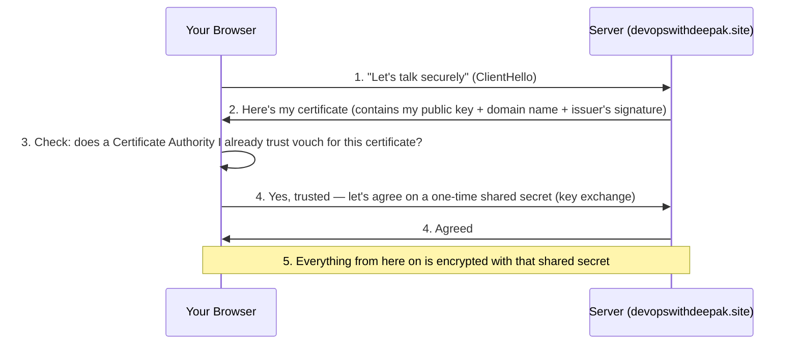
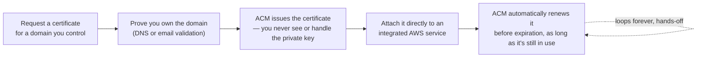

# 01 - AWS Certificate Manager (ACM)

> Goal: understand what SSL/TLS actually do and why every HTTPS site needs a certificate, then see what ACM specifically automates — issuing, deploying, and renewing those certificates — so a hands-on demo later actually makes sense rather than feeling like magic.

---

## 1. SSL/TLS, in plain terms — the foundation everything else here sits on

**TLS** (Transport Layer Security — the modern successor to the older **SSL**, Secure Sockets Layer; the two names are still used interchangeably in casual conversation, including on the exam) is the protocol that makes `https://` different from `http://`. It does two things:

1. **Proves identity** — when your browser connects to `https://devopswithdeepak.site`, how does it know it's actually talking to the real site, and not an attacker sitting in the middle pretending to be it?
2. **Encrypts the connection** — so anyone snooping on the network between you and the server (a coffee-shop Wi-Fi, an ISP, anyone) sees only scrambled bytes, not your actual data.

### A concrete walkthrough: what happens when you open `https://devopswithdeepak.site`

- **Step 3 is the "identity" part**: your browser ships with a built-in list of trusted **Certificate Authorities** (CAs) — organizations whose entire job is to verify "does this requester actually control this domain?" before signing a certificate for it. If the certificate presented in Step 2 was signed by one of those trusted CAs (or a CA that chains up to one), the browser trusts it. If not — say, a self-signed certificate, or one for the wrong domain — you get the "Your connection is not private" warning.
- **Step 4-5 is the "encryption" part**: the certificate's public key is only used briefly, to safely agree on a **symmetric** session key (the same key encrypts and decrypts). Asymmetric crypto (the public/private key pair in the certificate) is computationally expensive; symmetric crypto is fast. TLS uses the slow-but-secure method just long enough to bootstrap the fast method — this is why HTTPS doesn't meaningfully slow down a modern website.

> 🧠 **Simple analogy**: the certificate is like a **notarized ID card** — it's not that the ID itself keeps your conversation private, it's that a trusted notary (the CA) already confirmed "this person really is who they claim to be" before you even started talking. Once you've confirmed that, you and the other party agree on a private way to talk (the encrypted session) that has nothing to do with the ID card itself anymore.

---

## 2. The problem: running your own certificates is real, ongoing work

Every one of those trusted certificates has to come from **somewhere**, and historically that meant:
- Generating a private key and a certificate signing request (CSR).
- Paying a CA (or using a free one like Let's Encrypt) and proving domain ownership.
- Installing the certificate and private key on every server that needs it.
- **Tracking expiration dates** and manually renewing before they lapse — a genuinely common cause of real production outages ("the site went down because nobody remembered the cert expired last night").

**AWS Certificate Manager (ACM)** exists to remove essentially all of this manual work for certificates used **inside AWS**.

---

## 3. What ACM actually does

The critical detail that makes ACM genuinely different from a traditional CA workflow: **you never download or manage the private key** for a standard ACM public certificate. It's generated, stored, and used entirely inside AWS, directly by whichever service you attach it to (CloudFront, an Application Load Balancer, API Gateway, and others). That single design choice is what eliminates both "where do I safely store this key" and "who remembers to renew it."

---

## 4. Public certificates: DNS validation vs. email validation

Before ACM issues a certificate, you must prove you actually control the domain:

| | DNS validation (recommended) | Email validation |
|---|---|---|
| **How it works** | ACM gives you a CNAME record to add to your domain's DNS | ACM emails the domain's WHOIS contacts (or a validation address you specify); you click a link |
| **Renewal** | Fully automatic forever, as long as the CNAME record stays in place | You must click an email link again for every renewal — genuinely easy to miss |
| **Needs** | Write access to the domain's DNS (ideal if that DNS is a Route 53 hosted zone — ACM can create the record for you with one click) | Just receiving mail at the domain's registered contacts |
| **AWS's own recommendation** | Yes — explicitly, in their own docs | Only when you can't edit DNS at all |

> 🎯 **Exam tip**: "a certificate needs to keep renewing itself with zero ongoing manual steps" → **DNS validation**, not email. This is one of the most directly testable ACM facts on the SAA-C03.

---

## 5. A critical, easy-to-miss regional detail

ACM certificates are **regional resources** — a certificate requested in `ap-south-1` (Mumbai) can only be attached to services in `ap-south-1`, like a regional Application Load Balancer.

**The one major exception**: **Amazon CloudFront** is a global service, but it specifically requires any ACM certificate attached to a distribution to be requested in **`us-east-1` (N. Virginia)** — regardless of which Region your actual origin (S3 bucket, ALB, EC2 instance) lives in. This is a genuinely common real-world stumbling block (and exam trap): request the cert in the wrong Region, and CloudFront simply won't offer it as an option to attach.

| Target service | Certificate must be requested in |
|---|---|
| CloudFront distribution | **Always `us-east-1`**, no matter where the origin is |
| Application/Network Load Balancer, API Gateway (regional) | The **same Region** as that resource |

---

## 6. Certificate lifetime and renewal

- A public ACM certificate is currently valid for **198 days** from issuance (industry-wide certificate lifetimes have been shrinking for years — always check the current value in AWS's own docs rather than memorizing an old figure, since this has changed before and will likely change again).
- ACM attempts automatic renewal **45 days before expiration**.
- Automatic renewal only works if: the certificate is **still attached to an integrated AWS service** (or otherwise actively in use) **and** the original DNS validation CNAME record is still present. Delete the CNAME record, and the next renewal attempt fails silently until someone notices.

---

## 7. Public certificates vs. AWS Private CA

| | ACM public certificates (this note) | AWS Private CA |
|---|---|---|
| **Trusted by** | Every standard browser/OS, out of the box | Only clients that explicitly trust your own private root CA |
| **Cost** | Free (you pay only for the AWS resources using it) | Has its own hourly + per-certificate cost — a genuinely different pricing model |
| **Use case** | Public-facing websites/APIs | Internal services, mutual TLS between your own microservices, IoT device identities — anything that was never meant to be publicly trusted |

> 🎯 **Exam tip**: "a public website needs HTTPS" → ACM public certificate. "Internal microservices need mutual TLS and shouldn't be trusted by the public internet at all" → **AWS Private CA**, a distinctly different (and separately billed) service.

---

## 8. Recap

- **TLS** (the modern name for what's still casually called SSL) proves a server's identity via a CA-signed certificate, then bootstraps a fast symmetric-encrypted session — identity first, encryption second.
- **ACM's real value**: it issues, stores, and **automatically renews** certificates for you, and integrated AWS services never expose the private key to you at all.
- **DNS validation** is the recommended method — it enables genuinely hands-off, permanent auto-renewal; email validation requires manual action on every renewal.
- **CloudFront certificates must be requested in `us-east-1`**, regardless of where the origin lives — a real, common exam trap and real-world mistake.
- Next: the [ACM hands-on demo](01.01-ACM-Certificate-Demo.md) — requesting a real, DNS-validated certificate for a real domain, and using it to serve an actual site over HTTPS with a trusted padlock.

### Sources
- [AWS Certificate Manager public certificates — AWS docs](https://docs.aws.amazon.com/acm/latest/userguide/gs-acm-request-public.html)
- [Request a public certificate — AWS docs](https://docs.aws.amazon.com/acm/latest/userguide/acm-public-certificates.html)
- [AWS Certificate Manager DNS validation — AWS docs](https://docs.aws.amazon.com/acm/latest/userguide/dns-validation.html)
- [Managed certificate renewal in ACM — AWS docs](https://docs.aws.amazon.com/acm/latest/userguide/managed-renewal.html)
- [Requirements for using SSL/TLS certificates with CloudFront — AWS docs](https://docs.aws.amazon.com/AmazonCloudFront/latest/DeveloperGuide/cnames-and-https-requirements.html)
