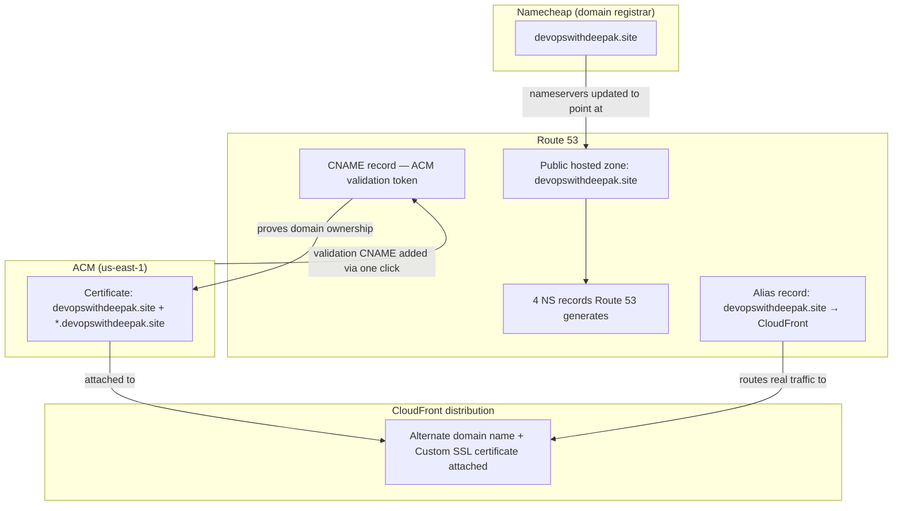

# 01.01 - Hands-On Demo: A Real, Trusted HTTPS Certificate for a Real Domain

> Goal: request a real ACM certificate for a real domain (`devopswithdeepak.site`, registered at Namecheap), validate it via DNS, and attach it to a CloudFront distribution so the domain actually serves HTTPS with a browser-trusted padlock — a full, working execution of what the [CloudFront Custom HTTPS](../Cloudfront_CDN/05-CloudFront-Custom-HTTPS.md) note explained conceptually with a placeholder domain. Every AWS-side action is via the **AWS Console**; the one step outside AWS entirely is updating nameservers in the **Namecheap** dashboard, since that's where this domain is registered — not an AWS automation exception, just a different vendor's own UI.

---

## 1. What you're building



---

## 2. Step 1 — Create a public hosted zone for the domain

If you don't already have one for `devopswithdeepak.site`:

1. **Route 53 console** → **Hosted zones** → **Create hosted zone**.
2. **Domain name**: `devopswithdeepak.site`.
3. **Type**: **Public hosted zone**.
4. **Create hosted zone**.
5. Route 53 automatically creates two records: an **NS** (Name Server) record with 4 values, and an **SOA** record. Copy the 4 **NS** values — you'll need them in Step 2.

> 🧠 If a hosted zone for this domain already exists (likely, given the [Route 53 folder](../Route53/01-Introduction-to-Route53.md)'s existing hands-on labs), skip straight to confirming its 4 NS values instead of creating a new one — **do not create a second hosted zone for the same domain**, since only one can actually be authoritative at a time.

---

## 3. Step 2 — Delegate the domain's nameservers from Namecheap to Route 53

Namecheap is the **registrar** (where the domain is bought/renewed), but it isn't necessarily the **DNS provider** — this step tells the rest of the internet "for anything about this domain, go ask Route 53," regardless of who sold you the domain name itself.

1. **Namecheap** → **Dashboard** → **Domain List** → find `devopswithdeepak.site` → **Manage**.
2. **Nameservers** section → change from **Namecheap BasicDNS** (or whatever it's currently set to) → **Custom DNS**.
3. Enter the 4 Route 53 NS values from Step 1, one per field, in order — typically formatted like `ns-123.awsdns-45.com`, `ns-678.awsdns-90.net`, `ns-234.awsdns-56.org`, `ns-789.awsdns-01.co.uk` (yours will be different — copy them exactly, don't retype by hand).
4. **Save**.

> ⚠️ Once you switch to **Custom DNS**, Namecheap's own DNS editor becomes inactive for this domain — every future DNS record (the CNAME in Step 5, the Alias in Step 9, anything else) must be created in **Route 53** from this point on, not in Namecheap.

---

## 4. Step 3 — Confirm the delegation actually propagated

DNS nameserver changes can take anywhere from a few minutes to a few hours to propagate globally. Confirm it worked before moving on, rather than guessing:

1. In a terminal, run (this is a plain DNS lookup tool, not AWS CLI or any AWS automation — purely for checking what the public internet currently sees):
   ```bash
   dig NS devopswithdeepak.site +short
   ```
2. Compare the output against the 4 NS values from Step 1. Once they match, the delegation is live and ACM's DNS validation (Step 6) will actually be able to see records you create in Route 53.

---

## 5. Step 4 — Request the certificate (in `us-east-1`)

1. **Switch the Region selector to `us-east-1` (N. Virginia)** — this is mandatory for a certificate that will be attached to CloudFront (the [Certificate Manager](01-AWS-Certificate-Manager-ACM.md) note's Section 5), regardless of which Region anything else in this project lives in.
2. **ACM console** → **Request a certificate** → **Request a public certificate** → **Next**.
3. **Fully qualified domain name**: `devopswithdeepak.site`.
4. **Add another name to this certificate** → `*.devopswithdeepak.site` — this covers both the bare domain and any subdomain (`www.devopswithdeepak.site`, `api.devopswithdeepak.site`, etc.) in one certificate.
5. **Validation method**: **DNS validation** (leave selected — the recommended option).
6. **Key algorithm**: leave at the default (**RSA 2048**).
7. **Request**.

---

## 6. Step 5 — Validate it with one click, since the zone is already in Route 53

1. In the certificate list, click the new certificate's **ID** (status: **Pending validation**).
2. **Domains** section → an active **Create records in Route 53** button should be visible (it only appears because Route 53 is genuinely this domain's authoritative DNS provider now, confirmed in Step 3).
3. Select the domain row(s) → **Create records in Route 53** → **Create records**.
4. The page reports **Successfully created DNS records** — Route 53 now has the CNAME record ACM needs, created automatically without you copying/pasting anything by hand.
5. Status stays **Pending validation** for up to ~30 minutes while ACM actually checks for that record. Refresh occasionally until it flips to **Issued**.

---

## 7. Step 6 — Attach the certificate to a CloudFront distribution

Use whichever CloudFront distribution you want this domain to point at:

- **If you still have the distribution from the [CloudFront Hands-On Lab 1](../Cloudfront_CDN/02-CloudFront-HandsOn-Lab1.md) note**: reuse it directly — one less thing to build.
- **If it's already been torn down**: this same recipe applies to any distribution; the [CloudFront Hands-On Lab 1](../Cloudfront_CDN/02-CloudFront-HandsOn-Lab1.md) note walks through building a minimal S3 + CloudFront one from scratch if needed.

1. **CloudFront console** → open the distribution → **General** tab → **Edit**.
2. **Alternate domain name (CNAME)** → **Add item** → `devopswithdeepak.site`. Add a second item for `www.devopswithdeepak.site` if you want that subdomain to work too (it's covered by the wildcard cert either way).
3. **Custom SSL certificate** → select the certificate from Step 6 (it only appears here because it's **Issued** and in **us-east-1** — this is the exact console-level proof of the Region requirement).
4. **Save changes** → wait for the distribution's status to return to **Deployed**.

---

## 8. Step 7 — Point the domain at the distribution

1. **Route 53 console** → the `devopswithdeepak.site` hosted zone → **Create record**.
2. **Record name**: leave blank (this creates a record for the bare/apex domain itself).
3. Toggle **Alias**: **On**.
4. **Route traffic to**: **Alias to CloudFront distribution** → select your distribution from the list.
5. **Record type**: `A`.
6. **Create records**.
7. (Optional) Repeat for `www` with **Record name**: `www`, same Alias target, so `www.devopswithdeepak.site` also resolves.

---

## 9. Step 8 — Test it for real

1. Wait a few minutes for the new Route 53 Alias record and the CloudFront distribution's Alternate Domain Name to both be fully live.
2. Open `https://devopswithdeepak.site` in a browser.
3. Click the padlock icon → **Certificate is valid** → inspect it: **Issued by** should show **Amazon** (ACM's issuing CA), **Issued to** should show `devopswithdeepak.site`, and the **Subject Alternative Name** list should include `*.devopswithdeepak.site` too.
4. This is the exact browser-trust chain the [Certificate Manager](01-AWS-Certificate-Manager-ACM.md) note's Section 1 walked through in theory — your browser trusted this connection because Amazon's CA (already in your browser's trust store) vouched for it, all the way from a certificate you requested minutes ago.

---

## 10. Troubleshooting

| Symptom | Likely cause |
|---|---|
| **Create records in Route 53** button missing or disabled | The nameserver delegation from Step 2/3 hasn't actually propagated yet, or the hosted zone in Step 1 doesn't match the domain exactly |
| Certificate stuck on **Pending validation** for hours | The CNAME record didn't get created (recheck Step 6), or nameserver delegation (Step 3) never actually completed — `dig NS devopswithdeepak.site +short` should show the AWS nameservers, not Namecheap's original ones |
| Certificate doesn't appear in CloudFront's **Custom SSL certificate** dropdown | It's not actually **Issued** yet, or it was requested in the wrong Region — CloudFront only lists `us-east-1` certificates, regardless of the console Region you're currently viewing CloudFront from |
| Browser still shows the **old** default CloudFront certificate / a warning | The distribution hasn't finished redeploying after Step 7's **Save changes** — check its status is back to **Deployed**, and hard-refresh the browser |
| `https://devopswithdeepak.site` doesn't load at all | The Alias record from Step 8 wasn't created, or DNS for the new record hasn't propagated yet — give it a few minutes |

---

## 11. Cleanup

Unlike most other demos in this project, there's little reason to tear this down — a real, valid HTTPS setup on your own domain is genuinely worth keeping running. If you do want to detach it later:

1. **CloudFront** → distribution → **General** → **Edit** → remove the **Alternate domain name** and reset **Custom SSL certificate** to the default → **Save changes**.
2. **Route 53** → delete the Alias record(s) created in Step 8.
3. **ACM** (`us-east-1`) → delete the certificate, **only after** nothing references it anymore (ACM won't let you delete a certificate that's still attached to a service).
4. Leave the Route 53 hosted zone and Namecheap nameserver delegation in place — those are foundational to the domain working at all, not specific to this one demo.

---

## 12. Recap

- SSL/TLS's trust model in practice: a CA-issued certificate is only trusted because the CA itself is already in your browser's trust store — this demo made that chain concrete and visible, not theoretical.
- A domain registered at one vendor (Namecheap) can have its DNS fully managed by a different one (Route 53) — the registrar only controls which nameservers are authoritative, nothing else about the domain's actual records.
- **DNS validation** plus an existing Route 53 hosted zone means ACM can create its own validation record with a single click — no manual copy-pasting of CNAME values, and fully automatic renewal forever afterward.
- The **`us-east-1`-only requirement for CloudFront certificates** is directly visible here: request it anywhere else, and it simply never shows up as an option to attach.
- Next: the [AWS Key Management Service (KMS)](02-AWS-Key-Management-Service-KMS.md) note, moving from certificates (proving identity, encrypting data in transit) to encryption keys (protecting data at rest).

### Sources
- [Request a public certificate — AWS docs](https://docs.aws.amazon.com/acm/latest/userguide/acm-public-certificates.html)
- [AWS Certificate Manager DNS validation — AWS docs](https://docs.aws.amazon.com/acm/latest/userguide/dns-validation.html)
- [Working with public hosted zones — AWS docs](https://docs.aws.amazon.com/Route53/latest/DeveloperGuide/AboutHZWorkingWith.html)
- [Making Amazon Route 53 the DNS service for a domain that's in use — AWS docs](https://docs.aws.amazon.com/Route53/latest/DeveloperGuide/MigratingDNS.html)
