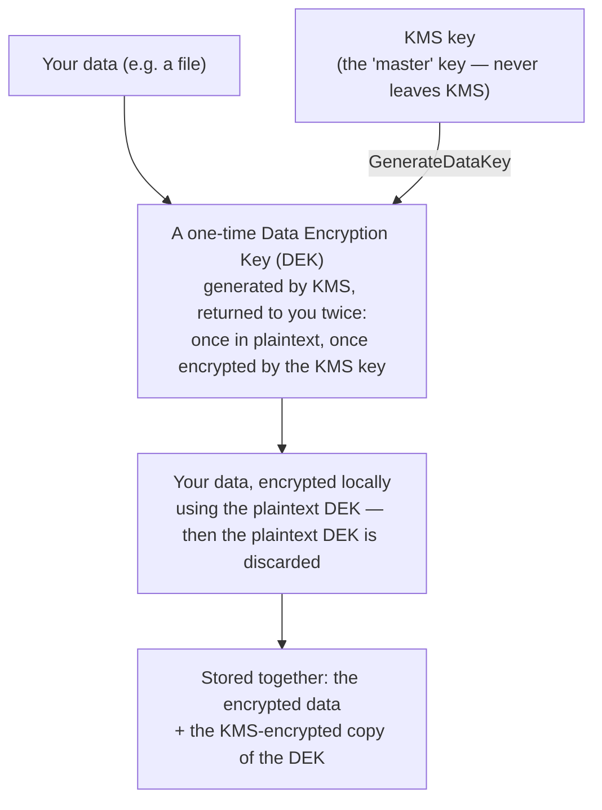
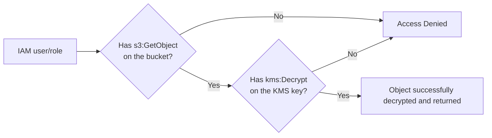

# 02 - AWS Key Management Service (KMS)

> Goal: understand what KMS actually protects (data **at rest**, the counterpart to the [Certificate Manager](01-AWS-Certificate-Manager-ACM.md) note's data **in transit**), how a KMS key differs from a regular password/secret, and why encrypting something with KMS creates a genuinely separate permission check from the storage service's own permissions.

---

## 1. The problem: encryption needs somewhere safe to keep the key

Encrypting data is easy in principle — run it through an algorithm with a secret key, and it becomes unreadable without that same key. The **hard** part has always been: **where does the key itself live**, and how do you stop *that* from being the weak link? Hardcode it in application code, and anyone who reads the code has it. Store it in a config file, and anyone with file access has it. Whoever controls the key controls the data, no matter how strong the encryption algorithm is.

**AWS KMS (Key Management Service)** solves this by keeping keys **inside dedicated hardware** that never lets the key material leave in a usable, readable form — you can use a KMS key to encrypt/decrypt, but you can never just "download" the raw key itself (for a standard AWS-generated key).

> 🧠 **Simple analogy**: think of a KMS key like a **safety deposit box's key that never leaves the bank**. You can walk in and ask the bank to lock or unlock the box for you (encrypt/decrypt), and the bank checks your ID every single time before doing it — but the actual key never goes home with you, so it can't be lost, copied, or stolen from your desk.

---

## 2. Architecture & workflow — envelope encryption

KMS doesn't actually encrypt your large files directly with the KMS key itself — it uses a pattern called **envelope encryption**, because encrypting large amounts of data directly with a key stored in a shared service would be slow and expensive at scale:

To decrypt later, the encrypted DEK is sent back to KMS (which decrypts it using the KMS key), and that decrypted DEK is then used locally to decrypt the actual data. **You never see the KMS key's own material at any point in this process** — this whole flow is what integrated services like S3, EBS, and RDS do automatically for you behind a single checkbox.

---

## 3. Customer managed keys vs. AWS managed keys vs. AWS owned keys

| | Customer managed key | AWS managed key | AWS owned key |
|---|---|---|---|
| **Who creates it** | You, explicitly | AWS, automatically the first time a service needs one (e.g. `aws/s3`) | AWS, entirely internal |
| **Key policy control** | Fully yours to edit | Fixed, view-only | Not visible to you at all |
| **Rotation** | Optional, you control it | Automatic, every year, cannot be disabled | Managed internally by AWS |
| **Can you use it for your own use cases beyond one service?** | Yes | No — scoped to the one service that created it | No — not a usable resource to you at all |
| **Cost** | Monthly fee per key + usage | Same usage cost, no separate key fee | Free — it's not really "yours" |

> 🎯 **Exam tip**: "we need full control over the key policy, want to enable/disable it, or need to share it across multiple services/accounts" → **customer managed key**. "We just want default encryption without managing anything" → **AWS managed key** is what you get automatically if you never create your own.

---

## 4. The permission model — this is the part that trips people up

This is the single most important, most exam-relevant KMS fact: **using a KMS key requires permission on the key itself, completely separate from permission on whatever service is using it.**

Having full `s3:*` permissions on a bucket is **not enough** to read an object encrypted with a customer managed KMS key you haven't also been granted access to. This is deliberate defense-in-depth — exactly the kind of scenario the [SAA-C03 exam](01-AWS-Certificate-Manager-ACM.md) loves to test: "a user has full S3 access but still gets Access Denied reading one specific object" → check the object's **KMS key permissions**, not the S3 bucket policy.

Two ways to grant KMS permission:
- **Key policy** — attached directly to the key itself (every key has one; it's the ultimate source of truth for who can use/manage it).
- **IAM policy** — a policy on a user/role that references the key's ARN, **but only works if the key's own key policy also allows IAM policies to grant access** (the default key policy does allow this).

---

## 5. Key rotation

- **Automatic key rotation** (optional, customer managed keys only): AWS KMS generates new cryptographic material on a schedule — **365 days by default**, customizable.
- Rotation is **transparent** — old data encrypted with the previous key material still decrypts correctly; KMS automatically tracks which material version encrypted what. You never have to re-encrypt existing data because of a rotation.
- **AWS managed keys** rotate automatically every year and **cannot** have rotation disabled — you don't get a choice there.

> 🧠 Rotation changes the key's *material*, not its identity — the Key ID/ARN never changes, so nothing in any application or IAM policy referencing that key needs to be updated when it rotates.

---

## 6. Where KMS shows up across AWS

| Service | What KMS protects there |
|---|---|
| **S3** | Server-side encryption (SSE-KMS) for objects at rest |
| **EBS** | Volume-level encryption for EC2 instance storage |
| **RDS** | Database storage encryption |
| **Lambda** | Environment variable encryption |
| **Secrets Manager** | Encrypting the secrets themselves at rest |

This is a genuinely common exam pattern: almost any "at rest" encryption question across completely different AWS services ultimately traces back to KMS underneath.

---

## 7. Recap

- KMS's core value: the key material for an AWS-generated key **never leaves KMS in a usable form** — you request encrypt/decrypt operations, you never handle the raw key.
- **Envelope encryption** is why this works efficiently at scale: KMS only ever handles small data keys directly, not your actual bulk data.
- **Customer managed keys** give you full control (key policy, rotation, cross-account sharing); **AWS managed keys** are the zero-effort default with less control.
- **KMS permissions are a separate check from the storage service's own permissions** — full S3 access does not imply KMS decrypt access, a genuinely common real-world and exam scenario.
- Next: the [KMS hands-on demo](02.01-KMS-Encryption-Demo.md) — creating a real customer managed key, encrypting an S3 object with it, and proving the separate-permission-layers point directly by getting denied, then granted, access.

### Sources
- [What is AWS Key Management Service? — AWS docs](https://docs.aws.amazon.com/kms/latest/developerguide/overview.html)
- [Envelope encryption — AWS docs](https://docs.aws.amazon.com/kms/latest/developerguide/concepts.html#enveloping)
- [Rotate AWS KMS keys — AWS docs](https://docs.aws.amazon.com/kms/latest/developerguide/rotate-keys.html)
- [Specifying server-side encryption with AWS KMS (SSE-KMS) — AWS docs](https://docs.aws.amazon.com/AmazonS3/latest/userguide/specifying-kms-encryption.html)
