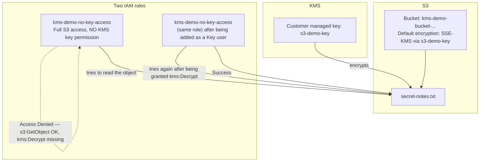

# 02.01 - Hands-On Demo: Encrypting an S3 Object with Your Own KMS Key, and Proving the Two-Layer Permission Model

> Goal: create a real customer managed KMS key, use it to encrypt a real S3 object, then **prove** — not just read about — that S3 permissions and KMS permissions are two separate checks: a role with full S3 access still gets **Access Denied** until it's also granted access to the key itself. Entirely via the **AWS Console**, no CLI.

---

## 1. What you're building

---

## 2. Step 1 — Create the customer managed KMS key

1. **KMS console** → **Customer managed keys** → **Create key**.
2. **Key type**: **Symmetric**. **Key usage**: **Encrypt and decrypt** (the only option for symmetric keys, and the correct one for this use case).
3. **Advanced options**: leave **Key material origin** at **KMS** and **Regionality** at **Single-Region key** — no need for the multi-Region/imported-key-material paths here.
4. **Alias**: `s3-demo-key`.
5. **Description** (optional): `Customer managed key for the KMS encryption demo`.
6. **Tags**: skip.
7. **Key administrators**: select your own IAM user/role — this grants permission to **manage** the key (edit its policy, disable it, schedule deletion) but **not automatically** to use it for encrypt/decrypt.
8. **Key usage permissions** (this account): select your own IAM user/role again — this is what actually lets **you** use the key for cryptographic operations, separate from administrative access.
9. Review the generated **key policy** JSON (you can see exactly how the two permissions above translate into policy statements) → **Finish**.

---

## 3. Step 2 — Turn on automatic rotation

1. Open the new `s3-demo-key` → **Key rotation** tab.
2. Check **Automatically rotate this KMS key every year**.
3. Note the **Rotation period**: `365` days (the [Key Management Service](02-AWS-Key-Management-Service-KMS.md) note's Section 5 default) — customizable here if you ever need a shorter cycle.

---

## 4. Step 3 — Create a bucket encrypted with this key by default

1. **S3 console** → **Create bucket** → name it something unique, e.g. `kms-demo-bucket-<your-name-or-date>`.
2. **Default encryption** section (further down the same Create bucket page): **Encryption type** → **Server-side encryption with AWS Key Management Service keys (SSE-KMS)**.
3. **AWS KMS key** → **Choose from your AWS KMS keys** → select `s3-demo-key`.
4. Leave **Bucket Key**: **Enable** (this reduces KMS request costs/throttling by caching a bucket-level data key briefly — no behavior change relevant to this demo, just cheaper at scale).
5. Leave everything else default → **Create bucket**.

### Upload a test object
6. Open the bucket → **Upload** → create and upload a small text file, `secret-notes.txt`, with any content.
7. After upload, click the object → **Properties** tab → scroll to **Server-side encryption settings** → confirm it shows **AWS Key Management Service key (SSE-KMS)** and the exact ARN of `s3-demo-key` — real, direct proof this specific object is protected by the key you just created, not the default `aws/s3` AWS managed key.

---

## 5. Step 4 — Create a role with full S3 access but no key access

This mirrors the role-creation flow from the [IAM Roles — AWS Account Assume Role hands-on](../IAM/08-IAM-Roles-Assume-Role-Same-Account-HandsOn.md) note's Section 2 — reuse that exact console flow:

1. **IAM console** → **Roles** → **Create role** → **Trusted entity type**: **AWS account** → **This account**.
2. **Add permissions**: attach `AmazonS3FullAccess` — deliberately broad S3 access.
3. **Role name**: `kms-demo-no-key-access` → **Create role**.

Notice this role was **not** added as a **Key user** on `s3-demo-key` in Section 2 — that's the entire point of this step.

---

## 6. Step 5 — Prove Access Denied, even with full S3 access

1. Switch into the `kms-demo-no-key-access` role (**Switch role**, top-right account menu — the same mechanism the [Security Token Service](03-AWS-Security-Token-Service-STS.md) note's hands-on demo uses, since switching roles is itself an STS operation under the hood).
2. **S3 console** → open `kms-demo-bucket-<...>` → select `secret-notes.txt` → **Open** (or **Download**).
3. **Expected result: Access Denied.** Despite `AmazonS3FullAccess` granting unrestricted `s3:GetObject`, the download fails — because decrypting the object also requires `kms:Decrypt` on `s3-demo-key`, which this role was never granted, exactly the [Key Management Service](02-AWS-Key-Management-Service-KMS.md) note's Section 4 diagram.

---

## 7. Step 6 — Grant key access, and watch the exact same action succeed

1. Switch back to your own (admin) identity.
2. **KMS console** → `s3-demo-key` → **Key users** section → **Add** → select the `kms-demo-no-key-access` role → **Add**.
3. Switch back into `kms-demo-no-key-access` again.
4. **S3 console** → the same `secret-notes.txt` → **Open**/**Download** again.
5. **Expected result: it works now.** Nothing about the S3 permissions changed between Section 6 and this step — the **only** change was adding this role as a KMS **Key user**, direct, hands-on proof that these really are two independent permission layers.

---

## 8. Troubleshooting

| Symptom | Likely cause |
|---|---|
| Access Denied even for your own admin identity right after creating the key | You skipped adding yourself under **Key usage permissions** in Section 2, Step 8 — administrator access to a key does not automatically include usage access |
| Upload to the bucket itself fails (not just download) | The uploading identity also needs `kms:GenerateDataKey` on the key — `AmazonS3FullAccess` alone doesn't grant this either, same two-layer pattern applies to writes, not just reads |
| Section 7's retry still shows Access Denied | Double-check you added the role itself (not your own user) as a **Key user**, and that you actually switched back into the role before retrying — testing from your own admin identity would succeed regardless and prove nothing |
| **Key rotation** tab shows no rotation option at all | Only symmetric keys with `AWS_KMS` origin support automatic rotation (the [Key Management Service](02-AWS-Key-Management-Service-KMS.md) note's Section 5) — recheck Section 2's key type/origin choices |

---

## 9. Cleanup

1. **S3 console** → empty and delete `kms-demo-bucket-<...>`.
2. **IAM console** → delete the `kms-demo-no-key-access` role.
3. **KMS console** → `s3-demo-key` → **Schedule key deletion** (minimum waiting period is 7 days — KMS deliberately never allows instant deletion, since losing a key means losing access to anything still encrypted with it, permanently).

---

## 10. Recap

- **Envelope encryption** is what makes KMS practical at scale — it never encrypts your actual bulk data directly with the KMS key, only a small, one-time data key.
- **Key administrators** and **Key users** are separate grants during key creation — managing a key and actually using it for crypto operations are two different permissions, mirrored directly in the generated key policy.
- The core lesson, proven directly rather than just explained: **full S3 access does not imply KMS decrypt access** — Section 6's Access Denied and Section 7's subsequent success are the same action, with the only variable being a KMS-side grant, not anything on the S3 side.
- Key deletion has a mandatory minimum **7-day waiting period** — a deliberate safety net against permanently losing access to encrypted data.
- Next: the [AWS Security Token Service (STS)](03-AWS-Security-Token-Service-STS.md) note — the mechanism that actually issued the temporary credentials behind this demo's own **Switch role** step.

### Sources
- [Creating keys — AWS docs](https://docs.aws.amazon.com/kms/latest/developerguide/create-keys.html)
- [Specifying server-side encryption with AWS KMS (SSE-KMS) — AWS docs](https://docs.aws.amazon.com/AmazonS3/latest/userguide/specifying-kms-encryption.html)
- [Key policies in AWS KMS — AWS docs](https://docs.aws.amazon.com/kms/latest/developerguide/key-policies.html)
- [Deleting AWS KMS keys — AWS docs](https://docs.aws.amazon.com/kms/latest/developerguide/deleting-keys.html)
