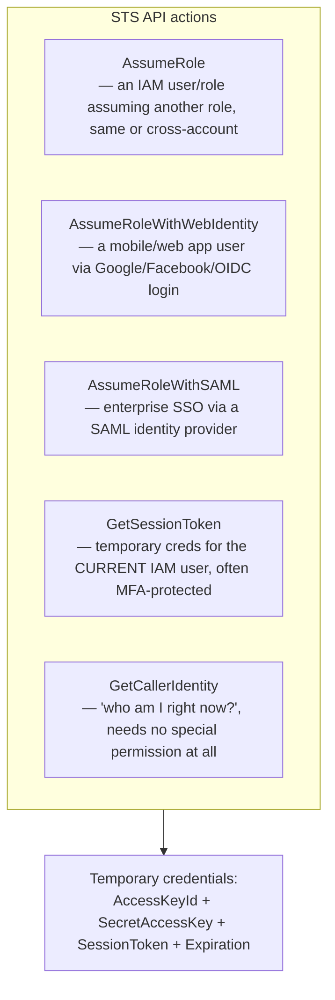

# 03 - AWS Security Token Service (STS)

> Goal: understand the service that's actually been running quietly behind the scenes in every "assume a role" hands-on already done in this project — the [IAM Roles — AWS Account Assume Role hands-on](../IAM/08-IAM-Roles-Assume-Role-Same-Account-HandsOn.md), the [KMS hands-on demo](02.01-KMS-Encryption-Demo.md)'s **Switch role** step — and see the raw temporary credentials it issues directly, instead of through a UI that hides them.

---

## 1. What STS actually is

**AWS Security Token Service (STS)** is the service that issues **temporary security credentials** — a short-lived `AccessKeyId` + `SecretAccessKey`, plus a third component permanent IAM user credentials don't have: a `SessionToken`, and an `Expiration` timestamp.

Every single time something in AWS "assumes a role" — a user switching roles in the console, an EC2 instance using its instance profile, a Lambda function using its execution role, a mobile app user logging in via a web identity — **STS is the service issuing the actual credentials that make that work**, even when the UI never shows you this is happening.

> 🧠 **Simple analogy**: think of a permanent IAM user's access key as a **house key you own forever**. An STS-issued temporary credential is more like a **hotel key card that's programmed to stop working at checkout time** — even if someone found a dropped key card, it's useless once the expiration hits, no one has to remember to go collect it back.

---

## 2. Why temporary credentials are the safer default

| | Permanent IAM user access keys | STS temporary credentials |
|---|---|---|
| **Lifespan** | Forever, until someone manually rotates/deletes them | Minutes to hours — you choose, capped by the role's own maximum |
| **If leaked** | Usable indefinitely until someone notices and revokes them | Automatically stops working at expiration, even if nobody notices the leak |
| **Rotation burden** | A real, ongoing operational task someone has to remember | None — a new set is simply requested again next time |
| **AWS's own recommendation** | Avoid for anything beyond narrow, unavoidable cases | The default, preferred approach almost everywhere |

> 🎯 **Exam tip**: "minimize the impact of a leaked credential" or "avoid long-lived access keys" → **STS temporary credentials via a role**, essentially every time this phrasing shows up on the SAA-C03.

---

## 3. Architecture & workflow — the API actions behind the scenes

This is the exact same table the [Lambda Triggers](../Lambda/10-Lambda-Triggers.md) note's push/pull distinction echoed for a different topic — a handful of named API actions cover essentially every real-world "who is this request actually coming from" scenario:

| Action | Real-world scenario |
|---|---|
| `AssumeRole` | The [IAM Roles — AWS Account Assume Role hands-on](../IAM/08-IAM-Roles-Assume-Role-Same-Account-HandsOn.md) and [Cross-Account Access hands-on](../IAM/09-IAM-Roles-Cross-Account-Access-HandsOn.md) notes, and the console's own **Switch role** feature |
| `AssumeRoleWithWebIdentity` | A mobile app letting users sign in with Google/Facebook/Amazon, then access AWS resources directly, no AWS credentials embedded in the app at all |
| `AssumeRoleWithSAML` | Corporate single sign-on federating into AWS via an on-premises Active Directory / SAML identity provider |
| `GetSessionToken` | An IAM user requesting their own short-lived credentials, typically to satisfy an **MFA-required** policy condition before a sensitive action |
| `GetCallerIdentity` | Pure diagnostics — "which identity is actually making this API call right now?" — needs no IAM permission at all, works for literally any authenticated caller |

---

## 4. Session duration — and the role-chaining catch

- Every role has a **maximum session duration** (default 1 hour, configurable up to 12 hours) set on the role itself.
- When switching roles in the console, the actual session length is the **smaller of**: the role's maximum session duration, or the time remaining in your **original** sign-in session — you can't extend your total session by hopping into a role.
- **Role chaining** (using role A's temporary credentials to assume role B) **always caps the session at exactly 1 hour**, regardless of either role's own configured maximum — a specific, genuinely testable exam detail, not just "shorter in general."

---

## 5. STS endpoints — global vs. regional

STS has a single **global endpoint** (`sts.amazonaws.com`) and separate **regional endpoints** (e.g. `sts.ap-south-1.amazonaws.com`). Regional endpoints exist for lower latency and to avoid the global endpoint becoming a single point of slowdown for latency-sensitive applications making frequent `AssumeRole` calls — a small operational detail, but one AWS explicitly recommends considering for high-throughput use cases.

---

## 6. Recap

- STS issues **temporary security credentials** — access key, secret key, session token, and an expiration — the mechanism underneath every "assume a role" action across AWS, whether or not the UI shows it happening.
- Temporary credentials are the safer default over permanent IAM user access keys precisely because a leak self-heals at expiration, with zero manual rotation required.
- `AssumeRole`, `AssumeRoleWithWebIdentity`, `AssumeRoleWithSAML`, `GetSessionToken`, and `GetCallerIdentity` cover essentially every real identity-federation and diagnostic scenario tested on the SAA-C03.
- **Role chaining caps a session at 1 hour**, no matter how generous either role's own configured maximum session duration is — a specific, easy-to-miss exam fact.
- Next: the [STS hands-on demo](03.01-STS-Temporary-Credentials-Demo.md) — using CloudShell to actually see the raw temporary credentials an `AssumeRole` call returns, the exact thing the console's **Switch role** button does invisibly.

### Sources
- [What is AWS STS? — AWS docs](https://docs.aws.amazon.com/STS/latest/APIReference/welcome.html)
- [Temporary security credentials in IAM — AWS docs](https://docs.aws.amazon.com/IAM/latest/UserGuide/id_credentials_temp.html)
- [Switch from a user to an IAM role (console) — AWS docs](https://docs.aws.amazon.com/IAM/latest/UserGuide/id_roles_use_switch-role-console.html)
- [Compare AWS STS credentials — AWS docs](https://docs.aws.amazon.com/IAM/latest/UserGuide/id_credentials_sts-comparison.html)
