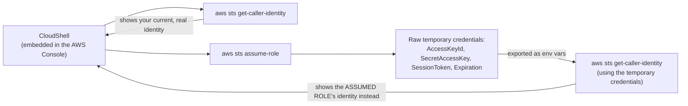

# 03.01 - Hands-On Demo: Seeing Real Temporary Credentials with AWS CloudShell

> Goal: run the exact STS API calls that power the console's **Switch role** button and every IAM role in this project, and actually see the raw `AccessKeyId`/`SecretAccessKey`/`SessionToken`/`Expiration` values — normally completely invisible to you. This uses **AWS CloudShell**, a terminal embedded directly inside the AWS Console (opened from an icon in the console's own top navigation bar) — not a locally installed CLI, so it stays within this project's console-only spirit; the commands themselves are read-only/diagnostic, nothing here provisions or changes any AWS resource.

---

## 1. What you're doing



---

## 2. Step 1 — Open CloudShell and check your current identity

1. **AWS Console** → top navigation bar → the **CloudShell** icon (looks like a terminal `>_` symbol, usually near the notifications bell) → wait for the environment to initialize (takes 10-30 seconds the first time).
2. Run:
   ```bash
   aws sts get-caller-identity
   ```
3. You'll see something like:
   ```json
   {
       "UserId": "AIDAEXAMPLE1234567",
       "Account": "339712902352",
       "Arn": "arn:aws:iam::339712902352:user/DeepakY"
   }
   ```
   This is your **real, current identity** — `GetCallerIdentity` needs no special IAM permission at all (the [Security Token Service](03-AWS-Security-Token-Service-STS.md) note's Section 3), which is exactly why it's the fastest way to sanity-check "who am I actually authenticated as right now" whenever something behaves unexpectedly.

---

## 3. Step 2 — Assume a role, and see the raw temporary credentials

Reuse the `kms-demo-no-key-access` role from the [KMS hands-on demo](02.01-KMS-Encryption-Demo.md)'s Section 5 (or any role in your account that trusts your own account):

1. Get the role's ARN: **IAM console** → **Roles** → `kms-demo-no-key-access` → copy the **ARN**.
2. Back in CloudShell:
   ```bash
   aws sts assume-role \
     --role-arn arn:aws:iam::339712902352:role/kms-demo-no-key-access \
     --role-session-name sts-demo-session
   ```
   (Use your own real role ARN.)
3. The output is the actual thing the console's **Switch role** button generates behind the scenes, normally never shown to you:
   ```json
   {
       "Credentials": {
           "AccessKeyId": "ASIAEXAMPLE...",
           "SecretAccessKey": "wJalrXUtnFEMI/...",
           "SessionToken": "IQoJb3JpZ2luX2VjE...(a very long string)...",
           "Expiration": "2026-08-01T13:45:00+00:00"
       },
       "AssumedRoleUser": {
           "AssumedRoleId": "AROAEXAMPLE:sts-demo-session",
           "Arn": "arn:aws:sts::339712902352:assumed-role/kms-demo-no-key-access/sts-demo-session"
       }
   }
   ```
   > 🧠 Notice the **`Arn`** in `AssumedRoleUser` — it's `assumed-role/<role-name>/<session-name>`, not your original user ARN at all. `--role-session-name` (here, `sts-demo-session`) is just a label you choose, useful for identifying which specific session did what, later, in CloudTrail logs.

---

## 4. Step 3 — Actually use the temporary credentials, and prove the identity really changed

1. Export the three credential values from Step 2's output as environment variables (copy your own real values — these are one-time-use example placeholders and won't work as-is):
   ```bash
   export AWS_ACCESS_KEY_ID="ASIAEXAMPLE..."
   export AWS_SECRET_ACCESS_KEY="wJalrXUtnFEMI/..."
   export AWS_SESSION_TOKEN="IQoJb3JpZ2luX2VjE..."
   ```
2. Run the exact same identity check again:
   ```bash
   aws sts get-caller-identity
   ```
3. **Expected result: a different answer than Step 2.** The `Arn` now shows `assumed-role/kms-demo-no-key-access/sts-demo-session` — the AWS CLI is now using the temporary credentials from the environment variables instead of CloudShell's own underlying identity, direct proof these three values alone are a fully independent, working set of credentials.
4. Clean up the environment variables so the rest of your CloudShell session goes back to using your real identity:
   ```bash
   unset AWS_ACCESS_KEY_ID AWS_SECRET_ACCESS_KEY AWS_SESSION_TOKEN
   aws sts get-caller-identity   # back to your original identity
   ```

---

## 5. Step 4 — Connect this back to the console's Switch role button

Open **IAM console** → your account menu (top-right) → **Switch role** → enter your account ID and `kms-demo-no-key-access` → **Switch Role**. You're now operating as that role in the console UI — **this button just did exactly what Sections 3-4 did manually**, requesting temporary credentials via `AssumeRole` and using them for every subsequent action, just without ever showing you the raw JSON. **Switch back** (same menu) returns you to your original identity, the console equivalent of Step 4's `unset`.

---

## 6. Optional bonus — `GetSessionToken` with MFA

If you have a virtual MFA device attached to your own IAM user (the [Root User Best Practices Part 1 — MFA](../IAM/12-Root-User-Best-Practices-Part1-MFA.md) note's Section 3 covers setting one up, though that note focuses on the root user specifically — the same mechanism works for any IAM user too):

1. Find your MFA device's ARN: **IAM console** → **Users** → your user → **Security credentials** tab → **Assigned MFA device**.
2. In CloudShell:
   ```bash
   aws sts get-session-token \
     --serial-number arn:aws:iam::339712902352:mfa/your-username \
     --token-code 123456
   ```
   (Replace `123456` with your authenticator app's **current** 6-digit code — it must be fresh, since each code is only valid for ~30 seconds.)
3. This returns the same `Credentials` shape as Section 3's `AssumeRole` call, but for **your own user's** identity, not a role — the exact mechanism behind an IAM policy condition requiring `aws:MultiFactorAuthPresent: true` for a sensitive action (the [Security Token Service](03-AWS-Security-Token-Service-STS.md) note's Section 3 table).

---

## 7. Troubleshooting

| Symptom | Likely cause |
|---|---|
| `An error occurred (AccessDenied) when calling the AssumeRole operation` | The target role's **trust policy** doesn't allow your account/user to assume it — recheck the [IAM Roles — AWS Account Assume Role hands-on](../IAM/08-IAM-Roles-Assume-Role-Same-Account-HandsOn.md) note's Section 2 |
| Step 4's `get-caller-identity` still shows your **original** identity, not the assumed role | The `export` commands didn't actually run in the same shell session, or one of the three values was copied incorrectly (a truncated `SessionToken` is a common mistake — it's a very long string) |
| `get-session-token` fails with an MFA-related error | The `--token-code` expired (used too slowly after reading it) or the `--serial-number` doesn't match your actual MFA device's ARN exactly |
| CloudShell won't open / shows a region-availability message | CloudShell isn't available in every Region — switch to a supported Region (e.g. `us-east-1`) via the Region selector first |

---

## 8. Cleanup

Nothing to clean up — every command in this demo was read-only/diagnostic (`get-caller-identity`, `assume-role`, `get-session-token` all just **request** credentials; none of them create, modify, or delete any AWS resource). CloudShell's own storage persists small files across sessions but nothing was saved here.

---

## 9. Recap

- `aws sts get-caller-identity` is the fastest, permission-free way to confirm exactly which identity is making a given API call — genuinely useful for real debugging, not just this demo.
- The console's **Switch role** button is a thin UI layer over a real `AssumeRole` call — Sections 3-4 did manually, visibly, exactly what that button does invisibly.
- Temporary credentials (`AccessKeyId` + `SecretAccessKey` + `SessionToken`) are a complete, independent, working credential set the moment they're issued — Step 4's identity check proved this directly, not just by description.
- `GetSessionToken` with an MFA code is the mechanism behind any IAM policy requiring `aws:MultiFactorAuthPresent` — a genuinely common way to require step-up authentication for sensitive actions.
- Next: the [AWS Web Application Firewall (WAF)](04-AWS-Web-Application-Firewall-WAF.md) note, moving from identity/credentials into protecting an application's traffic itself.

### Sources
- [assume-role — AWS CLI Command Reference](https://docs.aws.amazon.com/cli/latest/reference/sts/assume-role.html)
- [get-session-token — AWS CLI Command Reference](https://docs.aws.amazon.com/cli/latest/reference/sts/get-session-token.html)
- [Switch from a user to an IAM role (console) — AWS docs](https://docs.aws.amazon.com/IAM/latest/UserGuide/id_roles_use_switch-role-console.html)
- [Working with AWS CloudShell — AWS docs](https://docs.aws.amazon.com/cloudshell/latest/userguide/welcome.html)
