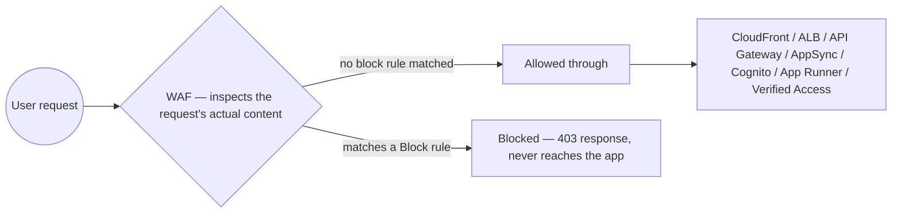

# 04 - AWS Web Application Firewall (WAF)

> Goal: understand what WAF actually protects against — the **application layer** (HTTP requests themselves), a fundamentally different target than a network firewall or security group — and how it plugs directly into services already built in this project (CloudFront, ALB, API Gateway).

---

## 1. The problem: a security group can't see inside a request

A security group (the [VPC](../VPC/) folder's own territory) filters traffic by **IP address and port** — it can allow or block "HTTPS traffic on port 443," but it has **no idea what's actually inside** that HTTPS request. A malicious `POST` body trying a SQL injection attack, or a request with `' OR '1'='1` stuffed into a query string, sails straight through a security group completely unnoticed — it's valid HTTPS traffic on the right port, exactly what the security group was told to allow.

**AWS WAF (Web Application Firewall)** operates one layer higher: it inspects the **actual content** of HTTP(S) requests — headers, query strings, request bodies, URI paths — **before** they ever reach your application, and can block, allow, count, or challenge them based on rules you (or AWS) define.

> 🧠 **Simple analogy**: a security group is like a **building's front door lock** — it checks whether you're allowed in the building at all. WAF is like a **security guard reading every visitor's bag contents** after they're already through the door — a completely different, complementary kind of check.

---

## 2. Architecture & workflow — where WAF sits

WAF is **not a standalone resource that traffic flows through on its own** — it's attached directly to one of a specific list of AWS services (CloudFront, Application Load Balancer, API Gateway, AppSync, Cognito user pools, App Runner, Verified Access). There's no "WAF endpoint" you point DNS at; the protection is layered onto a resource you already have.

---

## 3. Core building blocks

| Term | What it is |
|---|---|
| **Web ACL** (now increasingly called a **protection pack** in AWS's newer console) | The container you actually create and attach to a resource — a set of rules plus a default action |
| **Rule** | A single condition + action, e.g. "if the query string contains `union select`, Block" |
| **Rule group** | A reusable bundle of rules — either **AWS Managed Rules** (AWS-maintained, covering common attack patterns) or your own custom group |
| **Default action** | What happens when **no** rule matches — almost always **Allow**, since rules exist to catch specific bad traffic, not to whitelist everything explicitly |
| **Web ACL Capacity Units (WCUs)** | Every rule/rule group consumes a WCU budget (1,500 WCUs included free per Web ACL) — a real, if usually generous, resource ceiling to be aware of |

---

## 4. Rule types worth knowing for the exam

| Rule type | What it catches |
|---|---|
| **AWS Managed Rules — Core rule set (CRS)** | Broad, general-purpose protection against common web exploits (OWASP-style attack patterns) |
| **AWS Managed Rules — SQL database** | SQL injection attempt patterns specifically |
| **Rate-based rule** | Blocks a specific IP once it exceeds a request-count threshold in a rolling time window — the go-to answer for "protect against a flood of requests from a single source" |
| **IP set match** | Explicit allow/block lists of specific IP addresses or CIDR ranges |
| **Geographic match** | Block or allow by the request's country of origin |
| **String/regex match** | Custom conditions on headers, query strings, URI paths, or the body — your own hand-written rules |

> 🎯 **Exam tip**: "protect against a sudden flood of requests from one IP" (a basic, application-layer DoS pattern) → **rate-based rule**. This is one of the most consistently tested individual WAF facts on the SAA-C03 — don't confuse it with AWS Shield (a separate, broader DDoS-protection service operating more at the network/transport layer).

---

## 5. WAF vs. Shield vs. Security Groups vs. NACLs

| | Layer | What it protects against |
|---|---|---|
| **Security groups / NACLs** | Network (IP/port) | Unauthorized network-level access — the [VPC](../VPC/) folder's territory |
| **AWS WAF** | Application (HTTP content) | Malicious request *content* — SQLi, XSS, bad bots, excessive request rates from one source |
| **AWS Shield** | Network/transport (with Shield Advanced adding some application-layer help) | Large-scale DDoS attacks — volume-based flooding, not content inspection |

These are **complementary, layered defenses**, not competing choices — a well-protected public endpoint typically has security groups, WAF, and (for anything business-critical) Shield all active at once, each catching a different category of problem.

---

## 6. A critical regional detail — same shape as ACM's

Just like the [Certificate Manager](01-AWS-Certificate-Manager-ACM.md) note's Section 5: a Web ACL meant for **CloudFront** must be created with its scope set to **CloudFront**, and CloudFront-scoped Web ACLs are always managed in **`us-east-1`**, regardless of where the distribution's origin actually lives. A Web ACL for a **regional** resource (an ALB, a regional API Gateway) is created in that resource's own Region instead.

---

## 7. Recap

- WAF inspects the **actual content** of HTTP(S) requests — something security groups and NACLs, which only see IP/port, structurally cannot do.
- It's attached directly to a supported resource (CloudFront, ALB, API Gateway, and others) rather than being a standalone traffic-routing service of its own.
- A **Web ACL** bundles **rules** (custom or AWS Managed) with a **default action** — almost always Allow by default, with specific rules catching specific bad traffic.
- **Rate-based rules** are the textbook answer for "block a single IP flooding requests" — a distinctly different tool from Shield's broader DDoS protection.
- CloudFront-scoped Web ACLs live in **`us-east-1`**, mirroring the exact same regional gotcha the [Certificate Manager](01-AWS-Certificate-Manager-ACM.md) note already covered for certificates.
- Next: the [WAF hands-on demo](04.01-WAF-Protection-Demo.md) — attaching a real Web ACL to the CloudFront distribution already serving `devopswithdeepak.site`, and actually getting blocked by rules you configure yourself.

### Sources
- [What is AWS WAF? — AWS docs](https://docs.aws.amazon.com/waf/latest/developerguide/waf-chapter.html)
- [Creating a web ACL in AWS WAF — AWS docs](https://docs.aws.amazon.com/waf/latest/developerguide/web-acl-creating.html)
- [Using rate-based rule statements in AWS WAF — AWS docs](https://docs.aws.amazon.com/waf/latest/developerguide/waf-rule-statement-type-rate-based.html)
- [AWS Managed Rules rule groups list — AWS docs](https://docs.aws.amazon.com/waf/latest/developerguide/aws-managed-rule-groups-list.html)
