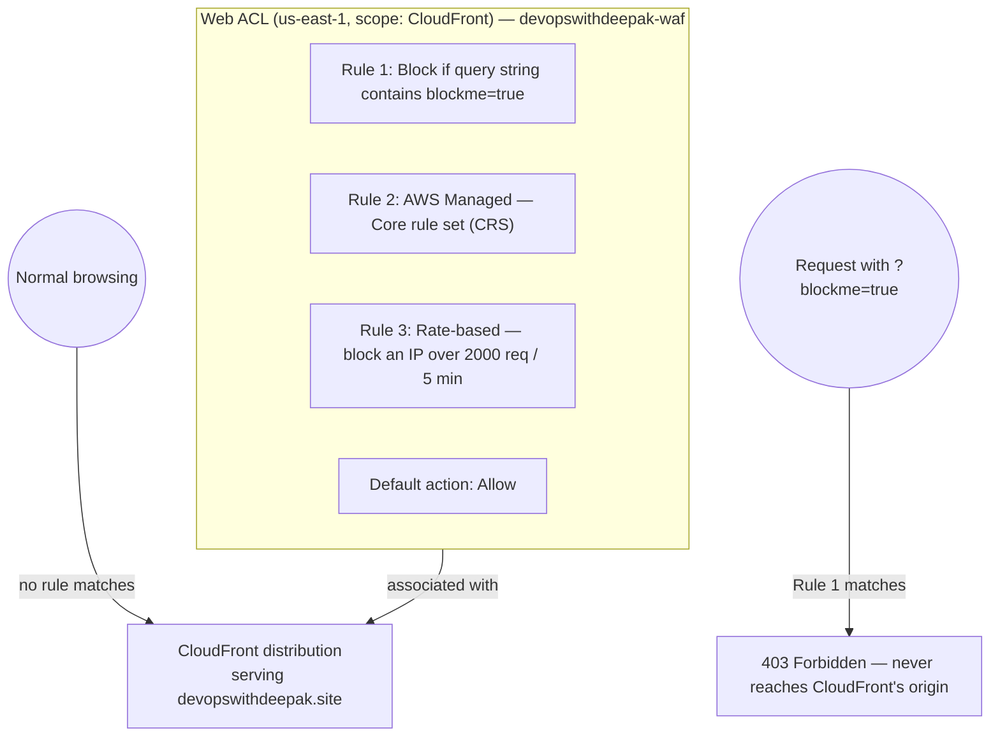

# 04.01 - Hands-On Demo: Blocking Real Requests to `devopswithdeepak.site`

> Goal: attach a real Web ACL to the same CloudFront distribution the [ACM hands-on demo](01.01-ACM-Certificate-Demo.md) put HTTPS on, add both a custom rule and an AWS Managed rule group, and actually **get blocked** by a rule you configured yourself — proof WAF is really inspecting content, not just theory. Entirely via the **AWS Console**, no CLI.

> ⚠️ **A console note before starting**: AWS is in the middle of rolling out a redesigned WAF console (referring to a Web ACL as a **"protection pack"**) alongside the existing one. You may see either the newer wizard (**"Tell us about your app"** → **App category** / **Traffic source** → **Choose initial protections**) or the classic one (**Create web ACL** → **Add rules and rule groups** → **Set rule priority**). Both create the exact same underlying resource — the field names below follow the classic flow since it's the more stable/well-documented one at the time of writing; if your console shows the newer wizard instead, the same decisions (resource to protect, rules to add, default action) just appear in a different order.

---

## 1. What you're building

---

## 2. Step 1 — Create the Web ACL

1. **Switch the Region selector to `us-east-1` (N. Virginia)** — mandatory for a CloudFront-scoped Web ACL, same requirement the [Certificate Manager](01-AWS-Certificate-Manager-ACM.md) note's Section 5 already covered for certificates.
2. **WAF console** → **Web ACLs** → **Create web ACL**.
3. **Name**: `devopswithdeepak-waf`.
4. **Description** (optional): `Protects the devopswithdeepak.site CloudFront distribution`.
5. **Resource type**: **Amazon CloudFront distributions**.
6. **Associated AWS resources** → **Add AWS resources** → select the distribution serving `devopswithdeepak.site` (the one from the [ACM hands-on demo](01.01-ACM-Certificate-Demo.md)'s Section 7) → **Add**.
7. **Next**.

---

## 3. Step 2 — Add a custom rule you can trigger yourself on demand

This is the rule that makes "getting blocked" something you can reliably reproduce right now, without waiting on a real attacker or a slow-to-trigger managed rule:

1. **Add rules** → **Add my own rules and rule groups** → **Rule builder** → **Rule visual editor**.
2. **Name**: `BlockDemoQueryString`.
3. **Rule type**: **Regular rule**.
4. **If a request**: **matches the statement**.
5. **Statement**: **Inspect** → **Single query parameter** → **Query parameter name**: `blockme`. **Match type**: **Exactly matches string**. **String to match**: `true`.
6. **Text transformation**: leave at **None**.
7. **Action**: **Block**.
8. **Add rule**.

---

## 4. Step 3 — Add an AWS Managed rule group

1. **Add rules** → **Add managed rule groups**.
2. Expand **AWS managed rule groups** → find **Core rule set (CRS)** → toggle **Add to web ACL** → **on**.
3. Leave its default rule actions as-is (each rule inside the group uses its own recommended action unless you explicitly override it) → **Add rules**.

> 🧠 The Core rule set alone bundles broad protection against common exploit patterns (bad inputs, known malicious signatures) that would otherwise take real effort to hand-write as custom rules — this is the practical value of a **Managed Rule Group** over writing everything yourself.

---

## 5. Step 4 — Add a rate-based rule

1. **Add rules** → **Add my own rules and rule groups** → **Rule builder** → **Rule visual editor**.
2. **Name**: `RateLimitPerIP`.
3. **Rule type**: **Rate-based rule**.
4. **Rate limit**: `2000` (requests) — the minimum the console allows; low enough to actually demonstrate in Section 7 if you choose to, without needing a real flood of traffic.
5. **Evaluation window**: `5 minutes`.
6. **Aggregate keys**: leave at **IP** (the default — one counter per source IP address).
7. **Action**: **Block**.
8. **Add rule**.

---

## 6. Step 5 — Set priority, default action, and create

1. **Next** → **Set rule priority**: order doesn't meaningfully matter for these three specific rules (they don't overlap on the same requests), but note that WAF always evaluates top-to-bottom, and the **first** matching rule's action wins — a genuinely important behavior for rules that *could* overlap.
2. **Next** → **Default action**: **Allow** — only the three rules above should ever block anything; everything else passes through untouched.
3. **Next** through **Configure metrics** (leave CloudWatch metrics enabled, the default) → **Next** → **Review and create web ACL** → **Create web ACL**.

---

## 7. Step 6 — Test it for real

### Normal traffic — allowed
1. Open `https://devopswithdeepak.site` in a browser. It should load completely normally — none of the three rules match ordinary browsing.

### The custom rule — blocked
2. Open `https://devopswithdeepak.site/?blockme=true`.
3. **Expected result**: a **403 Forbidden** response, served directly by CloudFront/WAF — the request never reaches your actual origin at all. This is the single most direct, on-demand proof that WAF genuinely inspects request content: nothing about this URL is malicious in a network sense, it's just a query string value your own rule was told to reject.

### Confirm it in WAF's own logs
4. **WAF console** → `devopswithdeepak-waf` → **Sampled requests** tab.
5. Find the blocked request → confirm it shows **Rule**: `BlockDemoQueryString` and **Action**: `BLOCK` — direct confirmation of *which* rule caught it, not just that something did.

### (Optional) The rate-based rule
6. Rapidly refreshing `https://devopswithdeepak.site` a couple thousand times within 5 minutes is impractical to do by hand — this rule is included primarily for the console configuration experience and the exam-relevant concept (the [Web Application Firewall](04-AWS-Web-Application-Firewall-WAF.md) note's Section 4) rather than as something to fully trigger manually in this demo.

---

## 8. Troubleshooting

| Symptom | Likely cause |
|---|---|
| `?blockme=true` doesn't get blocked | The Web ACL isn't actually associated with the right distribution (Section 2, Step 6), or the distribution hasn't finished redeploying after association — check its status is **Deployed** |
| Web ACL doesn't appear as an option to associate with CloudFront | It was created with **Resource type** set to **Regional resources** instead of **Amazon CloudFront distributions** (Section 2, Step 5), or it's not in `us-east-1` |
| Every request gets blocked, including normal browsing | The **Default action** (Section 6, Step 2) was accidentally set to **Block** instead of **Allow** — recheck that setting specifically, it silently inverts the whole Web ACL's behavior |
| Sampled requests tab shows nothing at all | Sampling can take a few minutes to start populating after a Web ACL is first associated — wait and refresh, or confirm CloudWatch metrics weren't disabled in Section 6, Step 3 |

---

## 9. Cleanup

1. **WAF console** → `devopswithdeepak-waf` → **Associated AWS resources** → remove the CloudFront distribution association.
2. Delete the `devopswithdeepak-waf` Web ACL.

(Leave the CloudFront distribution and `devopswithdeepak.site` itself untouched — same reasoning as the [ACM hands-on demo](01.01-ACM-Certificate-Demo.md)'s cleanup section, this is your real, working domain.)

---

## 10. Recap

- WAF genuinely inspects request **content** — the `?blockme=true` test blocked a request that was network-perfectly valid, purely because of a query string value a custom rule was configured to reject.
- **AWS Managed Rule Groups** (like the Core rule set) provide broad, maintained protection without hand-writing every individual rule yourself.
- **Rate-based rules** are configured with a threshold + time window + aggregation key (IP, by default) — the standard answer for "block a single source flooding requests."
- The **Sampled requests** tab is the direct, per-request way to confirm exactly which rule blocked a given request, not just that WAF did something.
- Next: the [AWS CloudHSM](05-AWS-CloudHSM.md) note, covering the most specialized, highest-control (and highest-cost) tier of AWS's key-management options.

### Sources
- [Creating a web ACL in AWS WAF — AWS docs](https://docs.aws.amazon.com/waf/latest/developerguide/web-acl-creating.html)
- [Using rate-based rule statements in AWS WAF — AWS docs](https://docs.aws.amazon.com/waf/latest/developerguide/waf-rule-statement-type-rate-based.html)
- [AWS Managed Rules rule groups list — AWS docs](https://docs.aws.amazon.com/waf/latest/developerguide/aws-managed-rule-groups-list.html)
- [Testing and tuning your AWS WAF protections — AWS docs](https://docs.aws.amazon.com/waf/latest/developerguide/web-acl-testing.html)
