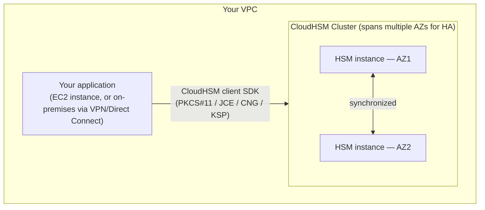

# 05 - AWS CloudHSM (Hardware Security Module)

> Goal: understand what CloudHSM offers that KMS deliberately doesn't — full, exclusive, single-tenant control over dedicated cryptographic hardware — and why that extra control comes with real, unavoidable operational cost and complexity. This note is **concept-only, no hands-on cluster** — CloudHSM bills per hour with no free tier (roughly $1.45-$1.60/hr per HSM, so even a short test is a real, unavoidable charge), and its cluster **activation** step genuinely cannot be completed from the browser console alone.

---

## 1. The problem: some workloads can't share hardware, even with AWS

The [Key Management Service](02-AWS-Key-Management-Service-KMS.md) note's whole value proposition rested on **not** having to manage key-storage hardware yourself — but KMS keys run on **shared, multi-tenant hardware** managed entirely by AWS. For most workloads that's exactly right. But some organizations have compliance requirements, contractual obligations, or internal security policies that specifically demand:

- **Single-tenant hardware** — no other AWS customer's keys ever touch the same physical device.
- **FIPS 140-2/140-3 Level 3** validation specifically (KMS's underlying HSMs are validated too, but CloudHSM gives you direct, exclusive control over hardware at this validation level, rather than a managed service built on top of it).
- **Full administrative control** — you manage your own users, your own key policies, entirely outside IAM, with **end-to-end encryption AWS itself cannot see into**.

**AWS CloudHSM** exists for exactly this narrower, higher-control, higher-responsibility tier.

---

## 2. Architecture & workflow

A **cluster** is the unit you manage — it can contain multiple individual **HSM instances** spread across Availability Zones for high availability, all kept cryptographically synchronized. Unlike KMS (where you just call an API and AWS handles everything underneath), your application talks to CloudHSM using a **client SDK** installed alongside it — supporting industry-standard interfaces (PKCS#11, JCE, CNG, KSP) specifically so existing on-premises applications built against those same standards can migrate with minimal code changes.

---

## 3. CloudHSM vs. KMS — the real trade-off

| | AWS KMS | AWS CloudHSM |
|---|---|---|
| **Tenancy** | Multi-tenant — shared hardware, AWS-managed | **Single-tenant** — dedicated hardware, exclusively yours |
| **Who manages users/access** | IAM (key policies + IAM policies) | **You** — CloudHSM has its own separate user/credential system, entirely outside IAM |
| **Visibility to AWS** | AWS operates the service; key material is protected but the service itself is AWS-managed | **End-to-end encrypted, not visible to AWS at all** — the trade-off is you take on far more operational responsibility |
| **Integration** | Deep, one-click integration with S3, EBS, RDS, Lambda, and more (the [Key Management Service](02-AWS-Key-Management-Service-KMS.md) note's Section 6) | Mostly **your own applications**, via the client SDK — some AWS services (e.g. a CloudHSM key store for KMS itself, or Amazon RDS's Oracle TDE / SQL Server TDE via CloudHSM) do integrate, but far fewer than KMS |
| **Cost model** | Per-key monthly fee + per-request usage | **Per-HSM-instance hourly fee**, running continuously — a fixed, always-on cost regardless of usage volume |
| **Setup complexity** | A few console clicks | A multi-step process: create a cluster, launch HSMs into it, generate/sign a certificate (via OpenSSL or AWS Private CA), initialize the cluster, then **activate** it using CloudHSM's own client tooling connecting directly to the HSM |

> 🎯 **Exam tip**: "regulatory requirement for a dedicated, single-tenant HSM" or "need direct control over the HSM appliance itself, outside of AWS's own management" → **CloudHSM**. "Just need managed encryption keys with deep AWS service integration and minimal operational overhead" → **KMS**, the correct default the overwhelming majority of the time. If a scenario doesn't explicitly demand single-tenancy or a specific compliance mandate that KMS doesn't already satisfy, CloudHSM is almost always the wrong, over-engineered answer.

---

## 4. Why this note stops at the console screens, not a running cluster

Creating and launching a cluster (choosing a VPC, subnets across multiple AZs, security groups) is genuinely a normal console flow, similar in spirit to launching other VPC-attached resources elsewhere in this project. Where it diverges sharply:

1. **Certificate signing** requires a tool like OpenSSL (or AWS Private CA) run **outside** the CloudHSM console entirely, to create a self-signed root certificate and sign the cluster's certificate signing request (CSR) — establishing cryptographic proof that *you*, not AWS, are the cluster's sole owner.
2. **Cluster activation** — setting the very first administrative credential, the **Crypto Officer (CO)** — requires AWS's own CloudHSM client software connecting **directly to the HSM's private IP address**, typically run from an EC2 instance inside the same VPC. There is no console button that does this step.
3. Every HSM instance bills **continuously, per hour, the moment it's created** — unlike, say, an EC2 t2.micro instance covered by the Free Tier, there's no free allowance here at all, and the meter runs until you explicitly delete every HSM in the cluster.

Given the real, unavoidable cost and the genuine requirement for tooling outside the browser, this note stays conceptual rather than walking through an actual paid cluster build.

---

## 5. Recap

- CloudHSM trades KMS's convenience for **exclusive, single-tenant control** — dedicated hardware, your own user management entirely outside IAM, and end-to-end encryption AWS cannot see into.
- A **cluster** can span multiple HSM instances across AZs for high availability, kept in cryptographic sync.
- The setup flow genuinely can't stay console-only: certificate signing needs external tooling (OpenSSL/AWS Private CA), and cluster **activation** needs the CloudHSM client connecting directly to the HSM, typically from an EC2 instance in the same VPC.
- **Cost is continuous and per-HSM-hour**, with no free tier — a real, structural difference from every other service covered in this folder.
- For the overwhelming majority of real-world and exam scenarios, **KMS remains the right default** — CloudHSM is specifically for the narrower set of cases where single-tenancy or a compliance mandate genuinely rules KMS out.

### Sources
- [What is AWS CloudHSM? — AWS docs](https://docs.aws.amazon.com/cloudhsm/latest/userguide/introduction.html)
- [AWS CloudHSM pricing — AWS docs](https://aws.amazon.com/cloudhsm/pricing/)
- [Initialize the cluster in AWS CloudHSM — AWS docs](https://docs.aws.amazon.com/cloudhsm/latest/userguide/initialize-cluster.html)
- [AWS CloudHSM vs. AWS KMS — AWS docs](https://docs.aws.amazon.com/whitepapers/latest/kms-cloudhsm-technical-comparison/aws-kms-technical-details.html)
