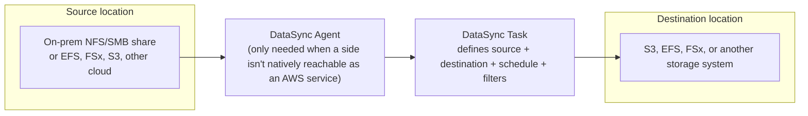

# 01 - AWS DataSync

> Goal: understand the problem AWS DataSync solves — moving large amounts of *file and object* data between storage systems, online, automatically, and fast — and how it compares to just writing your own `rsync`/`cp` script for the job.

---

## 1. The problem: moving files between storage systems is harder than it looks

Say a company has a few hundred thousand files on an on-premises NFS file share (or another cloud, or an existing AWS EFS/S3 bucket) and needs them copied into S3 — not once, but repeatedly, as new files show up. Writing a script to do this yourself sounds simple until you hit the real problems:

- **Verifying** every single file actually copied correctly (not just "the command didn't error").
- **Parallelizing** thousands of small files efficiently instead of one slow file at a time.
- **Retrying** failed files without re-copying the entire dataset.
- **Preserving** metadata — file permissions, timestamps, ownership — not just raw bytes.
- **Scheduling** repeat syncs so only *changed* files move each time, not a full re-copy.
- **Filtering** — only sync certain folders/file types, not everything.

**AWS DataSync** is a managed data-transfer service built to handle exactly this, entirely through automation you configure once — no custom scripts, no cron jobs you maintain yourself.

---

## 2. Architecture & workflow

A **Task** is the core object: it pairs a **source location** with a **destination location**, plus settings for what to include/exclude, how often to run, and how thoroughly to verify each transfer. Run it once on demand, or put it on a recurring schedule.

---

## 3. Agent vs. agentless — the one decision that matters most

| | When you need an **agent** | When you don't |
|---|---|---|
| **What it is** | A small virtual appliance (VM on VMware/KVM/Hyper-V, or an EC2 instance) that DataSync talks to | Nothing extra — DataSync talks to the AWS service's API directly |
| **Typical case** | One side of the transfer is storage DataSync can't reach natively — an on-premises NFS/SMB share, a self-managed file server running on an EC2 instance, or another cloud provider's storage | Both sides are AWS-native storage services DataSync already knows how to reach directly — **S3 ↔ S3**, **S3 ↔ EFS**, **EFS ↔ EFS**, **FSx ↔ FSx**, all within AWS |
| **Why** | The agent is the thing that actually sits next to your storage and reads/writes to it locally, then streams over the network to AWS | AWS's own storage services already expose an API DataSync can call directly — no local software needed at all |

> 🧠 This is genuinely the most exam-relevant distinction in this whole topic: **"agentless" only applies to AWS-native-to-AWS-native transfers.** The moment on-premises or another cloud is involved on either end, an agent is required.

---

## 4. What a Task actually controls

| Setting | What it does |
|---|---|
| **Source / Destination location** | The two endpoints being synced — each location type (NFS, SMB, S3, EFS, FSx, object storage, Azure Blob, HDFS) has its own connection details |
| **Include/exclude filters** | Sync only specific file paths or patterns, rather than an entire share |
| **Transfer mode** | **Transfer only data that has changed** (default, efficient for repeat runs) vs. **Transfer all data** (forces a full re-copy) |
| **Verification** | Whether DataSync verifies every transferred file's data integrity after copying, and how (point-in-time or full checksum) |
| **Schedule** | Run once on demand, or on a recurring schedule (hourly/daily/custom) so only new/changed files move each run |
| **Task reporting** | A detailed report of what was transferred, skipped, or failed — pushed to an S3 bucket you choose |

---

## 5. Common real-world use cases

- **On-premises to AWS migration**: move a file server's contents into S3 or EFS as part of a broader migration, without hand-rolling a transfer script.
- **Recurring hybrid-cloud sync**: keep an S3 bucket continuously in sync with an on-premises NFS share used by a legacy application that can't move to the cloud yet.
- **AWS-to-AWS data movement**: move data between accounts, Regions, or storage services (e.g. archiving EFS data into S3 on a schedule) — this is the agentless case.
- **Cloud-to-cloud migration**: moving data out of another cloud provider's object storage into S3.

> 🎯 **Exam tip**: if a scenario says "we need to migrate an on-premises file share into S3 and keep doing incremental syncs afterward," that's DataSync, not a one-time physical device — [AWS Snowball](../Migration-Services/01-AWS-Snowball.md)'s note covers why Snowball is the *physical, one-time, massive-scale* answer instead, and is itself being retired in favor of DataSync for the online case.

---

## 6. Recap

- DataSync automates file/object transfer between storage systems — verification, retries, metadata preservation, filtering, and scheduling all handled for you, instead of a custom script.
- A **Task** = source location + destination location + settings; run on demand or on a recurring schedule.
- The **agent** is only required when one side of the transfer isn't a native AWS storage service DataSync can reach directly (on-premises, self-managed, or another cloud) — pure AWS-to-AWS transfers are agentless.
- Next: the [DataSync agent hands-on demo](01.01-AWS-DataSync-Agent-Demo.md) — deploying a real agent on EC2 and syncing from a self-managed NFS share into S3.

### Sources
- [What is AWS DataSync? — AWS docs](https://docs.aws.amazon.com/datasync/latest/userguide/what-is-datasync.html)
- [Do I need a DataSync agent? — AWS docs](https://docs.aws.amazon.com/datasync/latest/userguide/do-i-need-datasync-agent.html)
- [Deploying your AWS DataSync agent — AWS docs](https://docs.aws.amazon.com/datasync/latest/userguide/deploy-agents.html)
- [Working with AWS DataSync tasks — AWS docs](https://docs.aws.amazon.com/datasync/latest/userguide/working-with-tasks.html)
