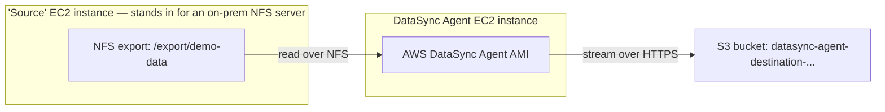

# 01.01 - Hands-On Demo: Agent-Based Sync from a Self-Managed NFS Share to S3

> Goal: build the scenario DataSync's **agent** actually exists for — a storage system AWS can't reach natively (a self-managed NFS share) — and watch a real DataSync agent stream its files into S3. This is deliberately different from a plain S3-to-S3 transfer: it exercises the agent deployment/activation flow, an NFS source location, include filters, and a task report. Everything is done via the **AWS Console**; the two non-console-app steps are (1) running one AWS CLI command inside **CloudShell** (browser-embedded, an already-approved exception) to look up the DataSync agent's AMI ID, and (2) a couple of shell commands on the two EC2 instances via **EC2 Instance Connect** (also browser-embedded) to set up the NFS share and test files — no locally installed software anywhere.

---

## 1. What you're building



Since there's no real external data center available, a second EC2 instance plays the role of the "on-premises NFS server" — a legitimate, documented way to exercise the agent-based path without needing outside infrastructure. AWS explicitly does **not** recommend using an EC2 agent for genuinely on-premises storage (network latency) — this setup is purely for learning the mechanics safely inside one AWS account.

---

## 2. Step 1 — Launch the "source" NFS server instance

1. **EC2 console** → **Launch instances**.
2. **Name**: `datasync-source-nfs-server`.
3. **AMI**: **Amazon Linux 2023**.
4. **Instance type**: `t2.micro`.
5. **Key pair**: **Proceed without a key pair** — connect via **EC2 Instance Connect** instead.
6. **Network settings** → **Edit**: same VPC/subnet you'll use for the agent instance later; **Auto-assign public IP**: **Enable** (needed for Instance Connect); security group: allow **SSH (22)** from **My IP** (for Instance Connect) and, once you know the agent instance's security group, allow **NFS (TCP/UDP 2049)**, **111**, and **20048** from that security group.
7. **Launch instance**.

---

## 3. Step 2 — Configure the NFS export and test files

1. **EC2 console** → select `datasync-source-nfs-server` → **Connect** → **EC2 Instance Connect** tab → **Connect**.
2. In the browser terminal:
   ```bash
   sudo dnf install -y nfs-utils
   sudo mkdir -p /export/demo-data/logs /export/demo-data/reports
   sudo chmod -R 777 /export/demo-data
   echo "hello from datasync demo" | sudo tee /export/demo-data/logs/app.log
   echo "quarterly report placeholder" | sudo tee /export/demo-data/reports/q1.txt
   echo '/export/demo-data *(rw,sync,no_root_squash,no_subtree_check)' | sudo tee -a /etc/exports
   sudo systemctl enable --now nfs-server
   sudo exportfs -ra
   ```
3. Note this instance's **private IPv4 address** (EC2 console → instance details) — the agent will reach it on the private network.

---

## 4. Step 3 — Look up the current DataSync agent AMI ID

The DataSync agent AMI ID is Region-specific and looked up via a single AWS-provided SSM parameter — done here in **CloudShell** (a browser-based terminal already backed by your console session, no local CLI install):

1. Open **CloudShell** (icon in the console's top toolbar).
2. Run, replacing the Region if you're not in `ap-south-1`:
   ```bash
   aws ssm get-parameter --name /aws/service/datasync/ami --region ap-south-1
   ```
3. Copy the AMI ID from the `"Value"` field in the output.

---

## 5. Step 4 — Launch the DataSync agent EC2 instance

1. In your browser's address bar, open:
   ```
   https://console.aws.amazon.com/ec2/v2/home?region=ap-south-1#LaunchInstanceWizard:ami=<ami-id-from-step-3>
   ```
   This opens the standard EC2 launch page pre-loaded with the DataSync agent AMI.
2. **Name**: `datasync-agent`.
3. **Instance type**: choose one of AWS's recommended sizes for a DataSync agent (`m5.2xlarge` is the documented baseline) — for this small demo a smaller size still boots and works, but AWS's own sizing guidance is `2xlarge`.
4. **Key pair**: **Proceed without a key pair**.
5. **Network settings** → **Edit**: same VPC/subnet as the source instance; **Auto-assign public IP**: **Enable**; security group allowing:
   - **HTTP (80)** inbound from **My IP** — needed once, for the console to fetch the activation key automatically.
   - **NFS (2049, 111, 20048)** outbound to the source instance's security group (or open outbound generally, since this is a demo).
6. **Launch instance**. Wait for **Running** + status checks passed, then note its **public IPv4 address**.
7. Go back to the source instance's security group and add an inbound rule allowing **NFS (2049, 111, 20048)** from the agent instance's security group, so the agent can actually reach the NFS export.

---

## 6. Step 5 — Activate the agent

1. **DataSync console** → **Agents** → **Create agent**.
2. **Service endpoint**: **Public service endpoints in `<your Region>`**.
3. **Activation key**: **Automatically get the activation key from your agent** → **Agent address**: the agent instance's **public IP** from Section 5 → **Get key**. The console reaches the instance on port 80 and retrieves a key automatically — no manual copy-pasting a key from a local terminal.
4. **Agent name**: `datasync-demo-agent`.
5. **Create agent**. It briefly shows **Offline**, then flips to **Online** within a minute or two.

---

## 7. Step 6 — Create the source (NFS) and destination (S3) locations

1. **S3 console** → **Create bucket** → `datasync-agent-destination-<your-name-or-date>` → leave defaults → **Create bucket**.
2. **DataSync console** → **Locations** → **Create location**.
3. **Location type**: **Network File System (NFS)**.
4. **Agents**: select `datasync-demo-agent`.
5. **NFS server**: the source instance's **private IP** from Section 3.
6. **Mount path**: `/export/demo-data`.
7. **Create location**.
8. **Create location** again → **Location type**: **Amazon S3** → **General purpose bucket**: `datasync-agent-destination-<...>` → **IAM role**: **Autogenerate** → **Create location**.

---

## 8. Step 7 — Create and run a filtered task

1. **DataSync console** → **Tasks** → **Create task**.
2. **Source location**: the NFS location from Section 7.
3. **Destination location**: the S3 location from Section 7.
4. **Next** → in **Filtering**, set an **Include** pattern of `/logs*` so only the `logs` folder syncs, not `reports` — this is the concrete way to prove filters actually work, not just take AWS's word for it.
5. Leave **Transfer mode**: **Transfer only data that has changed**, **Verification**: default, **Schedule**: **Run on demand** → **Next** → **Task name**: `datasync-nfs-to-s3-demo` → **Create task**.
6. Open the task → **Start** → **Start with defaults**.
7. Watch status move **Launching → Preparing → Transferring → Verifying → Success**.

---

## 9. Step 8 — Confirm the filter and the transfer both worked

1. **S3 console** → open `datasync-agent-destination-<...>`.
2. Confirm `logs/app.log` is present — and `reports/q1.txt` is **not**, proving the include filter from Section 8 actually scoped the sync.
3. Back in the DataSync task, open the **History** tab → the latest run → check **Files transferred**, **Data transferred**, and download the **task report** (if you enabled one) for a per-file breakdown.

---

## 10. Troubleshooting

| Symptom | Likely cause |
|---|---|
| **Get key** fails when activating the agent | Port 80 isn't open from your browser's IP to the agent instance's security group (Section 5) — recheck the inbound rule |
| NFS location creation fails / task errors reading the source | The source instance's security group doesn't allow NFS ports (2049/111/20048) **from the agent's security group** (Section 7's last step is easy to miss) |
| Agent stays **Offline** after activation | The instance may still be initializing — wait a minute, or confirm outbound internet access (public IP + default security group egress) so the agent can reach the DataSync service |
| `reports/q1.txt` shows up in the destination too | The include filter pattern in Section 8 wasn't applied correctly — re-open the task's filtering settings and confirm the pattern matches `/logs*` exactly |

---

## 11. Cleanup

1. **DataSync console** → delete the `datasync-nfs-to-s3-demo` task, then both locations, then the `datasync-demo-agent` agent.
2. **EC2 console** → terminate `datasync-source-nfs-server` and `datasync-agent`.
3. **IAM console** → delete the auto-generated DataSync S3-location role.
4. **S3 console** → empty and delete `datasync-agent-destination-<...>`.

---

## 12. Recap

- The **agent** is the piece that lets DataSync reach storage it can't talk to natively — here, a self-managed NFS export standing in for an on-premises file server.
- Getting an activation key **automatically through the console** only needs a browser-reachable port 80 on the agent — no separate local terminal step, as long as that path is open.
- **Include/exclude filters** on a task are a real, testable way to sync only part of a source — proven directly here by watching one folder land in S3 and the other not.
- This complements the [AWS Application Migration Service (MGN) demo](../Migration-Services/02.01-AWS-MGN-Migration-Demo.md)'s pattern of using a same-account EC2 instance as a stand-in for external infrastructure — a recurring, legitimate way to learn hybrid-style AWS services without needing real outside hardware.
- Next: the [AWS Storage Gateway](02-AWS-Storage-Gateway.md) note — a different hybrid-storage approach, presenting AWS-backed storage as a *local* file, block, or tape interface instead of syncing files one-way.

### Sources
- [Deploying your Amazon EC2 agent — AWS docs](https://docs.aws.amazon.com/datasync/latest/userguide/deploy-agents.html)
- [Activating your AWS DataSync agent — AWS docs](https://docs.aws.amazon.com/datasync/latest/userguide/activate-agent.html)
- [Creating a location for NFS — AWS docs](https://docs.aws.amazon.com/datasync/latest/userguide/create-nfs-location.html)
- [Configuring task filters — AWS docs](https://docs.aws.amazon.com/datasync/latest/userguide/filtering.html)
