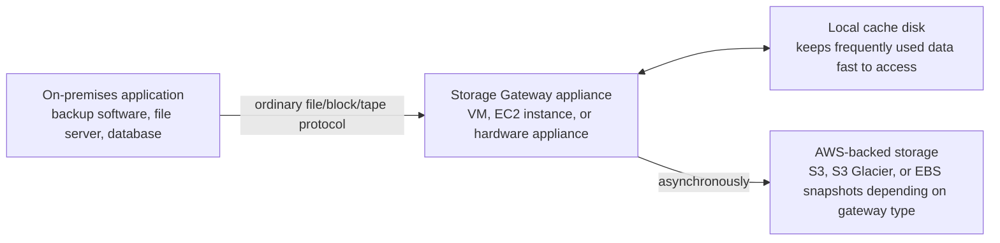

# 02 - AWS Storage Gateway

> Goal: understand the different problem Storage Gateway solves compared to [DataSync](01-AWS-DataSync.md) — it's not "copy files from A to B," it's "make an on-premises application think it's talking to local storage, while the actual bytes quietly live in AWS."

---

## 1. The problem: legacy applications that can't be rewritten to speak "cloud"

Plenty of real-world applications — backup software, file servers, databases — were written assuming they'll talk to a **local disk**, a **local file share**, or a **local tape drive**. They don't know how to call the S3 API. Rewriting them isn't always an option: the software might be third-party, decades old, or simply too risky to touch.

**AWS Storage Gateway** solves this by running a small **gateway appliance** (a VM in your data center, or an EC2 instance, or a physical hardware appliance AWS ships you) that presents a completely ordinary-looking **local interface** — an NFS/SMB file share, an iSCSI block volume, or a virtual tape library — while transparently storing the actual data in AWS behind the scenes. The application never has to change; it just keeps doing what it always did, pointed at the gateway instead of a physical disk.

---

## 2. Architecture & workflow — the shared pattern across all three gateway types

Every gateway type follows this same shape: a **local cache** absorbs recent reads/writes for low latency, while the gateway asynchronously and durably pushes data into AWS in the background.

---

## 3. The three gateway types

| Gateway type | Presents as | Backed by | Typical use case |
|---|---|---|---|
| **[Amazon S3 File Gateway](02.01-Storage-Gateway-File-Gateway-Demo.md)** | An NFS or SMB file share | S3 objects (one file = one S3 object, directly readable/writable via the S3 API too) | Lift-and-shift a file server, or give cloud-native apps a familiar file-share view of S3 |
| **[Volume Gateway](03-Storage-Gateway-Volume-Gateway.md)** | An iSCSI block storage volume | S3, with point-in-time backups as EBS snapshots | On-premises applications that need raw block storage — databases, VM datastores |
| **[Tape Gateway](04-Storage-Gateway-Tape-Gateway.md)** | An iSCSI virtual tape library (VTL) | S3 and S3 Glacier | Replacing physical tape backup infrastructure without changing existing backup software |

---

## 4. Deployment options

A gateway appliance can be deployed as:

- **A virtual machine** on **VMware ESXi**, **Microsoft Hyper-V**, **Linux KVM**, or **Nutanix AHV** — the genuinely "on-premises" case, run in your own data center's hypervisor.
- **An Amazon EC2 instance** — running the gateway entirely inside AWS itself, useful for cloud-native scenarios (or, as this project's hands-on demo uses it, for safely learning the mechanics without needing real on-premises hardware).
- **A dedicated hardware appliance** ordered directly from AWS — for sites with no existing virtualization infrastructure to host a VM on.

> 🧠 The genuinely on-premises deployment (VMware/Hyper-V/KVM) needs a real hypervisor outside of AWS to run the downloaded VM image on — that step can't be done from the AWS Console itself, so it's explained here conceptually rather than attempted as a hands-on. The **EC2 host platform**, however, is 100% console-doable end to end, and is what this project's hands-on demo actually builds and tests.

---

## 5. Recap

- Storage Gateway's whole purpose is making cloud storage look like **ordinary local storage** to an application that was never written to talk to AWS APIs directly.
- All three gateway types share the same shape: **local cache + gateway appliance + AWS-backed storage behind it**, asynchronously kept in sync.
- **S3 File Gateway** (file), **Volume Gateway** (block/iSCSI), and **Tape Gateway** (virtual tape library) each target a different kind of legacy application.
- Deployment can be a VM in your own data center, an EC2 instance, or AWS-shipped hardware — only the EC2 path is fully console-doable from inside this project's constraints.
- Next: the [S3 File Gateway hands-on demo](02.01-Storage-Gateway-File-Gateway-Demo.md) — deploying a real gateway on EC2, activating it, and mounting an NFS share backed by S3.

### Sources
- [What is AWS Storage Gateway? — AWS docs](https://docs.aws.amazon.com/storagegateway/latest/userguide/WhatIsStorageGateway.html)
- [Choosing a AWS Storage Gateway type — AWS docs](https://docs.aws.amazon.com/storagegateway/latest/userguide/storage-gateway-types.html)
- [AWS Storage Gateway FAQs — AWS](https://aws.amazon.com/storagegateway/faqs/)
