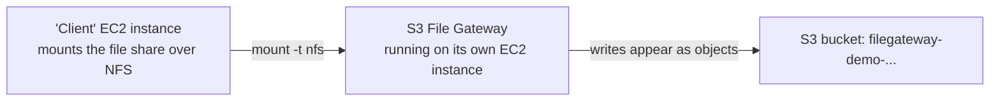

# 02.01 - Hands-On Demo: Deploying an S3 File Gateway and Mounting It as an NFS Share

> Goal: deploy a real **Amazon S3 File Gateway**, activate it, create an NFS file share backed by S3, and mount that share from another instance — proving files written to what looks like an ordinary network drive actually land as objects in an S3 bucket. The course material splits this into an **On-Premises Lab** and a **Cloud Lab**; Section 2 explains why only the cloud (EC2-hosted) path is genuinely doable from inside this project's AWS-Console-only constraint, and the rest of this note builds that path for real, end to end, via the **AWS Console**. The only non-console-app steps are two short shell commands run through **EC2 Instance Connect** (browser-embedded) on the client instance used to mount and test the share.

---

## 1. What you're building



---

## 2. Why this demo skips the On-Premises Lab and builds the Cloud Lab instead

The **On-Premises Lab** version of this topic deploys the gateway as a **VM on VMware ESXi, Hyper-V, or KVM** — a real hypervisor running outside of AWS, on hardware or a workstation you control. That step genuinely can't be done from the AWS Console, since it requires downloading an image file and importing it into hypervisor software that isn't AWS at all.

The **Cloud Lab** version deploys the exact same gateway software as an **Amazon EC2 instance** instead — and that entire flow, including launching the instance, is done through the AWS Console. Functionally the gateway behaves identically either way once it's running; only the "where does the appliance physically run" step differs. This note builds the Cloud Lab version for real.

---

## 3. Step 1 — Start the gateway setup and choose EC2 as the host platform

1. **AWS Storage Gateway console** → **Create gateway**.
2. **Gateway settings**: **Gateway name**: `filegateway-demo` → **Gateway time zone**: your local zone.
3. **Gateway options** → **Gateway type**: **Amazon S3 File Gateway**.
4. **Platform options** → **Host platform**: **Amazon EC2**.
5. Choose **Launch instance** — this opens the EC2 console pre-loaded with the AWS Storage Gateway community AMI.

---

## 4. Step 2 — Launch the gateway's EC2 instance

Still on the EC2 launch page opened from Step 1:

1. **Name**: `filegateway-demo-instance`.
2. **Instance type**: `m5.xlarge` — AWS's documented minimum-recommended size for a File Gateway appliance (smaller types can fail to meet the gateway's hardware requirements).
3. **Key pair**: **Proceed without a key pair** — you won't SSH into the gateway itself.
4. **Network settings** → **Edit**:
   - **VPC / Subnet**: your choice.
   - **Auto-assign public IP**: **Enable**.
   - **Firewall (security groups)**: create a new one, and under **Inbound security group rules** add:
     - **HTTP (80)** from **My IP** — required once, for activation; can be removed afterward.
     - **NFS (2049)**, and custom TCP/UDP rules for **111** and **20048**, from the VPC's CIDR range (or from the client instance's security group once you create it in Section 8) — required for mounting NFS shares.
5. **Configure storage** → **Add new volume** → add an **EBS volume of at least 150 GiB** for the gateway's local cache, in addition to the preconfigured root volume.
6. **Launch instance**.
7. Wait for **Instance state: Running** and **Status check: 2/2 checks passed**, then copy its **Public IPv4 address**.

---

## 5. Step 3 — Connect the gateway to AWS and activate it

Back in the **Storage Gateway console** (the **Set up gateway** page from Section 3):

1. Check **Confirm set up gateway** → **Next**, opening the **Connect to AWS** page.
2. **Connection options**: **IP address** → enter the gateway instance's **public IP** from Section 4.
3. **Service endpoint**: **Publicly accessible** → **IP version**: **IPv4** → **Next**, opening **Review and activate**.
4. Review the settings, then **Activate gateway**. Activation typically takes under a minute.

---

## 6. Step 4 — First-time gateway configuration

On the **Configure gateway** page that follows activation:

1. **Configure storage** → assign the **150 GiB EBS volume** from Section 4 to **Cache**.
2. **CloudWatch log group** → **Deactivate logging** (keeps this demo simple; a real production gateway would typically use **Create a new log group**).
3. **CloudWatch alarms** → **No alarm** (same reasoning — a real deployment would enable AWS's recommended alarms).
4. **Configure**. The **Gateway overview** page should now show your gateway as **Running**.

---

## 7. Step 5 — Create the S3 bucket and the NFS file share

1. **S3 console** → **Create bucket** → `filegateway-demo-<your-name-or-date>` → leave defaults → **Create bucket**.
2. **Storage Gateway console** → **File shares** → **Create file share**.
3. **Gateway**: `filegateway-demo`.
4. **S3 bucket name**: `filegateway-demo-<...>`.
5. **File share protocol**: **NFS**.
6. **IAM role**: **Autogenerate** — Storage Gateway creates a scoped role for reading/writing this specific bucket.
7. Leave the remaining defaults → **Create file share**. Note the **File share mount path** it displays — it's of the form `<gateway-ip>:/<bucket-name>`.

---

## 8. Step 6 — Mount the share from a client instance and prove it works

1. **EC2 console** → **Launch instances** → **Name**: `filegateway-demo-client` → **Amazon Linux 2023** → `t2.micro` → **Proceed without a key pair** → same VPC/subnet as the gateway → **Auto-assign public IP: Enable** → security group allowing SSH from **My IP** → **Launch instance**.
2. Go back to the **gateway instance's** security group (Section 4) and confirm/add an inbound rule allowing **NFS (2049, 111, 20048)** from this client instance's security group.
3. **EC2 console** → select `filegateway-demo-client` → **Connect** → **EC2 Instance Connect** → **Connect**.
4. In the browser terminal:
   ```bash
   sudo dnf install -y nfs-utils
   sudo mkdir -p /mnt/filegateway
   sudo mount -t nfs -o nolock <gateway-private-ip>:/filegateway-demo-<...> /mnt/filegateway
   echo "written through the file gateway" | sudo tee /mnt/filegateway/hello.txt
   ```
5. **S3 console** → open `filegateway-demo-<...>` → confirm `hello.txt` now exists as a real object in the bucket — direct proof the "file share" was actually S3 the entire time.

---

## 9. Troubleshooting

| Symptom | Likely cause |
|---|---|
| Gateway activation fails / times out | Port 80 isn't reachable from your browser to the gateway instance's public IP — recheck the security group rule from Section 4 |
| File share creation fails | AWS Security Token Service (STS) isn't active in this Region for the account — check **IAM console** → **Account settings** → **STS** (it's active by default in commercial Regions, but worth confirming if this step fails unexpectedly) |
| `mount` command hangs or fails | The client instance's security group isn't allowed inbound on the gateway's NFS ports, or vice versa — recheck both directions from Sections 4 and 8 |
| File written to the mount doesn't appear in S3 | Give it a few seconds — the gateway uploads asynchronously; also confirm you mounted the correct bucket path shown in Section 7 |

---

## 10. Cleanup

1. On the client instance, `sudo umount /mnt/filegateway`.
2. **Storage Gateway console** → delete the file share, then the `filegateway-demo` gateway.
3. **EC2 console** → terminate `filegateway-demo-instance` and `filegateway-demo-client`.
4. **IAM console** → delete the auto-generated file-share role.
5. **S3 console** → empty and delete `filegateway-demo-<...>`.

---

## 11. Recap

- The **On-Premises Lab** and **Cloud Lab** versions of this topic run the identical gateway software — only where the appliance physically runs differs, and only the EC2-hosted (Cloud Lab) path is achievable purely through the AWS Console.
- An **S3 File Gateway** file share is a genuine NFS (or SMB) mount point from the client's point of view, while every file written to it becomes a real, directly S3-API-readable object.
- A minimum **150 GiB cache volume** and port **80** (one-time, for activation) plus NFS ports **2049/111/20048** are the concrete infrastructure requirements this demo exercised for real.
- This is functionally a different problem from what the [DataSync agent demo](01.01-AWS-DataSync-Agent-Demo.md) solves: DataSync **copies** files from A to B on a schedule, while a File Gateway makes S3 **continuously appear** as a live, mountable file share.
- Next: the [Volume Gateway](03-Storage-Gateway-Volume-Gateway.md) note — the same gateway pattern applied to raw block (iSCSI) storage instead of files.

### Sources
- [Deploy a customized Amazon EC2 host for S3 File Gateway — AWS docs](https://docs.aws.amazon.com/filegateway/latest/files3/ec2-gateway-file.html)
- [Create and activate an Amazon S3 File Gateway — AWS docs](https://docs.aws.amazon.com/filegateway/latest/files3/create-gateway-file.html)
- [Create an NFS file share — AWS docs](https://docs.aws.amazon.com/filegateway/latest/files3/create-nfs-file-share.html)
- [Port requirements — AWS docs](https://docs.aws.amazon.com/filegateway/latest/files3/Requirements.html#requirements-network)
