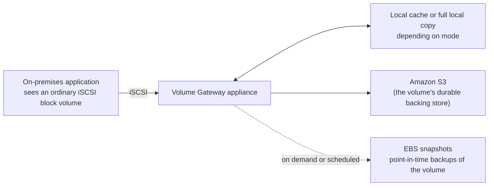

# 03 - Storage Gateway: Volume Gateway

> Goal: understand how Volume Gateway gives on-premises applications raw **block storage** (not files) backed by AWS, and the one decision that defines its entire behavior — **cached** vs. **stored** volumes. Kept concept-focused and console-light: the deployment mechanics are identical to the [S3 File Gateway hands-on demo](02.01-Storage-Gateway-File-Gateway-Demo.md)'s EC2-hosted pattern, just presenting a different protocol (iSCSI block, not NFS/SMB files) — testing it fully requires an iSCSI initiator client, which is standard OS functionality but outside this project's console-only demo pattern.

---

## 1. The problem: some applications need a raw disk, not a file share

A database engine, or a hypervisor's datastore, doesn't want to write to files on a network share — it wants to talk to what looks like a **local block device**: something it can partition, format with its own filesystem, and read/write at the block level, exactly like a physical hard disk plugged into the machine. **Volume Gateway** presents exactly that, over the standard **iSCSI** protocol, while the actual data lives durably in AWS.

---

## 2. Architecture & workflow

---

## 3. Cached volumes vs. stored volumes — the core decision

| | **Cached volumes** | **Stored volumes** |
|---|---|---|
| **Primary copy of the data lives** | In **Amazon S3** | **Locally**, on the gateway's own storage |
| **Local disk holds** | Only a **cache** of frequently accessed data, for low-latency access | The **entire dataset**, in full |
| **What AWS gets** | The full, authoritative data | An **asynchronous backup** of the local data |
| **Max volume size** | Larger — up to 32 TiB per volume | Smaller — up to 16 TiB per volume |
| **Why choose it** | You want most of your data's bulk sitting in AWS, keeping local hardware small, while still getting fast access to what's actually in active use | You need the **entire dataset available locally at low latency at all times** (e.g. no tolerance for a cache miss), but still want durable, offsite, versioned backups in AWS |

> 🎯 **Exam tip**: "primary data stored in AWS, only hot data cached locally" → **cached volumes**. "Primary data stays on-premises, AWS is just the backup" → **stored volumes**. Both still expose the same iSCSI interface to the application either way — the difference is entirely about *where the authoritative copy of the data lives*.

---

## 4. How volumes back up — EBS snapshots

Both volume types support point-in-time backups, and those backups are stored as standard **Amazon EBS snapshots** — the exact same snapshot mechanism covered in the [EBS Snapshot & Backup hands-on](../EC2-Storage/08-EBS-Snapshot-Backup-HandsOn.md). This is a deliberately reused building block: it means a Volume Gateway snapshot can be used to create a **real EBS volume** and attach it directly to an EC2 instance — a genuine, documented way to migrate an on-premises block-storage workload into native AWS block storage over time, one snapshot at a time.

---

## 5. Deployment, in outline (same EC2-hosted pattern as File Gateway)

The deployment mechanics are the same shape as the [File Gateway demo](02.01-Storage-Gateway-File-Gateway-Demo.md): **Storage Gateway console → Create gateway → Gateway type: Volume Gateway (Cached or Stored) → Host platform: Amazon EC2 → launch the gateway AMI → activate via its IP → allocate cache/storage disks**. The difference from that point on is what you create next — instead of a **file share**, you create a **volume** (**Volumes** in the left nav → **Create volume**), specify its size and which local disk backs it, and the gateway exposes it as an iSCSI target that an OS-level iSCSI initiator connects to. That initiator step (`iscsiadm` on Linux, the built-in iSCSI Initiator on Windows) is standard OS tooling, not an AWS console action — which is why this note stops at the concept and console-side setup rather than building a full iSCSI mount-and-test demo.

---

## 6. Recap

- Volume Gateway presents **iSCSI block storage** to on-premises applications that need a raw disk, not a file share.
- **Cached volumes**: primary data in S3, local disk is just a cache — larger max size, less local hardware needed.
- **Stored volumes**: primary data stays local in full, S3 holds an asynchronous backup — smaller max size, guaranteed full local low-latency access.
- Backups from either mode are ordinary **EBS snapshots** — directly reusable to create real EBS volumes in AWS, a genuine incremental migration path.
- Console-side deployment mirrors the [File Gateway demo](02.01-Storage-Gateway-File-Gateway-Demo.md)'s EC2-hosted pattern exactly; only the final client-side mount step (an iSCSI initiator) falls outside the console.
- Next: the [Tape Gateway](04-Storage-Gateway-Tape-Gateway.md) note — the same underlying gateway pattern, this time replacing physical backup tapes.

### Sources
- [What is Volume Gateway? — AWS docs](https://docs.aws.amazon.com/storagegateway/latest/vgw/WhatIsStorageGateway.html)
- [How Volume Gateway works — AWS docs](https://docs.aws.amazon.com/storagegateway/latest/vgw/StorageGatewayConcepts.html)
- [Creating a storage volume — AWS docs](https://docs.aws.amazon.com/storagegateway/latest/vgw/GettingStartedCreateVolumes.html)
