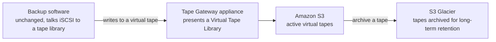

# 04 - Storage Gateway: Tape Gateway (Virtual Tape Library)

> Goal: understand how Tape Gateway lets a company keep using its existing tape-based backup software — completely unchanged — while physical tapes quietly disappear from the picture. Concept-focused: exercising this for real needs actual backup software (Veeam, NetBackup, etc.) configured to talk iSCSI, which is third-party tooling outside the AWS Console.

---

## 1. The problem: backup software that only knows how to talk to tape drives

Enterprise backup software has historically been built around **physical tape libraries**: a robotic tape changer, tape drives, and individual tape cartridges, all addressed over iSCSI or a similar protocol. That software is often deeply entrenched — years of retention policies, tested restore procedures, compliance sign-off — and "just switch to S3" isn't a realistic ask without a lot of retraining and re-validation.

**Tape Gateway** solves this the same way the other gateway types solve their own version of this problem: it presents a **Virtual Tape Library (VTL)** over iSCSI that looks, to the backup software, exactly like a real physical tape library — virtual media changer, virtual tape drives, virtual tapes — so the existing backup jobs keep running completely unmodified, while the "tapes" are actually stored durably in AWS.

---

## 2. Architecture & workflow

---

## 3. The moving pieces

| Component | Real-world equivalent it stands in for |
|---|---|
| **Virtual tape library (VTL)** | The physical tape library cabinet as a whole |
| **Virtual media changer** | The robotic arm that loads/unloads tapes into drives |
| **Virtual tape drives** | The physical drives that read/write a mounted tape |
| **Virtual tapes** | Individual tape cartridges — created with a chosen capacity, just like ordering physical tapes |
| **Virtual Tape Shelf (VTS)** | Where a tape goes when "ejected" for long-term archival — backed by **S3 Glacier**, matching the real-world practice of shipping ejected tapes to offsite, colder storage |

---

## 4. Why this matters for backup retention strategy

The tape lifecycle maps directly onto real tape-operations habits, which is exactly the point:

- **Active tapes** (recently written, likely to be restored from) stay accessible, backed by standard **S3**.
- **Archived tapes** (ejected to the "shelf" for long-term retention) move into **S3 Glacier** — dramatically cheaper for data that's rarely, if ever, touched again, mirroring how a real offsite tape vault works.
- Because the backup software is issuing completely ordinary tape commands the entire time, **existing retention policies, restore runbooks, and compliance procedures don't need to be rewritten** — only where the tapes physically live has changed.

> 🎯 **Exam tip**: "replace physical tape backup infrastructure without changing backup software" is the single clearest signal for **Tape Gateway** on the exam — it's the one gateway type explicitly built around *not* changing the client application at all.

---

## 5. Deployment, in outline (same EC2-hosted pattern as File and Volume Gateway)

Console-side setup again mirrors the [File Gateway demo](02.01-Storage-Gateway-File-Gateway-Demo.md): **Storage Gateway console → Create gateway → Gateway type: Tape Gateway → Host platform: Amazon EC2 → launch and activate the gateway instance → allocate cache storage**. From there, **Tapes** in the left nav lets you **Create tape** with a chosen capacity, entirely through the console — that part genuinely is console-doable. What stops this from being built into a full end-to-end hands-on here is the other end of the wire: proving it actually works needs real backup software (a Veeam/NetBackup/Commvault-style client) configured to discover the gateway's iSCSI VTL target and run a backup job against it — third-party software installation and configuration outside the AWS Console.

---

## 6. Recap

- Tape Gateway's entire value proposition is **zero changes to existing backup software** — it presents a Virtual Tape Library that looks exactly like real tape hardware over iSCSI.
- **Virtual tapes** live in S3 while active; **archiving** a tape moves it into S3 Glacier, mirroring a real offsite tape vault.
- This is the gateway type most directly aimed at organizations with heavy compliance/retention investment in their current backup tooling.
- Tape creation is console-doable; proving an actual backup job works against it needs a real backup client, which is why this note stays conceptual past the console setup.
- Next: the [DataSync vs. Storage Gateway](05-DataSync-vs-Storage-Gateway.md) note — pulling both services' decision criteria into one place, since the exam frequently tests telling them apart.

### Sources
- [What is Tape Gateway? — AWS docs](https://docs.aws.amazon.com/storagegateway/latest/tgw/WhatIsStorageGateway.html)
- [How Tape Gateway works — AWS docs](https://docs.aws.amazon.com/storagegateway/latest/tgw/StorageGatewayConcepts.html)
- [AWS Storage Gateway features — AWS](https://aws.amazon.com/storagegateway/features/)
