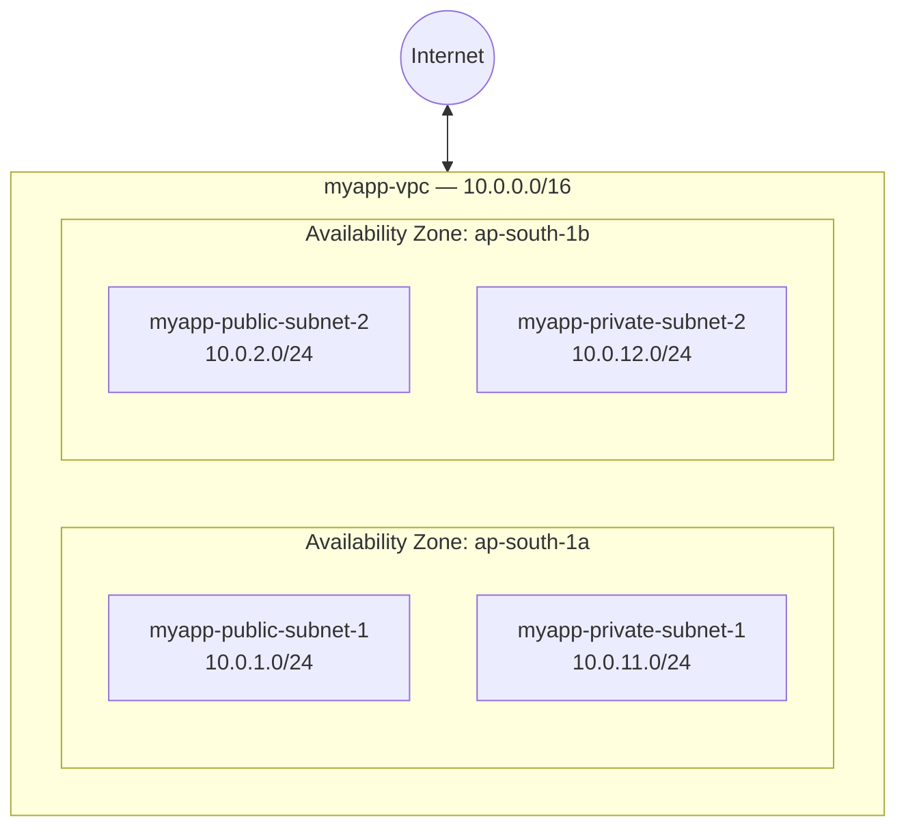

# 01 - Introduction to Amazon VPC

> Goal of this note: understand **what a VPC is, why it exists, and the building blocks** you'll use in every later VPC note. No hands-on yet — Note 04 builds the real thing.

---

## 1. What is a VPC in one line?

**Amazon VPC (Virtual Private Cloud)** is your own **logically isolated, private network inside AWS** — your own slice of the AWS cloud where you control the IP address range, subnets, routing, and network security.

Think of it as renting an entire **private data center network** (switches, routers, firewalls) that you design on a blank canvas, except AWS builds and manages the underlying hardware for you.

- **Virtual** → it's software-defined networking, not physical cables.
- **Private** → by default nothing outside it can reach in, and nothing inside can reach out, unless you explicitly allow it.
- **Cloud** → it lives inside an AWS Region, on AWS-managed infrastructure.

> 🧠 **Mental model:** if an EC2 **instance** is a computer, a **VPC** is the building + floor plan + electrical wiring that computer sits inside. An EC2 instance always launches *into* a VPC subnet, never outside one — at launch time you always pick a subnet, which pins the instance to one VPC and one Availability Zone.

---

## 2. Why does VPC exist? (The problem it solves)

Before VPC existed (pre-2009), all AWS customers' EC2 instances shared one flat, AWS-managed network — you had very little control over IP ranges or isolation from other customers.

**What VPC gives you that a bare "cloud server" doesn't:**
1. **Isolation** — your network is logically separated from every other AWS customer's network, and even from your own other VPCs, unless you deliberately connect them (peering, Transit Gateway, VPN — later notes).
2. **Full IP address control** — you choose the private IP range (CIDR block), not AWS.
3. **Custom topology** — you decide how many subnets, which are internet-facing ("public") and which are not ("private"), and how traffic is routed between them.
4. **Layered security** — Security Groups (instance-level) + Network ACLs (subnet-level) to control traffic (Notes 12–14).
5. **Hybrid connectivity** — VPN and Direct Connect let you extend your on-premises network into AWS as if it were one network (Notes 15–16).

🎯 **Exam tip:** SAA-C03 loves to test "design a secure, multi-tier network" scenarios. The VPC is the container; everything else in this folder (subnets, route tables, gateways, SG/NACL) is a piece you place inside it.

---

## 3. Region-scoped, not global

- A VPC lives in **exactly one Region** (e.g. `ap-south-1` — Mumbai). It cannot span Regions.
- A VPC **can** span multiple **Availability Zones (AZs)** within that Region — in fact, spreading subnets across AZs is exactly how you build high availability: if one AZ (effectively one physical data center cluster) has an outage, subnets and instances in a different AZ keep running.
- VPCs, subnets, route tables, security groups, etc. are all **Region-specific** resources — you won't see your Mumbai VPC if the console is switched to N. Virginia.

---

## 4. Every AWS account gets a default VPC

When you create a new AWS account, AWS automatically creates a **default VPC** in every Region:

| Property | Default VPC value |
|---|---|
| CIDR block | `172.31.0.0/16` |
| Subnets | One public subnet per AZ in the Region (using `/20` blocks, i.e. 4,096 addresses each) |
| Internet Gateway | Already attached |
| Route table | Already routes `0.0.0.0/0` to the Internet Gateway |
| Instances launched with no VPC specified | Land here automatically, get a public IP |

- The default VPC exists so a brand-new user can launch an EC2 instance with **zero networking knowledge** and it "just works" (internet-reachable).
- For anything beyond learning/toy projects, you build your **own custom VPC** (like the `myapp-vpc` we design and build over the rest of this folder) so you control the CIDR range, tiering, and security from scratch.

> ⚠️ You can delete the default VPC. If you do (or need it back), you can recreate a default VPC per Region from the console — but most real projects intentionally build custom VPCs instead of relying on it.

---

## 5. The building blocks of a VPC

Every VPC is a combination of these pieces — each gets its own dedicated note later:

| Building block | What it does | Covered in |
|---|---|---|
| **CIDR block** | The IP address range owned by the VPC (e.g. `10.0.0.0/16`) | Note 02, 03 |
| **Subnets** | Slices of the VPC CIDR, each pinned to one AZ | Note 03, 05 |
| **Route Table** | Rules deciding where traffic from a subnet is sent | Note 06 |
| **Internet Gateway (IGW)** | Lets public subnets reach/be reached from the internet | Note 06 |
| **NAT Gateway** | Lets private subnets reach the internet **outbound only** | Note 09 |
| **Security Group (SG)** | Stateful firewall at the instance/ENI level | Note 13, 14 |
| **Network ACL (NACL)** | Stateless firewall at the subnet level | Note 12, 13 |
| **VPC Peering / Transit Gateway** | Connects VPCs to each other | Note 11, 17 |
| **VPN / Direct Connect** | Connects your VPC to on-premises networks | Note 15, 16 |
| **VPC Endpoints** | Private, non-internet access to AWS services (S3, DynamoDB, etc.) | Note 18 |

> 🧠 **Mental model:** CIDR block = the land you own. Subnets = the plots you divide it into. Route tables = the road signs. IGW/NAT = the gates to the outside world. SG/NACL = the security guards and fences.

---

## 6. The VPC we'll build throughout this folder

To keep every note concrete, we design and build **one running example** end-to-end: `myapp-vpc`, a 2-tier (public/private) architecture in `ap-south-1` (Mumbai), across two AZs (`ap-south-1a`, `ap-south-1b`).

We won't add the Internet Gateway, route tables, or NAT Gateway until Notes 04–09 — for now, just picture the VPC as a fenced piece of land with 4 numbered plots (subnets), 2 in each AZ.

---

## 7. Recap

- A **VPC** = your own isolated, private virtual network inside a single AWS Region.
- It exists to give you **isolation, IP control, custom topology, and layered security** — none of which existed in the pre-2009 flat shared network model.
- A VPC **cannot span Regions**, but **can span multiple AZs**.
- Every account gets a **default VPC** (`172.31.0.0/16`) per Region, pre-wired to the internet, for zero-config learning.
- A VPC is a combination of **CIDR block + subnets + route tables + gateways + SG/NACL**.
- Our worked example: `myapp-vpc` (`10.0.0.0/16`) with 4 subnets across `ap-south-1a`/`ap-south-1b`.
- Next: **Note 02** — CIDR notation and IP addressing rules specific to VPC.

---

### Sources
- [What is Amazon VPC? – AWS docs](https://docs.aws.amazon.com/vpc/latest/userguide/what-is-amazon-vpc.html)
- [Default VPCs – AWS docs](https://docs.aws.amazon.com/vpc/latest/userguide/default-vpc.html)
- [Amazon VPC – Product page](https://aws.amazon.com/vpc/)
