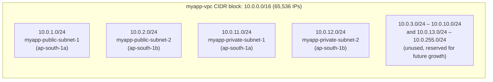

# 02 - VPC CIDR and IP Addressing

> Goal: understand **CIDR notation as it applies to a VPC specifically** — valid VPC CIDR sizes, private vs public IP ranges, and the overlap rule you must never break. Note 03 does the deep subnet math; this note sets up the vocabulary and rules first.

---

## 1. CIDR notation, quick refresher

**CIDR (Classless Inter-Domain Routing)** notation writes an IP range as `<network-address>/<prefix-length>`, e.g. `10.0.0.0/16`.

- The **prefix length** (`/16`) tells you how many of the 32 bits in an IPv4 address are fixed ("network bits"); the rest are free ("host bits").
- Total addresses in the block = `2^(32 - prefix)`.
- A `/16` → `2^(32-16)` = `2^16` = **65,536 addresses**.
- A `/24` → `2^8` = **256 addresses**.
- Smaller prefix number = **bigger** range (fewer fixed bits, more free bits) — this trips up beginners: `/16` is a *bigger* block than `/24`.

We won't do full binary/worked subnetting math here — this note only needs the "bigger block = smaller prefix number" intuition; the detailed arithmetic (splitting a block into equal pieces, sizing a subnet for an exact host count, etc.) comes in the next note.

---

## 2. Valid VPC CIDR sizes: `/16` to `/28`

AWS restricts how big or small a VPC's primary CIDR block can be:

| Limit | Prefix | Total IPs |
|---|---|---|
| **Largest allowed VPC** | `/16` | 65,536 |
| **Smallest allowed VPC** | `/28` | 16 |

- You **cannot** create a VPC bigger than `/16` (e.g. no `/8` VPCs) — AWS caps it to keep routing tables manageable.
- You **cannot** create a VPC smaller than `/28` — you need at least a few usable addresses per subnet, and AWS itself reserves 5 IP addresses in every subnet (the network address, the VPC router address, two addresses reserved for DNS/future use, and the broadcast address), so anything smaller than `/28` leaves almost nothing usable.
- Our worked example VPC, `myapp-vpc`, uses `10.0.0.0/16` — the largest, most flexible choice, giving room for many subnets later (a `/16` is 65,536 addresses, and our four subnets only use a small slice of that, leaving plenty of room for more).

🎯 **Exam tip:** if a question gives you a VPC CIDR outside `/16`–`/28`, it's testing whether you know that range — flag it as invalid immediately.

---

## 3. Private IP ranges (RFC 1918) vs public IP ranges

**RFC 1918** reserves three IPv4 ranges for private networks — addresses that are never routed on the public internet:

| Range | CIDR | Total IPs | Typical use |
|---|---|---|---|
| `10.0.0.0` – `10.255.255.255` | `10.0.0.0/8` | ~16.7M | Large networks/enterprises; AWS's own default-VPC-adjacent examples |
| `172.16.0.0` – `172.31.255.255` | `172.16.0.0/12` | ~1M | Medium networks; **AWS default VPC uses `172.31.0.0/16`, inside this range** |
| `192.168.0.0` – `192.168.255.255` | `192.168.0.0/16` | 65,536 | Small networks; common on home routers |

**Why AWS recommends you use a private range for your VPC CIDR:**
- Private IPs are **free to use however you want** — no one else on the internet owns them, so there's no conflict with real internet hosts.
- Instances in the VPC still get **outbound internet access** via a public IP or Elastic IP mapped on top — this mapping is a form of Network Address Translation (NAT), handled automatically by the Internet Gateway for public instances or by a NAT Gateway for private ones — the private CIDR itself never needs to be "public."
- You *can* technically use a publicly-routable CIDR for a VPC, but AWS strongly discourages it: if that VPC ever connects to the real internet address owner (via VPN/Direct Connect/peering), you get **routing conflicts** — traffic meant for the real public owner might get swallowed by your VPC instead.

Our worked example picks `10.0.0.0/16` — squarely inside the largest RFC 1918 block, giving maximum room for subnets and any future secondary CIDR blocks.

---

## 4. One VPC = one primary CIDR + optional secondary CIDR blocks

- Every VPC starts with exactly **one primary IPv4 CIDR block**, chosen at creation time (`10.0.0.0/16` for `myapp-vpc`).
- You can later **add secondary CIDR blocks** if you run out of address space (e.g. add `10.1.0.0/16` on top of an existing VPC) — up to a total of **5 CIDR blocks per VPC** (soft limit, raisable).
- Secondary CIDRs must still not overlap the primary or each other, and (if using the `100.64.0.0/10` "shared address space" range) there are some AWS-specific restrictions — call this out but don't over-engineer it as a beginner topic.
- Concretely: if `myapp-vpc` (`10.0.0.0/16`) ever ran out of room, you could add a secondary block like `10.1.0.0/16` on top of it, then create brand-new subnets inside that new range — the original `10.0.0.0/16` subnets are untouched.

---

## 5. The overlap rule — never let CIDRs collide

> ⚠️ **A VPC's CIDR block must never overlap with the CIDR of any network you will ever connect it to** — another VPC (peering), your on-premises network (VPN/Direct Connect), or a Transit Gateway-attached VPC.

**Why this matters — a concrete example:**

Suppose `myapp-vpc` uses `10.0.0.0/16`, and later your company builds a second VPC `myapp-vpc-b` also using `10.0.0.0/16`, then tries to **peer** them (a private, direct network connection between the two VPCs).

- Instance `10.0.1.5` exists in **both** VPCs.
- When `myapp-vpc` tries to route traffic to `10.0.1.5` across the peering connection, its own route table has a `local` route for `10.0.0.0/16` that wins first — traffic never even attempts to leave the VPC. The peering connection becomes **partially or fully unusable**.
- AWS will actually **reject creating a peering connection** between two VPCs with fully identical or overlapping CIDRs, and if you attach an overlapping VPC to a Transit Gateway, routes become ambiguous.

The same logic applies to a **Site-to-Site VPN** connection (an encrypted tunnel linking your on-premises network to a VPC): if your on-premises network is `10.0.0.0/16` too, your on-prem servers and your VPC subnets have colliding addresses, and routing simply cannot tell them apart.

**The fix:** plan your CIDR ranges company-wide *before* building VPCs, e.g.:
- `myapp-vpc` → `10.0.0.0/16`
- `myapp-vpc-b` → `10.1.0.0/16` (used for the Peering/Transit Gateway notes — deliberately non-overlapping)
- On-premises network → e.g. `192.168.0.0/16`, kept entirely separate from both

🎯 **Exam tip:** "Two VPCs can't communicate after peering / VPN setup" is one of the most common SAA-C03 troubleshooting scenarios, and the answer is almost always **overlapping CIDR blocks**.

---

## 6. Our worked example, visualized

Each subnet is carved out of the VPC's `/16` block, leaving plenty of address space unused for future tiers (e.g. a database subnet added later). The exact arithmetic behind this layout — how the CIDR ranges are chosen and how much room is left over — is worked out step by step in the next note.

---

## 7. Recap

- CIDR = `network/prefix`; total IPs = `2^(32-prefix)`; smaller prefix number = bigger block.
- A VPC's primary CIDR must be **`/16` (largest) to `/28` (smallest)**.
- Use an **RFC 1918 private range** (`10.0.0.0/8`, `172.16.0.0/12`, `192.168.0.0/16`) — AWS's default VPC itself uses `172.31.0.0/16`.
- A VPC has **one primary CIDR**, plus up to **4 secondary CIDR blocks** if needed.
- **Never let CIDRs overlap** across anything you'll connect (peering, VPN, Transit Gateway, on-prem) — overlap is the #1 cause of "why can't these networks talk to each other" exam questions and real incidents.
- Our example: `myapp-vpc` = `10.0.0.0/16`, home to 4 subnets, with lots of room to spare.
- Next: **Note 03** — the full subnet CIDR math (this is the exam's favorite VPC topic).

---

### Sources
- [VPCs and subnets – AWS docs](https://docs.aws.amazon.com/vpc/latest/userguide/configure-your-vpc.html)
- [IP addressing for your VPCs and subnets – AWS docs](https://docs.aws.amazon.com/vpc/latest/userguide/vpc-ip-addressing.html)
- [RFC 1918 – Address Allocation for Private Internets](https://datatracker.ietf.org/doc/html/rfc1918)
- [Amazon VPC quotas – AWS docs](https://docs.aws.amazon.com/vpc/latest/userguide/amazon-vpc-limits.html)
