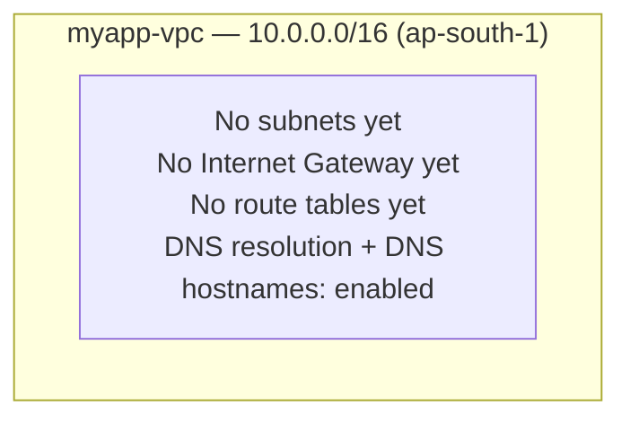

# 04 - Create a VPC (Hands-On)

> Goal: create our real, custom VPC — **`myapp-vpc`** (`10.0.0.0/16`) — using the console's **"VPC only"** path, so you understand every piece before letting AWS automate it. Note 05 adds subnets; Note 06 adds the Internet Gateway and route tables.

---

## 0. Before you start

1. Sign in to the **AWS Management Console**: <https://console.aws.amazon.com>.
2. Top-right Region selector → choose **Asia Pacific (Mumbai) `ap-south-1`** (our worked example's Region — Note 01 §6). VPCs are Region-specific, same as EC2.
3. In the top search bar, type **VPC** → click **VPC** to open the Amazon VPC console.

---

## 1. Two ways to create a VPC: know both, use the manual one

The **Create VPC** wizard offers a **"Resources to create"** choice:

| Option | What it does |
|---|---|
| **VPC only** | Creates just the VPC and its CIDR block. Nothing else. **We use this.** |
| **VPC and more** | A one-click shortcut: also creates subnets (public/private, across your chosen number of AZs), route tables, an Internet Gateway, optionally NAT Gateways per AZ, and optionally an S3 gateway endpoint — all in one step. |

> 🧠 **Why we don't use "VPC and more" here:** it's a fantastic shortcut for real projects once you understand networking, but it hides every step we're trying to learn. We build `myapp-vpc` piece by piece — VPC (this note) → subnets (Note 05) → Internet Gateway + route tables (Note 06) → NAT Gateway (Note 09) — so that when you *do* use "VPC and more" later, you know exactly what it's doing for you under the hood.

🎯 **Exam tip:** SAA-C03 expects you to know both exist. A question describing "quickly stand up a standard public/private VPC" is hinting at **VPC and more**; a question walking through IGW/route table/NAT Gateway individually is testing the manual model we build here.

---

## 2. Open the Create VPC wizard

1. In the left navigation pane, click **Your VPCs**.
2. Click the orange **Create VPC** button (top right).
3. Under **Resources to create**, select **VPC only**.

---

## 3. Name tag

- **Name tag**: type `myapp-vpc`.
- This creates a tag `Name = myapp-vpc` on the VPC, purely for identification — it's not a hostname or anything functional, just how you'll recognize it in lists (exactly like naming an EC2 instance).

---

## 4. IPv4 CIDR block

- Under **IPv4 CIDR block**, keep **IPv4 CIDR manual input** selected.
- Enter: **`10.0.0.0/16`**.
- Leave **IPv6 CIDR block** as **No IPv6 CIDR block** — we're keeping this example IPv4-only (Note 03 §8 covers IPv6 sizing if you want to experiment later).

> ⚠️ Double-check the CIDR before clicking Create — **you cannot change a VPC's primary CIDR block after creation** (you can only add secondary CIDR blocks, Note 02 §4, or delete and recreate the VPC).

---

## 5. Tenancy

- Leave **Tenancy** = **Default** (instances launched into this VPC use whatever tenancy *they* specify at launch — shared hardware unless you pay for Dedicated). We don't need Dedicated tenancy for this learning project.

---

## 6. Tags (optional, but good practice)

- Click **Add new tag** if you want extra metadata, e.g. `Project = myapp`, `Environment = learning`. Not required, but real-world accounts use tags heavily for cost tracking — worth building the habit now.

---

## 7. Create it

- Click **Create VPC**.
- You'll land on the new VPC's detail page. Confirm:
  - **VPC ID**: `vpc-xxxxxxxxxxxxxxxxx` (auto-generated, you'll reference this a lot).
  - **State**: `Available`
  - **IPv4 CIDR**: `10.0.0.0/16`

---

## 8. DNS settings — enable both (usually already on)

Every VPC has two DNS attributes. For a normal VPC (not the default one) these can sometimes be off, so verify:

1. With `myapp-vpc` selected in **Your VPCs**, click **Actions → Edit VPC settings**.
2. Confirm/enable both:
   - **Enable DNS resolution** — lets instances use the Amazon-provided DNS server (the `.2` reserved address in each subnet, Note 03 §2) to resolve domain names.
   - **Enable DNS hostnames** — assigns instances a resolvable DNS hostname alongside their IP.
3. Click **Save changes**.

> 🧠 Both should be **enabled** for almost every real use case — e.g. instances need DNS resolution to reach the internet by domain name, and DNS hostnames are needed for things like RDS endpoint resolution and some AWS service integrations. The console's "VPC and more" path enables both automatically; going the "VPC only" route means you should double check them yourself.

---

## 9. End state — what we've built so far

Just a fenced-off, empty piece of private address space — no subnets, no way in or out yet. That's intentional; we add each piece one note at a time.

---

## 10. ⚠️ Clean up to avoid charges

Good news: **a VPC by itself costs nothing.** You are not charged for:
- The VPC or its CIDR block
- Subnets, route tables, Security Groups, or Network ACLs (once we create them)

You only start paying once you add certain resources on top — most notably:
- **NAT Gateways** (hourly + data processing charges — Note 09)
- **Elastic IPs** left unattached
- **Site-to-Site VPN connections** and **Transit Gateway attachments** (Notes 15, 17)
- **VPC Interface Endpoints** (Note 18)

So at this stage, there's nothing to delete — feel free to leave `myapp-vpc` sitting empty while you continue to Note 05. If you ever want to tear it down entirely later: **Your VPCs → select `myapp-vpc` → Actions → Delete VPC** (AWS will block deletion until all dependent resources — subnets, gateways, etc. — are removed first).

---

## 11. Common beginner problems

| Problem | Likely cause / fix |
|---|---|
| "Create VPC" button greyed out / CIDR rejected | CIDR outside the `/16`–`/28` valid range (Note 02 §2), or malformed (e.g. missing `/prefix`). |
| Can't find `myapp-vpc` afterward | Wrong **Region** selected (top-right) — VPCs don't show across Regions. |
| Accidentally created it with "VPC and more" | Delete it (after removing dependent resources) and recreate with "VPC only", or just proceed — the *result* is the same VPC, you'll just have subnets/IGW/route tables already made for you (skip ahead, or delete them to practice manually). |
| DNS hostnames/resolution greyed out or seem to have no effect | Make sure you're editing settings on the VPC itself (**Your VPCs → Actions → Edit VPC settings**), not on a subnet or instance. |

---

## 12. Recap

- Two creation paths: **VPC only** (manual, what we used) vs **VPC and more** (automated shortcut for subnets/IGW/route tables/NAT).
- Created **`myapp-vpc`**, CIDR **`10.0.0.0/16`**, Region **ap-south-1**, Tenancy **Default**.
- The VPC's **primary CIDR cannot be changed later** — choose carefully up front.
- Enabled **DNS resolution** and **DNS hostnames**.
- An empty VPC costs **nothing** — charges start with NAT Gateways, EIPs, VPN, Transit Gateway, and Endpoints.
- Next: **Note 05** — create the 4 `myapp` subnets inside this VPC.

---

### Sources
- [Create a VPC – AWS docs](https://docs.aws.amazon.com/vpc/latest/userguide/create-vpc.html)
- [VPC DNS attributes – AWS docs](https://docs.aws.amazon.com/vpc/latest/userguide/vpc-dns.html)
- [VPC CIDR blocks – AWS docs](https://docs.aws.amazon.com/vpc/latest/userguide/vpc-cidr-blocks.html)
