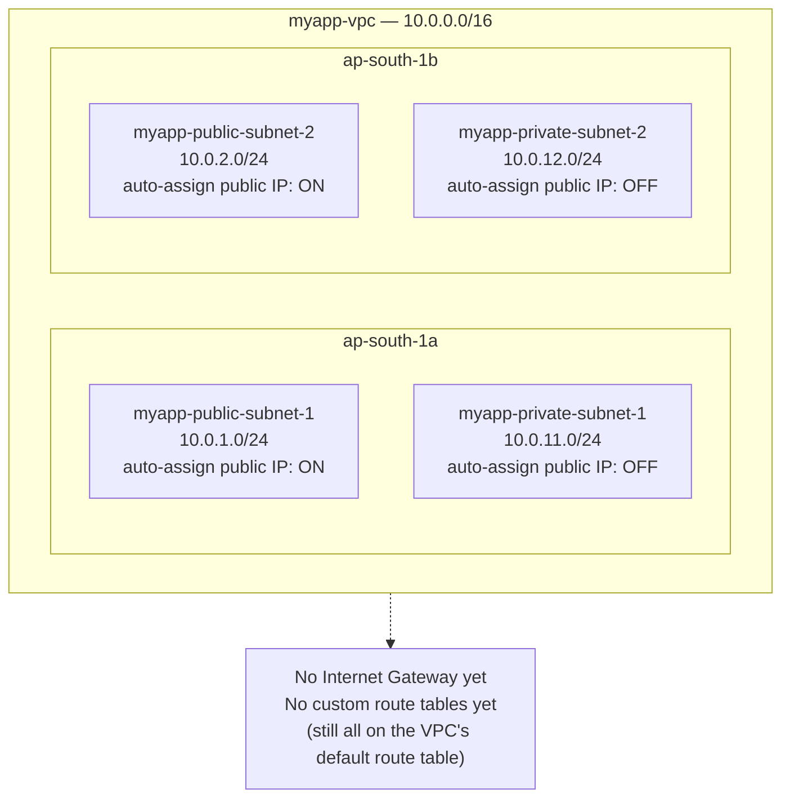

# 05 - Create Subnets (Hands-On)

> Goal: create the **4 `myapp` subnets** inside `myapp-vpc` (from Note 04), spread across two AZs. We assign CIDRs but there's **no internet access wired up yet** — that's Note 06 (Internet Gateway + route tables). This note also explains the "one subnet = one AZ" rule and the auto-assign public IP setting.

---

## 0. Before you start

- `myapp-vpc` (`10.0.0.0/16`) must already exist (Note 04).
- Region: **Asia Pacific (Mumbai) `ap-south-1`**, using AZs **`ap-south-1a`** and **`ap-south-1b`**.
- Our target layout (from Notes 01–03):

| Subnet name | CIDR | AZ | Type |
|---|---|---|---|
| `myapp-public-subnet-1` | `10.0.1.0/24` | ap-south-1a | Public |
| `myapp-public-subnet-2` | `10.0.2.0/24` | ap-south-1b | Public |
| `myapp-private-subnet-1` | `10.0.11.0/24` | ap-south-1a | Private |
| `myapp-private-subnet-2` | `10.0.12.0/24` | ap-south-1b | Private |

---

## 1. The "one subnet = one AZ" rule

> ⚠️ **A subnet lives entirely inside exactly one Availability Zone.** It cannot span multiple AZs. (Contrast: the VPC itself spans the whole Region.)

This is why our design has **2 public + 2 private subnets** instead of 1 of each — to get **high availability**, you must duplicate each tier into a second AZ, because if `ap-south-1a` has an outage, only the subnets physically in that AZ are affected. A subnet in `ap-south-1b` keeps running.

🎯 **Exam tip:** "Deploy across multiple AZs for high availability" always means **create a subnet per AZ, per tier** — you can't fake it with one subnet. This same rule reappears for NAT Gateways (Note 09 — a NAT GW is AZ-scoped too).

---

## 2. Open the Create Subnet wizard

1. VPC console → left navigation pane → **Subnets**.
2. Click **Create subnet**.
3. Under **VPC ID**, choose `myapp-vpc` from the dropdown.

You can actually create **multiple subnets in one screen** here (click **Add new subnet** to add rows) — we'll do all 4 in one pass.

---

## 3. Subnet 1 — `myapp-public-subnet-1`

- **Subnet name**: `myapp-public-subnet-1`
- **Availability Zone**: `ap-south-1a` (don't leave "No preference" — we need to pin it deliberately for our design)
- **IPv4 CIDR block**: select **Manual input**, enter `10.0.1.0/24`

---

## 4. Subnet 2 — `myapp-public-subnet-2`

Click **Add new subnet**, then:
- **Subnet name**: `myapp-public-subnet-2`
- **Availability Zone**: `ap-south-1b`
- **IPv4 CIDR block**: `10.0.2.0/24`

---

## 5. Subnet 3 — `myapp-private-subnet-1`

Click **Add new subnet** again:
- **Subnet name**: `myapp-private-subnet-1`
- **Availability Zone**: `ap-south-1a`
- **IPv4 CIDR block**: `10.0.11.0/24`

---

## 6. Subnet 4 — `myapp-private-subnet-2`

Click **Add new subnet** one more time:
- **Subnet name**: `myapp-private-subnet-2`
- **Availability Zone**: `ap-south-1b`
- **IPv4 CIDR block**: `10.0.12.0/24`

Leave **IPv6 CIDR block** blank for all 4 (this VPC is IPv4-only, Note 04 §4). Click **Create subnet** to create all 4 at once.

---

## 7. Auto-assign public IPv4 address — set it, but understand its limits

By default, **every new (non-default) subnet has "auto-assign public IPv4 address" turned OFF**. For our two public subnets, turn it ON:

1. **Subnets** list → select `myapp-public-subnet-1` → **Actions → Edit subnet settings**.
2. Check **Enable auto-assign public IPv4 address** → **Save**.
3. Repeat for `myapp-public-subnet-2`.
4. Leave it **unchecked** for both `myapp-private-subnet-1` and `myapp-private-subnet-2`.

> ⚠️ **Critical concept: this checkbox alone does NOT make a subnet "public."** All it does is give every instance launched in that subnet a public IP address automatically. Whether that subnet can actually **reach the internet** is decided entirely by its **route table** — specifically, whether that route table has a route to an **Internet Gateway** (`0.0.0.0/0 → igw-xxxx`). A subnet with auto-assign-public-IP enabled but no IGW route is really still a private subnet — the instance would have a public IP that goes nowhere. We wire up the actual routing in **Note 06**, which is what truly flips these subnets from "public-in-name" to "public-in-practice."

🎯 **Exam tip:** this exact trap shows up on SAA-C03 — "an instance has a public IP but still can't be reached from the internet." The answer is almost always a **missing/incorrect route table entry to the Internet Gateway**, not the auto-assign setting.

---

## 8. Verify

Back in **Subnets**, you should see all 4, each showing its correct **VPC**, **AZ**, and **CIDR**. Confirm:
- `myapp-public-subnet-1` / `10.0.1.0/24` / ap-south-1a / Auto-assign public IPv4 = **Yes**
- `myapp-public-subnet-2` / `10.0.2.0/24` / ap-south-1b / Auto-assign public IPv4 = **Yes**
- `myapp-private-subnet-1` / `10.0.11.0/24` / ap-south-1a / Auto-assign public IPv4 = **No**
- `myapp-private-subnet-2` / `10.0.12.0/24` / ap-south-1b / Auto-assign public IPv4 = **No**

---

## 9. End state — what we've built so far

All 4 subnets exist and use the default (main) route table for now — none of them can reach the internet yet, regardless of the auto-assign setting. That changes in Note 06.

---

## 10. ⚠️ Clean up to avoid charges

Subnets themselves are **free** — no charge for creating or holding them, same as the VPC in Note 04. Nothing to clean up at this stage. (Charges start once we add a NAT Gateway in Note 09.)

---

## 11. Common beginner mistakes

| Mistake | Symptom / consequence | Fix |
|---|---|---|
| Two subnets given overlapping CIDRs (e.g. both `10.0.1.0/24`) | Console rejects the second subnet — "CIDR conflicts with another subnet" | Double-check third-octet values before creating (Note 03 §4 math) |
| Subnet CIDR not inside the VPC's CIDR range | Console rejects it immediately | Subnet CIDR must be a subset of `10.0.0.0/16` |
| Left Availability Zone as "No preference" for all 4 | AWS might place two subnets you intended to separate into the **same AZ**, breaking your HA design | Explicitly pick `ap-south-1a` / `ap-south-1b` per the design table |
| Forgot to enable auto-assign public IP on the public subnets | Instances launched later get **no public IP** by default, even in a "public" subnet | Edit subnet settings → enable it, or set it explicitly at instance launch |
| Assumed enabling auto-assign public IP makes the subnet internet-reachable | Instance gets a public IP but still has no internet access | Remember: routing (IGW + route table, Note 06) is what actually makes a subnet public — the checkbox is just a convenience for IP assignment |
| Mixed up public/private subnet names when picking a subnet at EC2 launch time later | Web server accidentally lands in a private subnet (unreachable) or a DB accidentally lands in a public one (security risk) | Keep the naming/tagging consistent (`public-*` vs `private-*`) and double-check at launch |

---

## 12. Recap

- **One subnet = one AZ**, always — never spans AZs. Two AZs × two tiers = **4 subnets** for our design.
- Created `myapp-public-subnet-1` (`10.0.1.0/24`, 1a), `myapp-public-subnet-2` (`10.0.2.0/24`, 1b), `myapp-private-subnet-1` (`10.0.11.0/24`, 1a), `myapp-private-subnet-2` (`10.0.12.0/24`, 1b).
- Enabled **auto-assign public IPv4** on the two public subnets only.
- **Auto-assign public IP ≠ "public subnet."** Only the **route table's path to an Internet Gateway** determines whether a subnet is truly public — coming next.
- Subnets are free; no cleanup needed yet.
- Next: **Note 06** — create the Internet Gateway and route tables that actually make the public subnets public.

---

### Sources
- [Create a subnet – AWS docs](https://docs.aws.amazon.com/vpc/latest/userguide/create-subnets.html)
- [Subnet CIDR blocks – AWS docs](https://docs.aws.amazon.com/vpc/latest/userguide/subnet-sizing.html)
- [Modify the IP addressing attributes of your subnet – AWS docs](https://docs.aws.amazon.com/vpc/latest/userguide/subnet-public-ip.html)
