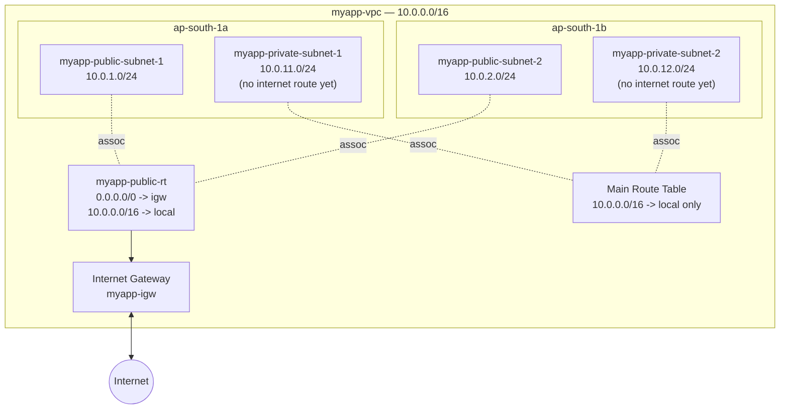

# 06 - Internet Gateway and Route Tables

> Goal: understand the two pieces that actually give a subnet internet access — the **Internet Gateway (IGW)** and **Route Tables** — and the single rule that decides whether a subnet is "public" or "private". Notes 01-05 built `myapp-vpc` with 4 subnets but **no internet access yet**. This note adds it for the two public subnets. Note 09 does the same for the private subnets (via NAT Gateway).

---

## 1. What is an Internet Gateway (IGW)?

An **Internet Gateway** is a **VPC component** that allows resources inside your VPC to communicate with the internet.

Key facts (memorize these):

- It is **horizontally scaled, redundant, and highly available** by design — AWS manages it, there's nothing to patch or scale yourself.
- It is **one IGW per VPC**, and **one VPC per IGW** — a 1:1 relationship. You cannot attach the same IGW to two VPCs.
- It must be **created, then attached** to a VPC as two separate steps (you can create it "floating" and attach later, or detach and reuse it elsewhere).
- For instances with a **public IPv4 address**, the IGW performs **1:1 Network Address Translation (NAT)** — translating the instance's private IP to/from its public IP as traffic crosses the gateway. (This is a different, simpler kind of NAT than the NAT Gateway used later in this build for private subnets: the IGW's NAT is two-way for instances that already have a public IP, while a NAT Gateway provides outbound-only access for instances that don't.)
- An IGW is **free** — you don't pay for the gateway itself, only for standard data transfer.

> 🧠 **Mental model:** the IGW is the **front door of the whole VPC** to the internet. But having a front door on the building doesn't mean every room (subnet) has a hallway leading to it — that's what the route table decides.

---

## 2. What is a Route Table?

A **route table** is a set of rules ("routes") that determine **where network traffic from a subnet is directed**.

Each route has two parts:

| Part | Meaning | Example |
|---|---|---|
| **Destination** | The CIDR block the traffic is going to | `10.0.0.0/16`, `0.0.0.0/0` |
| **Target** | Where to send traffic matching that destination | `local`, `igw-xxxx`, `nat-xxxx` |

AWS uses **longest prefix match** — the most specific matching route wins if several routes could apply.

### Main route table vs custom route table

- Every VPC gets a **main route table** automatically at creation. It contains only the `local` route.
- Any subnet **not explicitly associated** with another route table uses the **main route table** by default.
- You can (and for a real build, should) create **custom route tables** and associate specific subnets with them — this is exactly what we do below.

> ⚠️ **Exam trap:** if you forget to associate a subnet with your custom route table, it silently falls back to the **main route table**. If someone edited the main table's routes, this can accidentally expose or isolate a subnet. Best practice: leave the main route table as default (`local` only) and use custom tables for everything else.

### The `local` route

Every route table — main or custom — automatically has a route like `10.0.0.0/16 → local`. This lets **all subnets inside the VPC talk to each other** over private IPs. You cannot delete or edit this route.

---

## 3. What actually makes a subnet "public" vs "private"?

This is the single most tested concept in this note:

> **A subnet is "public" only because its associated route table has a route sending `0.0.0.0/0` (or a subset) to an Internet Gateway.**

There is no checkbox called "make this subnet public" — subnet "type" is purely a **consequence of routing**:

| Subnet type | Route table contains | Result |
|---|---|---|
| **Public** | `0.0.0.0/0 → igw-xxxx` | Instances with a public IP can reach/be reached from the internet |
| **Private** | No route to an IGW (only `local`, or a route to a NAT Gateway) | No direct inbound/outbound internet path |

A public subnet also needs the instance itself to have a **public IPv4 address or Elastic IP** — the route table alone doesn't put a public IP on an instance, it just gives it a path if it has one.

---

## 4. Hands-on: attach an IGW and build the public route table

We continue building `myapp-vpc` (`10.0.0.0/16`, region `ap-south-1`) from Note 05.

### Step 1 — Create the Internet Gateway

1. VPC console → left nav → **Internet Gateways** → **Create internet gateway**.
2. **Name tag**: `myapp-igw`.
3. Click **Create internet gateway**. It's created in state `Detached`.

### Step 2 — Attach it to `myapp-vpc`

1. Select `myapp-igw` → **Actions** → **Attach to VPC**.
2. Choose `myapp-vpc` → **Attach internet gateway**.
3. State changes to `Attached`.

### Step 3 — Create the public route table

1. Left nav → **Route Tables** → **Create route table**.
2. **Name**: `myapp-public-rt`.
3. **VPC**: `myapp-vpc`.
4. Create. It starts with only the default `local` route.

### Step 4 — Add the internet route

1. Select `myapp-public-rt` → **Routes** tab → **Edit routes** → **Add route**.
2. **Destination**: `0.0.0.0/0`.
3. **Target**: **Internet Gateway** → choose `myapp-igw`.
4. **Save changes.**

`myapp-public-rt` now has:

| Destination | Target |
|---|---|
| `10.0.0.0/16` | `local` |
| `0.0.0.0/0` | `myapp-igw` |

### Step 5 — Associate the public subnets

1. Still on `myapp-public-rt` → **Subnet associations** tab → **Edit subnet associations**.
2. Check **`myapp-public-subnet-1`** and **`myapp-public-subnet-2`**.
3. **Save associations.**

Both public subnets now route internet-bound traffic through `myapp-igw`. The two private subnets remain on the **main route table** (`local` only) — still fully isolated from the internet, exactly as intended for now.

---

## 5. Diagram: current state of `myapp-vpc`

---

## 6. Exam tips

🎯 **Exam tip:** "A subnet is public because it has a route to an IGW" is one of the most frequently tested facts in the whole VPC section — memorize it word for word.

🎯 **Exam tip:** IGW is **1 per VPC**, horizontally scaled/redundant by AWS — no HA design decision needed on your part (contrast with a NAT Gateway, which **is** AZ-scoped and needs one per AZ for HA).

🎯 **Exam tip:** a subnet not explicitly associated with any route table uses the **main route table** automatically — a classic "why can't my new subnet reach the internet" scenario.

---

## 7. Recap

- **IGW** = the VPC's connection to the internet; one per VPC, AWS-managed, free, does 1:1 NAT for public IPs.
- **Route table** = rules that steer subnet traffic; every VPC gets a **main route table** with just the `local` route.
- A subnet is **public** solely because its route table sends `0.0.0.0/0` to an IGW — nothing else defines "public."
- We built `myapp-igw`, attached it, created `myapp-public-rt` with `0.0.0.0/0 → igw`, and associated both public subnets.
- The two private subnets are still fully isolated (main route table, `local` only).
- Next: Note 07 covers the **2-tier/3-tier architecture pattern** this build follows, then Note 08 launches real EC2 instances into these subnets.

---

### Sources
- [Enable internet access for a VPC using an internet gateway – AWS docs](https://docs.aws.amazon.com/vpc/latest/userguide/VPC_Internet_Gateway.html)
- [Add internet access to a subnet – AWS docs](https://docs.aws.amazon.com/vpc/latest/userguide/working-with-igw.html)
- [Route table concepts – AWS docs](https://docs.aws.amazon.com/vpc/latest/userguide/RouteTables.html)
- [Configure route tables – AWS docs](https://docs.aws.amazon.com/vpc/latest/userguide/VPC_Route_Tables.html)
