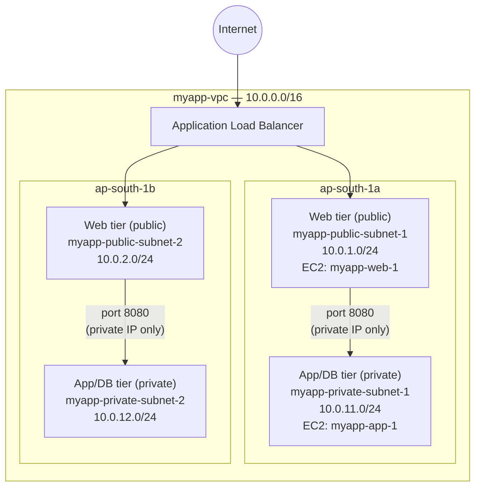
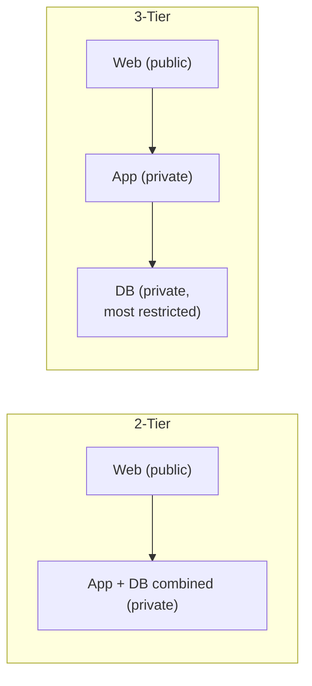

# 07 - VPC Two-Tier (and Three-Tier) Architecture

> Goal: a **conceptual** note (no hands-on) explaining *why* we split a VPC into public and private subnets the way Notes 01-06 did, and how that idea extends to a 3-tier design. This is the "why" behind the build before we launch real EC2 instances in Note 08.

---

## 1. The problem: not everything should be internet-facing

Not every server in your application needs to be reachable from the internet — in fact, **most shouldn't be**. Your web servers need to accept public traffic, but your application servers and databases only need to talk to your web servers (and to each other).

Putting a database directly on the internet is a classic beginner mistake: it maximizes the attack surface for zero benefit, since the database only ever needs to be reached by your own app tier.

> 🧠 **Mental model:** think of a VPC like an office building. The **reception desk** (web tier) is open to visitors. The **server room** (app/db tier) is behind a locked door that only staff (the web tier) can open — visitors never walk in directly.

This principle — giving each component only the network access it actually needs — is called **defense in depth**: even if one layer is compromised, the attacker doesn't automatically get to the next layer.

---

## 2. Two-tier architecture

A **two-tier** design splits the VPC into:

| Tier | Subnet type | Holds | Reachable from internet? |
|---|---|---|---|
| **Web/presentation tier** | Public subnets | Web servers, load balancers | Yes (ports 80/443) |
| **App/data tier** | Private subnets | Application logic + database combined | No — only from the web tier |

This is exactly what `myapp-vpc` has built so far (Notes 01-06):

- `myapp-public-subnet-1` / `myapp-public-subnet-2` — web tier.
- `myapp-private-subnet-1` / `myapp-private-subnet-2` — combined app+data tier.

Two-tier is simpler to operate and is fine for small applications where the app logic and database don't need to scale or be secured independently.

---

## 3. Three-tier architecture

A **three-tier** design splits the private side further into its own **app tier** and **database tier**, each in its own subnets:

| Tier | Subnet type | Holds | Reachable from |
|---|---|---|---|
| **Web tier** | Public subnets | Web servers / ALB | Internet (80/443) |
| **App tier** | Private subnets | Application servers, business logic | Web tier only (e.g. port 8080) |
| **DB tier** | Private subnets (often with no route to NAT either) | RDS/database instances | App tier only (e.g. port 3306) |

Applied to the `myapp` example, this would add a third pair of subnets:

- `myapp-db-subnet-1` = `10.0.21.0/24` (ap-south-1a)
- `myapp-db-subnet-2` = `10.0.22.0/24` (ap-south-1b)

Three-tier gives you finer-grained security (a compromised app server still can't be reached directly from the internet, and the DB tier can be locked down even further) and lets each tier scale independently — e.g. more app servers without touching the database layer.

---

## 4. High availability: every tier spans 2+ AZs

A subnet lives in exactly **one Availability Zone** and can never span two. If all your web servers sat in a single subnet/AZ, an AZ outage takes your whole site down. So **every tier is duplicated across at least two AZs**:

- Web tier: `myapp-public-subnet-1` (AZ-a) + `myapp-public-subnet-2` (AZ-b).
- App/DB tier(s): same pattern, one subnet pair per AZ.

An **Auto Scaling Group (ASG)** launches instances across both public subnets, and an **Application Load Balancer (ALB)** distributes traffic across both AZs — if `ap-south-1a` has an outage, `ap-south-1b` keeps serving traffic. This is why ASGs and ALBs are always configured to span **multiple subnets in multiple AZs**, never a single subnet.

---

## 5. Diagram: myapp two-tier layout across 2 AZs

### 2-tier vs 3-tier at a glance

---

## 6. Exam tips

🎯 **Exam tip:** the exam frequently describes a scenario ("a database should not be directly accessible from the internet") and expects you to identify the fix as **placing it in a private subnet**, not a security-group-only fix — subnet placement + routing is the first line of defense.

🎯 **Exam tip:** "Highly available" architecture questions almost always hinge on **spreading resources across at least 2 AZs** — for ALBs this means enabling the ALB across 2+ subnets in 2+ AZs, and for ASGs it means the launch template's subnets spanning multiple AZs. A single-AZ deployment is a classic wrong answer on HA questions.

🎯 **Exam tip:** defense in depth in a VPC = **public subnet for internet-facing tiers only** + **private subnets for everything else** + **security groups scoped tier-to-tier** (the next hands-on note configures exactly this, with a web-tier security group that only allows the app tier's security group in on the app port, not the whole internet).

---

## 7. Recap

- **2-tier** = public web tier + private app/data tier (combined). This is what `myapp-vpc` currently has.
- **3-tier** = public web tier + private app tier + private DB tier, each its own subnet pair.
- Private subnets exist for **defense in depth** — nothing that doesn't need to be internet-facing should be.
- **High availability** = every tier duplicated across 2+ AZs; ALBs and ASGs always span multiple subnets/AZs.
- Next: Note 08 launches real `myapp-web-1` and `myapp-app-1` EC2 instances into this layout and proves the private instance has no internet path yet.

---

### Sources
- [What is Amazon VPC? – AWS docs](https://docs.aws.amazon.com/vpc/latest/userguide/what-is-amazon-vpc.html)
- [Application Load Balancers – AWS docs](https://docs.aws.amazon.com/elasticloadbalancing/latest/application/introduction.html)
- [Amazon EC2 Auto Scaling – What is Amazon EC2 Auto Scaling – AWS docs](https://docs.aws.amazon.com/autoscaling/ec2/userguide/what-is-amazon-ec2-auto-scaling.html)
