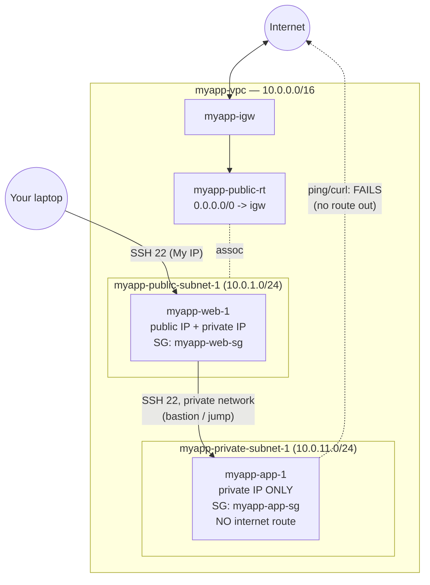

# 08 - Public and Private Subnets (Hands-On)

> Goal: launch **two real EC2 instances** into the `myapp-vpc` layout — one in a public subnet, one in a private subnet — and prove the difference between them with your own eyes. We also show how to reach the private instance from the public one (the "bastion/jump host" pattern) and its modern replacement, **Session Manager**. The private instance will have **no internet route yet** — that's fixed in Note 09.

---

## 0. Before you start

You should already have, from Notes 04-06:
- `myapp-vpc` (`10.0.0.0/16`)
- 4 subnets (`myapp-public-subnet-1/2`, `myapp-private-subnet-1/2`)
- `myapp-igw` attached, `myapp-public-rt` associated with both public subnets

---

## 1. Create the security groups first

### `myapp-web-sg` (for the public instance)

EC2 console → **Security Groups** → **Create security group**.

- **Name**: `myapp-web-sg`.
- **VPC**: `myapp-vpc`.
- **Inbound rules**:

| Type | Port | Source |
|---|---|---|
| HTTP | 80 | `0.0.0.0/0` |
| HTTPS | 443 | `0.0.0.0/0` |
| SSH | 22 | **My IP** |

- **Outbound**: leave default (all traffic allowed).

### `myapp-app-sg` (for the private instance)

Create another security group:

- **Name**: `myapp-app-sg`.
- **VPC**: `myapp-vpc`.
- **Inbound rules**:

| Type | Port | Source |
|---|---|---|
| SSH (demo jump access) | 22 | **`myapp-web-sg`** (select the security group itself, not a CIDR) |
| Custom TCP (app port, demo) | 8080 | `myapp-web-sg` |

> 🧠 Referencing a **security group as the source** (instead of a CIDR) means "allow traffic from anything currently using `myapp-web-sg`" — so if you add more web instances later, they're automatically allowed in without editing this rule. This is the standard tier-to-tier security pattern (web tier's SG → app tier's SG → db tier's SG), where each tier only opens its firewall to the specific tier in front of it, never to the whole internet or the whole VPC.

- **Outbound**: leave default.

---

## 2. Launch `myapp-web-1` (public instance)

1. EC2 console → **Launch instance**.
2. **Name**: `myapp-web-1`.
3. **AMI**: Amazon Linux (latest).
4. **Instance type**: `t3.micro` (Free Tier eligible).
5. **Key pair**: use or create one, e.g. `myapp-key`.
6. **Network settings** → **Edit**:
   - **VPC**: `myapp-vpc`.
   - **Subnet**: `myapp-public-subnet-1`.
   - **Auto-assign public IP**: **Enable**.
   - **Firewall**: select existing security group → `myapp-web-sg`.
7. Launch.

Once running, note its **Public IPv4 address** — you'll use it to SSH in.

---

## 3. Launch `myapp-app-1` (private instance)

1. **Launch instance** again.
2. **Name**: `myapp-app-1`.
3. Same AMI, same instance type, same key pair (`myapp-key`).
4. **Network settings** → **Edit**:
   - **VPC**: `myapp-vpc`.
   - **Subnet**: `myapp-private-subnet-1`.
   - **Auto-assign public IP**: **Disable** (there's no point — and this subnet has no IGW route anyway).
   - **Firewall**: select existing security group → `myapp-app-sg`.
5. Launch.

`myapp-app-1` gets only a **private IP** (e.g. `10.0.11.x`) — no public IP, no route to the internet.

---

## 4. Reach the private instance via the public one (bastion/jump pattern)

Since `myapp-app-1` has no public IP, you cannot SSH into it directly from your laptop. The classic pattern is to **jump through** the public instance:

1. Copy your private key (`myapp-key.pem`) onto `myapp-web-1` (or use SSH agent forwarding so the key never leaves your laptop — preferred).
2. SSH into `myapp-web-1` using its public IP:
   ```
   ssh -A -i myapp-key.pem ec2-user@<myapp-web-1-public-ip>
   ```
   (`-A` enables agent forwarding.)
3. From inside `myapp-web-1`, SSH to `myapp-app-1`'s **private IP**:
   ```
   ssh ec2-user@10.0.11.x
   ```
4. Because `myapp-app-sg` allows port 22 **from `myapp-web-sg`**, and both instances sit in the same VPC (reachable via the `local` route), this connection succeeds — over the private network, never touching the internet.

`myapp-web-1` acting as the hop here is called a **bastion host** (or "jump box").

> ⚠️ **A dedicated bastion host is still a server you must patch, secure, and pay for 24/7.** The modern, more secure alternative is **AWS Systems Manager Session Manager**: it lets you open a shell to *any* instance (public or private) with no open inbound ports, no bastion host, and no SSH key management at all — as long as the instance has the SSM Agent installed and an IAM role with the `AmazonSSMManagedInstanceCore` policy, and can reach the SSM service endpoints (either via the internet path through an IGW/NAT Gateway, or privately through a VPC endpoint — a private, non-internet connection straight to an AWS service). For new builds, prefer Session Manager over a bastion host.

---

## 5. Verify: the private instance has NO internet access yet

From inside `myapp-app-1` (having jumped in via SSH), try:

```
ping -c 2 8.8.8.8
curl -m 5 https://amazon.com
```

Both should **time out / fail**. This is expected: `myapp-private-subnet-1` is still on the **main route table** (which only has the automatic `local` route for in-VPC traffic) — there is no route out to the internet, so even simple `yum update` commands would fail right now.

This is exactly why Note 09 exists: we add a **NAT Gateway** so private instances get **outbound-only** internet access (for patches/updates) while remaining unreachable from the internet inbound.

---

## 6. Diagram: current state



---

## 7. Troubleshooting

| Problem | Likely cause / fix |
|---|---|
| Can't SSH into `myapp-web-1` | Your IP changed since the SG rule was created — edit `myapp-web-sg` inbound rule, set source to **My IP** again. |
| Can SSH into `myapp-web-1` but not `myapp-app-1` from there | Check `myapp-app-sg` inbound allows port 22 **from `myapp-web-sg`** (not from a CIDR). Also confirm you used agent forwarding (`-A`) or copied the key. |
| `myapp-app-1` has no public IP and that's "wrong" | That's correct — private subnet instances should not have public IPs. |
| `ping`/`curl` from `myapp-app-1` hangs then fails | Expected — no internet route yet. Fixed in Note 09. |
| Instance launched into the wrong subnet | Check the **Subnet** dropdown during launch — it's easy to leave it on the default VPC's subnet by mistake. |

---

## 8. ⚠️ Clean up to avoid charges

If you're not continuing straight to Note 09, **terminate or stop both instances**:
1. EC2 → **Instances** → select `myapp-web-1` and `myapp-app-1`.
2. **Instance state** → **Terminate instance** (if done for now) or **Stop instance** (if resuming soon).

Running `t3.micro` instances are Free-Tier eligible for the first 12 months, but only up to the monthly hour limit — leaving test instances running indefinitely is a common source of small surprise charges.

---

## 9. Exam tips

🎯 **Exam tip:** "How do you securely access an EC2 instance in a private subnet without a bastion host?" → **AWS Systems Manager Session Manager** is the textbook answer on SAA-C03.

🎯 **Exam tip:** referencing a **security group as a rule's source** (instead of a CIDR block) is the standard, exam-favored way to allow tier-to-tier traffic (web SG → app SG → db SG) without hardcoding IPs.

---

## 10. Recap

- Launched `myapp-web-1` (public subnet, public IP, `myapp-web-sg`) and `myapp-app-1` (private subnet, no public IP, `myapp-app-sg`).
- `myapp-app-sg` allows traffic **only from `myapp-web-sg`**, not from the internet.
- Reached the private instance via SSH agent forwarding through the public one — the **bastion/jump host** pattern; **Session Manager** is the modern, keyless, portless alternative.
- Confirmed the private instance has **no internet route** — by design, until Note 09.
- Next: Note 09 adds a **NAT Gateway** so private instances get outbound-only internet access.

---

### Sources
- [Connect to your Linux instance using SSH – AWS docs](https://docs.aws.amazon.com/AWSEC2/latest/UserGuide/AccessingInstancesLinux.html)
- [AWS Systems Manager Session Manager – AWS docs](https://docs.aws.amazon.com/systems-manager/latest/userguide/session-manager.html)
- [Connect to an Amazon EC2 instance by using Session Manager – AWS Prescriptive Guidance](https://docs.aws.amazon.com/prescriptive-guidance/latest/patterns/connect-to-an-amazon-ec2-instance-by-using-session-manager.html)
- [Security groups for your VPC – AWS docs](https://docs.aws.amazon.com/vpc/latest/userguide/vpc-security-groups.html)
