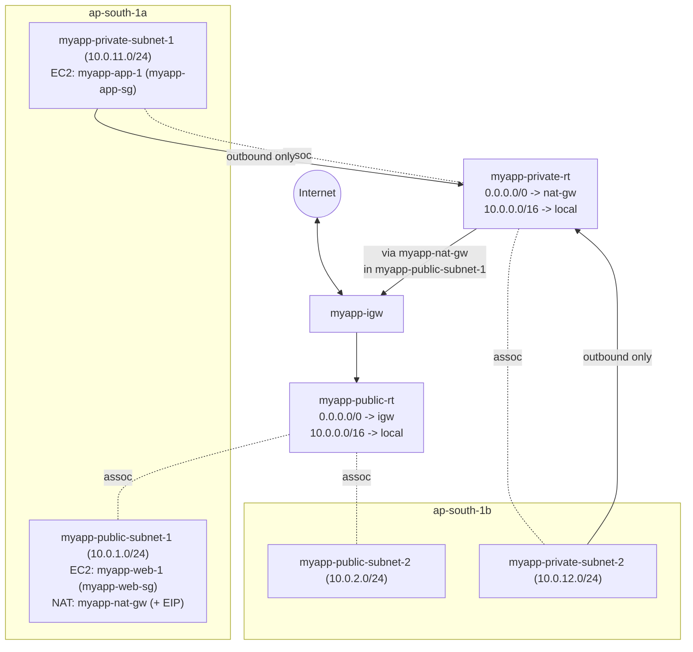

# 09 - NAT Gateway

> Goal: give the private subnets **outbound-only** internet access — so instances like `myapp-app-1` (Note 08) can download OS patches and packages — **without** ever becoming reachable from the internet inbound. This is the last networking piece for the "complete" `myapp-vpc` build; Note 10 recaps the whole thing.

---

## 1. Why private subnets need outbound internet access

`myapp-app-1` currently (end of Note 08) can't `yum update`, install packages, call external APIs, or reach AWS public endpoints over the internet path. But it still needs to:

- Download OS security patches.
- Pull application dependencies.
- Call third-party APIs.

None of this requires the instance to accept **inbound** connections from the internet — it only needs to **initiate outbound** connections and receive the responses. That's exactly the job of a **NAT Gateway (NAT GW)**.

> 🧠 **Mental model:** a NAT Gateway is like a **one-way mirror** for a private subnet — traffic can go out and come back as a response, but nobody outside can initiate a connection in.

---

## 2. How a NAT Gateway works

1. You deploy a NAT Gateway **inside a public subnet** and give it an **Elastic IP (EIP)**.
2. You add a route in the **private** route table: `0.0.0.0/0 → nat-gateway-id`.
3. When `myapp-app-1` (private) makes an outbound request, it's routed to the NAT Gateway (still inside the VPC, over the `local` route), which then sends it out through the **Internet Gateway** using its own Elastic IP as the source address.
4. Return traffic comes back to the NAT Gateway's EIP, and the NAT Gateway forwards it to the originating private instance.
5. Nobody on the internet can initiate a new connection **to** a private instance through the NAT Gateway — only pre-established outbound sessions get a return path.

---

## 3. NAT Gateway vs NAT Instance

Before NAT Gateway existed (and still occasionally seen in older architectures/exam questions), people ran a **NAT Instance** — a regular EC2 instance configured to forward traffic.

| | **NAT Gateway** (current, recommended) | **NAT Instance** (legacy) |
|---|---|---|
| Managed by | AWS (fully managed) | You (it's just an EC2 instance) |
| Availability | Highly available **within its AZ** | Single instance = single point of failure unless you build your own failover |
| Scaling | Scales automatically up to 100 Gbps | You must pick/resize the instance type yourself |
| Patching | None needed (managed service) | You must patch the OS yourself |
| Security groups | Not supported (uses the VPC's own controls) | Supported (it's a normal instance) |
| Bastion usage | Cannot be used as a bastion host | Can double as a bastion host |
| Cost | Hourly charge + per-GB data processing | Just normal EC2 instance-hour + data transfer cost |
| Source/destination check | N/A (not an instance) | Must be **disabled** on the instance for forwarding to work |

🎯 **Exam tip:** the exam loves the phrase "managed, scales automatically, no patching required" → that's always describing **NAT Gateway**, not NAT Instance.

---

## 4. NAT Gateway vs Internet Gateway

Easy to confuse since both involve "internet access" — but they solve different problems:

| | **Internet Gateway** | **NAT Gateway** |
|---|---|---|
| Purpose | Two-way internet access for **public** subnets | **Outbound-only** internet access for **private** subnets |
| Scope | One per VPC | Deployed **inside a specific subnet** → tied to that subnet's AZ |
| HA design | AWS handles it, nothing for you to do | **You** must deploy one per AZ for HA (see below) |
| Cost | Free | Hourly + per-GB charge |
| Needs an EIP? | No | Yes, one EIP per NAT Gateway |
| Inbound from internet? | Yes, if instance has a public IP | Never — outbound-initiated only |

---

## 5. NAT Gateway is AZ-scoped — deploy one per AZ for HA

This is the detail beginners miss most often: **a NAT Gateway lives in one specific subnet, and therefore one specific AZ.**

If you create a single `myapp-nat-gw` in `myapp-public-subnet-1` (`ap-south-1a`) and route **both** private subnets to it, then an outage in `ap-south-1a` takes down internet access for `myapp-private-subnet-2` (`ap-south-1b`) as well — even though that subnet's own AZ is healthy. The NAT Gateway becomes a **single point of failure across AZs**.

**Production best practice:** deploy **one NAT Gateway per AZ** (e.g. a second `myapp-nat-gw-2` in `myapp-public-subnet-2`), and route each private subnet's traffic to the NAT Gateway **in its own AZ**. For this learning build we deploy just one (`myapp-nat-gw`) to keep cost down, but call out clearly that production designs need two.

---

## 6. Cost model — a common surprise-bill item

NAT Gateway pricing has two components:

1. **Hourly charge** for every hour the NAT Gateway exists (whether or not it's processing traffic) — roughly **$0.045/hour** in most regions (~$32/month per gateway).
2. **Per-GB data processing charge** — roughly **$0.045/GB** processed through the gateway, **on top of** normal AWS data transfer charges.

> ⚠️ **This is one of the most common "surprise AWS bill" line items.** A forgotten NAT Gateway left running 24/7, or a private instance streaming large volumes of data outbound (e.g. logs, backups, container image pulls) through it, can rack up real cost fast. Always check the **NAT Gateways** page in the VPC console for orphaned gateways during cleanup, and consider **VPC Endpoints** — private, direct connections from your VPC to AWS services like S3 or DynamoDB that bypass the NAT Gateway (and the internet) entirely — to avoid routing AWS-service traffic through a NAT Gateway at all.

---

## 7. Hands-on: create the NAT Gateway and private route table

### Step 1 — Allocate an Elastic IP (or let the wizard do it)

You can pre-allocate one under **Elastic IPs**, or let the NAT Gateway wizard allocate it for you (shown below).

### Step 2 — Create the NAT Gateway

1. VPC console → left nav → **NAT Gateways** → **Create NAT gateway**.
2. **Name**: `myapp-nat-gw`.
3. **Subnet**: **`myapp-public-subnet-1`** (must be a public subnet — it needs its own route to the IGW).
4. **Connectivity type**: **Public**.
5. **Elastic IP allocation ID**: click **Allocate Elastic IP** → select it.
6. **Create NAT gateway.** State starts as `Pending`, then becomes `Available` after a few minutes.

### Step 3 — Create the private route table

1. Left nav → **Route Tables** → **Create route table**.
2. **Name**: `myapp-private-rt`.
3. **VPC**: `myapp-vpc`.
4. Create (starts with only the `local` route).

### Step 4 — Add the NAT route

1. Select `myapp-private-rt` → **Routes** → **Edit routes** → **Add route**.
2. **Destination**: `0.0.0.0/0`.
3. **Target**: **NAT Gateway** → `myapp-nat-gw`.
4. **Save changes.**

`myapp-private-rt` now has:

| Destination | Target |
|---|---|
| `10.0.0.0/16` | `local` |
| `0.0.0.0/0` | `myapp-nat-gw` |

### Step 5 — Associate the private subnets

1. **Subnet associations** tab → **Edit subnet associations**.
2. Check **`myapp-private-subnet-1`** and **`myapp-private-subnet-2`**.
3. **Save associations.**

Both private subnets now have **outbound-only** internet access. Re-running the `curl`/`ping` test from Note 08 on `myapp-app-1` now succeeds.

---

## 8. Diagram: the complete `myapp-vpc` architecture

---

## 9. Exam tips

🎯 **Exam tip:** "NAT Gateway is a managed service that scales automatically and requires no patching" vs "NAT Instance requires you to disable source/destination check and manage patching/scaling yourself" — a guaranteed comparison question.

🎯 **Exam tip:** **NAT Gateway is AZ-scoped.** For a highly available design, deploy **one NAT Gateway per AZ** and route each AZ's private subnet to its own local NAT Gateway — never route every AZ through a single NAT Gateway in production.

🎯 **Exam tip:** NAT Gateway = **outbound-only** for private subnets; it cannot be used to allow the internet to initiate connections into your private instances — that's simply not possible through a NAT Gateway by design.

---

## 10. Recap

- **NAT Gateway** gives private subnets **outbound-only** internet access (patches, updates, external API calls) without inbound exposure.
- It lives inside a **public subnet**, needs an **Elastic IP**, and is **AWS-managed** (vs the legacy, self-managed **NAT Instance**).
- It is **AZ-scoped** — one per AZ needed for true HA; this build uses one (`myapp-nat-gw`) for simplicity.
- Costs **hourly + per-GB processed** — a frequent source of surprise AWS bills; clean up unused NAT Gateways.
- Built `myapp-nat-gw` in `myapp-public-subnet-1`, `myapp-private-rt` (`0.0.0.0/0 → nat-gw`), associated both private subnets — `myapp-vpc` is now a complete, working 2-tier VPC.
- Next: Note 10 recaps the entire `myapp-vpc` build end-to-end before moving into peering, NACLs, VPN, and other advanced topics.

---

### Sources
- [NAT gateways – AWS docs](https://docs.aws.amazon.com/vpc/latest/userguide/vpc-nat-gateway.html)
- [Pricing for NAT gateways – AWS docs](https://docs.aws.amazon.com/vpc/latest/userguide/nat-gateway-pricing.html)
- [Compare NAT gateways and NAT instances – AWS docs](https://docs.aws.amazon.com/vpc/latest/userguide/vpc-nat-comparison.html)
- [Amazon VPC Pricing](https://aws.amazon.com/vpc/pricing/)
