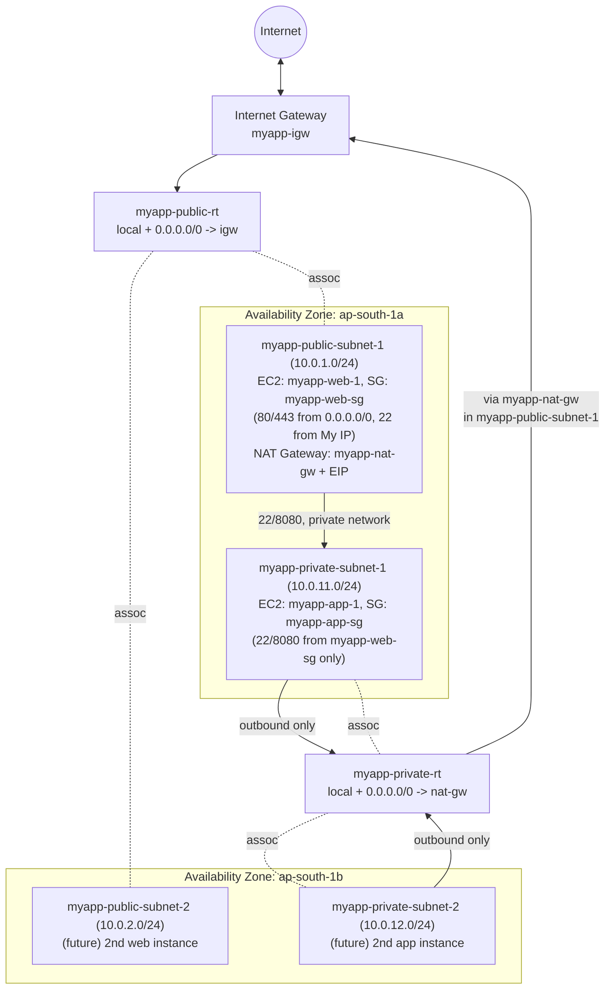

# 10 - VPC Build Summary (Chapter Recap)

> Goal: tie Notes 01-09 together into **one end-to-end narrative** of the `myapp-vpc` build, with a single comprehensive diagram and a console-navigation cheat sheet. This is the "chapter recap" before moving into advanced/hybrid topics (peering, NACLs, VPN, Direct Connect, Transit Gateway, Endpoints — Notes 11-21).

---

## 1. The story so far, in build order

1. **Note 01-02 — Introduction to VPC / CIDR & IP addressing.** Learned what a VPC is (your own isolated network in AWS) and how CIDR blocks define its address space. Chose `10.0.0.0/16` for `myapp-vpc` (65,536 IPs).
2. **Note 03 — Subnet & CIDR math.** Worked out how `10.0.0.0/16` splits into smaller subnets, and why AWS reserves 5 IPs per subnet.
3. **Note 04 — Created `myapp-vpc`** (`10.0.0.0/16`) in region `ap-south-1`, via the "VPC only" console path.
4. **Note 05 — Created 4 subnets** across two AZs: two public, two private (table below).
5. **Note 06 — Created and attached `myapp-igw`**, built `myapp-public-rt` (`0.0.0.0/0 → igw`), associated it with both public subnets — the public subnets became truly "public."
6. **Note 07 — Understood the 2-tier/3-tier pattern** this build follows and why private subnets exist (defense in depth) plus why every tier spans 2+ AZs (high availability).
7. **Note 08 — Launched real EC2 instances**: `myapp-web-1` (public, `myapp-web-sg`) and `myapp-app-1` (private, `myapp-app-sg`). Proved the private instance had **no** internet route, and reached it via SSH jump/bastion (with Session Manager as the modern alternative).
8. **Note 09 — Created `myapp-nat-gw`** in `myapp-public-subnet-1` with an EIP, built `myapp-private-rt` (`0.0.0.0/0 → nat-gw`), associated both private subnets — private instances now get **outbound-only** internet access.

The result: a complete, working, highly-available 2-tier VPC.

---

## 2. Full inventory of what exists in `myapp-vpc` now

| Resource | Name | Detail |
|---|---|---|
| VPC | `myapp-vpc` | `10.0.0.0/16`, region `ap-south-1` |
| Subnet (public) | `myapp-public-subnet-1` | `10.0.1.0/24`, ap-south-1a |
| Subnet (public) | `myapp-public-subnet-2` | `10.0.2.0/24`, ap-south-1b |
| Subnet (private) | `myapp-private-subnet-1` | `10.0.11.0/24`, ap-south-1a |
| Subnet (private) | `myapp-private-subnet-2` | `10.0.12.0/24`, ap-south-1b |
| Internet Gateway | `myapp-igw` | Attached to `myapp-vpc` |
| NAT Gateway | `myapp-nat-gw` | In `myapp-public-subnet-1`, with an Elastic IP |
| Route table (public) | `myapp-public-rt` | `local` + `0.0.0.0/0 → igw`; assoc. with both public subnets |
| Route table (private) | `myapp-private-rt` | `local` + `0.0.0.0/0 → nat-gw`; assoc. with both private subnets |
| Security group | `myapp-web-sg` | 80/443 from anywhere, 22 from My IP |
| Security group | `myapp-app-sg` | 22/8080 from `myapp-web-sg` only |
| EC2 instance | `myapp-web-1` | Public subnet 1, public IP, `myapp-web-sg` |
| EC2 instance | `myapp-app-1` | Private subnet 1, private IP only, `myapp-app-sg` |

---

## 3. The complete architecture diagram

---

## 4. Console left-nav → what we configured there

| VPC console left-nav item | What we configured (note) |
|---|---|
| **Your VPCs** | Created `myapp-vpc`, `10.0.0.0/16` (Note 04) |
| **Subnets** | Created the 4 `myapp-*-subnet-*` subnets across 2 AZs (Note 05) |
| **Internet Gateways** | Created `myapp-igw`, attached to `myapp-vpc` (Note 06) |
| **Route Tables** | Created `myapp-public-rt` and `myapp-private-rt`, added routes, associated subnets (Notes 06, 09) |
| **NAT Gateways** | Created `myapp-nat-gw` with an EIP in `myapp-public-subnet-1` (Note 09) |
| **Security Groups** | Created `myapp-web-sg` and `myapp-app-sg` (Note 08) |
| *(EC2 console)* **Instances** | Launched `myapp-web-1` and `myapp-app-1` into the right subnets/SGs (Note 08) |

---

## 5. What's still missing — where we're headed next (Notes 11-21)

This build covers a solid single-VPC, 2-tier, 2-AZ foundation — enough for most SAA-C03 "design a basic VPC" questions. It does **not** yet cover:

| Topic | Why it matters | Covered in |
|---|---|---|
| **VPC Peering** | Connecting two VPCs privately (e.g. `myapp-vpc` to a shared-services VPC) | Note 11 |
| **Network ACLs (NACLs)** | A second, **stateless**, subnet-level firewall layer (vs SG's instance-level, stateful model) | Note 12 |
| **Security Group vs NACL** | Direct exam-favorite comparison of the two firewall layers | Note 13 |
| **Stateless vs Stateful** | The underlying networking concept behind the SG/NACL contrast | Note 14 |
| **Site-to-Site VPN** | Encrypted connection from your on-premises network into `myapp-vpc` over the internet | Note 15 |
| **AWS Direct Connect** | A dedicated, private physical network link to AWS (no internet involved) | Note 16 |
| **VPC Transit Gateway** | A hub-and-spoke way to connect many VPCs/VPNs at scale (replaces messy full-mesh peering) | Note 17 |
| **VPC Endpoints / PrivateLink** | Reach AWS services (S3, DynamoDB, etc.) privately, without routing through the NAT Gateway or IGW at all — also reduces NAT data-processing cost (Note 09's cost warning) | Note 18 |
| **DHCP Option Sets** | How instances get DNS/domain settings inside a VPC | Note 19 |
| **VPC Flow Logs** | Logging/auditing the actual traffic hitting your ENIs, subnets, or VPC | Note 20 |
| **Managed Prefix Lists** | Reusable, named groups of CIDR blocks for route tables/SGs, so you don't hand-edit every rule when an IP range changes | Note 21 |

🎯 **Exam tip:** SAA-C03 tests hybrid connectivity choices (VPN vs Direct Connect vs Transit Gateway vs Peering) almost entirely by **matching a scenario's requirement (cost, bandwidth, encryption, number of VPCs) to the right option** — Notes 11 and 15-17 build the comparison tables you'll need.

---

## 6. Recap

- `myapp-vpc` is now a complete, working, 2-AZ, 2-tier VPC: 4 subnets, 1 IGW, 1 NAT Gateway, 2 route tables, 2 security groups, 2 EC2 instances.
- The build order was: **VPC → subnets → IGW → public route table → EC2 instances → NAT Gateway → private route table** — worth memorizing as the mental checklist for building any VPC by hand.
- Public vs private is decided entirely by **routing** (Note 06); security is layered with **subnet placement + security groups** (Note 07/08); private outbound access comes from a **NAT Gateway** (Note 09).
- Still missing (by design, for later notes): peering, NACLs, VPN, Direct Connect, Transit Gateway, Endpoints, Flow Logs, DHCP option sets, Prefix Lists.
- Next: Note 11 — **VPC Peering**, the first of the advanced/hybrid connectivity topics.

---

### Sources
- [What is Amazon VPC? – AWS docs](https://docs.aws.amazon.com/vpc/latest/userguide/what-is-amazon-vpc.html)
- [Amazon VPC User Guide (PDF) – AWS docs](https://docs.aws.amazon.com/pdfs/vpc/latest/userguide/vpc-ug.pdf)
- [Example routing options – AWS docs](https://docs.aws.amazon.com/vpc/latest/userguide/route-table-options.html)
- [Amazon VPC FAQs – AWS](https://aws.amazon.com/vpc/faqs/)
