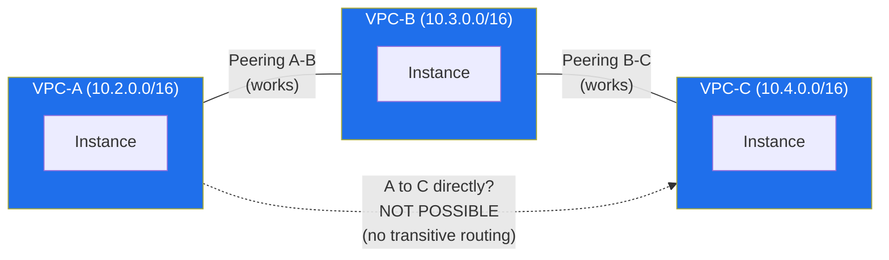
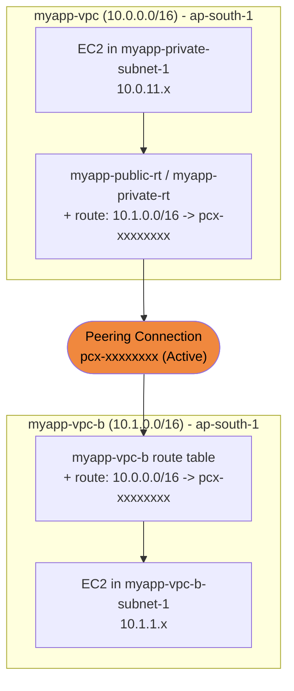

# 11 - VPC Peering

> Goal: understand what a **VPC peering connection** is, why CIDRs must not overlap, the **no-transitive-peering** exam trap, and how to actually wire one up (create, accept, then fix route tables on **both** sides). Builds on the `myapp-vpc` (10.0.0.0/16) from Notes 04-10. Next up: Note 12 moves from "connecting VPCs" to "filtering traffic inside one" (Network ACLs).

---

## 1. What is VPC Peering?

A **VPC peering connection** is a **private, 1:1 networking connection between exactly two VPCs** that lets instances in either VPC talk to each other using **private IP addresses**, as if they were on the same network.

- It is **not a gateway** and **not a VPN connection** — AWS builds it on top of its own existing network infrastructure.
- Because of that, there is **no single point of failure** and **no bandwidth bottleneck** — it isn't a physical box in the middle that traffic funnels through.
- Traffic between peered VPCs **never leaves the AWS network** (never traverses the public internet).
- It is **free to create**; data transfer within the same AZ over a peering connection is free, cross-AZ/cross-Region transfer is billed at normal data transfer rates.

> 🧠 **Mental model:** peering is like laying a **private cable directly between two houses** — no shared junction box, no ISP in the middle. But it only connects **two** houses; it does not automatically extend to a third house down the street.

---

## 2. Non-overlapping CIDR requirement

Two VPCs can only be peered if their **CIDR blocks do not overlap**.

- `myapp-vpc` = `10.0.0.0/16`
- `myapp-vpc-b` = `10.1.0.0/16` (a brand-new VPC created just for this note) — different /16, no overlap. ✅

**Why this matters — a concrete failure example:**

Suppose `myapp-vpc-b` had instead been created as `10.0.0.0/16` (same as `myapp-vpc`), or even just overlapping like `10.0.11.0/24` (which collides with `myapp-private-subnet-1`). Now imagine an instance in `myapp-vpc` at `10.0.11.5` wants to reach an instance in `myapp-vpc-b` at `10.0.11.9`:

1. The route table in `myapp-vpc` sees destination `10.0.11.9`.
2. But `10.0.11.0/24` is **already the local CIDR** of `myapp-private-subnet-1` inside `myapp-vpc` itself (the implicit `local` route always wins because it's the most specific/first-priority route).
3. The router never even considers sending that packet toward the peering connection — it thinks the destination is a neighbor **already inside its own VPC**, so it looks for a local instance with that IP instead.
4. Result: the packet either goes nowhere (no such host locally) or, worse, reaches the *wrong* local instance that happens to share the same overlapping IP.

AWS actually **blocks you from creating the peering connection at all** if the CIDRs overlap, precisely to prevent this ambiguity. This is why planning non-overlapping IP ranges **before** you build any VPC (choosing a distinct `/16` per VPC up front, rather than reusing `10.0.0.0/16` everywhere) matters so much once peering enters the picture.

> ⚠️ **Gotcha:** this is also why you should avoid always defaulting every VPC to `10.0.0.0/16`. If you know you'll eventually peer VPCs (dev, staging, prod, shared-services), give each one a distinct /16 range from the start (e.g. `10.0.0.0/16`, `10.1.0.0/16`, `10.2.0.0/16`).

---

## 3. No transitive peering (the classic exam trap)

**Peering is NOT transitive.** If VPC-A is peered with VPC-B, and VPC-B is peered with VPC-C, that does **NOT** mean VPC-A can reach VPC-C.

- Each peering connection is its own isolated 1:1 relationship.
- Traffic cannot "hop" across a peering connection to reach a VPC on the other side of *another* peering connection.
- To let A talk to C, you must create a **separate, explicit** peering connection: A ↔ C.

If you need full any-to-any connectivity between many VPCs (a "hub and spoke" or full mesh), peering does not scale well — that's exactly the problem **Transit Gateway** solves: it's a central hub that every VPC attaches to once, instead of every VPC needing a direct peering connection to every other VPC. With N VPCs needing full mesh peering, you'd need `N(N-1)/2` separate peering connections; with Transit Gateway you need just N attachments.

🎯 **Exam tip:** if a question describes A-B and B-C peering connections and asks "can A communicate with C?", the answer is **NO** unless an A-C peering connection is explicitly mentioned. This is one of the most frequently tested VPC facts on the SAA-C03.

---

## 4. Same-Region vs cross-Region, same-account vs cross-account

| Dimension | Option 1 | Option 2 |
|---|---|---|
| **Region** | Same-Region peering (both VPCs in `ap-south-1`) | **Inter-Region** peering — VPCs in different Regions (e.g. `ap-south-1` and `us-east-1`). Traffic is automatically **encrypted** and stays on the AWS global backbone, never the public internet. |
| **Account** | Same-account peering — you own both VPCs | **Cross-account** peering — the other VPC belongs to a different AWS account. The peering request must be **accepted** by the owner of the other account. |

Both combinations are fully supported and can be combined (e.g. cross-account **and** cross-Region). The requester/accepter workflow (next section) is identical either way — cross-account/cross-Region just means the accepter signs into a *different* console/Region to accept.

---

## 5. The requester/accepter model, and routes on BOTH sides

Creating a peering connection is a two-step handshake:

1. **Requester**: the owner of one VPC creates a **peering connection request**, specifying the local VPC and the target VPC (by VPC ID, and account ID/Region if cross-account/cross-Region).
2. **Accepter**: the owner of the other VPC must **accept** the pending request before any traffic can flow.

> ⚠️ **A peering connection being "Active" routes NOTHING by itself.** It only makes the private connection *available*. You must still **manually add a route in the route table on each side**, pointing the peer's CIDR at the peering connection (`pcx-...`) as the target. Miss the route on even one side and traffic is one-way or fails entirely. On top of routing, each instance's **security group** (and any Network ACL on its subnet) must also allow the traffic — routing gets the packet there, but the firewall layers still have to let it through.

For our example: `myapp-vpc` (10.0.0.0/16) needs to reach `myapp-vpc-b` (10.1.0.0/16):
- In `myapp-vpc`'s route table(s): add `10.1.0.0/16 → pcx-xxxxxxxx`.
- In `myapp-vpc-b`'s route table(s): add `10.0.0.0/16 → pcx-xxxxxxxx`.

Both directions are required — this is symmetric and easy to forget one side of.

---

## 6. Hands-on: peer `myapp-vpc` with `myapp-vpc-b`

**Scenario:** we already built `myapp-vpc` (10.0.0.0/16) in Notes 04-09. Now we create a second, small VPC `myapp-vpc-b` (10.1.0.0/16) in the same account/Region and peer the two.

### Step 1 — Create the second VPC
1. VPC console → **Your VPCs** → **Create VPC**.
2. Choose **VPC only**. **Name tag**: `myapp-vpc-b`. **IPv4 CIDR**: `10.1.0.0/16`. Leave the rest default → **Create VPC**.
3. (Optional for testing) add one subnet, e.g. `myapp-vpc-b-subnet-1` = `10.1.1.0/24` in `ap-south-1a`, with a test EC2 instance in it.

### Step 2 — Create the peering connection (as requester)
1. VPC console → left nav → **Peering Connections** → **Create peering connection**.
2. **Name**: `myapp-vpc-to-myapp-vpc-b`.
3. **VPC (Requester)**: `myapp-vpc`.
4. **Select another VPC to peer with** → choose **My account** (same account here) → **Region**: same Region (or pick "Another Region" for inter-Region) → **VPC (Accepter)**: `myapp-vpc-b`.
5. Click **Create peering connection**. Status shows **Pending acceptance**.

### Step 3 — Accept the connection (as accepter)
1. Still in **Peering Connections**, select the new connection.
2. **Actions** → **Accept request**.
3. Confirm. Status changes to **Active**.

(If this were a different AWS account, the accepter would switch to that account's console — or receive the pending request there — before accepting.)

### Step 4 — Update BOTH route tables
1. Route Tables → select `myapp-public-rt` (and `myapp-private-rt` if private instances also need to reach `myapp-vpc-b`) → **Routes** tab → **Edit routes** → **Add route**:
   - **Destination**: `10.1.0.0/16`, **Target**: **Peering Connection** → `pcx-xxxxxxxx` → **Save**.
2. Switch to `myapp-vpc-b`'s route table → **Edit routes** → **Add route**:
   - **Destination**: `10.0.0.0/16`, **Target**: the same `pcx-xxxxxxxx` → **Save**.

### Step 5 — Allow the traffic in security groups
Even with routes on both sides, an instance's **security group** must allow the traffic (e.g. add an inbound rule on the target instance's SG allowing the source CIDR `10.0.0.0/16` or `10.1.0.0/16` as appropriate). Peering routes packets; it doesn't override firewall rules.

### Step 6 — Test
From an instance in `myapp-private-subnet-1` (10.0.11.x), `ping` or connect to the private IP of the test instance in `myapp-vpc-b` (10.1.1.x). It should succeed once routes + SGs are correct on both ends.

---

## 7. Key facts to remember

- A peering connection is **1:1** between exactly two VPCs — not transitive.
- CIDRs of the two VPCs **must not overlap**.
- Works **same-Region or cross-Region**, **same-account or cross-account**.
- Must be **requested** by one side and **accepted** by the other before it becomes Active.
- **Active status ≠ routing.** You must add routes on **both** sides pointing the peer CIDR at the `pcx-...` target.
- Security groups/NACLs still apply — peering only provides the network path.
- No extra hardware, no single point of failure, no bandwidth bottleneck (uses AWS's own backbone).

🎯 **Exam tip:** two common wrong-answer traps: (1) assuming peering is transitive (A-B + B-C ⇒ A-C — false), and (2) forgetting that an "Active" peering connection alone doesn't route traffic — route table entries on **both sides** are mandatory.

---

## 8. Recap

- VPC peering = private, direct, non-transitive 1:1 connection between two VPCs over AWS's own network.
- Requires **non-overlapping CIDRs**.
- **No transitive peering** — A-B and B-C does not give you A-C; you must peer A-C explicitly.
- Supports same/cross-Region and same/cross-account.
- Flow: **Create request (requester)** → **Accept (accepter)** → **Add route on both sides** → **check SGs**.
- For connecting many VPCs at scale, prefer a **Transit Gateway** hub over a full-mesh peering setup.
- Next: Note 12 — **Network ACLs**, the subnet-level stateless firewall that also governs traffic entering a peered VPC's subnets.

---

### Sources
- [What is VPC peering? – AWS docs](https://docs.aws.amazon.com/vpc/latest/peering/what-is-vpc-peering.html)
- [How VPC peering connections work – AWS docs](https://docs.aws.amazon.com/vpc/latest/peering/vpc-peering-basics.html)
- [Create a VPC peering connection – AWS docs](https://docs.aws.amazon.com/vpc/latest/peering/create-vpc-peering-connection.html)
- [Connect VPCs using VPC peering – AWS docs](https://docs.aws.amazon.com/vpc/latest/userguide/vpc-peering.html)
