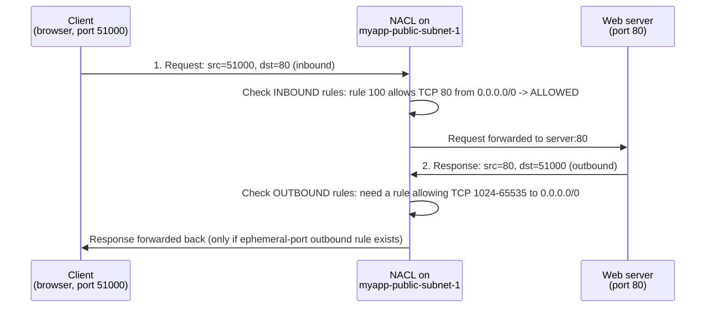

# 12 - Network ACL (NACL)

> Goal: understand the **Network ACL (NACL)** — a **subnet-level, stateless** firewall — including rule numbers/evaluation order, ALLOW **and** DENY rules, and the **ephemeral port** requirement that trips up almost every beginner. Builds on the `myapp-vpc` subnets from Notes 04-09. Note 13 then directly compares NACL vs Security Group; Note 14 goes deep on stateless vs stateful.

---

## 1. What is a Network ACL?

A **Network Access Control List (NACL)** is a **firewall that operates at the subnet level** — it controls traffic **entering and leaving an entire subnet**, not an individual instance.

- Every subnet **must** be associated with exactly **one** NACL.
- One NACL **can** be associated with **multiple subnets** at the same time.
- If you don't explicitly associate a subnet with a custom NACL, it uses the VPC's **default NACL**.
- NACLs live at the VPC level (like route tables), independent of any single instance's ENI.

> 🧠 **Mental model:** if a Security Group is the **bouncer at an instance's door**, a NACL is the **checkpoint at the entrance to the whole neighborhood (subnet)** — every packet headed to or from any house in that neighborhood passes through it first.

---

## 2. Default NACL vs Custom NACL

| | **Default NACL** (auto-created with every VPC) | **Custom NACL** (one you create) |
|---|---|---|
| Inbound default | **Allow all** traffic | **Deny all** traffic (until you add rules) |
| Outbound default | **Allow all** traffic | **Deny all** traffic (until you add rules) |
| Behaves like | A "pass-through," effectively invisible until you edit it | A locked-down whitelist you build up rule by rule |

> ⚠️ The moment you create a **custom** NACL and associate a subnet with it, that subnet's traffic drops to **nothing** until you add explicit ALLOW rules — including for return/ephemeral traffic (Section 5).

---

## 3. ALLOW and explicit DENY rules

Unlike Security Groups (Note 11 — allow-only, nothing to deny explicitly), NACLs support **both**:

- **ALLOW** rules — permit matching traffic.
- **DENY** rules — explicitly block matching traffic, even if a later/other rule would otherwise allow it.

This lets you do something a Security Group cannot: **explicitly block a specific IP or CIDR** at the subnet level, e.g. "deny all traffic from `198.51.100.0/24` (a known-bad range)," while still allowing everyone else. There's no way to "deny an IP" with a security group — SGs can only choose what to allow.

---

## 4. Rule numbers and evaluation order

Every NACL rule has a **rule number** (1-32766). Rules are evaluated **in order from the lowest number to the highest**, and **the first rule that matches the traffic is applied** — AWS stops checking as soon as it finds a match, even if a later rule would contradict it.

**Concrete example — inbound rules on a NACL:**

| Rule # | Type | Protocol | Port | Source | Allow/Deny |
|---|---|---|---|---|---|
| 100 | HTTP | TCP | 80 | 0.0.0.0/0 | ALLOW |
| 110 | HTTPS | TCP | 443 | 0.0.0.0/0 | ALLOW |
| 120 | Custom TCP | TCP | 22 | `<your-IP>/32` | ALLOW |
| 130 | All traffic | All | All | `198.51.100.0/24` | **DENY** |
| * | All traffic | All | All | 0.0.0.0/0 | **DENY** (implicit, cannot be edited/deleted) |

Walk through two packets:
- A packet on port 80 from `203.0.113.5` → rule 100 matches first (lowest number that matches) → **ALLOWED**. Rules 110-130 and `*` are never even checked.
- A packet on any port from `198.51.100.7` (inside the blocked /24) → rule 100 doesn't match (wrong port), 110/120 don't match either, rule 130 matches → **DENIED**, even though the final `*` rule would also have denied it anyway.
- A packet on port 3389 (RDP) from anywhere → no numbered rule matches → falls through to the **implicit final `*` DENY rule** → **DENIED**.

> 🧠 Leave **gaps between rule numbers** (100, 110, 120... not 1, 2, 3...) so you can insert a new rule later (e.g. 105) without renumbering everything.

🎯 **Exam tip:** "lowest number wins, first match stops evaluation" is a guaranteed SAA-C03 topic — expect a question with a numbered rule table asking whether specific traffic is allowed or denied.

---

## 5. Stateless: why you need explicit ephemeral port rules

A NACL is **stateless** — it does **not** remember that a request went out, so it does **not** automatically allow the matching response back in. You must write a rule for **each direction, independently**.

The catch: when a client (e.g. a browser) initiates a TCP connection, it doesn't use port 80/443 as *its own* port — it picks a random high-numbered **ephemeral port** (typically **1024-65535**, exact range depends on the client OS) to receive the reply on. The server replies **from** 80/443 **to** that ephemeral port. So the subnet's **outbound** NACL rules must allow traffic **out on ephemeral ports**, not just on 80/443.

**Step-by-step: a client's HTTP request into `myapp-public-subnet-1`:**

If the outbound rule set only allows ports 80/443/22 out (mirroring the inbound list) and forgets **1024-65535**, step 2 is silently dropped — the client's browser just spins and times out, even though the request clearly reached the server. This is the single most common NACL misconfiguration beginners hit.

The same logic applies in reverse for traffic initiated **from inside** the subnet (e.g. an instance calling out to an API): the **outbound** rule allows the initiating port, and the **inbound** rule set must allow the **ephemeral port range** for the reply to come back in.

> ⚠️ **Rule of thumb:** for a stateless NACL, always pair every "real" service port rule with an **ephemeral port rule in the opposite direction** (inbound service port ⇒ also need outbound ephemeral; outbound service port ⇒ also need inbound ephemeral).

---

## 6. Hands-on: custom NACL for `myapp-public-subnet-1`

**Goal:** replace the default NACL on `myapp-public-subnet-1` with a custom one that allows only HTTP, HTTPS, SSH, and their necessary ephemeral return traffic — denying everything else.

1. VPC console → left nav → **Network ACLs** → **Create network ACL**.
2. **Name**: `myapp-public-nacl`. **VPC**: `myapp-vpc` → **Create**.
3. New NACL starts with **all inbound/outbound denied** (custom NACL default). Select it → **Inbound rules** tab → **Edit inbound rules** → **Add rule** for each row below → **Save changes**. Repeat for **Outbound rules**.

**Inbound rules:**

| Rule # | Type | Protocol | Port range | Source | Allow/Deny |
|---|---|---|---|---|---|
| 100 | HTTP | TCP | 80 | 0.0.0.0/0 | ALLOW |
| 110 | HTTPS | TCP | 443 | 0.0.0.0/0 | ALLOW |
| 120 | SSH | TCP | 22 | `<your-IP>/32` | ALLOW |
| 130 | Custom TCP | TCP | 1024-65535 | 0.0.0.0/0 | ALLOW |
| * | All traffic | All | All | 0.0.0.0/0 | DENY (default, fixed) |

**Outbound rules:**

| Rule # | Type | Protocol | Port range | Destination | Allow/Deny |
|---|---|---|---|---|---|
| 100 | HTTP | TCP | 80 | 0.0.0.0/0 | ALLOW |
| 110 | HTTPS | TCP | 443 | 0.0.0.0/0 | ALLOW |
| 120 | Custom TCP | TCP | 1024-65535 | 0.0.0.0/0 | ALLOW |
| * | All traffic | All | All | 0.0.0.0/0 | DENY (default, fixed) |

(Rule 120 outbound ephemeral covers replies to *inbound* SSH/HTTP/HTTPS sessions initiated by clients; if instances in this subnet also *initiate* outbound calls like software updates on 443, rule 110 outbound already covers that, and rule 130 inbound ephemeral lets the matching replies back in.)

4. Select the NACL → **Subnet associations** tab → **Edit subnet associations** → check `myapp-public-subnet-1` → **Save changes**.
5. Test: confirm HTTP/HTTPS/SSH still work to instances in that subnet, and that some other port (e.g. a database port hit directly from outside) is now blocked at the subnet boundary even before it reaches any security group.

> ⚠️ **Clean up note:** unlike NAT Gateways or peering, NACLs have **no hourly cost** — nothing to "clean up" for billing. But do restore/detach a custom NACL from a production subnet if it was only for practice, so you don't accidentally lock out real traffic later.

---

## 7. Recap

- NACL = **stateless, subnet-level** firewall; one NACL per subnet, but one NACL can cover many subnets.
- **Default NACL**: allow all in/out. **Custom NACL**: deny all until you add rules.
- Supports **both ALLOW and explicit DENY** rules (unlike SGs).
- Rules have **numbers**; evaluated **lowest-to-highest**, **first match wins**, rest ignored.
- **Stateless** ⇒ must explicitly allow **ephemeral ports (1024-65535)** in the return direction for any request/response flow.
- An implicit final `*` DENY rule always exists and can't be removed.
- Next: Note 13 puts NACL and Security Group **side by side** in one comparison table; Note 14 dives deeper into *why* statefulness works the way it does.

---

### Sources
- [Control subnet traffic with network access control lists – AWS docs](https://docs.aws.amazon.com/vpc/latest/userguide/vpc-network-acls.html)
- [Network ACL rules – AWS docs](https://docs.aws.amazon.com/vpc/latest/userguide/nacl-rules.html)
- [Create a custom network ACL – AWS docs](https://docs.aws.amazon.com/vpc/latest/userguide/create-network-acl.html)
- [Network ACL rules (ephemeral ports section) – AWS docs](https://docs.aws.amazon.com/vpc/latest/userguide/nacl-rules.html)
