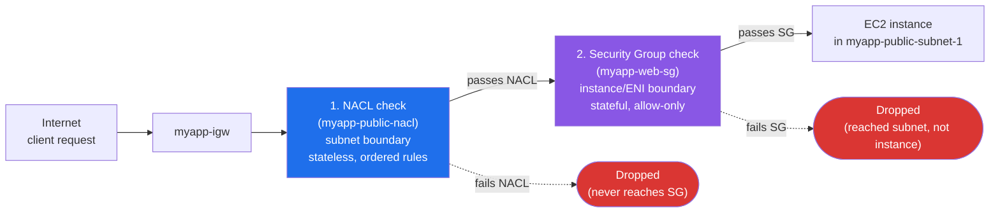

# 13 - Security Group vs Network ACL

> Goal: a **focused side-by-side comparison** of Security Groups (Note 11, EC2 folder) and Network ACLs (Note 12) — this exact comparison is one of the most frequently tested topics on the SAA-C03. No new concepts here, just the two put together so the contrast is crystal clear.

---

## 1. The one-sentence version

- **Security Group (SG)** = firewall **around an instance's ENI**, **stateful**, **allow-only**.
- **Network ACL (NACL)** = firewall **around a subnet**, **stateless**, **allow + deny**.

Both exist in the same VPC at the same time, and **every packet reaching an instance in a subnet passes through both** — the NACL first (subnet boundary), then the SG (instance boundary).

---

## 2. Full comparison table

| Aspect | Security Group | Network ACL |
|---|---|---|
| **Operates at** | Instance / ENI level | Subnet level |
| **Stateful or stateless** | **Stateful** — return traffic auto-allowed | **Stateless** — must explicitly allow both directions (Note 14) |
| **Rule types** | **Allow only** (implicit deny for everything else) | **Allow AND explicit Deny** |
| **Rule evaluation** | **All** rules are evaluated; if **any** rule matches and allows, traffic passes | **Ordered** by rule number, **lowest number first, first match wins** |
| **Default for a new/blank one** | New SG: inbound all denied, outbound all allowed | **Default** NACL: allow all in/out. **Custom** NACL: deny all until rules added |
| **Applies to** | Only the instances **explicitly associated** with that SG | **Every instance in the subnet**, no matter what SG they have |
| **Can reference** | Other security groups as source/destination | Only CIDR blocks (IPs/ranges), not SG IDs |
| **Number per instance/subnet** | Instance can have **multiple** SGs (rules combined) | Subnet has **exactly one** NACL at a time |
| **Cost** | Free | Free |

🎯 **Exam tip:** if a question says "instance-level, stateful" → Security Group. "Subnet-level, stateless, supports explicit deny" → NACL. These four adjectives (instance/subnet, stateful/stateless) are the fastest way to identify which one a question is describing.

---

## 3. Layered defense — a packet's journey into `myapp-vpc`

Every inbound packet destined for an EC2 instance passes two checkpoints, in this order:

Both checkpoints must say "yes" for a packet to reach the instance. On the way **out**, the order reverses: SG is checked first (leaving the instance), then the NACL (leaving the subnet).

---

## 4. Worked "what happens" scenarios

**Scenario A — NACL allows, SG blocks:**
`myapp-public-nacl` has an inbound ALLOW rule for TCP 22 (SSH) from `0.0.0.0/0` (rule 120 in Note 12's example only allowed a specific IP, but suppose it were opened to anywhere for this scenario). The instance's SG, `myapp-web-sg`, only allows inbound 80/443 from `0.0.0.0/0` and 22 from a specific "My IP" — a different, unrelated IP tries to SSH in.
1. Packet arrives at the subnet boundary → NACL rule 120 matches, port 22 is allowed → **passes the NACL**.
2. Packet reaches the instance's ENI → SG is checked → no inbound SG rule matches this source IP for port 22 → **implicit deny at the SG**.
3. **Result: connection refused/times out.** The NACL being permissive doesn't matter — the SG is the stricter of the two here, and *both* must allow it.

**Scenario B — SG allows, NACL blocks:**
`myapp-web-sg` allows inbound 80 from `0.0.0.0/0` (wide open, as intended for a public web server). But `myapp-public-nacl` has a DENY rule at rule 130 for the source CIDR `198.51.100.0/24` (a known-bad range, added at the subnet level to block it for every instance in that subnet at once), sitting before the final implicit deny.
1. A request from `198.51.100.7` arrives at the subnet boundary.
2. NACL evaluates rules **in order**: rule 100 (allow 80) does match on port, but wait — NACL rules are evaluated top to bottom and the **first matching rule** wins regardless of allow/deny. If the DENY rule for that CIDR (130) has a **lower** number than the ALLOW rule for port 80, and both match, the lower number wins.
3. Assume the admin correctly placed the CIDR-specific DENY at rule number **90** (lower than the port-80 ALLOW at 100) specifically so it's evaluated first for that bad range → **DENIED at the NACL**, packet never reaches the instance, and the SG is never even consulted.
4. **Result: blocked**, even though the SG would have happily allowed it. This is exactly why NACLs are useful for **coarse, subnet-wide blocking** — one DENY rule protects every instance in the subnet, without touching any SG.

> ⚠️ **Rule-ordering gotcha:** for scenario B to actually block the bad range, the DENY rule number must be **lower** than any ALLOW rule number it would otherwise match. If the ALLOW-80-from-anywhere rule had a lower number, it would match first and the traffic would be let through *before* the DENY rule is ever checked.

---

## 5. When to use which (defense in depth)

- **Security Groups** — your primary, day-to-day tool. Use them for **fine-grained, per-application-tier control**: "only `myapp-web-sg` can reach `myapp-app-sg` on 8080," "only `myapp-app-sg` can reach `myapp-db-sg` on 3306" (the tiered SG chain from Notes 07-08).
- **Network ACLs** — a coarser, secondary layer. Use them when you need to:
  - Block a **known-bad IP range** for an **entire subnet** in one place, instantly, without editing every instance's SG.
  - Add an extra layer of protection for compliance (defense in depth — "if someone misconfigures a security group, the NACL is still there").
  - Deny very specific traffic that SGs cannot express (SGs can't deny; only allow).
- In practice, most learners/teams **leave the default NACL as-is** (allow all) and rely mainly on Security Groups, only reaching for a custom NACL when there's a specific subnet-wide blocking need. That's a legitimate real-world pattern — but the exam still expects you to know NACLs exist as the subnet-level backstop.

---

## 6. Recap

- SG = instance-level, stateful, allow-only, applies only to attached instances.
- NACL = subnet-level, stateless, allow+deny, applies to every instance in the subnet, evaluated in rule-number order.
- A packet must pass **both** to reach an instance — NACL first, then SG (reverse order outbound).
- Use SGs for per-tier application control; use NACLs for coarse, subnet-wide allow/block decisions (e.g. blocking a bad IP range).
- Next: Note 14 — a deep dive purely on **why** stateful vs stateless works the way it does, with a side-by-side sequence diagram.

---

### Sources
- [Security groups for your VPC – AWS docs](https://docs.aws.amazon.com/vpc/latest/userguide/vpc-security-groups.html)
- [Control subnet traffic with network access control lists – AWS docs](https://docs.aws.amazon.com/vpc/latest/userguide/vpc-network-acls.html)
- [Ensure internetwork traffic privacy in Amazon VPC – AWS docs](https://docs.aws.amazon.com/vpc/latest/userguide/VPC_Security.html)
- [Security best practices for your VPC – AWS docs](https://docs.aws.amazon.com/vpc/latest/userguide/vpc-security-best-practices.html)
