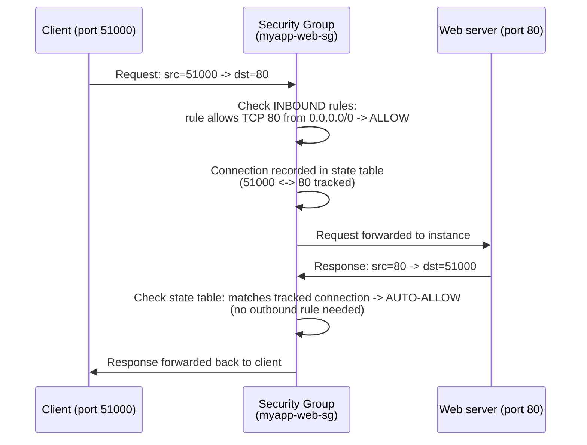
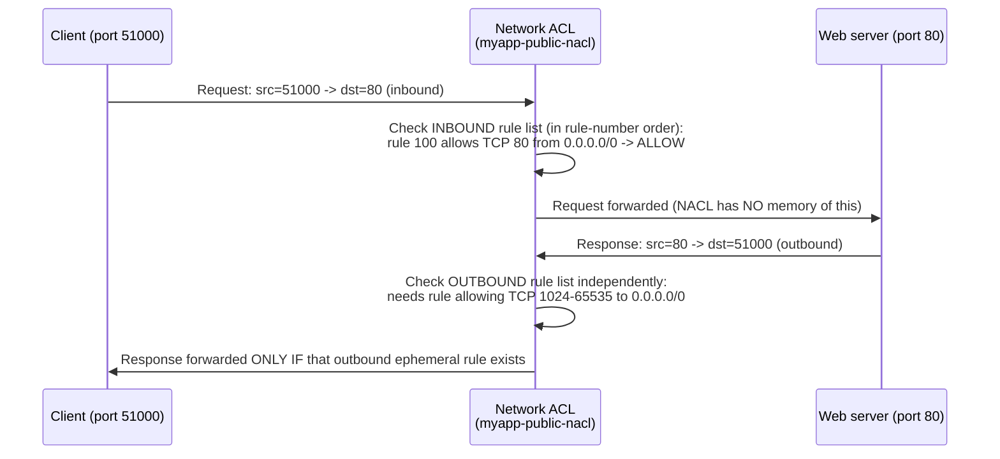

# 14 - Stateless vs Stateful (Deep Dive)

> Goal: really nail down **what "state" means** in a firewall, why that single property changes how many rules you must write, and see it play out packet-by-packet for both a Security Group (Note 11) and a Network ACL (Note 12). This is the concept that trips up the most beginners in the whole VPC section — worth a dedicated note.

---

## 1. What does "state" mean for a firewall?

A **stateful** firewall keeps a small memory (a **connection tracking table**) of connections it has already seen. When it sees a reply that matches an existing tracked connection, it automatically lets it through — it doesn't need a separate rule for the reply, because it already "knows" this packet belongs to a conversation it approved.

A **stateless** firewall has **no memory** of past packets. Every single packet is evaluated **independently against the rule list**, regardless of whether it's a brand-new request or a reply to something that was just allowed through moments ago.

> 🧠 **Analogy:** a **stateful** guard remembers "I let this exact visitor in five minutes ago, so I'll wave them back out without re-checking the list." A **stateless** guard has amnesia — every person, coming or going, gets checked against the list from scratch, every single time, even if it's the "same" conversation.

---

## 2. TCP handshake context (why this matters for HTTP/SSH/etc.)

A typical TCP connection (e.g. a browser loading a web page) works like this:

1. **Client** picks a random **ephemeral source port** (e.g. `51000`) and sends a `SYN` packet to the **server's port** (e.g. `80`).
2. **Server** replies `SYN-ACK` **from** port 80 **to** the client's ephemeral port `51000`.
3. **Client** sends `ACK` — connection established.
4. Data flows both ways: server-to-client traffic is **from port 80 to port 51000**; client-to-server traffic is **from port 51000 to port 80**.

Notice: the **server's replies are addressed to a random high port** the client picked, not to port 80. Any firewall on the path has to somehow allow that reply through — either because it "remembers" the outgoing request (stateful) or because it has a standing rule for that whole ephemeral range (stateless, Note 12 §5).

---

## 3. Why Security Groups (stateful) need only ONE rule per direction of initiation

Because a Security Group tracks connection state:

- You add **one inbound rule**: "allow TCP 80 from `0.0.0.0/0`."
- The **reply** (server:80 → client:ephemeral-port) is automatically permitted **outbound**, because the SG recognizes it as part of a connection it already approved inbound — **no outbound rule needed for the reply.**
- Same logic in reverse: if the **instance initiates** an outbound connection (e.g. calling an external API on 443), you add **one outbound rule** allowing 443 out, and the **inbound reply** is automatically allowed back in — no inbound rule needed.

So for SGs, you only ever write a rule for the **direction that starts the conversation** — never for the reply.

---

## 4. Why Network ACLs (stateless) need rules for BOTH request AND reply

A NACL has no memory, so:

- The **inbound** rule allowing TCP 80 from `0.0.0.0/0` only covers the **request** arriving.
- The **reply** (server:80 → client:ephemeral-port) is a **completely separate packet** as far as the NACL is concerned — it must independently match an **outbound** rule, specifically one allowing the **ephemeral port range (1024-65535)** as the destination.
- Miss that outbound ephemeral rule, and the request gets in fine, but the reply is silently dropped on the way out — the classic "it looks like it should work but the client just hangs" NACL bug (see Note 12 §5-6).

---

## 5. Side-by-side sequence diagrams

**A. Stateful scenario — Security Group only (no NACL blocking anything, default NACL allows all):**

Only **one rule** was ever needed (the inbound allow on port 80). The reply needed **zero** explicit rules.

**B. Stateless scenario — Network ACL only (imagine no SG in the path, just the NACL):**

**Two separate rules** were required: one inbound (port 80) and one outbound (ephemeral range) — the NACL never "remembers" that it just approved the request.

---

## 6. Quick-reference table

| | Security Group | Network ACL |
|---|---|---|
| Remembers connections? | **Yes** (stateful) | **No** (stateless) |
| Rules needed per conversation | **1** (direction of initiation only) | **2** (request direction + reply direction) |
| Must think about ephemeral ports? | No — handled automatically | **Yes** — must explicitly allow 1024-65535 in the return direction |
| Risk if you forget the "return" rule | N/A — not applicable, it's automatic | Silent drop of replies; connection looks "hung" |

🎯 **Exam tip:** if a scenario says "I opened port 80 inbound on my NACL but users still can't load the page," the answer is almost always: **missing outbound ephemeral port rule** on the NACL (1024-65535). If the same complaint is about a **security group**, the fix is different — check the inbound rule itself (SG statefulness means the return path is never the problem).

---

## 7. Other stateful vs stateless concepts in AWS (brief, for context only)

This stateful/stateless distinction shows up elsewhere in AWS too — good to recognize, not required in depth for the VPC section:

| Service/feature | Stateful or Stateless | Note |
|---|---|---|
| Security Group | Stateful | Covered above |
| Network ACL | Stateless | Covered above |
| AWS Network Firewall (stateful rule groups) | Can be either | Supports both **stateless** rule groups (fast, simple 5-tuple matching) and **stateful** rule groups (deep packet inspection, connection tracking) |
| Classic/Application Load Balancer | Effectively stateful per-connection | Tracks in-flight connections for routing/health |

Keep the VPC-section focus on **Security Group = stateful** and **NACL = stateless** — that pairing is what SAA-C03 actually tests.

---

## 8. Recap

- **Stateful** = firewall remembers a connection and auto-allows the matching reply. **Stateless** = no memory, every packet checked independently in both directions.
- **Security Groups are stateful** → one rule per direction of *initiation* is enough.
- **Network ACLs are stateless** → need explicit rules for **both** the request and the ephemeral-port reply.
- The TCP handshake's use of a random **ephemeral port** on the client side is *why* the reply direction needs its own stateless rule at all.
- Forgetting the NACL's outbound ephemeral rule is the #1 real-world NACL bug — always pair a service-port rule with its ephemeral counterpart in the opposite direction.
- This closes out the NACL/SG mini-series (Notes 11-14). Next in the VPC folder: Note 15 — **Site-to-Site VPN**, connecting `myapp-vpc` back to an on-premises network.

---

### Sources
- [Control subnet traffic with network access control lists – AWS docs](https://docs.aws.amazon.com/vpc/latest/userguide/vpc-network-acls.html)
- [Network ACL rules – AWS docs](https://docs.aws.amazon.com/vpc/latest/userguide/nacl-rules.html)
- [Security groups for your VPC – AWS docs](https://docs.aws.amazon.com/vpc/latest/userguide/vpc-security-groups.html)
- [Standard stateful rule groups in AWS Network Firewall – AWS docs](https://docs.aws.amazon.com/network-firewall/latest/developerguide/stateful-rule-groups-basic.html)
