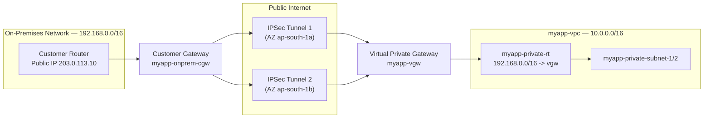
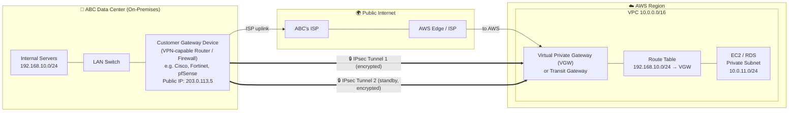

# 15 - AWS Site-to-Site VPN

> Goal: connect `myapp-vpc` back to an **on-premises network** over the public internet, encrypted, using **AWS Site-to-Site VPN**. Covers the four building blocks (Customer Gateway, Virtual Private Gateway, the VPN Connection itself, and route propagation), why AWS always gives you **two tunnels**, static vs BGP routing, and **VPN CloudHub**. Later notes in this folder cover the dedicated-line alternative (Direct Connect) and Transit Gateway, which can also terminate VPN connections at scale.

---

## 1. What problem does Site-to-Site VPN solve?

So far every note in this folder has treated `myapp-vpc` as a self-contained island that talks to the public internet through its Internet Gateway, or is peered directly to a sibling VPC. Real companies usually also have an **on-premises data center or office network** that needs to talk to AWS privately — for example, to reach `myapp-private-subnet-1` without going over the open internet unencrypted, or to let head-office staff hit an internal admin tool.

**AWS Site-to-Site VPN** creates an **encrypted IPSec tunnel** between:
- your **on-premises network** (a physical router/firewall you own), and
- your **AWS VPC**,

routed over the **public internet**, but encrypted end-to-end so the traffic inside the tunnel is private.

> 🧠 **Mental model:** Site-to-Site VPN is like renting an armored courier van that drives on the same public roads as everyone else (the internet), but nobody can see what's inside the van (encryption). Direct Connect — a dedicated, private, physical network link to AWS covered in a later note — is by contrast your own private road that never touches public traffic at all.

---

## 2. The four building blocks

| Component | What it represents | Lives where |
|---|---|---|
| **Customer Gateway (CGW)** | An AWS *resource* that just describes **your** on-prem device: its public IP, the routing type (static/BGP), and BGP ASN if used | AWS side, but represents your hardware |
| **Virtual Private Gateway (VGW)** | The **AWS-side VPN endpoint**, attached to your VPC | Attached to `myapp-vpc` |
| **VPN Connection** | The actual encrypted tunnel(s) linking the CGW and VGW | Spans both sides |
| **Route Table entries** | Tell the VPC how to reach the on-prem CIDR via the VGW | `myapp-private-rt` |

### Customer Gateway (CGW) in detail
- It is **not your actual router** — it's an AWS object that just holds metadata **about** your router: its public IPv4 (or IPv6) address, the type of routing (static or BGP), and (if using BGP) your **ASN** (Autonomous System Number).
- Your real on-prem device (a Cisco ASA, pfSense box, Fortinet appliance, etc.) must support **IPSec** and be reachable from the internet at that public IP.

### Virtual Private Gateway (VGW) in detail
- The **AWS-managed VPN concentrator** attached to one VPC (like an Internet Gateway, it's a 1:1-per-VPC style attachment, though a VGW can be detached and re-attached elsewhere).
- Unlike an IGW, a VGW can also be configured to **propagate routes** automatically into your route tables (Section 5).
- Also supports terminating a **Direct Connect private VIF** — Direct Connect being AWS's dedicated physical network connection, detailed in a later note — the VGW is a general "VPC-side gateway," not VPN-only.

---

## 3. Why AWS always gives you TWO tunnels (not one)

Every Site-to-Site VPN connection provisions **two independent IPSec tunnels** between the CGW and the VGW, terminating in **two different Availability Zones** on the AWS side.

Why two, not one?

- **High availability.** If AWS performs maintenance on one tunnel's endpoint, or a device fails, traffic **automatically fails over** to the second tunnel — no manual intervention.
- Your on-prem device should be **configured to use both tunnels** (active/active if it supports ECMP, or active/standby). If you only configure one tunnel, you lose the HA benefit and get an "your VPN is not redundant" finding in AWS Trusted Advisor.
- Traffic from on-prem to AWS can use **both** tunnels simultaneously; traffic from AWS back to on-prem prefers one tunnel but fails over automatically if that path breaks.

> ⚠️ **Common real-world mistake:** configuring the on-prem router with only ONE of the two tunnel endpoints "because it works." It works right up until AWS performs maintenance on that tunnel, and then the connection drops with no automatic recovery, because the second tunnel was never configured on the customer side.

🎯 **Exam tip:** "AWS Site-to-Site VPN connection = 2 tunnels, for redundancy" is a near-guaranteed fact tested on the SAA-C03. For full redundancy against an entire CGW/on-prem-device failure, use **two Customer Gateways** (two VPN connections) — that protects against losing the whole on-prem device, not just one tunnel.

---

## 4. Static routing vs BGP (dynamic) routing

| | Static Routing | BGP (Border Gateway Protocol) Routing |
|---|---|---|
| How routes are shared | You manually type the on-prem CIDR block(s) into the VPN connection config | Routes are **automatically exchanged** between your router and AWS |
| Failover | Manual / relies on route entries you maintain | **Automatic** — BGP naturally reroutes around a dead tunnel |
| Best for | Simple setups, on-prem device without BGP support, a small number of static CIDRs | Multiple CIDRs, changing networks, production HA setups |
| AWS recommendation | Use only when BGP isn't available | **Preferred / recommended** whenever your CGW device supports it |

> 🧠 If your on-prem CIDR is simple and never changes (like our example, `192.168.0.0/16`), static routing is easy to reason about. In a real enterprise with dozens of subnets on both sides, BGP saves you from manually re-entering routes every time the network team adds a subnet.

---

## 5. Route propagation

Instead of manually adding a route for the on-prem CIDR to `myapp-private-rt`, you can enable **route propagation**: the route table automatically learns routes from the VGW (which in turn learns them from BGP, or has the static routes you configured on the VPN connection).

- Route propagation is a checkbox **per route table**, toggled on the **Route Propagation** tab of the route table.
- With propagation on + BGP, if on-prem adds a new subnet, it can appear in `myapp-private-rt` automatically, no console edits needed.
- With static routing, you still add the on-prem CIDR as a static route on the **VPN Connection**, and propagation pushes that into the route table.

---

## 6. AWS VPN CloudHub

**VPN CloudHub** lets multiple on-premises sites, each with their own Customer Gateway, connect to a **single Virtual Private Gateway**, and communicate **with each other** (not just with the VPC) over their VPN connections.

- Think of the VGW as a hub, and each on-prem site as a spoke, all using **simple BGP static/dynamic routing with distinct ASNs**.
- This is a low-cost way to get **site-to-site connectivity between branch offices** without buying separate MPLS/leased lines between them — traffic between two branch offices simply routes: `Branch A → CGW A → VGW → CGW B → Branch B`.
- Pricing: you pay standard Site-to-Site VPN connection rates for each VPN connection; data relayed hub-to-spoke is billed at standard data transfer rates (no special CloudHub surcharge).

🎯 **Exam tip:** if a question describes "multiple branch offices need to talk to each other AND to a single VPC, using only VPN (no dedicated lines)" — the answer is **AWS VPN CloudHub**.

---

## 7. Where this fits vs Direct Connect vs Client VPN

| | Site-to-Site VPN | Direct Connect | Client VPN |
|---|---|---|---|
| Connects | **Network to network** (on-prem network ↔ VPC) | **Network to network**, over a dedicated private line | **A single remote user's laptop** ↔ VPC |
| Path | Public internet (encrypted) | Private dedicated fiber (not internet) | Public internet (encrypted) |
| Setup time | **Minutes** | **Weeks to months** (physical cross-connect) | Minutes |
| Typical exam clue | "connect our office network to AWS quickly / cheaply" | "consistent low latency," "need it THIS WEEK" → still VPN, DX is too slow to provision | "remote employees need to VPN in individually" |

**Client VPN** (OpenVPN-based, `Client VPN Endpoint` in the console) is a completely different service aimed at **individual remote users** (e.g., someone working from home needing access to private resources), not site-to-site network connectivity. It's mentioned here only to avoid confusing it with Site-to-Site VPN — it isn't covered in depth in this folder.

---

## 8. Hands-on: connect `myapp-vpc` to a simulated on-premises network

We'll simulate an on-premises network of `192.168.0.0/16` (a router at the office with public IP `203.0.113.10` for this example) and connect it to `myapp-vpc` (`10.0.0.0/16`, built in Notes 01–10).

### Step 1 — Create the Customer Gateway

1. VPC console → left nav → **Customer Gateways** → **Create customer gateway**.
2. **Name**: `myapp-onprem-cgw`.
3. **BGP ASN**: `65000` (a private ASN; use static routing instead if your device has none).
4. **IP address**: `203.0.113.10` (the public IP of the simulated on-prem router).
5. **Routing**: choose **Static** for this walkthrough (simplest to reason about).
6. **Create customer gateway**.

### Step 2 — Create the Virtual Private Gateway and attach it

1. Left nav → **Virtual Private Gateways** → **Create virtual private gateway**.
2. **Name**: `myapp-vgw`.
3. **ASN**: leave as **Amazon default ASN** (or set a custom one if BGP).
4. **Create virtual private gateway**. It's created in state `Detached`.
5. Select it → **Actions** → **Attach to VPC** → choose `myapp-vpc` → **Attach**.

### Step 3 — Create the VPN Connection

1. Left nav → **Site-to-Site VPN Connections** → **Create VPN connection**.
2. **Name**: `myapp-s2s-vpn`.
3. **Target gateway type**: **Virtual Private Gateway** → select `myapp-vgw`.
4. **Customer gateway**: **Existing** → select `myapp-onprem-cgw`.
5. **Routing options**: **Static**.
6. **Static IP prefixes**: add `192.168.0.0/16` (the on-prem CIDR our VPC needs to reach).
7. Leave tunnel options at AWS defaults (pre-shared keys are auto-generated; you can supply your own).
8. **Create VPN connection**. It takes a few minutes to provision — status moves from `Pending` → `Available`.
9. Once available, select it → **Download configuration** → pick the vendor matching your on-prem device (Cisco, Juniper, generic, etc.) — this file has the exact commands/settings for your router, including both tunnel endpoints.

### Step 4 — Route on-prem traffic from the private subnets

We want `myapp-private-subnet-1/2` (app tier) to reach `192.168.0.0/16`.

**Option A — manual static route:**
1. Route Tables → select `myapp-private-rt`.
2. **Routes** tab → **Edit routes** → **Add route**.
3. **Destination**: `192.168.0.0/16`. **Target**: **Virtual Private Gateway** → `myapp-vgw`.
4. **Save changes.**

**Option B — route propagation (recommended, especially with BGP):**
1. Select `myapp-private-rt` → **Route Propagation** tab → **Edit route propagation**.
2. Enable propagation for `myapp-vgw` → **Save**.
3. The `192.168.0.0/16` route now appears automatically (learned from the VPN connection's static routes or BGP).

`myapp-private-rt` now looks like:

| Destination | Target |
|---|---|
| `10.0.0.0/16` | `local` |
| `0.0.0.0/0` | `myapp-nat-gw` |
| `192.168.0.0/16` | `myapp-vgw` |

> ⚠️ Don't forget the **mirror-image route** on the on-prem router: it must have a route sending `10.0.0.0/16` back through the CGW device. A VPN route table entry only handles the AWS side.

---

## 9. Diagram: `myapp-vpc` connected to on-premises via Site-to-Site VPN

---

## Architecture Explaination

## How the pieces map to AWS terminology

| In your diagram | AWS name | Role |
|---|---|---|
| ABC's VPN router/firewall | **Customer Gateway (CGW)** | Your physical device with a **public IP**; terminates the tunnel on your side. This *is* the "VPN server" on-prem. |
| ISP links | **Public Internet** | Carries the encrypted tunnel. AWS doesn't own this part. |
| AWS-side VPN endpoint | **Virtual Private Gateway (VGW)** or **Transit Gateway** | Terminates the tunnel on the AWS side, attached to your VPC. |
| The encrypted path | **IPsec VPN tunnels** | AWS gives you **2 tunnels** (to 2 different endpoints) for high availability. |

## The traffic flow, step by step

1. A server in ABC DC (`192.168.10.0/24`) sends a packet to an EC2 instance in AWS (`10.0.11.0/24`).
2. The LAN routes it to the **Customer Gateway** device.
3. The CGW **encrypts + encapsulates** the packet (IPsec) and sends it out through **ABC's ISP** onto the public internet.
4. It travels the internet inside the tunnel and arrives at the **Virtual Private Gateway** in AWS.
5. The VGW **decrypts** it, and the VPC **route table** (which has `192.168.10.0/24 → VGW`) forwards it to the EC2 instance.
6. Return traffic goes back the same way, through the same encrypted tunnel.

## A few important notes

- **Two tunnels for redundancy:** AWS always provisions **2 IPsec tunnels** to separate endpoints. Your CGW should be configured for both so that if one drops, traffic fails over automatically.
- **Routing options:** **Static** (you manually list on-prem CIDRs) or **dynamic with BGP** (routes exchanged automatically — better for larger/changing networks).
- **The VPN server on your side is the Customer Gateway device.** AWS runs the managed VPN endpoint (VGW/TGW) — you don't manage a "VPN server" inside AWS for Site-to-Site VPN.
- **Both CIDRs must not overlap** (`192.168.10.0/24` on-prem vs `10.0.0.0/16` in AWS) — otherwise routing breaks.

> 🧠 One line: your **router/firewall (Customer Gateway)** builds an encrypted **IPsec tunnel over your ISP + the internet** to the **Virtual Private Gateway** attached to your VPC, and route tables on both ends know how to reach each other's private networks.

---

## 10. Common beginner problems

| Problem | Likely cause / fix |
|---|---|
| VPN connection shows "Available" but no traffic passes | On-prem router isn't configured with the tunnel's pre-shared key/IPs from the downloaded config, or only one tunnel configured |
| Instances in `myapp-private-subnet-1` can't reach `192.168.0.0/16` | Route missing/not propagated in `myapp-private-rt`, or security group / NACL blocking the traffic |
| On-prem side can't reach the VPC | On-prem router's own routing table has no route back to `10.0.0.0/16` via the CGW device |
| Connection flaps / drops randomly | Only one tunnel configured on-prem — the "redundant" second tunnel was never wired up |

---

## 11. ⚠️ Clean up to avoid charges

- **Site-to-Site VPN connections** are billed **per hour while attached and available** (roughly $0.05/hr in most regions for a standard connection), whether or not traffic flows.
- Delete the **VPN Connection** first, then you can detach/delete the **Virtual Private Gateway** and **Customer Gateway** (these two are free, but tidy up unused resources anyway).
- If you also created a NAT Gateway / EIP for this walkthrough, remember those are billed hourly too — a NAT Gateway bills per hour it's running plus per-GB of data processed, independent of this VPN setup.

---

## 12. Recap

- **CGW** = metadata about your on-prem device (public IP, ASN, routing type). **VGW** = the AWS-side VPN endpoint, attached to your VPC.
- Every VPN connection gets **2 IPSec tunnels** in 2 AZs, for automatic HA failover — configure your on-prem device to use both.
- **Static routing** = you type the CIDRs; **BGP** = routes exchange automatically and is AWS's recommended default when supported.
- **Route propagation** pushes VPN/BGP-learned routes into your route table automatically instead of manual entry.
- **VPN CloudHub** = multiple on-prem sites + one VGW = those sites can talk to each other, not just to the VPC.
- Site-to-Site VPN sets up in **minutes** over the public internet (encrypted); Direct Connect is a **dedicated private line** that takes **weeks**; Client VPN is for individual remote users, not site-to-site.
- Next: Note 16 covers **Direct Connect** for when you need consistent, high-bandwidth, dedicated connectivity instead.

---

### Sources
- [What is AWS Site-to-Site VPN? – AWS docs](https://docs.aws.amazon.com/vpn/latest/s2svpn/VPC_VPN.html)
- [AWS Site-to-Site VPN](https://docs.aws.amazon.com/whitepapers/latest/aws-vpc-connectivity-options/aws-site-to-site-vpn.html)
- [How AWS Site-to-Site VPN works – AWS docs](https://docs.aws.amazon.com/vpn/latest/s2svpn/how_it_works.html)
- [AWS Site-to-Site VPN single and multiple VPN connection examples – AWS docs](https://docs.aws.amazon.com/vpn/latest/s2svpn/Examples.html)
- [Secure communication between VPN connections using AWS VPN CloudHub – AWS docs](https://docs.aws.amazon.com/vpn/latest/s2svpn/VPN_CloudHub.html)
- [AWS VPN pricing – AWS](https://aws.amazon.com/vpn/pricing/)
