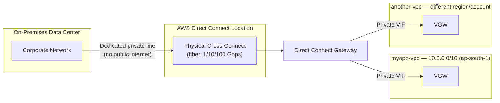

# 16 - AWS Direct Connect

> Goal: understand **AWS Direct Connect (DX)** — a dedicated, private, physical network link from your on-premises facility to AWS that never touches the public internet. Contrasts with Site-to-Site VPN (Note 15) on cost, speed, encryption, and setup time. This is a **conceptual** note, not a hands-on build — DX requires physical hardware, a colocation facility, and often an AWS Partner, so a console-only walkthrough wouldn't reflect reality. High-level console steps are still shown for completeness.

---

## 1. What is Direct Connect, really?

**AWS Direct Connect** is a **dedicated, private, physical network connection** between your on-premises data center (or a colocation/network provider facility) and an AWS **Direct Connect location**. Once established, your traffic to AWS travels over this dedicated link instead of the public internet.

> 🧠 **Mental model:** if Site-to-Site VPN (Note 15) is an armored van driving on public roads, Direct Connect is your own **private road** that only your traffic ever uses — no other cars (internet traffic), no traffic lights (internet congestion/jitter), and by default, no armor (not encrypted) because you own the whole road.

Key properties:
- **Bypasses the public internet entirely** for the traffic that flows over it.
- Requires a physical **cross-connect** at an AWS Direct Connect location (a data center where AWS has a presence) — either your equipment is already in that facility (colocation), or you connect via an **AWS Direct Connect Partner** who extends the link to your actual site.
- Delivered over single- or dual-strand fiber at fixed port speeds: **1 Gbps, 10 Gbps, 100 Gbps**, and (at select locations) **400 Gbps**, for **Dedicated Connections**. Smaller increments (50 Mbps up to 10 Gbps) are available via **Hosted Connections** through a Partner.

---

## 2. Why use Direct Connect over VPN?

| Reason | Explanation |
|---|---|
| **Consistent, predictable latency** | Public internet paths vary hop to hop; DX is a fixed physical circuit with stable latency/jitter — important for latency-sensitive workloads (trading, VOIP, real-time data replication) |
| **Higher bandwidth** | Up to 100 Gbps (400 Gbps at select locations) per dedicated connection, vs VPN's practical throughput ceiling over internet-routed IPSec |
| **Reduced data transfer cost** | Data transferred out over DX is billed at a **lower rate** than standard internet data transfer out |
| **Avoids public internet entirely** | No exposure to internet congestion, no reliance on internet routing stability |

The trade-off: DX is **more expensive** to set up and maintain, and requires **physical provisioning** — this is the crucial exam differentiator (Section 5).

---

## 3. Is Direct Connect encrypted?

**No — not by default.** A standard Direct Connect connection is **private** (isolated from the public internet) but **not encrypted**. Physical isolation ≠ encryption; if your compliance requirement is specifically "encrypted in transit," a bare DX connection doesn't satisfy it on its own.

Two common ways to add encryption on top of DX:
1. **Direct Connect + Site-to-Site VPN combined** — run an IPSec VPN connection *over* a **public VIF** (Section 4) on your DX link. You get the private/dedicated path of DX plus VPN's encryption. AWS documents this pattern explicitly for customers needing both performance and encryption.
2. **AWS Direct Connect with MACsec** — supported at certain DX locations/port speeds, MACsec (802.1AE) encrypts traffic at the physical/data-link layer on the dedicated connection itself, without the overhead of IPSec.

🎯 **Exam tip:** "Direct Connect is not encrypted by default — combine it with a VPN (over a public VIF) if you need both dedicated bandwidth AND encryption" is a frequently tested combination.

---

## 4. Virtual Interfaces (VIFs)

A single physical Direct Connect connection can carry multiple **Virtual Interfaces (VIFs)**, each serving a different purpose — similar in spirit to VLANs:

| VIF type | Connects to | Uses | Notes |
|---|---|---|---|
| **Private VIF** | A VPC (via a **VGW** or a **Direct Connect Gateway**) | Reach private IP resources inside your VPC (EC2, RDS, etc.) | Most common type for hybrid architectures |
| **Public VIF** | **AWS public services** (S3, DynamoDB, public endpoints of any AWS service) reachable via their **public IP ranges** | Reach AWS public services over DX instead of the internet; also the VIF type used to layer a VPN on top for encryption | Requires public IPs (yours or AWS-provided) |
| **Transit VIF** | One or more **Transit Gateways** (Note 17) via a **Direct Connect Gateway** | Reach many VPCs across accounts/regions attached to a Transit Gateway, through one DX connection | The modern, scalable way to connect DX to many VPCs |

You can create **up to 51 VIFs per dedicated connection** (1/10/100 Gbps), including the transit VIF.

### Direct Connect Gateway (DX Gateway)

A **Direct Connect Gateway** is a globally-available resource that lets **one Direct Connect connection** (via a private or transit VIF) reach **multiple VPCs**, across **different regions and even different AWS accounts** — without needing a separate physical connection or VIF per VPC.

- Without a DX Gateway: one private VIF ↔ one VGW ↔ one VPC (1:1).
- With a DX Gateway: one VIF ↔ DX Gateway ↔ many VGWs/VPCs, including VPCs in other regions.

This mirrors the way Note 17's Transit Gateway solves the "many VPCs" scaling problem for VPN/peering — DX Gateway solves the equivalent problem for physical Direct Connect.

---

## 5. Setup timeline: the classic exam trap

| | Site-to-Site VPN | Direct Connect |
|---|---|---|
| Setup time | **Minutes** — fully self-service in the console | **Weeks to months** — requires physical cross-connect, possibly a Partner, site surveys, cabling |
| Why | Software-defined, runs over existing internet connectivity | Physical fiber must be run/patched at a real Direct Connect location |

> ⚠️ **The single most common exam scenario for this topic:** *"Our company needs private connectivity to AWS by **next week** / **as soon as possible**."* Even though Direct Connect looks like the "better" dedicated option on paper, the correct answer is almost always **Site-to-Site VPN**, because **Direct Connect physically cannot be provisioned that fast.** Read timeline clues in the question carefully — they are the deciding factor, not "which is technically superior."

🎯 **Exam tip:** if the question emphasizes **urgency** ("this week," "immediately," "no time for procurement"), think **VPN**. If it emphasizes **sustained high bandwidth, consistent low latency, or large recurring data transfer**, and there's no urgency mentioned, think **Direct Connect**.

---

## 6. Comparison table: Direct Connect vs Site-to-Site VPN

| | Site-to-Site VPN | Direct Connect |
|---|---|---|
| **Path** | Public internet (encrypted tunnel) | Dedicated private physical line |
| **Setup time** | Minutes | Weeks to months |
| **Bandwidth** | Practically capped by internet path + IPSec overhead (AWS also offers higher-throughput VPN options up to ~5 Gbps per connection) | 1 / 10 / 100 / 400 Gbps dedicated port speeds |
| **Latency/consistency** | Variable (internet-dependent) | Consistent, predictable |
| **Encryption** | Yes, always (IPSec) | **No by default** — add VPN-over-public-VIF or MACsec for encryption |
| **Cost** | Low (~$0.05/hr connection fee + standard data transfer) | Higher (port-hour fees + often a Partner's cross-connect fee), but **cheaper per-GB data transfer** at scale |
| **Reliability model** | 2 tunnels across 2 AZs automatically | Design your own redundancy — a single DX connection is a single point of failure unless you provision a second connection/location |
| **Good for** | Quick setup, lower/variable traffic, backup path | Sustained heavy traffic, latency-sensitive workloads, large data migrations |

> ⚠️ Unlike Site-to-Site VPN (which always gives you 2 tunnels automatically), a **single Direct Connect connection has no built-in redundancy**. For production HA, AWS recommends at least **two DX connections at two different DX locations** (or a DX connection + a Site-to-Site VPN as a backup path).

---

## 7. High-level console steps (not a full hands-on)

Because Direct Connect needs physical infrastructure you don't control end-to-end from a browser, this is a **conceptual walkthrough**, not a follow-along build:

1. **VPC/Direct Connect console** → left nav → **Direct Connect** → **Connections** → **Create connection**.
2. Choose **Dedicated Connection** (you own/lease the port) or request via an **AWS Direct Connect Partner** (they extend connectivity from your office to the nearest DX location — the realistic path for most companies).
3. Select a **Direct Connect location** near you, and a port speed (1/10/100 Gbps).
4. AWS (or the Partner) schedules the physical cross-connect — this is the part that takes **weeks**, not minutes.
5. Once the physical connection is `Available`, create a **Virtual Interface**: Direct Connect console → **Virtual Interfaces** → **Create virtual interface** → choose **Private**, **Public**, or **Transit**, supply VLAN ID, BGP ASN, and (for private/transit) the target **VGW** / **Direct Connect Gateway**.
6. If connecting to multiple VPCs/regions, create a **Direct Connect Gateway** first (**Direct Connect Gateways** → **Create**) and associate your VGWs to it.
7. Update your VPC route tables to route relevant CIDRs toward the VGW/DX Gateway, exactly as in Note 15's route propagation step.

---

## 8. Diagram: `myapp-vpc` and a second VPC reached via Direct Connect

---

## 9. Recap

- Direct Connect = a **dedicated physical connection** from on-prem to AWS, bypassing the public internet entirely.
- **Not encrypted by default** — layer a VPN over a public VIF, or use MACsec, if you need encryption.
- **Private VIF** → one VPC (via VGW/DX Gateway). **Public VIF** → AWS public services (or a VPN-over-DX). **Transit VIF** → Transit Gateway, for many VPCs.
- **Direct Connect Gateway** lets one DX connection reach many VPCs across regions/accounts.
- **Setup takes weeks to months** (physical provisioning) — this is the #1 exam differentiator vs VPN's minutes-to-set-up.
- A single DX connection has **no automatic redundancy** — design a second connection/location, or a VPN backup, for HA.
- Next: Note 17 covers **Transit Gateway**, which solves the "many VPCs / many connections" scaling problem that both VPN and Direct Connect eventually run into.

---

### Sources
- [AWS Direct Connect – Amazon VPC Connectivity Options whitepaper](https://docs.aws.amazon.com/whitepapers/latest/aws-vpc-connectivity-options/aws-direct-connect.html)
- [Direct Connect virtual interfaces – AWS docs](https://docs.aws.amazon.com/directconnect/latest/UserGuide/WorkingWithVirtualInterfaces.html)
- [Direct Connect quotas – AWS docs](https://docs.aws.amazon.com/directconnect/latest/UserGuide/limits.html)
- [AWS Direct Connect pricing – AWS](https://aws.amazon.com/directconnect/pricing/)
