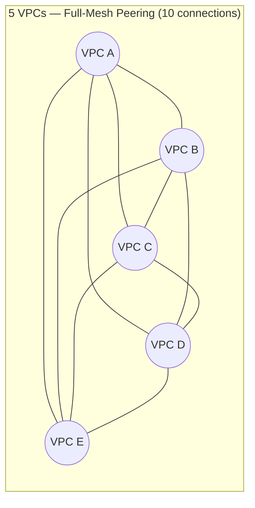
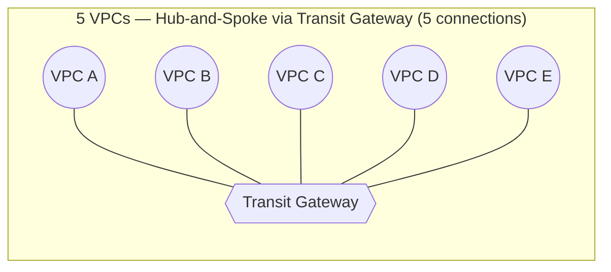
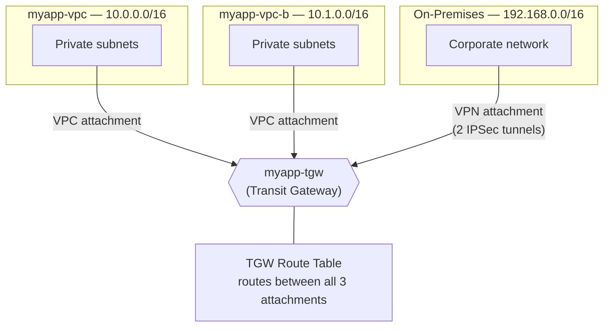

# 17 - VPC Transit Gateway

> Goal: understand **AWS Transit Gateway (TGW)** — a central hub/router that connects many VPCs and on-premises networks without a full mesh of peering connections (Note 11). Covers the peering scalability problem, TGW route tables (segmentation), attachment types, and the TGW-vs-peering decision. Extends the `myapp` example by attaching `myapp-vpc`, `myapp-vpc-b`, and the Site-to-Site VPN from Note 15 to one `myapp-tgw`.

---

## 1. The problem: VPC Peering doesn't scale

Note 11 showed how to peer two VPCs directly. That's fine for two VPCs. But peering connections are **point-to-point** and **not transitive** — if VPC A peers with B, and B peers with C, **A still cannot reach C** through B. To let every VPC talk to every other VPC, you need a peering connection **between every pair**.

The number of connections needed for **N** fully-meshed VPCs is:

```
connections = N(N-1) / 2
```

| N (VPCs) | Full-mesh peering connections needed |
|---|---|
| 2 | 1 |
| 5 | 10 |
| 10 | 45 |
| 20 | 190 |

Each of those connections also needs its own route table entries in **every** VPC's route tables. Ten VPCs means each VPC's route table needs 9 separate peering routes. This becomes unmanageable fast — and VPC peering has a **default soft limit of 50, hard limit of 125** connections per VPC, so at real enterprise scale full-mesh peering simply stops being viable.

> 🧠 **Mental model:** full-mesh peering is like every house in a neighborhood running its own private cable directly to every other house. A **Transit Gateway** is a central switchboard — every house runs **one** cable to the switchboard, and the switchboard routes calls between them.

### Diagram: full-mesh peering nightmare vs hub-and-spoke with TGW





With a TGW, **N** VPCs need only **N** attachments, not N(N-1)/2 — and adding a 6th VPC means adding **one** more attachment, not five more peering connections.

---

## 2. What is Transit Gateway?

**AWS Transit Gateway** is a **regional, highly-available network transit hub** that you attach VPCs, VPN connections, and Direct Connect Gateways to. It routes traffic **between** its attachments based on its own route tables — acting as a central router for your whole network.

Key facts:
- **Regional resource** — a single TGW lives in one AWS Region. To connect TGWs across Regions, you create a **Transit Gateway peering attachment** between two TGWs (Section 5).
- Supports up to **5,000 attachments** per Transit Gateway, and TGW route tables can hold up to **10,000 routes** — built for large-scale hub-and-spoke designs.
- Traffic through a TGW is billed per **attachment-hour** plus a **per-GB data processing charge** — factor this into cost comparisons against "free" VPC peering.

---

## 3. Attachment types

A Transit Gateway doesn't just connect VPCs — it connects several kinds of networks, called **attachments**:

| Attachment type | Connects |
|---|---|
| **VPC attachment** | One VPC (via one subnet per AZ you want reachable) |
| **VPN attachment** | A Site-to-Site VPN connection (Note 15) — instead of terminating on a VGW per-VPC, the VPN terminates on the TGW and can reach every VPC attached to it |
| **Direct Connect Gateway attachment** | A DX Gateway (Note 16), via a **transit VIF** — brings on-prem DX connectivity to every attached VPC through the hub |
| **Peering attachment** | Connects **two Transit Gateways**, including across Regions or AWS accounts — the way to extend a hub-and-spoke design beyond one Region |

This is exactly why Note 15's VPN and Note 16's Direct Connect are relevant here: instead of a VPN/DX connection being wired to one VPC's VGW, you attach it once to the TGW and every VPC on that TGW can reach it — one on-prem connection serving many VPCs.

---

## 4. TGW Route Tables: segmentation and isolation

Even though many VPCs are attached to the **same** Transit Gateway, they are **not automatically able to reach each other**. Routing between attachments is controlled by **Transit Gateway route tables** — a separate concept from VPC route tables.

- Each **attachment** is associated with **one** TGW route table (controls what that attachment can send traffic to).
- Each TGW route table can have routes that **propagate from** one or more attachments (controls what routes that attachment's traffic can be received from).
- By using **multiple TGW route tables**, you can **segment** your network even though everything shares one physical TGW:
  - A `prod-tgw-rt` that only prod VPCs and the prod VPN propagate into/associate with → prod VPCs can reach each other and on-prem, but **not** dev.
  - A `dev-tgw-rt` that only dev VPCs associate with → isolated from prod entirely.
- This is how large organizations get **centralized connectivity with policy-based isolation** — "all VPCs are on one hub, but Finance can't reach Dev" — without needing separate TGWs.

> 🎯 **Exam tip:** "Transit Gateway route tables can segment/isolate certain VPCs from others while all being attached to the same TGW" is a key differentiator tested against simple VPC peering (which has no such centralized control point).

---

## 5. TGW is regional — cross-region needs TGW peering

A Transit Gateway cannot directly attach to a VPC or another TGW in a different Region. To connect hubs across Regions:

1. Create a TGW in each Region (e.g., `myapp-tgw` in `ap-south-1`, another in `us-east-1`).
2. Create a **Transit Gateway peering attachment** between them.
3. Accept the peering attachment on the accepter side.
4. Update both TGWs' route tables to route the other Region's CIDRs across the peering attachment.

Note that **only static routes** are supported over a TGW peering attachment (no dynamic/BGP propagation across the peering link itself) — you must add those routes manually.

---

## 6. Hands-on: attach `myapp-vpc`, `myapp-vpc-b`, and the Site-to-Site VPN to `myapp-tgw`

We bring together three notes' worth of resources: `myapp-vpc` (`10.0.0.0/16`, Notes 01–10), `myapp-vpc-b` (`10.1.0.0/16`, Note 11's peering example), and the Site-to-Site VPN from Note 15 — all attached to one new Transit Gateway so all three can reach each other **through the hub** instead of needing a peering connection AND a separate VPN-per-VPC.

### Step 1 — Create the Transit Gateway

1. VPC console → left nav → **Transit Gateways** → **Create Transit Gateway**.
2. **Name tag**: `myapp-tgw`.
3. **Amazon side ASN**: leave default (used if you later add BGP-based attachments).
4. Leave **DNS support** and **Default route table association/propagation** enabled (simplest for this walkthrough — one shared TGW route table for now).
5. **Create Transit Gateway**. Takes a few minutes to reach state `Available`.

### Step 2 — Create the VPC attachment for `myapp-vpc`

1. Left nav → **Transit Gateway Attachments** → **Create Transit Gateway Attachment**.
2. **Transit Gateway**: `myapp-tgw`.
3. **Attachment type**: **VPC**.
4. **VPC**: `myapp-vpc`.
5. **Subnets**: select one subnet per AZ you want reachable — pick `myapp-private-subnet-1` and `myapp-private-subnet-2` (the TGW places an ENI in each chosen subnet).
6. **Create attachment**.

### Step 3 — Create the VPC attachment for `myapp-vpc-b`

1. Repeat Step 2, **VPC**: `myapp-vpc-b` (`10.1.0.0/16`), selecting its equivalent private subnets.
2. **Create attachment**.

### Step 4 — Attach the Site-to-Site VPN from Note 15

1. **Create Transit Gateway Attachment** → **Attachment type**: **VPN**.
2. **Transit Gateway**: `myapp-tgw`.
3. **Customer Gateway**: choose `myapp-onprem-cgw` (existing, from Note 15) or create a new one.
4. This provisions a fresh Site-to-Site VPN connection **terminating on the TGW** rather than a per-VPC VGW — now `192.168.0.0/16` is reachable by **both** `myapp-vpc` and `myapp-vpc-b` through the same hub, instead of needing a second VPN if `myapp-vpc-b` also wanted on-prem access.

### Step 5 — Update VPC route tables to send cross-VPC/on-prem traffic to the TGW

The TGW attachments alone don't redirect traffic — each **VPC's own route table** still needs a route pointing at the TGW.

1. Route Tables → `myapp-private-rt` (in `myapp-vpc`) → **Edit routes** → **Add route**:
   - Destination `10.1.0.0/16` (myapp-vpc-b's CIDR) → Target: **Transit Gateway** → `myapp-tgw`.
   - Destination `192.168.0.0/16` (on-prem) → Target: `myapp-tgw` (replacing/alongside the direct VGW route from Note 15, depending on which path you keep).
2. In `myapp-vpc-b`'s equivalent private route table → **Add route**:
   - Destination `10.0.0.0/16` (myapp-vpc's CIDR) → Target: `myapp-tgw`.
   - Destination `192.168.0.0/16` → Target: `myapp-tgw`.
3. Both VPCs, plus on-prem, can now reach each other **through `myapp-tgw`** as a hub.

> ⚠️ **CIDRs must not overlap** for any of this to route correctly — exactly the same rule as VPC peering (Note 11). `10.0.0.0/16`, `10.1.0.0/16`, and `192.168.0.0/16` are all distinct, so routing is unambiguous.

---

## 7. Diagram: end state — `myapp-tgw` as the hub



---

## 8. TGW vs VPC Peering: the decision

| Factor | VPC Peering (Note 11) | Transit Gateway |
|---|---|---|
| Cost | Free (only data transfer charged) | Attachment-hour + per-GB data processing charge |
| Topology | Point-to-point, not transitive | Hub-and-spoke, all attachments can reach each other via route tables |
| Scaling to many VPCs | Gets unmanageable fast (N(N-1)/2 connections, 125 hard limit) | Built for it — up to 5,000 attachments |
| Central control / segmentation | None — each peering connection is independent | **Yes** — TGW route tables let you isolate groups (prod vs dev) centrally |
| Connects on-prem (VPN/DX) to many VPCs at once | Not directly — each VPC needs its own VGW | **Yes** — one VPN/DX Gateway attachment serves every VPC on the TGW |
| Cross-region | Peering supports cross-region directly | TGW is regional; needs **TGW peering** for cross-region |

🎯 **Exam tip:** **few VPCs, simple needs, cost-sensitive** → VPC Peering is fine (and effectively free). **Many VPCs, need central routing control, need to share one VPN/Direct Connect across many VPCs, or need segmentation between environments** → Transit Gateway. If the question mentions "hundreds of VPCs" or "central network hub" or "connect on-prem to many VPCs," the answer is almost always **Transit Gateway**.

---

## 9. ⚠️ Clean up to avoid charges

- **Transit Gateway attachments** are billed **per attachment-hour**, plus **per-GB processed** through the TGW — delete VPC/VPN/peering attachments you no longer need.
- Delete attachments before deleting the Transit Gateway itself (VPC attachments, VPN attachment, then the TGW).
- Remember the underlying **Site-to-Site VPN connection** (Note 15) is still billed hourly even after moving it to a TGW attachment — delete it too if it's no longer needed.
- Leftover **route table entries pointing at a deleted TGW** will show as blackholed routes — clean those up in each VPC's route table.

---

## 10. Recap

- VPC Peering doesn't scale past a handful of VPCs — full mesh needs **N(N-1)/2** connections and isn't transitive.
- **Transit Gateway** = a regional hub/router; N VPCs need only **N** attachments.
- Attachment types: **VPC**, **VPN**, **Direct Connect Gateway**, and **TGW peering** (for cross-region).
- **TGW route tables** let you segment/isolate attachments (e.g., prod vs dev) even on one shared TGW.
- TGW is **regional** — cross-region connectivity needs a **TGW peering attachment** with static routes.
- We attached `myapp-vpc`, `myapp-vpc-b`, and the Note 15 Site-to-Site VPN to `myapp-tgw`, then updated each VPC's route table to send cross-VPC/on-prem traffic to the TGW.
- Decision rule: **few VPCs → peering; many VPCs / need central control → Transit Gateway.**
- Next: Note 18 covers **VPC Endpoints and PrivateLink** — private connectivity to AWS services without needing internet/NAT at all.

---

### Sources
- [How AWS Transit Gateway works – AWS docs](https://docs.aws.amazon.com/vpc/latest/tgw/how-transit-gateways-work.html)
- [AWS Transit Gateway quotas – AWS docs](https://docs.aws.amazon.com/vpc/latest/tgw/transit-gateway-quotas.html)
- [Transit Gateway peering attachments – AWS docs](https://docs.aws.amazon.com/vpc/latest/tgw/tgw-peering.html)
- [AWS Transit Gateway FAQs – AWS](https://aws.amazon.com/transit-gateway/faqs/)
