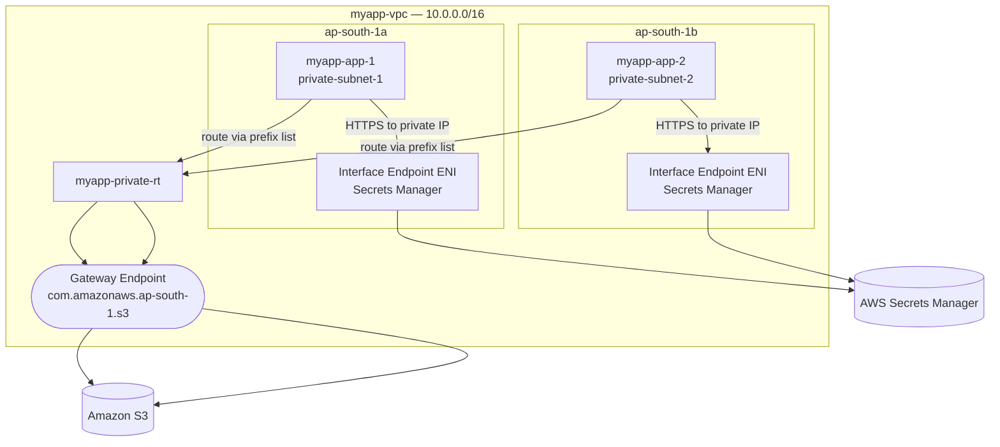

# 18 - VPC Endpoints and AWS PrivateLink

> Goal: understand how instances in a **private subnet** (no IGW, no public IP) can still talk to AWS services like **S3** and **Secrets Manager** without going out to the public internet — and without paying NAT Gateway data-processing fees. Builds on the `myapp-vpc` NAT Gateway design from Note 09. Next: Note 19 (DHCP Option Sets).

---

## 1. The problem: private subnet traffic to AWS services today

In the `myapp-vpc` build so far, `myapp-app-1` sits in `myapp-private-subnet-1` with **no public IP** and **no route to an Internet Gateway**. If it needs to call the **S3 API** (e.g. to read a config file, or write logs), the only route out is:

```
myapp-app-1 → myapp-private-rt (0.0.0.0/0) → myapp-nat-gw → myapp-igw → public internet → S3's public endpoint
```

This works, but has two real downsides:

1. **Cost** — every byte crosses the NAT Gateway, which bills **per GB processed** (Note 09), even though the traffic never leaves AWS's own network geographically.
2. **Security posture** — traffic technically transits the public internet path (via IGW), which some compliance/security teams want to avoid entirely for a "private" resource — they want traffic to **never leave the AWS backbone**.

A **VPC Endpoint** solves both: it lets resources inside your VPC reach an AWS service **privately**, over the AWS network, with **no NAT Gateway and no Internet Gateway involved at all** for that traffic.

> 🧠 **Mental model:** without an endpoint, reaching S3 is like driving out of your gated community, onto the public highway, to a building that happens to be AWS-owned. A VPC Endpoint is a **private tunnel** straight from your gated community to that AWS building — you never touch the public highway.

---

## 2. Two types of VPC Endpoint

| | **Gateway Endpoint** | **Interface Endpoint** |
|---|---|---|
| Powered by | Just a route table entry | **AWS PrivateLink** |
| Supported services | **Only S3 and DynamoDB** | Most other AWS services (Secrets Manager, SSM, KMS, SNS, SQS, ECR, CloudWatch, etc.) + your own PrivateLink-shared services |
| How it works | Adds a **route** in your route table pointing at a special "pl-xxxx" prefix list target for the service | Creates an **ENI** (Elastic Network Interface) with a **private IP** inside your chosen subnet(s) |
| Cost | **Free** | **~$0.01/hour per AZ** + **~$0.01/GB** data processing charge |
| Security control | Endpoint policy (IAM-style JSON) only | Endpoint policy **+ a Security Group** on the ENI |
| DNS | No DNS change needed — route table does the redirect | Can enable **private DNS** so the service's normal hostname (e.g. `secretsmanager.ap-south-1.amazonaws.com`) resolves to the endpoint's private IP automatically |
| Scope | Regional, associated with specific **route tables** | Placed in specific **subnets** (one ENI per subnet/AZ you choose) |

🎯 **Exam tip:** the exam loves this exact question: *"An application in a private subnet needs to reach S3 without using a NAT Gateway or Internet Gateway — what should you use?"* Answer: **Gateway Endpoint** (it's free and purpose-built for S3/DynamoDB). If the service isn't S3 or DynamoDB, the answer becomes **Interface Endpoint (PrivateLink)**.

---

## 3. What is AWS PrivateLink, really?

**AWS PrivateLink** is the underlying technology behind **Interface Endpoints**. It provides private, one-way connectivity from your VPC to:

- **AWS services** (Interface Endpoints, as above), or
- **Your own services**, or
- **Third-party SaaS services** (e.g. Datadog, Snowflake) that publish a PrivateLink endpoint.

The powerful extra capability: you can put **your own application** (e.g. an internal API) behind a **Network Load Balancer**, register it as an **Endpoint Service** (VPC console → **Endpoint Services**), and share it with other VPCs, other AWS accounts, or even customers — **without VPC Peering, without a Transit Gateway, and without ever exposing it to the public internet.**

> 🧠 **Mental model:** VPC Peering connects two whole networks (like joining two buildings' hallways). PrivateLink is far more surgical — it's like installing a single mail slot from one specific room in your building into a specific room in someone else's building. The consumer only ever sees an ENI with a private IP; they never see your VPC's internal layout, CIDR, or other resources.

Key properties of PrivateLink connections:
- **One-directional** — the consumer VPC can reach the service, but the service provider cannot initiate connections back into the consumer's VPC.
- **No overlapping-CIDR problem** — unlike peering, the two VPCs' CIDR ranges can even overlap, because there's no direct routing between the full networks, only to the single ENI.
- **Scales to thousands of consumer VPCs/accounts** without the "full mesh" management headache Transit Gateway/peering can create (Notes 11, 17).


---

## 4. Extending `myapp-vpc`: adding two endpoints

We add:

1. A **Gateway Endpoint for S3**, associated with `myapp-private-rt`, so `myapp-app-1`/`myapp-app-2` can reach S3 without the NAT Gateway.
2. An **Interface Endpoint for Secrets Manager** (e.g. the app fetches a DB password at boot), placed in `myapp-private-subnet-1` and `myapp-private-subnet-2` — one ENI per subnet, for AZ resilience.



Both paths stay entirely inside AWS's network — no IGW, no NAT Gateway, involved for this traffic.

---

## 5. Step-by-step: create the S3 Gateway Endpoint

1. VPC console → left nav **Endpoints** → **Create endpoint**.
2. **Name tag**: `myapp-s3-gateway-endpoint`.
3. **Service category**: AWS services.
4. **Services**: search `s3` → select the entry of **Type = Gateway** (`com.amazonaws.ap-south-1.s3`).
5. **VPC**: `myapp-vpc`.
6. **Route tables**: check **`myapp-private-rt`** (this is what auto-adds the route — you'll see a new route to a `pl-xxxxxxxx` (S3 prefix list) target pointing at the endpoint).
7. **Policy**: leave **Full access** for learning (in production, scope this down to just your bucket ARNs).
8. **Create endpoint**.
9. Verify: Route Tables → `myapp-private-rt` → **Routes** tab → you'll see a new row: destination = `pl-xxxxxxxx` (S3), target = `vpce-xxxxxxxx`.

---

## 6. Step-by-step: create the Secrets Manager Interface Endpoint

1. VPC console → **Endpoints** → **Create endpoint**.
2. **Name tag**: `myapp-secretsmanager-endpoint`.
3. **Service category**: AWS services.
4. **Services**: search `secretsmanager` → select the entry of **Type = Interface**.
5. **VPC**: `myapp-vpc`.
6. **Subnets**: check both **`myapp-private-subnet-1`** and **`myapp-private-subnet-2`** (creates one ENI per AZ, for HA).
7. **Enable DNS name**: leave checked — this lets the app call the normal `secretsmanager.ap-south-1.amazonaws.com` hostname and transparently resolve to the endpoint's private IP, so **no code changes needed**.
8. **Security group**: choose/create one that allows inbound **443 from `myapp-app-sg`** (Note 04) — the endpoint ENI needs its own SG just like an instance would.
9. **Create endpoint**. Status goes `Pending` → `Available` after a minute or two.

---

## 7. Common beginner problems

| Problem | Likely cause / fix |
|---|---|
| App still routes to NAT Gateway for S3 | Gateway endpoint wasn't associated with `myapp-private-rt` — check the endpoint's **Route tables** tab. |
| Interface endpoint times out | Security group on the endpoint ENI doesn't allow port 443 from the calling instance's SG/subnet. |
| App still resolves the public IP for Secrets Manager | **Private DNS** wasn't enabled on the interface endpoint, or the VPC's `enableDnsHostnames`/`enableDnsSupport` attributes are off. |
| "Service not available as Gateway type" | Only **S3 and DynamoDB** support Gateway endpoints — everything else needs an **Interface** endpoint. |

---

## 8. ⚠️ Clean up to avoid charges

- **Interface Endpoints bill hourly per AZ + per GB**, even when idle — delete unused ones (VPC console → Endpoints → select → **Delete VPC endpoints**).
- **Gateway Endpoints are free** — no cost risk, but still remove them if you're tearing down the whole `myapp-vpc` lab, since a route pointing at a deleted VPC breaks nothing but is just clutter.
- If you created an **Endpoint Service** (PrivateLink provider side) fronted by an NLB, remember the **NLB itself bills hourly** too.

---

## 9. Recap

- A **VPC Endpoint** lets private-subnet resources reach AWS services **without a NAT Gateway or Internet Gateway** — traffic stays on the AWS backbone.
- **Gateway Endpoint**: S3 + DynamoDB only, **free**, works via a **route table** entry, no ENI, no security group.
- **Interface Endpoint**: most other AWS services, powered by **AWS PrivateLink**, costs **$/hour + $/GB**, creates an **ENI with a private IP**, controlled by a **security group**.
- **AWS PrivateLink** also lets you expose **your own service** (behind an NLB) privately to other VPCs/accounts as an **Endpoint Service** — no peering, no internet exposure, one-directional.
- We extended `myapp-vpc`: S3 Gateway Endpoint on `myapp-private-rt`, Secrets Manager Interface Endpoint in both private subnets.
- 🎯 **Exam tip:** "private subnet → S3, no NAT/IGW" = Gateway Endpoint. "private subnet → any other AWS service, privately" = Interface Endpoint / PrivateLink.
- Next: **Note 19** — DHCP Option Sets (how instances get their DNS config, and how to point them at an on-prem DNS server).

---

### Sources
- [VPC endpoints – AWS docs](https://docs.aws.amazon.com/vpc/latest/privatelink/vpc-endpoints.html)
- [Gateway endpoints – AWS docs](https://docs.aws.amazon.com/vpc/latest/privatelink/gateway-endpoints.html)
- [Interface endpoints – AWS docs](https://docs.aws.amazon.com/vpc/latest/privatelink/create-interface-endpoint.html)
- [AWS PrivateLink pricing](https://aws.amazon.com/privatelink/pricing/)
