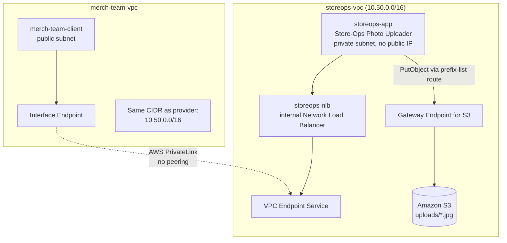

# 18.01 - Hands-On: VPC Gateway Endpoint (S3) and a Real AWS PrivateLink Service

> Goal: prove [Note 18](18-VPC-Endpoints-and-PrivateLink.md)'s claims with your own eyes, wrapped around one real, coherent scenario. This lab is **fully standalone** — it builds its own small VPC from scratch. **Part 1**: a private EC2 app with a real upload form **writes** (`PutObject`) image files straight into S3 through a free Gateway Endpoint — proven by deleting its NAT route entirely and uploading again with no internet route at all. **Part 2**: that same app is published as a genuine **AWS PrivateLink** service and consumed **privately from a second, unrelated team's VPC** — no VPC Peering, and even an **identical, overlapping CIDR** on purpose, to prove PrivateLink genuinely doesn't care.

---

## 0. The real-world scenario behind this lab

**NorthStar Retail**'s store staff photograph shelf displays throughout the day — proof that promotions are set up correctly, stock is facing forward, etc. Those photos need to land in S3 so the Merchandising team can review them later. The app that receives the uploads, **Store-Ops Photo Uploader**, runs on a **private** EC2 instance — no public IP, nobody should reach it directly from the internet.

That raises the first real question: **how does a private EC2 instance write files to S3 without a route to the internet?** Routing every upload through a NAT Gateway would work, but it's needlessly expensive and pushes real (if internal) traffic out over what looks like a public internet path for something that's really just AWS-to-AWS traffic. **Part 1** answers this with a **Gateway Endpoint**: free, and it keeps all S3 traffic — uploads included, not just reads — entirely on AWS's own network. Proven here by deleting the NAT route completely and showing a fresh photo upload still succeeds.

The second question: the **Merchandising team** runs in their own separate VPC (different subnet plan, possibly a different AWS account) and wants to browse the uploaded photos without touching Store-Ops' network directly. The obvious answer, **VPC Peering**, breaks down fast once more than one or two teams need this:

| | VPC Peering | AWS PrivateLink (Interface Endpoint) |
|---|---|---|
| **Scales to many consumers how** | One peering connection **per pair** of VPCs — a full mesh gets unmanageable past a handful of teams | One **Endpoint Service**, published once; any number of consumers just create their own Interface Endpoint pointing at it |
| **CIDR requirement** | The two VPCs' CIDR ranges **must not overlap** | **No CIDR restriction at all** — only a single private ENI is exposed, not full network routing |
| **Routing** | Full bidirectional network routing between both VPCs (and **not transitive** — A↔B and B↔C doesn't give A↔C) | **One-directional only** — the consumer can reach the published service, and nothing else in the provider's VPC |
| **Where this lab uses it** | — | **Part 2**: `merch-team-vpc` reaches the Store-Ops app with a CIDR **identical** to the provider's own VPC, and zero peering connections anywhere |

**Part 2** builds exactly this: Store-Ops is published once as a **VPC Endpoint Service**, and a second VPC (standing in for the Merchandising team, deliberately given the exact same `10.50.0.0/16` CIDR) reaches it through an **Interface Endpoint** — real cross-VPC traffic, no peering, no CIDR planning.

---

## 1. What you're building



---

## 2. Part 0 — Build the standalone lab VPC

### 2.1 Create the VPC and subnets

1. **VPC console** → **Create VPC** → **VPC only** → **Name**: `storeops-vpc` → **IPv4 CIDR**: `10.50.0.0/16` → **Create VPC**.
2. **Subnets** → **Create subnet** → **VPC**: `storeops-vpc`:
   - `storeops-public-subnet` — AZ `ap-south-1a` — CIDR `10.50.1.0/24`.
   - `storeops-private-subnet` — AZ `ap-south-1a` — CIDR `10.50.11.0/24`.
3. **Create internet gateway** → `storeops-igw` → **Attach to VPC** → `storeops-vpc`.

### 2.2 Public routing and the NAT Gateway

1. **Route Tables** → **Create route table** → `storeops-public-rt` → **VPC**: `storeops-vpc`.
2. **Routes** → **Edit routes** → add `0.0.0.0/0 → storeops-igw` → **Save**.
3. **Subnet associations** → associate `storeops-public-subnet`.
4. **NAT Gateways** → **Create NAT gateway** → **Name**: `storeops-nat-gw` → **Subnet**: `storeops-public-subnet` → **Allocate Elastic IP** → **Create**. Wait for **Available**.
5. **Route Tables** → **Create route table** → `storeops-private-rt` → **VPC**: `storeops-vpc`.
6. **Routes** → **Edit routes** → add `0.0.0.0/0 → storeops-nat-gw` → **Save**.
7. **Subnet associations** → associate `storeops-private-subnet`.

### 2.3 Security groups

1. **`storeops-app-sg`** (for the app instance) — inbound: **HTTP 80** from `10.50.0.0/16`.
2. **`storeops-eice-sg`** (for the connect endpoint, created next) — no inbound rules needed; default outbound (all traffic) is fine.

### 2.4 An EC2 Instance Connect Endpoint — keyless, bastion-free access into the private subnet

This is the modern, fully console-based way to reach a private instance directly — no bastion host, no key-pair juggling, no public IP on the target.

1. **VPC console** → **Endpoints** → **Create endpoint**.
2. **Name tag**: `storeops-eice`.
3. **Type**: **EC2 Instance Connect Endpoint**.
4. **VPC**: `storeops-vpc` → **Subnet**: `storeops-private-subnet`.
5. **Security groups**: `storeops-eice-sg`.
6. **Create endpoint**. Wait for status **Available** (a few minutes).
7. Back on `storeops-app-sg` (once the app instance exists) → add inbound rule: **SSH 22** from source **`storeops-eice-sg`** — this is what actually lets the endpoint reach the instance.
8. On `storeops-eice-sg` → confirm/add an outbound rule: **SSH 22** to destination **`storeops-app-sg`**.

### 2.5 Create the S3 bucket

1. **S3 console** → **Create bucket** → `storeops-bucket-<your-name-or-date>` → leave block-all-public-access on → **Create bucket**. No need to upload anything — the app writes into it at runtime.

### 2.6 IAM role — a scoped custom policy, not a broad managed one

The app needs to both **list** and **write** objects in exactly one bucket — a good moment to use a least-privilege custom policy instead of a broad managed policy like `AmazonS3ReadOnlyAccess` (which wouldn't even allow uploads).

1. **IAM console** → **Policies** → **Create policy** → **JSON** tab → paste the content of [`demo-site/18.01/s3-access-policy.json`](demo-site/18.01/s3-access-policy.json), replacing both `<STOREOPS_BUCKET_NAME>` placeholders with your real bucket name from Section 2.5:
   ```json
   {
     "Version": "2012-10-17",
     "Statement": [
       {
         "Sid": "ListBucket",
         "Effect": "Allow",
         "Action": ["s3:ListBucket"],
         "Resource": "arn:aws:s3:::<STOREOPS_BUCKET_NAME>"
       },
       {
         "Sid": "ReadWriteObjects",
         "Effect": "Allow",
         "Action": ["s3:PutObject", "s3:GetObject"],
         "Resource": "arn:aws:s3:::<STOREOPS_BUCKET_NAME>/*"
       }
     ]
   }
   ```
2. **Next** → **Policy name**: `storeops-s3-access-policy` → **Create policy**.
3. **IAM console** → **Roles** → **Create role** → **AWS service** → **EC2** → attach **`storeops-s3-access-policy`** → **Role name**: `storeops-s3-role` → **Create role**.

### 2.7 Launch the Store-Ops app instance — doubles as the Part 1 upload client and the Part 2 PrivateLink service

The app itself is a small Flask service (`pip install`, this project's one approved non-console exception, same as elsewhere in this series) that serves an upload form and lists what's already in the bucket.

1. **EC2 console** → **Launch instances** → **Name**: `storeops-app`.
2. **AMI**: Amazon Linux 2023 → **Instance type**: `t3.micro` → **Key pair**: **Proceed without a key pair** (not needed — access is via the Connect Endpoint).
3. **Network settings**: **VPC**: `storeops-vpc` → **Subnet**: `storeops-private-subnet` → **Auto-assign public IP**: Disable → **Security group**: `storeops-app-sg`.
4. **Advanced details** → **IAM instance profile**: `storeops-s3-role`.
5. **Advanced details → User data** — installs Flask and boto3, writes the app from [`demo-site/18.01/app.py`](demo-site/18.01/app.py), and runs it as a systemd service using [`demo-site/18.01/storeops.service`](demo-site/18.01/storeops.service). **Before pasting**, replace `<STOREOPS_BUCKET_NAME>` in the `Environment=` line with your real bucket name from Section 2.5:
   ```bash
   #!/bin/bash
   dnf install -y python3-pip
   pip3 install flask boto3

   mkdir -p /opt/storeops
   cat > /opt/storeops/app.py << 'APPEOF'
   from flask import Flask, request, redirect
   import boto3
   import os

   app = Flask(__name__)
   s3 = boto3.client('s3', region_name='ap-south-1')
   BUCKET = os.environ.get('STOREOPS_BUCKET', '<STOREOPS_BUCKET_NAME>')
   PREFIX = 'uploads/'

   PAGE = """<!DOCTYPE html>
   <html lang="en">
   <head>
   <meta charset="UTF-8">
   <title>NorthStar Retail - Store-Ops Photo Uploader</title>
   <style>
     :root {{ --aws-orange:#FF9900; --aws-dark:#131A22; --aws-darker:#0F1111; --aws-text:#E9ECEF; }}
     * {{ box-sizing:border-box; margin:0; padding:0; }}
     body {{ background:#0F1111; color:var(--aws-text); font-family:'Segoe UI',Arial,sans-serif; padding:40px; }}
     .badge {{ display:inline-block; background:var(--aws-orange); color:#131A22; font-weight:700; font-size:12px; letter-spacing:1px; padding:6px 14px; border-radius:999px; text-transform:uppercase; margin-bottom:18px; }}
     h1 {{ font-size:26px; margin-bottom:6px; }}
     h1 span {{ color:var(--aws-orange); }}
     .subtitle {{ color:#9AA5B1; margin-bottom:24px; font-size:14px; }}
     form {{ margin-bottom:24px; }}
     input[type=file] {{ color:#E9ECEF; }}
     button {{ background:var(--aws-orange); color:#131A22; font-weight:700; border:none; padding:10px 18px; border-radius:8px; cursor:pointer; margin-left:10px; }}
     table {{ width:100%; border-collapse:collapse; background:var(--aws-dark); border:1px solid #2b3542; border-radius:8px; overflow:hidden; }}
     th, td {{ padding:10px 14px; text-align:left; border-bottom:1px solid #2b3542; font-size:14px; }}
     th {{ background:#1B2430; color:var(--aws-orange); text-transform:uppercase; font-size:12px; letter-spacing:1px; }}
   </style>
   </head>
   <body>
     <span class="badge">Store-Ops Photo Uploader</span>
     <h1>NorthStar<span> Retail</span> — Shelf Photos</h1>
     <p class="subtitle">{count} photo(s) stored in s3://{bucket}/{prefix} via the VPC Gateway Endpoint</p>
     <form method="POST" action="/upload" enctype="multipart/form-data">
       <input type="file" name="photo" required>
       <button type="submit">Upload</button>
     </form>
     <table>
       <tr><th>File</th><th>Size</th><th>Uploaded</th></tr>
       {rows}
     </table>
   </body>
   </html>"""

   @app.route('/')
   def index():
       resp = s3.list_objects_v2(Bucket=BUCKET, Prefix=PREFIX)
       objs = resp.get('Contents', [])
       rows = ''.join(
           "<tr><td>{}</td><td>{} bytes</td><td>{}</td></tr>".format(
               o['Key'].replace(PREFIX, ''), o['Size'], o['LastModified'].strftime('%Y-%m-%d %H:%M:%S')
           )
           for o in objs
       )
       return PAGE.format(
           count=len(objs), bucket=BUCKET, prefix=PREFIX,
           rows=rows or '<tr><td colspan="3">No photos uploaded yet.</td></tr>'
       )

   @app.route('/upload', methods=['POST'])
   def upload():
       f = request.files['photo']
       key = PREFIX + f.filename
       s3.upload_fileobj(f, BUCKET, key)
       return redirect('/')

   if __name__ == '__main__':
       app.run(host='0.0.0.0', port=80)
   APPEOF

   cat > /etc/systemd/system/storeops.service << 'SERVICEEOF'
   [Unit]
   Description=Store-Ops Photo Uploader
   After=network.target

   [Service]
   ExecStart=/usr/bin/python3 /opt/storeops/app.py
   Restart=always
   User=root
   Environment=STOREOPS_BUCKET=<STOREOPS_BUCKET_NAME>

   [Install]
   WantedBy=multi-user.target
   SERVICEEOF

   systemctl daemon-reload
   systemctl enable --now storeops
   ```
6. **Launch instance**.
7. Confirm you can reach it: **EC2 console** → select `storeops-app` → **Connect** → **EC2 Instance Connect Endpoint** tab → **Connect**. A browser terminal opens directly, with no public IP and no key pair involved.

---

## 3. Part 1 — Gateway Endpoint: the upload still works with the NAT route *removed entirely*

### 3.1 Baseline: upload a photo — via the NAT Gateway

The instance has no public IP or ALB in front of it yet, so drive the app locally from the browser terminal opened in Section 2.7, Step 7 — this simulates exactly what the real upload form's `POST /upload` does:

```bash
curl -s http://localhost/ | grep -i "photo(s) stored"          # starts at 0
head -c 50000 /dev/urandom > /tmp/shelf-photo-01.jpg            # stand-in for a real camera photo
curl -s -F "photo=@/tmp/shelf-photo-01.jpg" http://localhost/upload -o /dev/null -w "%{http_code}\n"
curl -s http://localhost/ | grep -i "photo(s) stored"           # now reads 1
```

The count moves from **0** to **1 photo(s) stored** — a real `PutObject` call landed in S3. Right now that call's route was `storeops-app → storeops-private-rt (0.0.0.0/0) → storeops-nat-gw → storeops-igw → S3's public endpoint` — exactly [Note 18](18-VPC-Endpoints-and-PrivateLink.md) Section 1's "expensive, internet-transiting" baseline path.

(Optional but convincing) **CloudWatch console** → **Metrics** → **NAT Gateway** → `storeops-nat-gw` → **BytesOutToDestination** — note the small bump from the upload above.


### 3.2 Create the S3 Gateway Endpoint

1. **VPC console** → **Endpoints** → **Create endpoint**.
2. **Name tag**: `storeops-s3-gw-endpoint`.
3. **Service category**: **AWS services** → search `s3` → select the entry with **Type = Gateway** (`com.amazonaws.ap-south-1.s3`).


4. **VPC**: `storeops-vpc` → **Route tables**: check `storeops-private-rt`.
5. **Policy**: leave **Full access** for this demo → **Create endpoint**.


6. Confirm: **Route Tables** → `storeops-private-rt` → **Routes** — a new row appears, destination `pl-xxxxxxxx` (the S3 prefix list), target `vpce-xxxxxxxx`.


### 3.3 The definitive test — remove the NAT route completely, then upload again

1. **Route Tables** → `storeops-private-rt` → **Routes** → **Edit routes** → **delete** the `0.0.0.0/0 → storeops-nat-gw` row entirely → **Save changes**.
2. Back on `storeops-app`'s browser terminal:
   ```bash
   curl -m 5 https://amazon.com                                     # should now fail — no internet route at all
   head -c 50000 /dev/urandom > /tmp/shelf-photo-02.jpg
   curl -s -F "photo=@/tmp/shelf-photo-02.jpg" http://localhost/upload -o /dev/null -w "%{http_code}\n"
   curl -s http://localhost/ | grep -i "photo(s) stored"            # should now read 2
   ```
3. The `curl` to the open internet times out (no NAT route left), but the upload **still succeeds** and the count moves to **2 photo(s) stored** — proof the `PutObject` call was never actually using the NAT Gateway's `0.0.0.0/0` route, it was riding the endpoint's prefix-list route the whole time, and it keeps working for *every future upload*, not just a one-time boot fetch.

### 3.4 Restore the NAT route

Add `0.0.0.0/0 → storeops-nat-gw` back to `storeops-private-rt`, so the lab VPC is back to normal before Part 2.

---

## 4. Part 2 — Publish Store-Ops via AWS PrivateLink, consumed from the Merchandising team's VPC

`storeops-vpc` becomes the **service provider**. A brand-new, unrelated VPC standing in for the **Merchandising team** — deliberately given the **exact same CIDR**, `10.50.0.0/16` — becomes the **service consumer**. If Merchandising can still browse the uploaded photos with zero VPC Peering and an identical CIDR, Section 0's "no overlapping-CIDR problem" claim is proven, not just stated.

### 4.1 Provider side — the internal NLB and the Endpoint Service

**Create the internal Network Load Balancer**

1. **EC2 console** → **Load Balancers** → **Create load balancer** → **Network Load Balancer**.
2. **Name**: `storeops-nlb` → **Scheme**: **Internal**.
3. **VPC**: `storeops-vpc` → **Mappings**: select `storeops-private-subnet` (and `storeops-public-subnet` too, if the console requires two subnets — the NLB itself stays internal regardless).
4. **Listener**: TCP `80` → **Create target group**:
   - **Target type**: Instances → **Protocol/Port**: TCP `80` → **VPC**: `storeops-vpc`.
   - Register `storeops-app` as the target.
5. **Create load balancer**. Wait for **Active**.

**Create the Endpoint Service**

1. **VPC console** → **Endpoint Services** → **Create endpoint service**.
2. **Load balancer type**: **Network** → **Load balancers**: `storeops-nlb`.
3. **Require acceptance for endpoint**: **Yes** — the real, exam-relevant workflow: a consumer's connection request must be explicitly **accepted** by the provider, not auto-approved.
4. **Create service**. Note the generated **Service name**, e.g. `com.amazonaws.vpce.ap-south-1.vpce-svc-0123456789abcdef0` — the only thing the consumer side will ever need.

### 4.2 Consumer side — the Merchandising team's own, independent VPC, same CIDR

1. **VPC console** → **Create VPC** → **VPC only** → **Name**: `merch-team-vpc` → **IPv4 CIDR**: `10.50.0.0/16` — **deliberately identical** to `storeops-vpc`'s own CIDR, exactly as an unrelated team's own VPC would realistically be planned → **Create VPC**.
2. **Subnets** → **Create subnet** → `merch-team-subnet` → CIDR `10.50.2.0/24`.
3. **Create internet gateway** → `merch-team-igw` → attach to `merch-team-vpc`.
4. **Route Tables** → **Create route table** → `merch-team-rt` → add `0.0.0.0/0 → merch-team-igw` → associate `merch-team-subnet`.

**Launch the Merchandising team's client instance**

1. **EC2 console** → **Launch instances** → **Name**: `merch-team-client`.
2. **VPC**: `merch-team-vpc` → **Subnet**: `merch-team-subnet` → **Auto-assign public IP**: Enable.
3. **Security group**: create `merch-team-sg` — inbound **SSH 22** from **My IP**.
4. **Key pair**: **Proceed without a key pair** (connect via **EC2 Instance Connect**, since this instance has a public IP) → **Launch instance**.

**Create the Interface Endpoint pointing at the provider's service**

1. **VPC console** → **Endpoints** → **Create endpoint**.
2. **Service category**: **Other endpoint services**.
3. **Service name**: paste the `com.amazonaws.vpce.ap-south-1.vpce-svc-...` value from Section 4.1 → **Verify service**.
4. **VPC**: `merch-team-vpc` → **Subnets**: `merch-team-subnet`.
5. **Security group**: create `merch-team-interface-sg` — inbound **TCP 80** from `merch-team-sg`.
6. **Create endpoint**. Status: `Pending acceptance`.

### 4.3 Accept the connection on the provider side

1. **VPC console** (in the provider account/session) → **Endpoint Services** → the service backing `storeops-nlb` → **Endpoint connections** tab.
2. Select the pending connection request from `merch-team-vpc` → **Actions** → **Accept endpoint connection request**.
3. Refresh the consumer side's endpoint — status flips to **Available**.

### 4.4 Test it — Merchandising browses the live uploads, zero peering

1. **EC2 console** → select `merch-team-client` → **Connect** → **EC2 Instance Connect** → **Connect** (browser terminal, no key pair needed).
2. **VPC console** (consumer side) → the Interface Endpoint → note its **DNS name** (or private IP).
3. From inside the instance:
   ```bash
   curl -s http://<endpoint-private-dns-or-ip>/ | grep -i "photo(s) stored"
   ```
4. Confirm it reads **2 photo(s) stored** — the *exact same live upload data* `storeops-app` holds, real HTTP content, reached from a **completely separate VPC with an identical CIDR**, with **no VPC Peering connection anywhere in this account**. This is the payoff: Merchandising never touched `storeops-vpc`'s network at all — PrivateLink only ever exposed the one service, nothing else.

---

## 5. Common problems

| Problem | Likely cause / fix |
|---|---|
| Can't connect to `storeops-app` via the Connect Endpoint | `storeops-app-sg` doesn't allow inbound 22 from `storeops-eice-sg`, or the Connect Endpoint isn't yet **Available** — recheck Section 2.4 |
| Homepage shows an error instead of the upload form | The `storeops` service failed to start — reconnect via the Instance Connect Endpoint and run `systemctl status storeops` / `journalctl -u storeops -e`; usually a missed `<STOREOPS_BUCKET_NAME>` placeholder or the IAM role not being attached at launch |
| Upload returns an error / count doesn't increase | `storeops-s3-role` doesn't have `s3:PutObject` on the bucket — recheck the custom policy in Section 2.6, and that its bucket ARN matches your real bucket name exactly |
| Part 1: upload fails *after* deleting the NAT route | The Gateway Endpoint wasn't actually associated with `storeops-private-rt` — recheck the endpoint's **Route tables** tab |
| Part 2: Endpoint connection stuck on `Pending acceptance` forever | You forgot Section 4.3 — the provider must explicitly accept it, since **Require acceptance** was set to **Yes** |
| Part 2: `curl` from `merch-team-client` times out | The Interface Endpoint's security group doesn't allow inbound 80 from `merch-team-sg`, or `storeops-app-sg` doesn't allow 80 from `10.50.0.0/16` |
| Part 2: NLB target shows `unhealthy` | Confirm the `storeops` service is actually running and bound to port 80 — `systemctl status storeops` |

---

## 6. ⚠️ Clean up to avoid charges

Delete in this order:

1. **Part 2**: delete the Interface Endpoint (consumer side); delete the Endpoint Service and `storeops-nlb` (provider side); terminate `merch-team-client`; delete `merch-team-vpc` (its IGW, route table, subnet).
2. **Part 1**: delete the S3 Gateway Endpoint; empty and delete `storeops-bucket-<...>`.
3. **Part 0**: delete the EC2 Instance Connect Endpoint; terminate `storeops-app`; delete `storeops-nat-gw` (releases the Elastic IP separately — release it too); delete both route tables, both subnets, `storeops-igw`, and finally `storeops-vpc`; delete `storeops-s3-role` and `storeops-s3-access-policy`.

---

## 7. Recap

- The whole lab hangs off one real scenario: NorthStar Retail's **Store-Ops Photo Uploader**, a private EC2 app that lets staff **write** real files into S3 through a genuine upload form, not just read a static one.
- **Part 1** proved [Note 18](18-VPC-Endpoints-and-PrivateLink.md)'s Gateway Endpoint claim the hard way, for a **write** path this time: with the NAT route **deleted entirely**, a fresh photo upload still succeeded — direct evidence `PutObject` traffic never depended on NAT/IGW, for every future upload, not just a one-time fetch.
- **Part 2** answered "why not just use VPC Peering for the other teams" concretely: a full peering mesh doesn't scale, requires non-overlapping CIDRs, and isn't transitive. **AWS PrivateLink** solved it by publishing the service **once** as an **Endpoint Service** (with **Require acceptance** enforced — the real provider-side workflow), consumed by a `merch-team-vpc` with an **identical `10.50.0.0/16` CIDR** and **no VPC Peering connection** — concrete proof PrivateLink doesn't route between the two networks at all, only to the one exposed ENI.
- The **EC2 Instance Connect Endpoint** used throughout provided keyless, bastion-free access to a fully private instance — the modern replacement for the jump-host pattern.
- Next: [Note 19 — DHCP Option Sets](19-DHCP-Option-Sets.md).

### Sources
- [Gateway endpoints — AWS docs](https://docs.aws.amazon.com/vpc/latest/privatelink/gateway-endpoints.html)
- [Create a VPC endpoint service — AWS docs](https://docs.aws.amazon.com/vpc/latest/privatelink/create-endpoint-service.html)
- [Accept and reject interface endpoint connection requests — AWS docs](https://docs.aws.amazon.com/vpc/latest/privatelink/configure-endpoint-service.html)
- [Create an EC2 Instance Connect Endpoint — AWS docs](https://docs.aws.amazon.com/AWSEC2/latest/UserGuide/create-ec2-instance-connect-endpoints.html)
- [Security groups for EC2 Instance Connect Endpoint — AWS docs](https://docs.aws.amazon.com/AWSEC2/latest/UserGuide/eice-security-groups.html)
