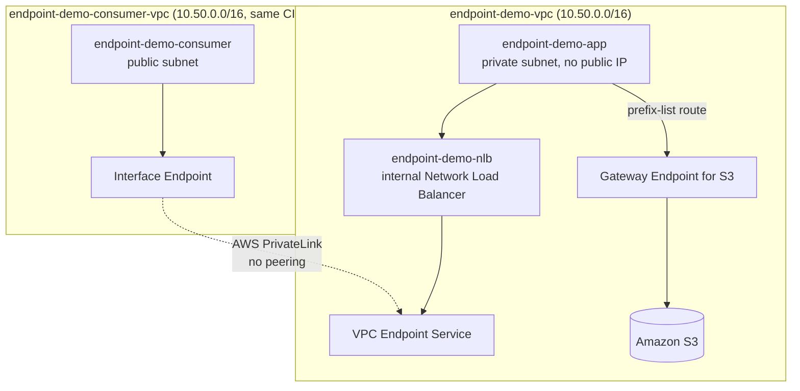

# 18.01 - Hands-On: VPC Gateway Endpoint (S3) and a Real AWS PrivateLink Service

> Goal: prove [Note 18](18-VPC-Endpoints-and-PrivateLink.md)'s claims with your own eyes, not just read them. This lab is **fully standalone** — it builds its own small VPC from scratch, so it doesn't depend on any other note in this folder. **Part 1** keeps it simple — a private EC2 instance still reaches **S3** through a free Gateway Endpoint, proven by deleting its NAT route entirely. **Part 2** goes end-to-end and builds a genuine **AWS PrivateLink** service: a small app on EC2 exposed through an NLB as an **Endpoint Service**, consumed **privately from a second, completely separate VPC** — with no VPC Peering, and even an **identical, overlapping CIDR** on purpose, to prove PrivateLink genuinely doesn't care.

---

## 1. What you're building



---

## 2. Part 0 — Build the standalone lab VPC

### 2.1 Create the VPC and subnets

1. **VPC console** → **Create VPC** → **VPC only** → **Name**: `endpoint-demo-vpc` → **IPv4 CIDR**: `10.50.0.0/16` → **Create VPC**.
2. **Subnets** → **Create subnet** → **VPC**: `endpoint-demo-vpc`:
   - `endpoint-demo-public-subnet` — AZ `ap-south-1a` — CIDR `10.50.1.0/24`.
   - `endpoint-demo-private-subnet` — AZ `ap-south-1a` — CIDR `10.50.11.0/24`.
3. **Create internet gateway** → `endpoint-demo-igw` → **Attach to VPC** → `endpoint-demo-vpc`.

### 2.2 Public routing and the NAT Gateway

1. **Route Tables** → **Create route table** → `endpoint-demo-public-rt` → **VPC**: `endpoint-demo-vpc`.
2. **Routes** → **Edit routes** → add `0.0.0.0/0 → endpoint-demo-igw` → **Save**.
3. **Subnet associations** → associate `endpoint-demo-public-subnet`.
4. **NAT Gateways** → **Create NAT gateway** → **Name**: `endpoint-demo-nat-gw` → **Subnet**: `endpoint-demo-public-subnet` → **Allocate Elastic IP** → **Create**. Wait for **Available**.
5. **Route Tables** → **Create route table** → `endpoint-demo-private-rt` → **VPC**: `endpoint-demo-vpc`.
6. **Routes** → **Edit routes** → add `0.0.0.0/0 → endpoint-demo-nat-gw` → **Save**.
7. **Subnet associations** → associate `endpoint-demo-private-subnet`.

### 2.3 Security groups

1. **`endpoint-demo-app-sg`** (for the app instance) — inbound: **HTTP 80** from `10.50.0.0/16`.
2. **`endpoint-demo-eice-sg`** (for the connect endpoint, created next) — no inbound rules needed; default outbound (all traffic) is fine.

### 2.4 An EC2 Instance Connect Endpoint — keyless, bastion-free access into the private subnet

This is the modern, fully console-based way to reach a private instance directly — no bastion host, no key-pair juggling, no public IP on the target.

1. **VPC console** → **Endpoints** → **Create endpoint**.
2. **Type**: **EC2 Instance Connect Endpoint**.
3. **VPC**: `endpoint-demo-vpc` → **Subnet**: `endpoint-demo-private-subnet`.
4. **Security groups**: `endpoint-demo-eice-sg`.
5. **Create endpoint**. Wait for status **Available** (a few minutes).
6. Back on `endpoint-demo-app-sg` (once the app instance exists) → add inbound rule: **SSH 22** from source **`endpoint-demo-eice-sg`** — this is what actually lets the endpoint reach the instance.
7. On `endpoint-demo-eice-sg` → confirm/add an outbound rule: **SSH 22** to destination **`endpoint-demo-app-sg`**.

### 2.5 IAM role for S3 access

1. **IAM console** → **Roles** → **Create role** → **AWS service** → **EC2** → attach **`AmazonS3ReadOnlyAccess`** → **Role name**: `endpoint-demo-s3-role` → **Create role**.

### 2.6 Launch the app instance — doubles as the Part 1 S3 client and the Part 2 PrivateLink service

1. **EC2 console** → **Launch instances** → **Name**: `endpoint-demo-app`.
2. **AMI**: Amazon Linux 2023 → **Instance type**: `t3.micro` → **Key pair**: **Proceed without a key pair** (not needed — access is via the Connect Endpoint).
3. **Network settings**: **VPC**: `endpoint-demo-vpc` → **Subnet**: `endpoint-demo-private-subnet` → **Auto-assign public IP**: Disable → **Security group**: `endpoint-demo-app-sg`.
4. **Advanced details** → **IAM instance profile**: `endpoint-demo-s3-role`.
5. **Advanced details → User data**:
   ```bash
   #!/bin/bash
   dnf install -y httpd
   systemctl enable --now httpd
   cat << 'EOF' > /var/www/html/index.html
   <html><body style="background:#000;color:#ff8c00;font-family:sans-serif;text-align:center;padding-top:15%">
   <h1>DevopsWithDeepak — PrivateLink Demo Service</h1>
   <p>Reached privately via AWS PrivateLink — no VPC Peering, no internet.</p>
   </body></html>
   EOF
   ```
6. **Launch instance**.
7. Confirm you can reach it: **EC2 console** → select `endpoint-demo-app` → **Connect** → **EC2 Instance Connect Endpoint** tab → **Connect**. A browser terminal opens directly, with no public IP and no key pair involved.

---

## 3. Part 1 — Gateway Endpoint: prove S3 works with the NAT route *removed entirely*

### 3.1 Create a test bucket

1. **S3 console** → **Create bucket** → `endpoint-demo-bucket-<your-name-or-date>` → leave block-all-public-access on → **Create bucket**.
2. Upload one small test file, e.g. `hello.txt`.

### 3.2 Baseline: prove S3 currently works *via the NAT Gateway*

1. In the `endpoint-demo-app` browser terminal (Section 2.6, Step 7):
   ```bash
   aws s3 ls s3://endpoint-demo-bucket-<...>/ --region ap-south-1
   ```
2. It succeeds. Right now this traffic's route is `endpoint-demo-app → endpoint-demo-private-rt (0.0.0.0/0) → endpoint-demo-nat-gw → endpoint-demo-igw → S3's public endpoint` — exactly [Note 18](18-VPC-Endpoints-and-PrivateLink.md) Section 1's "expensive, internet-transiting" baseline path.
3. (Optional but convincing) **CloudWatch console** → **Metrics** → **NAT Gateway** → `endpoint-demo-nat-gw` → **BytesOutToDestination** — note the small bump from the command above.

### 3.3 Create the S3 Gateway Endpoint

1. **VPC console** → **Endpoints** → **Create endpoint**.
2. **Name tag**: `endpoint-demo-s3-gw-endpoint`.
3. **Service category**: **AWS services** → search `s3` → select the entry with **Type = Gateway** (`com.amazonaws.ap-south-1.s3`).
4. **VPC**: `endpoint-demo-vpc` → **Route tables**: check `endpoint-demo-private-rt`.
5. **Policy**: leave **Full access** for this demo → **Create endpoint**.
6. Confirm: **Route Tables** → `endpoint-demo-private-rt` → **Routes** — a new row appears, destination `pl-xxxxxxxx` (the S3 prefix list), target `vpce-xxxxxxxx`.

### 3.4 The definitive test — remove the NAT route completely

1. **Route Tables** → `endpoint-demo-private-rt` → **Routes** → **Edit routes** → **delete** the `0.0.0.0/0 → endpoint-demo-nat-gw` row entirely → **Save changes**.
2. Back on `endpoint-demo-app`:
   ```bash
   curl -m 5 https://amazon.com          # should now fail — no internet route at all
   aws s3 ls s3://endpoint-demo-bucket-<...>/ --region ap-south-1   # should still SUCCEED
   ```
3. The `curl` to the open internet times out (no NAT route left), but `aws s3 ls` **still works** — proof the S3 traffic was never actually using the NAT Gateway's `0.0.0.0/0` route, it was riding the endpoint's prefix-list route the whole time.

### 3.5 Restore the NAT route

Add `0.0.0.0/0 → endpoint-demo-nat-gw` back to `endpoint-demo-private-rt`, so the lab VPC is back to normal before Part 2.

---

## 4. Part 2 — A real AWS PrivateLink service, consumed from a second, unrelated VPC

`endpoint-demo-vpc` becomes the **service provider**. A brand-new, tiny VPC — deliberately given the **exact same CIDR**, `10.50.0.0/16` — becomes the **service consumer**. If this still works with zero VPC Peering and an identical CIDR, [Note 18](18-VPC-Endpoints-and-PrivateLink.md) Section 3's "no overlapping-CIDR problem" claim is proven, not just stated.

### 4.1 Provider side — the internal NLB and the Endpoint Service

**Create the internal Network Load Balancer**

1. **EC2 console** → **Load Balancers** → **Create load balancer** → **Network Load Balancer**.
2. **Name**: `endpoint-demo-nlb` → **Scheme**: **Internal**.
3. **VPC**: `endpoint-demo-vpc` → **Mappings**: select `endpoint-demo-private-subnet` (and `endpoint-demo-public-subnet` too, if the console requires two subnets — the NLB itself stays internal regardless).
4. **Listener**: TCP `80` → **Create target group**:
   - **Target type**: Instances → **Protocol/Port**: TCP `80` → **VPC**: `endpoint-demo-vpc`.
   - Register `endpoint-demo-app` as the target.
5. **Create load balancer**. Wait for **Active**.

**Create the Endpoint Service**

1. **VPC console** → **Endpoint Services** → **Create endpoint service**.
2. **Load balancer type**: **Network** → **Load balancers**: `endpoint-demo-nlb`.
3. **Require acceptance for endpoint**: **Yes** — the real, exam-relevant workflow: a consumer's connection request must be explicitly **accepted** by the provider, not auto-approved.
4. **Create service**. Note the generated **Service name**, e.g. `com.amazonaws.vpce.ap-south-1.vpce-svc-0123456789abcdef0` — the only thing the consumer side will ever need.

### 4.2 Consumer side — a second, independent VPC with the *same* CIDR

1. **VPC console** → **Create VPC** → **VPC only** → **Name**: `endpoint-demo-consumer-vpc` → **IPv4 CIDR**: `10.50.0.0/16` — **deliberately identical** to `endpoint-demo-vpc`'s own CIDR → **Create VPC**.
2. **Subnets** → **Create subnet** → `endpoint-demo-consumer-subnet` → CIDR `10.50.2.0/24`.
3. **Create internet gateway** → `endpoint-demo-consumer-igw` → attach to `endpoint-demo-consumer-vpc`.
4. **Route Tables** → **Create route table** → `endpoint-demo-consumer-rt` → add `0.0.0.0/0 → endpoint-demo-consumer-igw` → associate `endpoint-demo-consumer-subnet`.

**Launch the consumer instance**

1. **EC2 console** → **Launch instances** → **Name**: `endpoint-demo-consumer`.
2. **VPC**: `endpoint-demo-consumer-vpc` → **Subnet**: `endpoint-demo-consumer-subnet` → **Auto-assign public IP**: Enable.
3. **Security group**: create `endpoint-demo-consumer-sg` — inbound **SSH 22** from **My IP**.
4. **Key pair**: **Proceed without a key pair** (connect via **EC2 Instance Connect**, since this instance has a public IP) → **Launch instance**.

**Create the Interface Endpoint pointing at the provider's service**

1. **VPC console** → **Endpoints** → **Create endpoint**.
2. **Service category**: **Other endpoint services**.
3. **Service name**: paste the `com.amazonaws.vpce.ap-south-1.vpce-svc-...` value from Section 4.1 → **Verify service**.
4. **VPC**: `endpoint-demo-consumer-vpc` → **Subnets**: `endpoint-demo-consumer-subnet`.
5. **Security group**: create `endpoint-demo-interface-sg` — inbound **TCP 80** from `endpoint-demo-consumer-sg`.
6. **Create endpoint**. Status: `Pending acceptance`.

### 4.3 Accept the connection on the provider side

1. **VPC console** (in the provider account/session) → **Endpoint Services** → the service backing `endpoint-demo-nlb` → **Endpoint connections** tab.
2. Select the pending connection request from `endpoint-demo-consumer-vpc` → **Actions** → **Accept endpoint connection request**.
3. Refresh the consumer side's endpoint — status flips to **Available**.

### 4.4 Test it — real cross-VPC traffic, zero peering

1. **EC2 console** → select `endpoint-demo-consumer` → **Connect** → **EC2 Instance Connect** → **Connect** (browser terminal, no key pair needed).
2. **VPC console** (consumer side) → the Interface Endpoint → note its **DNS name** (or private IP).
3. From inside the instance:
   ```bash
   curl http://<endpoint-private-dns-or-ip>
   ```
4. Confirm the **"DevopsWithDeepak — PrivateLink Demo Service"** page returns — real HTTP content served by `endpoint-demo-app`, sitting inside a **completely separate VPC with an identical CIDR**, reached with **no VPC Peering connection anywhere in this account**.

---

## 5. Common problems

| Problem | Likely cause / fix |
|---|---|
| Can't connect to `endpoint-demo-app` via the Connect Endpoint | `endpoint-demo-app-sg` doesn't allow inbound 22 from `endpoint-demo-eice-sg`, or the Connect Endpoint isn't yet **Available** — recheck Section 2.4 |
| Part 1: `aws s3 ls` fails even before deleting the NAT route | `endpoint-demo-s3-role` wasn't attached at launch, or the wrong bucket name/Region — Amazon Linux 2023 ships the AWS CLI by default |
| Part 1: `aws s3 ls` fails *after* deleting the NAT route | The Gateway Endpoint wasn't actually associated with `endpoint-demo-private-rt` — recheck the endpoint's **Route tables** tab |
| Part 2: Endpoint connection stuck on `Pending acceptance` forever | You forgot Section 4.3 — the provider must explicitly accept it, since **Require acceptance** was set to **Yes** |
| Part 2: `curl` from the consumer instance times out | The Interface Endpoint's security group doesn't allow inbound 80 from `endpoint-demo-consumer-sg`, or `endpoint-demo-app-sg` doesn't allow 80 from `10.50.0.0/16` |
| Part 2: NLB target shows `unhealthy` | Confirm `httpd` actually started — reconnect via the Instance Connect Endpoint and run `systemctl status httpd` |

---

## 6. ⚠️ Clean up to avoid charges

Delete in this order:

1. **Part 2**: delete the Interface Endpoint (consumer side); delete the Endpoint Service and `endpoint-demo-nlb` (provider side); terminate `endpoint-demo-consumer`; delete `endpoint-demo-consumer-vpc` (its IGW, route table, subnet).
2. **Part 1**: delete the S3 Gateway Endpoint; empty and delete `endpoint-demo-bucket-<...>`.
3. **Part 0**: delete the EC2 Instance Connect Endpoint; terminate `endpoint-demo-app`; delete `endpoint-demo-nat-gw` (releases the Elastic IP separately — release it too); delete both route tables, both subnets, `endpoint-demo-igw`, and finally `endpoint-demo-vpc`; delete `endpoint-demo-s3-role`.

---

## 7. Recap

- **Part 1** proved [Note 18](18-VPC-Endpoints-and-PrivateLink.md)'s Gateway Endpoint claim the hard way: with the NAT route **deleted entirely**, the private instance could still reach S3 — direct evidence the traffic never depended on NAT/IGW.
- **Part 2** built a genuine **AWS PrivateLink** service end-to-end: an app behind an internal NLB, published as an **Endpoint Service**, with **Require acceptance** enforced — the real provider-side workflow.
- The consumer lived in a **separate VPC with an identical `10.50.0.0/16` CIDR** and reached the service with **no VPC Peering connection** — concrete proof PrivateLink doesn't route between the two networks at all, only to the one exposed ENI.
- The **EC2 Instance Connect Endpoint** used throughout provided keyless, bastion-free access to a fully private instance — the modern replacement for the jump-host pattern.
- Next: [Note 19 — DHCP Option Sets](19-DHCP-Option-Sets.md).

### Sources
- [Gateway endpoints — AWS docs](https://docs.aws.amazon.com/vpc/latest/privatelink/gateway-endpoints.html)
- [Create a VPC endpoint service — AWS docs](https://docs.aws.amazon.com/vpc/latest/privatelink/create-endpoint-service.html)
- [Accept and reject interface endpoint connection requests — AWS docs](https://docs.aws.amazon.com/vpc/latest/privatelink/configure-endpoint-service.html)
- [Create an EC2 Instance Connect Endpoint — AWS docs](https://docs.aws.amazon.com/AWSEC2/latest/UserGuide/create-ec2-instance-connect-endpoints.html)
- [Security groups for EC2 Instance Connect Endpoint — AWS docs](https://docs.aws.amazon.com/AWSEC2/latest/UserGuide/eice-security-groups.html)
