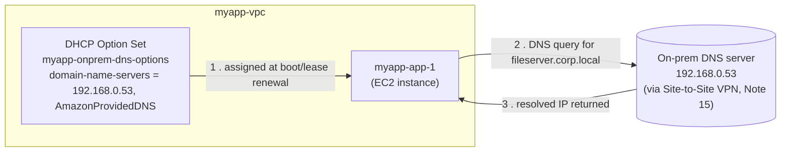

# 19 - DHCP Option Sets

> Goal: understand how EC2 instances automatically get their **DNS and network configuration** inside a VPC, and how to override it with a **custom DHCP option set** — the classic use case being "point my instances at an on-prem DNS server" in a hybrid setup (ties to Note 15's Site-to-Site VPN). Next: Note 20 (VPC Flow Logs).

---

## 1. What is DHCP, and why does a VPC need it?

**DHCP (Dynamic Host Configuration Protocol)** is how a device automatically receives its network configuration — IP address, DNS servers, domain name, NTP servers, etc. — instead of it being typed in by hand.

Every time an EC2 instance boots (or its network interface comes up), it makes a DHCP request. Inside a VPC, AWS answers that request using a set of rules called a **DHCP option set**.

A DHCP option set can define:

| Option | What it controls |
|---|---|
| `domain-name` | The default domain suffix appended to unqualified hostnames |
| `domain-name-servers` | Which DNS server(s) the instance uses to resolve names (up to 4) |
| `ntp-servers` | Which time server(s) the instance syncs its clock against |
| `netbios-name-servers` / `netbios-node-type` | Legacy Windows NetBIOS naming service settings |

> 🧠 **Mental model:** think of a DHCP option set as the **"welcome packet"** every instance receives the moment it plugs into the VPC's network — it tells the instance "here's who to ask for names, here's your default domain, here's your clock source."

---

## 2. The default DHCP option set

Every VPC (including the default VPC, and `myapp-vpc` when we created it in Note 04) is automatically associated with a **default DHCP option set** containing:

| Option | Default value |
|---|---|
| `domain-name-servers` | `AmazonProvidedDNS` (the special alias for the Amazon Route 53 Resolver at `169.254.169.253` / the VPC `.2` address) |
| `domain-name` | Region-specific (e.g. `ap-south-1.compute.internal`) |
| `ntp-servers` | (not set — instances typically use Amazon Time Sync Service at `169.254.169.123` instead) |

This is why, out of the box, every EC2 instance in `myapp-vpc` can already resolve both public internet hostnames and internal AWS DNS names (like an RDS endpoint) — **no configuration needed.**

---

## 3. Why would you ever create a custom DHCP option set?

The default works fine for a pure-AWS setup. The real-world trigger is **hybrid connectivity** (Note 15 – Site-to-Site VPN, Note 16 – Direct Connect):

> "We have an on-prem Active Directory domain (`corp.local`) with its own DNS servers. Our EC2 instances in `myapp-vpc` join that AD domain, and need to resolve on-prem hostnames (`fileserver.corp.local`) — not just AWS/internet names."

To make that work, you create a **custom DHCP option set** that lists your **on-prem DNS server IP(s)** (reachable over the VPN/DX connection from Note 15) as the `domain-name-servers`, and associate it with `myapp-vpc`. Now every instance's OS-level DNS resolver automatically points at the on-prem DNS server instead of (or in addition to) `AmazonProvidedDNS`.

Other real reasons to customize:
- Standardizing on a **corporate NTP server** for compliance/audit reasons.
- Setting a custom internal **domain-name** to match on-prem naming conventions.

🎯 **Exam tip:** whenever an SAA-C03 question mentions "instances need to resolve on-premises hostnames" or "instances must use the corporate DNS server," the answer is almost always **create and associate a custom DHCP option set** pointing `domain-name-servers` at the on-prem DNS IP(s).

---

## 4. ⚠️ The big gotcha: DHCP option sets are IMMUTABLE

You **cannot edit** an existing DHCP option set once created. There is no "Edit" button for its options. To change anything:

1. **Create a brand-new** DHCP option set with the values you want.
2. **Associate** the new set with the VPC (this replaces the old association — a VPC can only have **one** DHCP option set active at a time).
3. **Existing running instances will NOT pick up the change immediately.** They must either:
   - Renew their DHCP lease (on Linux: `sudo dhclient -r && sudo dhclient`, varies by OS/distro), or
   - **Reboot** the instance (simplest, guaranteed way).
4. **New instances** launched after the association automatically get the new options right away.

> ⚠️ This immutability + lease-renewal requirement is a classic exam trap: creating/associating a new option set is **not instantly effective** for already-running instances.

---

## 5. Step-by-step: custom DHCP option set for `myapp-vpc`

**Scenario:** `myapp-vpc` connects to an on-prem network (`192.168.0.0/16`, per Note 15's Site-to-Site VPN) that has an on-prem DNS server at `192.168.0.53`. We want `myapp-app-1`/`myapp-app-2` to resolve on-prem AD hostnames.

1. VPC console → left nav **DHCP Option Sets** → **Create DHCP option set**.
2. **DHCP option set name**: `myapp-onprem-dns-options`.
3. **Domain name** (optional): `corp.local` (the on-prem AD domain).
4. **Domain name servers**: `192.168.0.53, AmazonProvidedDNS`
   - Listing `AmazonProvidedDNS` as a **second** entry means: try the on-prem DNS first, fall back to Amazon's resolver for AWS/internet names, so you don't break normal AWS name resolution.
5. **NTP servers** / **NetBIOS**: leave blank unless you have a specific corporate time server.
6. Click **Create DHCP option set**. Note the new option set ID (`dopt-xxxxxxxx`).
7. Go to **Your VPCs** → select **`myapp-vpc`** → **Actions** → **Edit VPC settings**, or from the VPC details **Actions → Edit DHCP options set**.
8. Choose **`myapp-onprem-dns-options`** → **Save**.
9. To apply to **already-running** instances: connect via SSH/SSM and run a DHCP lease renewal, or simply **reboot** each instance (Stop/Start is not required — a normal OS reboot is enough since DHCP is requested at network-interface-up time).

---

## 6. Common beginner problems

| Problem | Likely cause / fix |
|---|---|
| Changed the DHCP option set but instances still resolve the old way | You edited/created a new set but forgot to **reboot** or renew the DHCP lease on existing instances. |
| Trying to "edit" an existing option set — no such button | Option sets are **immutable** — create a new one and re-associate instead. |
| On-prem names resolve, but S3/AWS names stop resolving | `AmazonProvidedDNS` wasn't listed as a fallback entry in `domain-name-servers`. |
| On-prem DNS unreachable from EC2 | The Site-to-Site VPN / Direct Connect (Note 15/16) isn't up, or the security group/NACL blocks port 53 (UDP/TCP) to `192.168.0.53`. |

---

## 7. Recap

- **DHCP option sets** control the network config (DNS servers, domain name, NTP) instances receive automatically at boot.
- Every VPC starts with a **default option set**: `domain-name-servers = AmazonProvidedDNS`.
- **Custom option sets** are mainly for hybrid setups — pointing instances at an **on-prem DNS server** so they can resolve on-prem hostnames (ties to Note 15 VPN / Note 16 Direct Connect).
- ⚠️ Option sets are **immutable** — you create a new one and re-associate it with the VPC; you don't edit in place.
- Existing running instances need a **DHCP lease renewal or reboot** to pick up a newly associated option set; new instances get it immediately.
- Next: **Note 20** — VPC Flow Logs (capturing metadata about the traffic actually flowing through your VPC).

---

### Sources
- [DHCP option sets – AWS docs](https://docs.aws.amazon.com/vpc/latest/userguide/VPC_DHCP_Options.html)
- [Work with DHCP option sets – AWS docs](https://docs.aws.amazon.com/vpc/latest/userguide/DHCPOptionSet.html)
- [DNS attributes for your VPC – AWS docs](https://docs.aws.amazon.com/vpc/latest/userguide/vpc-dns.html)
